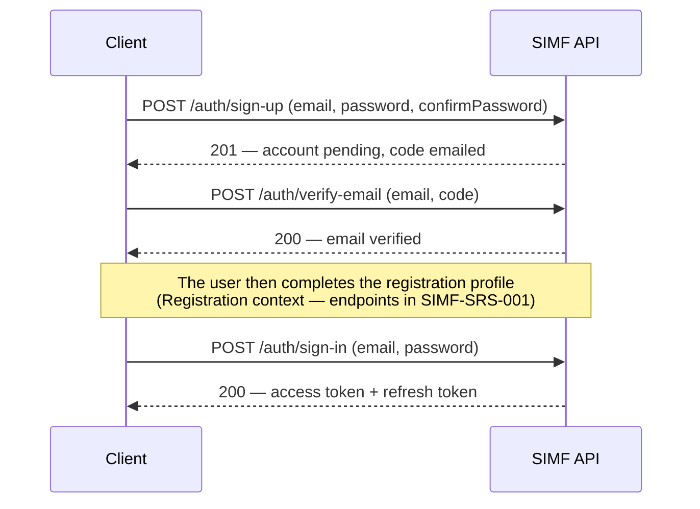

# API Specification

| Field | Value |
|-------|-------|
| Document ID | SIMF-API-001 |
| Title | API Specification |
| Version | 1.2 |
| Status | Approved |
| Classification | Confidential — to be confirmed by the owner |
| Prepared by | Engineering & Architecture Team, STARTIME |
| Owner | Solution Architect |
| Approver | Solution Architect |
| Date issued | 2026-05-20 |
| Related documents | SIMF-SAD-001, SIMF-SES-001, SIMF-RPM-001, SIMF-SRS-001 |

### Revision history

| Version | Date | Author | Summary of change |
|---------|------|--------|-------------------|
| 1.0 | 2026-05-20 | Engineering & Architecture Team | First issue. API conventions and the authentication surface. Feature endpoints follow as their requirements close. |
| 1.1 | 2026-05-20 | Engineering & Architecture Team | Specified the password-reset flow in §12.7 (forgot-password / reset-password, six-digit email OTP on ASP.NET Core Identity; reset-password revokes the account's refresh tokens); added AUTH_RESET_CODE_INVALID and AUTH_RESET_CODE_EXPIRED to §12.6; closed open item OI-3. |
| 1.2 | 2026-05-21 | Engineering & Architecture Team | Architecture-review amendment (see Amendment A): added the `verify-otp` and `change-password` endpoints; added `AUTH_ACCOUNT_LOCKED`, `AUTH_OTP_INVALID`, `AUTH_OTP_EXPIRED`, `AUTH_OTP_TOKEN_INVALID`, `AUTH_PASSWORD_CHANGE_REQUIRED`; scoped `X-Anti-Forgery` to the Blazor cookie surfaces. |

---

## 1. Purpose

This document defines how the SIMF API behaves: its conventions, its response
shape, its error model, how a client authenticates, and the contract of the
authentication endpoints. Every SIMF endpoint, present and future, follows the
conventions in sections 4 to 11. Section 12 specifies the authentication API in
full, because that is the first thing the team builds.

## 2. Scope

Version 1.0 covers the API conventions and the authentication and session
endpoints. It does not yet specify the feature endpoints — registration
completion, sessions, badges, engagement, and the rest — because their request
and response bodies depend on requirement decisions still open (gates D1–D6 in
SIMF-PGP-001). Those endpoints are added to this document, following the same
conventions, as each feature's requirements close.

## 3. API design principles

1. One predictable response shape for everything. A client parses success and
   failure the same way every time.
2. The API is the only door. The website, the Control Panel and the mobile app
   all go through it. No client gets a private side channel.
3. Endpoints are explicit about authorisation. An endpoint states what it needs;
   nothing is open by default.
4. The contract is stable. A breaking change means a new API version, not a
   quiet change to an existing one.
5. The API is the same for every client. Device differences are carried in a
   header, not in separate endpoints.

## 4. Base URL and versioning

All endpoints live under a versioned base path:

```
/api/v1
```

The version in the path is the major version. A breaking change to a contract
introduces `/api/v2`; `/api/v1` keeps working until its clients have moved.
Non-breaking additions — a new optional field, a new endpoint — do not change
the version.

## 5. Standard request headers

Every request to the API carries these headers.

| Header | Required | Purpose |
|--------|----------|---------|
| `X-App-Key` | Yes | Identifies the calling application. A request without a valid key is rejected. |
| `X-Device-Type` | Yes | One of `Web`, `ControlPanel`, `Android`, `iOS`. Used for logging and device-aware behaviour. |
| `Accept-Language` | Yes | `ar` or `en`. Sets the language of messages in the response. `ar` is the default if the value is missing or unrecognised. |
| `Authorization` | For protected endpoints | `Bearer <access token>`. |
| `X-Anti-Forgery` | For state-changing requests | The anti-forgery (SFC) token. Required on POST, PUT, PATCH and DELETE. |

A request that is missing `X-App-Key` or, on a protected endpoint, a valid
`Authorization` header, is rejected before it reaches the endpoint logic.

## 6. The response envelope

Every response — success or failure, every endpoint — is an `ApiResult<T>`.

### 6.1 Shape

```json
{
  "success": true,
  "data": {},
  "error": null,
  "meta": null
}
```

| Field | Type | Meaning |
|-------|------|---------|
| `success` | boolean | True if the request succeeded. |
| `data` | T or null | The result payload on success; null on failure. |
| `error` | object or null | The error detail on failure; null on success. |
| `meta` | object or null | Optional extra information, for example pagination. |

### 6.2 Success example

```json
{
  "success": true,
  "data": { "id": "8a3f...", "email": "r.alsalem@example.sa" },
  "error": null,
  "meta": null
}
```

### 6.3 Failure example

```json
{
  "success": false,
  "data": null,
  "error": {
    "code": "AUTH_INVALID_CREDENTIALS",
    "message": "The email or password is incorrect.",
    "details": []
  },
  "meta": null
}
```

A client never has to guess. If `success` is false, `error` is populated and
`data` is null.

## 7. Error model

### 7.1 The error object

| Field | Type | Meaning |
|-------|------|---------|
| `code` | string | A stable, machine-readable code. Clients branch on this, not on the message. |
| `message` | string | A human-readable message in the request's language. Safe to show a user. |
| `details` | array | Field-level errors, used mainly for validation. Empty when there are none. |

A `details` entry is `{ "field": "<name>", "message": "<reason>" }`.

### 7.2 Error codes

Codes are uppercase, namespaced by area with an underscore. The authentication
codes are listed in section 12.6. Each feature adds its codes to this document
when its endpoints are specified. A code, once published, does not change
meaning.

### 7.3 Validation errors

A validation failure returns `success: false`, the code
`VALIDATION_FAILED`, and one `details` entry per invalid field:

```json
{
  "success": false,
  "data": null,
  "error": {
    "code": "VALIDATION_FAILED",
    "message": "Some fields need your attention.",
    "details": [
      { "field": "email", "message": "Enter a valid email address." },
      { "field": "password", "message": "Password and confirmation do not match." }
    ]
  },
  "meta": null
}
```

The field names in `details` match the request body field names exactly, so a
client can attach each message to the right input.

## 8. HTTP status codes

The envelope carries the application result; the HTTP status carries the
transport result. They agree.

| Status | Used for |
|--------|----------|
| 200 OK | A successful request. |
| 201 Created | A successful create. |
| 400 Bad Request | Validation failure, or a malformed request. |
| 401 Unauthorized | Missing, invalid or expired authentication. |
| 403 Forbidden | Authenticated, but not permitted. |
| 404 Not Found | The addressed resource does not exist. |
| 409 Conflict | The request conflicts with current state, for example a duplicate email. |
| 429 Too Many Requests | A rate limit was exceeded. |
| 500 Internal Server Error | An unexpected server fault. |

On any non-200 result the body is still an `ApiResult<T>` with `success: false`,
so a client reads errors one way regardless of the status.

## 9. Pagination, filtering and sorting

List endpoints accept these query parameters:

| Parameter | Default | Meaning |
|-----------|---------|---------|
| `page` | 1 | The page number, starting at 1. |
| `pageSize` | 20 | Items per page. The server caps this; the cap is set per endpoint. |
| `sort` | endpoint default | A field name, optionally prefixed with `-` for descending. |
| `search` | none | A free-text filter where the endpoint supports it. |

A paged response puts the page information in `meta`:

```json
{
  "success": true,
  "data": [],
  "error": null,
  "meta": { "page": 1, "pageSize": 20, "totalItems": 137, "totalPages": 7 }
}
```

List endpoints return only active records (`IsActive = true`) unless the
endpoint explicitly offers an option to include inactive ones.

## 10. Rate limiting

The API limits request rate per IP address, per user and per endpoint. The
authentication endpoints have tighter limits than the rest, because they are the
ones brute force targets. A caller that exceeds a limit gets HTTP 429 and the
error code `RATE_LIMIT_EXCEEDED`. The concrete limit values are set in
configuration and recorded in SIMF-OPS-001.

## 11. Localisation

The response language follows the `Accept-Language` header: `ar` or `en`, with
`ar` as the default. This applies to `error.message` and to any human-readable
text in `data`. Codes, field names and identifiers are never localised.

## 12. Authentication API

This section specifies the authentication and session endpoints in full. They
are the build kickoff item in SIMF-PGP-001.

### 12.1 Overview of the flow

Account creation, then sign-in:



Sign-in is email and password. There is no Nafath and no Face ID (confirmed
2026-05-20).

### 12.2 Tokens

On a successful sign-in the API returns an access token and a refresh token.

- The **access token** is a JWT. It carries the user id, the user type and the
  granted permissions, and it expires 30 minutes after issue.
- The **refresh token** is opaque to the client. It is exchanged for a new
  access token. Refresh tokens rotate: each refresh issues a new refresh token
  and invalidates the one used.
- A **session** stays valid for 30 days. After that the user signs in again.

These three values come from the technology proposal. They are treated as
confirmed; if the owner wants different values, they change here and nowhere
else.

### 12.3 Administrative sign-in and TOTP

A Control Panel user signs in with email and password and then a time-based
one-time code (TOTP) from an authenticator app. The password step returns a
result that says a second factor is required; the client then calls the TOTP
endpoint. An access token is issued only after the TOTP step succeeds.

### 12.4 Endpoints

All paths are relative to `/api/v1`. All are anonymous (no `Authorization`
header) except sign-out and the TOTP step, as noted.

#### POST /auth/sign-up

Starts account creation. Creates an account in a pending, email-unverified
state and sends a six-digit verification code to the email.

Sign-up is **enumeration-resistant** (D-198): it never reveals whether an email
is already registered. The response shape is identical in all three cases below,
so a duplicate email returns the same 201 a new one does.

Request:

```json
{
  "email": "r.alsalem@example.sa",
  "password": "<password>",
  "confirmPassword": "<password>"
}
```

Rules:

- `email` is required and is a valid email address.
- `password` is required and meets the password policy in section 12.5.
- `confirmPassword` is required and equals `password`.

Behaviour for an existing email (D-198):

- **No account exists** — a new pending account is created and a code emailed.
- **Account exists but is still email-unverified** — registration restarts: the
  newly supplied password replaces the old one, the previous code is invalidated,
  and a fresh code is emailed. The user continues as if signing up for the first
  time.
- **Account exists and is already verified** — the account is left untouched (the
  supplied password is ignored and no verification code is issued); a security
  heads-up email is sent to the account owner pointing them to sign-in /
  password-reset.

Success — 201:

```json
{
  "success": true,
  "data": { "email": "r.alsalem@example.sa", "codeExpiresInSeconds": 600 },
  "error": null,
  "meta": null
}
```

Failure: `VALIDATION_FAILED` (400); `RATE_LIMIT_EXCEEDED` (429) when the
per-account verification-code cap is reached on a restart. A duplicate email is
**not** an error — see the behaviour list above.

#### POST /auth/verify-email

Verifies the email with the code sent by sign-up.

Request:

```json
{ "email": "r.alsalem@example.sa", "code": "492715" }
```

Rules:

- `email` is required and identifies a pending account.
- `code` is required, is six digits, matches the code issued, and has not
  expired.

Success — 200: `data` is `{ "email": "...", "emailVerified": true }`.

Failure: `AUTH_CODE_INVALID` (400); `AUTH_CODE_EXPIRED` (400);
`AUTH_ACCOUNT_NOT_FOUND` (404).

After this step the user completes the registration profile. Those endpoints
belong to the Registration context and are specified in SIMF-SRS-001 once the
field set per user type is confirmed (gate D1).

#### POST /auth/resend-code

Issues a new verification code for a pending account and invalidates the
previous one. Rate-limited more tightly than other endpoints.

Request: `{ "email": "r.alsalem@example.sa" }`

Success — 200: `data` is `{ "email": "...", "codeExpiresInSeconds": 600 }`.

Failure: `AUTH_ACCOUNT_NOT_FOUND` (404); `RATE_LIMIT_EXCEEDED` (429).

#### POST /auth/sign-in

Signs a user in with email and password.

Request:

```json
{ "email": "r.alsalem@example.sa", "password": "<password>" }
```

Success for a standard user — 200:

```json
{
  "success": true,
  "data": {
    "accessToken": "<jwt>",
    "refreshToken": "<opaque>",
    "tokenType": "Bearer",
    "accessTokenExpiresInSeconds": 1800,
    "user": {
      "id": "8a3f...",
      "email": "r.alsalem@example.sa",
      "userType": "Visitor",
      "displayName": "Raed Alsalem"
    }
  },
  "error": null,
  "meta": null
}
```

Success for an administrative user whose account requires TOTP — 200, with no
tokens yet:

```json
{
  "success": true,
  "data": { "mfaRequired": true, "mfaToken": "<short-lived opaque token>" },
  "error": null,
  "meta": null
}
```

Failure:

- `AUTH_INVALID_CREDENTIALS` (401) — wrong email or password. The message does
  not say which, on purpose.
- `AUTH_EMAIL_NOT_VERIFIED` (403) — the account exists but the email is not
  verified.
- `AUTH_ACCOUNT_NOT_APPROVED` (403) — the account is verified but the
  registration is still awaiting approval. Whether a not-yet-approved user may
  sign in at all, and with what access, depends on gate D1 and is confirmed in
  SIMF-RPM-001; this code reserves the case.
- `AUTH_ACCOUNT_DISABLED` (403) — the account is deactivated.
- `RATE_LIMIT_EXCEEDED` (429).

#### POST /auth/verify-totp

Completes administrative sign-in. Takes the `mfaToken` from the sign-in step and
the six-digit TOTP code.

Request:

```json
{ "mfaToken": "<short-lived opaque token>", "code": "204815" }
```

Success — 200: the same token payload as a standard sign-in success.

Failure: `AUTH_MFA_TOKEN_INVALID` (400); `AUTH_MFA_TOKEN_EXPIRED` (400);
`AUTH_TOTP_INVALID` (400); `RATE_LIMIT_EXCEEDED` (429).

#### POST /auth/refresh

Exchanges a refresh token for a new access token and a new refresh token.

Request: `{ "refreshToken": "<opaque>" }`

Success — 200: the same token payload as sign-in. The refresh token in the
response is new; the one in the request is now invalid.

Failure: `AUTH_REFRESH_TOKEN_INVALID` (401);
`AUTH_REFRESH_TOKEN_EXPIRED` (401) — the 30-day session has ended; the user
signs in again.

#### POST /auth/sign-out

Ends the current session. Requires a valid `Authorization` header. Invalidates
the refresh token so it cannot be used again.

Request: `{ "refreshToken": "<opaque>" }`

Success — 200: `data` is `{ "signedOut": true }`.

### 12.5 Password policy

The password rules are applied at sign-up and at any password change.

- At least 8 characters.
- Contains at least one letter and at least one digit.
- Is not equal to the email address.

This is a baseline. If the owner's security policy requires a stronger rule, it
is set here and enforced in one place. Confirming the final policy is open
item OI-2.

### 12.6 Authentication error codes

| Code | HTTP | Meaning |
|------|------|---------|
| `VALIDATION_FAILED` | 400 | One or more fields failed validation; see `details`. |
| `AUTH_EMAIL_ALREADY_REGISTERED` | 409 | The email already has an account. |
| `AUTH_ACCOUNT_NOT_FOUND` | 404 | No account for the given email. |
| `AUTH_CODE_INVALID` | 400 | The email verification code is wrong. |
| `AUTH_CODE_EXPIRED` | 400 | The email verification code has expired. |
| `AUTH_RESET_CODE_INVALID` | 400 | The password-reset code is wrong, or the email has no account. |
| `AUTH_RESET_CODE_EXPIRED` | 400 | The password-reset code has expired. |
| `AUTH_INVALID_CREDENTIALS` | 401 | The email or password is incorrect. |
| `AUTH_EMAIL_NOT_VERIFIED` | 403 | Sign-in attempted before the email was verified. |
| `AUTH_ACCOUNT_NOT_APPROVED` | 403 | The registration is awaiting approval. |
| `AUTH_ACCOUNT_DISABLED` | 403 | The account is deactivated. |
| `AUTH_MFA_TOKEN_INVALID` | 400 | The MFA continuation token is not valid. |
| `AUTH_MFA_TOKEN_EXPIRED` | 400 | The MFA continuation token has expired. |
| `AUTH_TOTP_INVALID` | 400 | The TOTP code is wrong. |
| `AUTH_REFRESH_TOKEN_INVALID` | 401 | The refresh token is not valid. |
| `AUTH_REFRESH_TOKEN_EXPIRED` | 401 | The 30-day session has ended. |
| `RATE_LIMIT_EXCEEDED` | 429 | Too many requests. |

### 12.7 Password reset

A user who has forgotten their password recovers it with a two-step,
email-code flow built on ASP.NET Core Identity. The flow mirrors email
verification (section 12.4): a six-digit numeric code, sent to the email, with
the same expiry and the same tighter rate limiting as `resend-code`.

Neither step reveals whether an email address has an account.
`forgot-password` always reports success, and `reset-password` returns the same
error for an unknown email as for a wrong code. This prevents account
enumeration.

Both endpoints are anonymous — they sit on the short, approved anonymous list
with sign-in and sign-up.

#### POST /auth/forgot-password

Starts a password reset. If the email belongs to an account, a six-digit reset
code is sent to it and any previous reset code for that account is invalidated.
If the email has no account, nothing is sent. Either way the response is the
same. Rate-limited more tightly than other endpoints.

Request:

```json
{ "email": "r.alsalem@example.sa" }
```

Rules:

- `email` is required and is a valid email address.

Success — 200:

```json
{
  "success": true,
  "data": { "codeExpiresInSeconds": 600 },
  "error": null,
  "meta": null
}
```

The response carries no field whose value depends on whether the account
exists.

Failure: `VALIDATION_FAILED` (400); `RATE_LIMIT_EXCEEDED` (429).

#### POST /auth/reset-password

Completes a password reset. Verifies the six-digit code and sets the new
password.

Request:

```json
{
  "email": "r.alsalem@example.sa",
  "code": "618402",
  "newPassword": "<password>",
  "confirmPassword": "<password>"
}
```

Rules:

- `email` is required and is a valid email address.
- `code` is required, is six digits, matches the code issued to the account,
  and has not expired.
- `newPassword` is required and meets the password policy in section 12.5.
- `confirmPassword` is required and equals `newPassword`.

On success the reset code is consumed and cannot be used again, and any other
unexpired reset code for the account is invalidated. The account's refresh
tokens are revoked as well, so every existing session ends; the user signs in
again with the new password.

Success — 200:

```json
{
  "success": true,
  "data": { "passwordReset": true },
  "error": null,
  "meta": null
}
```

Failure: `VALIDATION_FAILED` (400); `AUTH_RESET_CODE_INVALID` (400);
`AUTH_RESET_CODE_EXPIRED` (400); `RATE_LIMIT_EXCEEDED` (429).

A wrong code and an email with no account both return
`AUTH_RESET_CODE_INVALID`, so the response does not reveal whether the email is
registered.

## 13. OpenAPI

FastEndpoints generates an OpenAPI (Swagger) description of the API. The
generated description is the live, machine-readable contract; this document is
the human explanation of the conventions and the intent behind it. The two are
kept in step: an endpoint change updates both.

In non-production environments the Swagger UI is available for developers and
testers. In production it is disabled.

## 14. Conventions for future endpoints

When a feature's requirements close and its endpoints are added to this
document, they follow the rules already set: the versioned base path, the
standard headers, the `ApiResult<T>` envelope, the error model, the status code
table, the pagination convention, and an explicit authorisation declaration.
A new feature does not invent a new response shape or a new error style.

## 15. Open items

| ID | Item | Needed for |
|----|------|-----------|
| OI-1 | Feature endpoint contracts (registration completion, sessions, badges, engagement, and the rest) depend on requirement gates D1–D6 | Sections beyond 12 |
| OI-2 | Final password policy from the owner's security policy | Section 12.5 |
| OI-4 | Whether a not-yet-approved user may sign in, and with what access | `AUTH_ACCOUNT_NOT_APPROVED`, gate D1 |
| OI-5 | Confirm document classification with the owner | Control block |

---

## Amendment A — Architecture review (2026-05-21)

The authentication design review of 2026-05-21 amends this specification. The
changes below are authoritative and read together with the sections they cite.

### A.1 New endpoint — visitor email-OTP second factor

`POST /api/v1/auth/verify-otp` completes a **visitor** sign-in. A visitor's
password step at `/auth/sign-in` returns `mfaRequired: true` with a short-lived
`otpToken` and emails a six-digit code; the client submits the token and code
here.

- Request: `{ "otpToken": "<opaque>", "code": "493018" }`
- Success — 200: the standard token payload (access token, refresh token, user).
- Failure: `AUTH_OTP_INVALID` (400), `AUTH_OTP_EXPIRED` (400),
  `AUTH_OTP_TOKEN_INVALID` (400), `RATE_LIMIT_EXCEEDED` (429).

`/auth/sign-in` now has two second-factor branches: `mfaRequired` with an
`mfaToken` for an admin (TOTP, §12.4) and `mfaRequired` with an `otpToken` for a
visitor (email OTP, here).

### A.2 New endpoint — change password

`POST /api/v1/auth/change-password` — requires a valid `Authorization` header.

- Request: `{ "currentPassword": "<...>", "newPassword": "<...>", "confirmPassword": "<...>" }`
- Rules: the current password is correct; the new password meets §12.5 and
  equals its confirmation. On success every refresh token for the account is
  revoked.
- Success — 200: `{ "passwordChanged": true }`.
- Failure: `VALIDATION_FAILED` (400), `AUTH_INVALID_CREDENTIALS` (401).

A user in the **password-change-required** state (a seeded or admin-created
account holding a temporary password) may call only this endpoint; every other
protected endpoint returns `AUTH_PASSWORD_CHANGE_REQUIRED` (403) until the
password is changed.

### A.3 Second-factor tokens

`mfaToken` (admin TOTP) and `otpToken` (visitor email OTP) are short-lived
(2–5 minutes), **single-use**, stored **hashed**, invalidated after a small
number of failed attempts, and bound to the originating sign-in.

### A.4 Account lockout

`/auth/sign-in` and the code-verification endpoints are protected by ASP.NET
Core Identity lockout and a per-code attempt cap. A locked account returns
`AUTH_ACCOUNT_LOCKED`.

### A.5 New error codes — added to §12.6

| Code | HTTP | Meaning |
|------|------|---------|
| `AUTH_ACCOUNT_LOCKED` | 423 | The account is locked after too many failed attempts. |
| `AUTH_OTP_INVALID` | 400 | The email-OTP code is wrong. |
| `AUTH_OTP_EXPIRED` | 400 | The email-OTP code has expired. |
| `AUTH_OTP_TOKEN_INVALID` | 400 | The `otpToken` is not valid or has expired. |
| `AUTH_PASSWORD_CHANGE_REQUIRED` | 403 | The account must change its password before any other action. |

### A.6 Anti-forgery scope — amends §5

`X-Anti-Forgery` is **not** required by the bearer-token `/api/v1` API: a
bearer-token API carries no browser-attached ambient credential and is not
CSRF-exposed. The `X-Anti-Forgery` requirement in §5 is **scoped to the Blazor
cookie-authenticated surfaces** (the website and Control Panel) only.

---

## Amendment B — Server-paged grids (2026-05-23)

Decision **D-044(a)** / **D-045** introduces a second pagination shape for
**parameter-rich admin and operational lists** that need structured
per-column filters and a search-text payload of unbounded length. The §9
shape remains the rule for **read-mostly public lists** (agenda, sessions,
news, booths) where a GET-with-querystring is browser-, CDN- and
reverse-proxy-cacheable.

### B.1 When to use which shape

| List shape | When | Method |
|------------|------|--------|
| **§9 GET + querystring** | Read-mostly, anonymous or cookie-cached, low-cardinality filter set. Examples: `/programme/sessions`, `/news`, `/exhibitors`. | `GET /…?page=&pageSize=&sort=&search=` |
| **B GridQuery POST + body** | Admin / operational lists with structured per-column filters, multi-column sort, large search strings. Examples: `/admin/users/list`, future `/admin/audit-log/list`. | `POST /…/list` with the JSON body below |

### B.2 The GridQuery body

```json
{
  "skip": 0,
  "top": 20,
  "search": "ahmed",
  "sort": "email",
  "sortDescending": false,
  "filters": { "state": "Approved", "twoFactor": "true" }
}
```

- `top` is clamped at the endpoint (today: 200 default cap; the export
  endpoint takes a 5 000 row cap; the import endpoint a 5 000 row cap and
  a 5 MB upload cap).
- `filters` is a string-to-string map; the endpoint validates keys against
  its own allow-list and ignores unknown keys (with structured logging).
  Unknown values inside a known key fall through (e.g. an unparseable
  `AccountState` becomes "no filter on state").

### B.3 The GridPage<T> response

```json
{
  "success": true,
  "data": {
    "items": [ … ],
    "total": 137,
    "skip": 0,
    "top": 20
  },
  "error": null,
  "meta": null
}
```

Paging information lives in `data` for the GridPage shape (because the
client always parses the items and paging together, and the typed client
binds to one DTO). The standard §9 shape continues to use `meta` for the
same purpose; both shapes are correct, used in different places.

### B.4 Excel I/O on Grid endpoints

A list endpoint that supports bulk export accepts a sibling endpoint
`POST /…/export` with body `{ "ids": [], "query": GridQuery }`. When
`ids` is empty, the export applies the query and is bounded at 5 000
rows. The response is an XLSX workbook (MIME
`application/vnd.openxmlformats-officedocument.spreadsheetml.sheet`) with
a `Content-Disposition: attachment` header. Every string cell that would
begin with `=`, `+`, `-`, `@`, TAB or CR is prefixed with an apostrophe
so Excel does not auto-execute the value (OWASP CWE-1236).

A list endpoint that supports bulk import accepts a sibling endpoint
`POST /…/import` as multipart with a single `file` field. The endpoint
validates the file size (5 MB cap), ZIP magic bytes (`50 4B 03 04`) and
the worksheet name before parsing. Per-row errors are reported in the
response body, never thrown.

### B.5 Bulk action audit shape

A bulk-action endpoint (delete / approve / archive) writes **one audit
row per subject**, not one summary row per request. The summary in the
response gives the admin a count; the per-subject rows give SOC the
trail it needs to reconstruct who-did-what-to-whom.

---

## Amendment C — Mobile sign-up ProfileType picker (D-190, 2026-05-30)

D-186 collapsed `UserType` to (Visitor, Admin) and moved the
audience-vs-partner distinction onto `ProfileType.IsVisitor`. D-190
unblocks the mobile sign-up Screen 2 ProfileType dropdown.

### C.1 New endpoint — public profile-type picker

`GET /api/v1/account/profile-types`

Authentication: **required** (standard bearer). **Not** admin-only;
**not** approval-gated — the caller is mid-registration (account state
typically `EmailVerified` or `PendingApproval`) so a `RequireApprovedAccount`
floor would lock them out of the picker. Rate-limited via the
`auth` bucket.

Query parameters (optional):

| Name | Type | Effect |
|------|------|--------|
| `isVisitor` | bool? | `true` → audience profile types only; `false` → partner profile types only; omitted → all active rows |

Response (`ApiResult<ProfileTypePickerListResponse>`):

```json
{
  "success": true,
  "data": {
    "items": [
      { "id": "uuid", "name": "VIP", "nameArabic": "كبار", "pageColor": "#FFD700", "isVisitor": true },
      { "id": "uuid", "name": "Sponsor", "nameArabic": "راعي", "pageColor": "#8B5CF6", "isVisitor": false }
    ]
  }
}
```

The DTO deliberately omits `MobileAppRole` — that's admin-curated
authority that flows on the JWT `mobile_app_role` claim only. The
picker never returns it.

Filter floor: every returned row has `IsActive = true` AND
`UserType = Visitor`. Admin-scope profile types (if any) are never
surfaced — a self-registering user cannot pick into the admin pool.
Rows are ordered by `Name` ascending.

### C.2 Amended request shape — `UpsertUserProfileRequest`

`POST /api/v1/account/user-profile` now accepts an optional
`profileTypeId` field carrying the user's self-pick from the picker
endpoint above. Existing callers that omit it see no behavioural
change.

Validation:

- When non-null, must resolve to an active `ProfileType` with
  `UserType = Visitor`. Unknown id / inactive row / Admin-scope row
  → 400 `AdminProfileTypeInvalid`.
- Empty Guid is rejected at the shape-level validator.

Precedence rule (admin wins): when the existing `UserProfile.ProfileTypeId`
is already set (because an admin pre-assigned it via
`/admin/visitors` or `/admin/others`), the user's self-pick on the
upsert is **silently ignored**. The admin's assignment survives. The
user-pick path fills the column only when the admin has not chosen
yet. Admin overrides anywhere require a separate admin endpoint.

`UserProfileResponse` already carried `profileTypeId`; D-190 makes
the field meaningful from the user-write side.

Audit Detail on `UserProfile.Saved` now carries the resolved
`profileTypeId` (or the literal `none`) so the CP pending-profile
review surface shows what the user picked.

---

End of document.
