# Data Model and Database Design

| Field | Value |
|-------|-------|
| Document ID | SIMF-DAT-001 |
| Title | Data Model and Database Design |
| Version | 1.4 |
| Status | Approved |
| Classification | Confidential — to be confirmed by the owner |
| Prepared by | Engineering & Architecture Team, STARTIME |
| Owner | Solution Architect |
| Approver | Solution Architect |
| Date issued | 2026-05-20 |
| Related documents | SIMF-SAD-001, SIMF-RPM-001, SIMF-SRS-001, SIMF-API-001, SIMF-SES-001 |

### Revision history

| Version | Date | Author | Summary of change |
|---------|------|--------|-------------------|
| 1.0 | 2026-05-20 | Engineering & Architecture Team | First issue. Logical data model by bounded context, conventions, and the core ERD. |
| 1.1 | 2026-05-21 | Engineering & Architecture Team | Architecture-review amendment (see Amendment A): one database with two DbContexts and separate migration histories; GpsPresence as batched append-only telemetry with a retention purge; peak-load indexes; Booking.Status Rejected, Hall geofence, the account-code generalisation; SQL Server Standard edition. |
| 1.2 | 2026-05-21 | Engineering & Architecture Team | Increment-2 build amendment (see Amendment B): records how the §5.1 Identity & Access entities map onto ASP.NET Core Identity. |
| 1.3 | 2026-07-19 | Apexium | Corrected the Booking lifecycle to match the built code (reservation-only, auto-confirm): attendee seat reservations are confirmed immediately (Status `Approved`) with no Control Panel approval, held provisionally until gate check-in (`CheckedIn`) and released by the pre-start sweep (`Released`) if not checked in; the `Pending` / `Rejected` approval queue is retained but dormant and always empty. Updated §5.4, §8 and Amendment A.4. |
| 1.4 | 2026-08-16 | Apexium | Profile-owned admission amendment (see Amendment C): the attendee record, not the account, is the primary registration entity and owns admission; identity documents become a one-to-many child collection; the two mobile attributes collapse to one canonical number; the badge order gains a name and per-profile-type child lines; the yearly edition becomes an entity. Section 8 is rewritten around the constraint posture the schema actually carries (CHECK constraints, filtered unique indexes, blind indexes over encrypted columns). Corrected four claims that were never built or no longer true: the `GateScan` INSTEAD-OF trigger, the persisted statistics snapshot, the shared-database sentence in §5.3.1, and the `CheckedIn` / `Released` booking states, which are not members of the enum at all. A second verification pass over the generated migrations corrected five more: `GateScan` carries **five** indexes and not six (§5.3.2, §A.3); `Notification` is built in `SIMF_Identity`, not `SIMF_App`, and `NotificationDelivery` was never built (§3, §5.9, §A.1); `SubTopic` was never built and a session is tagged with **many** themes rather than belonging to one (§5.4, §7); `Session.IsLive` and `Session.BroadcastMode` do not exist (§5.4); and the bilingual pair convention this document writes as `XAr` / `XEn` is built as `X` / `XArabic` on every live table, that spelling surviving only on the `Archive*` tables and `EmailTemplates` (§C.0). Updated §4, §5.1–§5.5, §5.8, §5.9, §5.11, §5.12, §7, §8 and Amendments A.1, A.3, A.4 and B. §5.6, §5.7 and §5.10 were not re-verified — see Amendment C.7. |

---

## 1. Purpose

This document defines the SIMF data model: the entities the system stores, the
attributes that matter, and how the entities relate. It is the logical model the
EF Core code-first schema is built from, and the reference for anyone reading or
extending the database.

## 2. Scope

The document covers the logical data model — entities, key attributes and
relationships — grouped by the bounded contexts in SIMF-SAD-001. It sets the
database conventions every table follows.

It is a logical model, not a physical column dump. Exact column types, lengths
and indexes live in the EF Core configuration and the generated migrations,
which are reviewed as code (SIMF-SES-001 section 5.4). Where a field length
matters to a contract it is aligned across the layers per SIMF-SES-001 section
5.3.

## 3. Approach

- **Two physically separated databases** (D-157, superseding C-1; reaffirmed
  D-246). `SIMF_Identity` holds the Identity & Access tables; `SIMF_App` holds
  all other tables. No cross-database relation/FK and no duplicated data — see
  §A.1. **One context boundary does not follow that split:** `Notification`
  (§5.9) is keyed by account and is built in `SIMF_Identity`, so a reader
  looking for it among the App tables will not find it.
- **EF Core, code-first.** The schema is defined in code and applied through
  reviewed migrations.
- **A context owns its tables.** Each bounded context owns its own tables. A
  context that needs another's data reads it through that context's application
  service, not with a cross-context query. The model below groups tables by
  context for that reason.
- **Soft delete is the default.** Tables for entities that have a lifecycle
  carry `IsActive`; rows are deactivated, not physically deleted.
- **Auditing is standard.** Entities that change over time carry `CreatedAt`,
  `CreatedBy`, `ModifiedAt`, `ModifiedBy`.

## 4. Conventions

| Topic | Convention |
|-------|------------|
| Primary key | Every table has an `Id`, a GUID. |
| Naming | Tables are PascalCase and singular (`Session`, not `Sessions`); columns are PascalCase (SIMF-SES-001 section 8). |
| Soft delete | `IsActive` boolean; default true; list queries filter on it. |
| Audit columns | `CreatedAt`, `CreatedBy`, `ModifiedAt`, `ModifiedBy` on entities that change over time. |
| Foreign keys | Named `<Entity>Id`. Relationships are enforced with FK constraints. |
| Enumerations | Stored as a small integer or a short string, backed by a C# enum. Used for fixed sets that the software owns (account state, booking status). |
| Dynamic categories | Sets the client maintains — profile types, session categories, interests, organisations, regions — are **data**, not enums. Built as one lookup table per list, not one shared table (section 5.12). |
| Bilingual text | See section 6. |
| Money / counts | Not applicable widely; counts are integers. |
| Timestamps | Stored in UTC; displayed per locale (`dd-MM-yyyy`, Latin digits) by the clients. |

## 5. Logical model by bounded context

Each subsection lists the context's entities with their key attributes and their
relationships. Standard columns (`Id`, `IsActive`, audit columns) are not
repeated in every list.

### 5.1 Identity & Access

| Entity | Key attributes | Relationships |
|--------|----------------|---------------|
| `User` | `Email`, `PasswordHash`, `DisplayName`, `AccountState` (enum), `UserType` (enum: Visitor / Admin) | has many `UserRole`; **optionally** linked to one attendee profile (§5.2). The link is owned by the profile, not by this row, and may be absent |
| `Role` | `Name`, `IsBaseline` | has many `RolePermission`, `UserRole` |
| `Permission` | `Code` | one action on one page, identified by its `Page.Action` code; the fixed page-and-action catalogue in SIMF-RPM-001 §8; the page, action and display name are presentation metadata held in the in-process `PermissionCatalog`, not columns; has many `RolePermission` |
| `RolePermission` | — | links `Role` and `Permission` |
| `UserRole` | — | links `User` and `Role` |
| `RefreshToken` | `TokenHash`, `ExpiresAt`, `RevokedAt`, `RotatedFromId` | belongs to `User` |
| `EmailVerificationCode` | `Code`, `ExpiresAt`, `ConsumedAt` | belongs to `User` |
| `TotpSecret` | `Secret` | belongs to `User` (internal users) |

`AccountState` enum: Registered, EmailVerified, PendingApproval, Approved,
Rejected, Disabled (SIMF-RPM-001 section 6). `UserType` is a fixed software-owned
enum, not a `Category` row.

`User.AccountState` governs the **credential**: whether the email is verified,
whether the account may sign in, whether it is disabled. It is **not** the
admission decision. Admission — whether a person may pass a gate, enter a hall or
hold a valid badge — is `AdmissionState` on the attendee profile (§5.2), because
an attendee need not hold an account at all. See Amendment C.1 for the
relationship between the two columns and the dual-write that currently links
them.

### 5.2 Registration & Approval

| Entity | Key attributes | Relationships |
|--------|----------------|---------------|
| `AttendeeProfile` | `Name`, `NameArabic`, `Gender`, `DateOfBirth`, `PlaceOfBirth`, `IsSaudi`, `MobileNumber`, `JobTitle`, `ReferenceNumber`, `AdmissionState` (enum), `StateChangedAt`, `StateChangedByUserId`, `RejectionReason`, `EditionYear` | **owns** an optional link to a `User` (§5.1); has many `IdentityDocument`; belongs to a `BadgeBatch` (§5.3, **required**) and, once assigned, to a `ProfileType` (nullable until approval); references `Country`, `Organisation`, `Region`, `Asset` (ID document, VIP photo) |
| `IdentityDocument` | `Kind` (NationalId / Iqama / Passport), `Number` (encrypted), `NumberHash` (blind index) | belongs to `AttendeeProfile`; **one row per document**, cascade-deleted with the profile |
| `Exhibitor` | `Name`, `NameArabic`, `Tier`, contact email / phone / website, social links, `City` + `CityArabic`, `Latitude` / `Longitude` | references `Country`; has many `ExhibitorMembership` and `Booth` (§5.5) |
| `ExhibitorMembership` | `ContactName`, `RoleLabel` (free text, e.g. "Booth Manager") | belongs to `Exhibitor`; holds a **logical** `UserId` into `SIMF_Identity`. Deactivating the row revokes that officer's lead scanning and their access to the booth's captured contacts |

Four facts about this context are load-bearing and are the ones most often got
wrong.

**The attendee record is primary; the account is optional.** A person who attends
the forum has an `AttendeeProfile` whether or not they ever hold a sign-in
account, and the account grants exactly one thing: mobile-app access. The link is
a **nullable** reference on the profile, so the cardinality is zero-or-one account
per profile, never one-to-one. There is no separate registration-request entity:
the request, its review and its outcome are attributes of the profile itself
(`AdmissionState`, `StateChangedAt`, `StateChangedByUserId`, `RejectionReason`).

**An attendee may hold more than one identity document.** The rule the
registration validator applies is "national id, or iqama, or passport" as an
inclusive OR, so a resident holding both an iqama and a passport supplies both.
That is why documents are a child collection and not a `Kind` plus one number
column: a single column would have to discard one of them, and with it the
evidence that catches somebody re-registering under their other document.
`IsSaudi` remains on the profile and is not superseded by `IdentityDocument.Kind`
— it records which document is *required*, the child row records what was
*supplied*.

**An attendee has one mobile number.** It is stored once, in canonical E.164
form, because a Saudi mobile is an international mobile with a country code on
the front rather than a second attribute. Two columns permitted one row to hold
two different numbers with nothing saying which to ring, and de-duplicated against
nothing, the same number in two spellings reading as two people.

**Document numbers are encrypted at rest and cannot be equality-queried.** Each
carries a deterministic keyed-HMAC digest alongside the ciphertext, and it is the
digest — never the number — that is indexed, compared and used to detect a
duplicate registration. See §8.

The attendee's tier or partner kind is a `ProfileType` row — the audience-tier
and partner-kind lookup described in §5.12 — set on approval.

### 5.3 Badge & Access Control

| Entity | Key attributes | Relationships |
|--------|----------------|---------------|
| `BadgeBatch` | `Name`, `NameArabic` (both required), `IsDelegate`, `RecipientEmail` | has many `BadgeBatchItem`; has many `AttendeeProfile`. Soft-deleted, never removed, so every back-reference stays resolvable |
| `BadgeBatchItem` | `ProfileTypeId`, `Count`, `DisplayOrder` | belongs to `BadgeBatch`; one line per profile type in the order |
| `HallAttendance` | `Enter`, `Leave`, `Method` (QrScan / Geofence), denormalised `HallId` | belongs to `Session` and `AttendeeProfile` |
| `SavedContact` | `SavedAt` | links an owner `User` to a scanned `User` |
| `Gate` | `Code` (uppercase-normalised, unique), `Name`, `NameArabic`, `Description?`, `DescriptionArabic?`, `DirectionMode` (In / Out / Both), `IsActive`, `CreatedAt`, `UpdatedAt?` | has many `GateProfileTypeAllow`, `GateAssignment`, `GateScan` |
| `GateProfileTypeAllow` | composite key `(GateId, ProfileTypeId)` | links `Gate` to `ProfileType`; a real same-database FK with `Restrict` (see §5.3.1) |
| `GateAssignment` | `GateId`, `UserId`, `IsActive`, `AssignedAt`, `AssignedByUserId`, `RevokedAt?`, `RevokedByUserId?` | links `Gate` to a logical `SimfUser` reference (cross-context — see §5.3.1) |
| `GateScan` | `Id` (`bigint IDENTITY` PK — monotonic, no fragmentation), `GateId`, `UserProfileId?`, `QrIdAtScan` (what was physically presented, preserved verbatim through a rotation), `ScannedDisplayName?` / `ScannedProfileTypeName?` (audit snapshots), `Direction` (CheckIn / CheckOut), `Outcome` (Allowed / Denied), `DenialReasonCode?`, `ScannedAt` (server clock — authoritative), `ClientScannedAt?` (device clock — client-asserted), `ScannedByUserId`, `Source` (Simulator / MobileApp / Kiosk), `CorrelationId`, `IpAddress?`, `UserAgent?`, `IdempotencyKey?` | belongs to `Gate` (`Restrict`, so deleting a gate cannot wipe its history) and, by a real nullable FK, to `AttendeeProfile`; `ScannedByUserId` is a logical ref to `SimfUser` (see §5.3.1). Append-only audit log; opts out of `RowAudit` because it is itself one |
| `ScanIdempotency` | `Key` (UUIDv4), `GateId`, `RequestHash`, `ResponseHash`, `StoredAt`, 24h retention | 24-hour replay store for `POST /scans` |

**There is no separate badge entity.** A badge is the attendee: the QR identifier
and the human-facing `SIMF-YYYY-NNNNNNNN` reference are attributes of the
`AttendeeProfile` (§5.2), both uniquely indexed among the rows that carry one, and
the printed colour comes from the profile's `ProfileType`. The QR identifier is
minted only when the profile reaches `Approved`, so most rows do not have one.

**A badge order is a first-class aggregate.** `BadgeBatch` is the order badges
were minted under, so a set handed out together can be topped up, re-emailed or
revoked together. Every attendee belongs to one; anybody who arrived without a
bulk order behind them — a self-registration, a walk-in, an exhibition-desk
capture — belongs to a seeded **direct-registration** order with a fixed id,
referenced with `Restrict` so it cannot be deleted out from under them.

**What the order holds is child rows, not a rendered string.** `BadgeBatchItem`
carries a count per profile type; the readable breakdown ("VIP × 3 + Normal × 2")
and the order total are composed on **read** against the live profile-type names.
A stored summary string crushed several facts into one value that no question
could be asked of, froze the tier name at mint time so a rename made every
historical label wrong, and was built in one language for a bilingual estate.
A profile type may legitimately appear on two lines of one order, so there is
deliberately no unique key on (batch, profile type); `DisplayOrder` preserves the
order the admin entered.

`HallAttendance` records both an enter time and a leave time, captured by the
QR scan and the GPS geofence (decision D4). It is keyed by **attendee profile**,
not by account, because a walk-in has no account.

**`GateScan` is append-only by code convention, not by a database guarantee.**
Nothing in the codebase updates or deletes a row, and it is excluded from
`RowAudit` for that reason. No `INSTEAD OF UPDATE` / `INSTEAD OF DELETE` trigger
exists; an earlier revision of this document claimed one, and none was ever built.
What the database does enforce is the CHECK constraints in §8, which is the right
guard for a log whose bad values can never be corrected afterwards.

#### 5.3.1 Gate Module — cross-context FK note

`GateAssignment.UserId`, `GateAssignment.AssignedByUserId` / `RevokedByUserId`
and `GateScan.ScannedByUserId` reference `User` rows in `SIMF_Identity`. EF Core
treats them as **logical foreign keys** without a database-level constraint,
because the two databases are physically separate (Amendment A.1) and SQL Server
has no cross-database foreign-key syntax. Referential integrity is enforced at
write time by the gate services — `AdminGateService` validates existence and
activity inside its transaction.

`GateProfileTypeAllow.ProfileTypeId` and `GateScan.UserProfileId` are **real
database foreign keys**, not logical ones: `ProfileTypes` and `UserProfiles` both
live in `SIMF_App` alongside the gate tables, so the constraint is legal and is
declared (`Restrict` on the profile-type allow-list). `GateScan.UserProfileId`
is additionally resolved through `IQrResolver` before insert, because it is
nullable — an unrecognised QR records a scan with no attendee.

An earlier revision of this section said the two contexts "share a database"; they
do not, and have not since D-157. That sentence was the reason it also gave for
the logical keys, and the real reason is the physical split.

#### 5.3.2 Gate Module — `GateScan` indexes

**Five** non-clustered indexes ride the clustered bigint PK. Three of them are
filtered, and are counted in the filtered-index total in §8:

| Index | Columns | Filter | Purpose |
|-------|---------|--------|---------|
| `IX_GateScan_Gate_ScannedAt` | `(GateId, ScannedAt DESC)` | — | Per-gate firehose; powers admin reports filtered by gate + date range |
| `IX_GateScan_UserProfile_LastAllowed` | `(UserProfileId, ScannedAt DESC)` | `WHERE Outcome = Allowed AND UserProfileId IS NOT NULL` | "Currently inside" derivation (design notes §3.3) — single-row seek per visitor |
| `IX_GateScan_Gate_UserProfile_5sWindow` | `(GateId, UserProfileId, ScannedAt DESC)` | `WHERE UserProfileId IS NOT NULL` | 5-second duplicate absorption per design notes §3.2 |
| `IX_GateScan_ScannedBy_ScannedAt` | `(ScannedByUserId, ScannedAt DESC)` | — | Operator daily report (`my-reports/today`) |
| `UX_GateScan_Idempotency` | `(IdempotencyKey, GateId)` | `WHERE IdempotencyKey IS NOT NULL` | Unique filtered — replay enforcement |

A sixth index, an **unfiltered** `IX_GateScan_UserProfile_ScannedAt` over
`(UserProfileId, ScannedAt DESC)` for per-visitor history, is declared in the EF
configuration but is **not in the generated schema**, and earlier revisions of
this document listed it as though it were. It is declared on the same property
pair as `IX_GateScan_UserProfile_LastAllowed`, and an unnamed `HasIndex` over a
property set EF has already seen reconfigures that index rather than adding a
second one — so the later declaration silently renames the earlier and applies
its filter, leaving one index where two were intended. A full per-visitor history
read spans both outcomes, so it cannot use the filtered index at all and has **no
supporting index**: it scans. The count above is what the migration creates;
correcting the configuration is a code change outside this document, and this
note stays until the schema carries both indexes.

### 5.4 Forum Programme

| Entity | Key attributes | Relationships |
|--------|----------------|---------------|
| `Theme` | `Name`, `NameArabic`, `DisplayOrder`, `PageColor` | tags many `Session` through `SessionTheme` |
| `SubTopic` | `TitleAr`, `TitleEn` | **PROPOSED, NOT BUILT** — no such table or entity exists |
| `Hall` | `Code`, `Name`, `NameArabic`, `Capacity`, `Floor`, `Purpose`, `SeatSelectionMode`, geofence centre + radius, `ArrivalGraceMinutes` | has one `HallSeatLayout`; has many `Session`, `Booth` |
| `HallSeatLayout` | `RowLabels`, `SeatsPerRow`, `SeatCounts?` (ragged rows), `SeatTiers?` | belongs to `Hall`; one row per hall, not one row per seat |
| `Session` | `Title`, `TitleArabic`, `Description`, `DescriptionArabic`, `Start`, `End`, `Type` (enum), `Status` (enum) | belongs to `Hall` and a session-category `Category`; tagged with many `Theme` through `SessionTheme`; has many `SessionSpeaker` |
| `SessionTheme` | composite key `(SessionId, ThemeId)` | links `Session` and `Theme` |
| `Speaker` | `Name`, `NameArabic`, `Rank`, `Bio`, `Qualifications`, `TrainingExperience`, `Awards` | references `Country`, `Asset` (photo); has many `SessionSpeaker`, `SpeakerPresentation` |
| `SessionSpeaker` | `Role` (Speaker / Host), `DisplayOrder` | links `Session` and `Speaker` |
| `SpeakerPresentation` | — | belongs to `Speaker` and `Session`; references `Asset` (the PPT file) |
| `Booking` | `Kind`, `Status` (only `Approved` and `Cancelled` are written), `RowLabel?` + `SeatNumber?` (both null on general admission), `CreatedByUserId`, `CreatedAt`, `ReleasedAt?`, `ReleasedByUserId?`, `NoShowReleaseAt?`, `GuestHint` | belongs to `Session`; held by an `AttendeeProfile` (null on an admin block, which is what tells *blocked* from *taken*) |

**A session is tagged with themes, not owned by one.** Earlier revisions gave
`Session` a `ThemeId` and read the programme as a one-theme-per-session tree with
a `SubTopic` level beneath it. Neither was built: there is no `SubTopic` table and
no `ThemeId` column, and the relationship is many-to-many through `SessionTheme`,
so a session that spans two themes is listed under both. `Session.IsLive` and
`Session.BroadcastMode` were listed here and do not exist either — a session's
state is `Status`, its kind is `Type`, and the live feed is the stream file
referenced from the row.

A `Booking` is for a specific seat in a session, or for general admission when the
row and seat are both null. The reservation is confirmed immediately (Status
`Approved`) — there is no Control Panel approval step.

**The lifecycle is carried by timestamps, not by the status enum**, and version
1.3 of this document got that wrong in two ways.

`BookingStatus` has exactly **four** members — `Pending = 0`, `Approved = 1`,
`Rejected = 2`, `Cancelled = 3` — and only two of them are ever written. A live,
held reservation is `Approved`, written by every create path; a given-up one is
`Cancelled`. **There is no `CheckedIn` value and no `Released` value**; version
1.3 named both as live states and neither has ever existed in the enum. Release is
the `ReleasedAt` timestamp being stamped — the row is kept rather than deleted and
the seat becomes bookable again — and check-in is a `HallAttendance` row (§5.3),
not a booking state. The held seat is keyed on `ReleasedAt IS NULL`, which is what
the seat-uniqueness indexes in §8.2 filter on. The no-show sweep is driven by
`NoShowReleaseAt`, which is null for rows needing no sweep because the holder is
already present (admin blocks and walk-in holds).

`Pending` and `Rejected` have **no production writer**. `Pending` is the zero
value, so it is what an unset field and a wire payload omitting the key read as,
but nothing persists it; there is no reject action left to write `Rejected`. Both
are **kept, not deleted**: the enum is int-backed and frozen against renumbering,
`Rejected = 2` is decoded by the shipped mobile app, and read-side mappings still
switch on it. Treat them as reserved, and do not build new behaviour on them
without an owner decision to restore an approval step.

There is no separate seat entity. A hall's seating is a `HallSeatLayout`, and a
reservation names its seat by row label and number.

### 5.5 Exhibition

| Entity | Key attributes | Relationships |
|--------|----------------|---------------|
| `Booth` | `Code`, `Name` + `NameArabic`, `Sector`, `Description`, and an officer contact block (name, phone, email, socials, city, country) | optionally belongs to `Hall` and to `Exhibitor` (§5.2); references `Asset` (logo) |
| `Sponsor` | `NameAr`, `NameEn`, `Tier` (Strategic / Premium / Gold), `DescriptionAr`, `DescriptionEn` | references `Asset` (logo) |
| `VenueMapNode` | `Kind` (Hall / Zone / Booth), `RefId`, `PositionX`, `PositionY`, `Shape` | references the hall, zone or booth it marks |

Delegations are not modelled as a standalone entity — the original module was
removed from scope (SIMF-RDR-001 context, SIMF-CON-001 section 14) and permanently
deleted (D-277). **Re-introduced 2026-06-20 as a light additive feature (D-473,
req #10):** a delegate is an ordinary visitor with `UserProfile.IsDelegate = true`
whose nationality is an invited `Country` (`Country.IsInvited = true`) — two
additive boolean columns, no new entity.

### 5.6 Engagement & Live

| Entity | Key attributes | Relationships |
|--------|----------------|---------------|
| `LiveSessionState` | `IsBroadcasting`, `StartedAt`, `EndedAt`, `Language` | belongs to `Session` |
| `SessionQuestion` | `Recipient` (Speaker / Host), `Text`, `Status` (Pending / Approved / Hidden), `Phase` (Pre / Live), `IsPushed`, `CreatedAt`, `ModeratedByUserId` | belongs to `Session`, asked-by `User` |
| `Comment` | `Text`, `AiResult` (Passed / Flagged), `AiCheckedAt`, `AdminDecision` (Pending / Approved / Discarded), `DecidedByUserId`, `CreatedAt` | belongs to `Session`, author `User` |

A `Comment` always carries both an AI result and an admin decision — the
two-stage moderation from decision D5. A session's questions open only after the
asking user has a `HallAttendance` enter record for that session.

### 5.7 Networking

| Entity | Key attributes | Relationships |
|--------|----------------|---------------|
| `Interest` | backed by `Category` of kind Interest | linked to users via `UserInterest` |
| `UserInterest` | — | links `User` and an interest `Category` |
| `MeetingRequest` | `Topic`, `Status` (Pending / Approved / Declined), `ApprovedByUserId` | links a requester `User` and a target `User` |
| `MatchSuggestion` | `Score`, `Reason` | links a `User` to a suggested `User` |

A `MatchSuggestion` with a score of 80 or more triggers a session
recommendation and a push notification (SIMF-CON-001 section 7.6).

### 5.8 Content & Media

| Entity | Key attributes | Relationships |
|--------|----------------|---------------|
| `MediaItem` | `Kind` (Post / Photo / Video / SocialPost), `TitleAr`, `TitleEn`, `Body`, `PublishedAt` | references `Asset` |
| `MediaPartner` | `Name` | references `Asset` (logo) |
| `NewsItem` | `TitleAr`, `TitleEn`, `Body`, `PublishedAt` | belongs to a news-category `Category`; references `Asset` (image) |
| `Edition` | `Year`, `TitleAr`, `TitleEn`, `Brief`, `Place`, `StartAt`, `EndAt`, `IsVisible` | has many `EditionStat`, `EditionSpeaker`; references `Asset` (cover, media) |
| `EditionStat` | `Label`, `Value` | belongs to `Edition` |
| `EditionSpeaker` | `Name`, `Rank` | belongs to `Edition` |

The exact field set of `MediaItem` and `NewsItem` is proposed here and confirmed
in the per-feature specifications (decision D6).

**`Edition` here is the marketing archive, and is not the live edition.** Its
rows are hand-typed past-forum content whose totals are entered by an admin
rather than counted, with no key to any live row. The forum's *current* year is a
separate single-row entity — `Year`, `OpenedAt`, `LastClosedAt`,
`OpenedByUserId`, `LastReissueCount` — updated in place on the same pattern as
`RegistrationControl`. Opening a year is what makes an edition a queryable
dimension rather than a date range: an attendee's record is stamped with the year
it belongs to, closing a year deletes nobody, and re-opening clears the QR so a
returning attendee is re-issued rather than left holding a badge every door
refuses.

Two things about the link are easy to get wrong. It is the **year as an integer**,
not a foreign key to the edition row: no `EditionId` column exists on any live
table, a design note that proposed one was never built, and the only
`ArchiveEditionId` in the schema is the archive's own child key described above.
And it is stamped on the **attendee profile only** — the same note proposed
carrying it on the gate-scan, reservation and attendance tables as well, and that
half was not built either, so a per-edition query over those tables has to reach
the year through the profile.

### 5.9 Notifications

| Entity | Key attributes | Relationships |
|--------|----------------|---------------|
| `Notification` | `Kind`, `Title`, `TitleArabic`, `Body`, `BodyArabic`, `Severity`, `CreatedAt`, `ReadAt`, `RelatedEntityType` / `RelatedEntityId`, `ClickUrl`, `GroupCode` | belongs to a recipient `User`. Built in **`SIMF_Identity`** — see below |
| `NotificationDelivery` | `Channel` (InApp / Email / SMS / WhatsApp), `Status`, `SentAt` | **PROPOSED, NOT BUILT** — no such table exists |

**`Notification` lives in the Identity database, not the App one**, which is the
single exception to §3's "`SIMF_App` holds all other tables". It is keyed by
account rather than by attendee profile, so placing it beside the user row keeps
the recipient reference a real foreign key instead of a logical one; the cost is
that a notification cannot carry a database-level reference to the App row it is
about, which is why `RelatedEntityType` / `RelatedEntityId` are a loose pair
rather than a key. `NotificationBroadcast`, the admin-composed fan-out that
creates them, is built in `SIMF_App`, so the fan-out crosses the two databases
and the broadcast holds no key to the rows it produced.

**`NotificationDelivery` was never built**, and this document previously
described it in the present tense along with the one-row-per-channel rule that
depended on it. No per-channel delivery ledger exists: the in-app notification is
the `Notification` row itself, and what goes out over email is recorded by the
sending path, not by this model. The entity is kept in the table above, marked,
because the design argument for a delivery ledger stands.

### 5.10 Cognitive AI

| Entity | Key attributes | Relationships |
|--------|----------------|---------------|
| `FaqGroup` | `TitleAr`, `TitleEn`, `Order` | has many `FaqEntry` |
| `FaqEntry` | `QuestionAr`, `QuestionEn`, `AnswerAr`, `AnswerEn` | belongs to `FaqGroup` |
| `AiSetting` | `Key`, `Value` | — |
| `SessionSummary` | `KeyPoints`, `Recommendations`, `GeneratedAt` | belongs to `Session` |

`FaqGroup` and `FaqEntry` are the two levels of the cognitive-AI knowledge from
decision D5 — the group is level one, the entry is level two.

### 5.11 Analytics & Statistics

| Entity | Key attributes | Relationships |
|--------|----------------|---------------|
| `GpsPresence` | `Latitude`, `Longitude`, `AccuracyMeters?`, `CapturedAt` (device fix) and `CreatedAt` (received), resolved `HallId?` / `SessionId?` | belongs to `User`. **No** FK to `Hall` or `Session`: telemetry must never block editing either |
| `StatisticSnapshot` | `Scope` (Day / Overall), `Day`, `Metric`, `Value` | **PROPOSED, NOT BUILT** — no such table exists |

This context mostly reads from the others, and it owns no stored aggregate.

**`StatisticSnapshot` was never built**, and this document previously described it
in the present tense. It was proposed so a heavy dashboard report would not be
recomputed on every view, and the metric list it would hold is still open (OI-1,
decision D6). It is kept in the table above, marked, rather than deleted: the
design argument for it stands and the open decision is the only thing blocking it.
Until then, every statistic the Control Panel shows is computed on read from the
owning contexts.

`GpsPresence` keeps the derived enter and leave times of a hall arrival on
`HallAttendance` (§5.3) and never in this table; the raw coordinate track lives
here and nowhere else. Capture is self-only and the aggregate reads require the
attendance-view permission, the coordinates being sensitive personal data.

### 5.12 Platform Configuration

| Entity | Key attributes | Relationships |
|--------|----------------|---------------|
| `Category` | `Kind`, `NameAr`, `NameEn`, `Color`, `Order` | the logical dynamic-category concept. **Built as one table per list, not one shared table** — see below |
| `ProfileType` | `Name`, `NameArabic`, `PageColor`, `IsForVisitor`, `IsVipTier`, `IsAppRegisterable`, `ShowInPartnerDirectory`, `MobileAppRole`, `Code` (small stable number the offline badge carries in place of the id, assigned once and never reused) | the audience-tier / partner-kind lookup; referenced by `AttendeeProfile` (§5.2), `BadgeBatchItem` (§5.3) and the gate allow-list (§5.3). Display and business-rule metadata only, **never** a source of permissions |
| `ContentBlock` | `Key`, `ValueAr`, `ValueEn` | the dynamic content — titles, texts, the welcome message, banners |
| `RegistrationControl` | `IsOpen`, `AutoCloseAt` | a single configuration row |
| `Asset` | `FileName`, `ContentType`, `StoragePath`, `UploadedAt` | referenced wherever a file is stored — photos, logos, attachments, media |
| `OperationLog` | `Action`, `EntityType`, `EntityId`, `Timestamp`, `Details` | belongs to the acting `User` |

Every dynamic, client-maintained list is **data rather than an enum**, which is
the "everything is dynamic" requirement (SIMF-CON-001 section 7.11) and remains in
force. What changed is the shape: the model proposed one shared `Category` table
tagged by `Kind`, and it is built as **one table per list** — profile types,
session categories, organisations, regions, interests and the rest each own a
table. Each carries the bilingual name, colour and ordering the shared table would
have carried, and each can carry the columns only its own list needs, which a
single shared table cannot. A reader looking for a `Category` table will not find
one; the concept survives, the single table does not.

## 6. Bilingual content storage

SIMF stores content in Arabic and English. The model uses **paired columns** —
`TitleAr` and `TitleEn`, `NameAr` and `NameEn` — rather than a separate
translations table.

The reason: SIMF has exactly two languages, both known at design time, and both
are almost always shown or edited together. Paired columns keep a record whole,
keep queries simple, and keep the EF model straightforward. A translations table
earns its complexity when the language set is open or large; here it is neither.

User-supplied free text that is genuinely single-language — a question typed in
a session, a comment — is stored in one column, with the language recorded
alongside it where it matters.

## 7. Core ERD

The diagram shows the central entities and their relationships. Lookup,
configuration and audit tables are left out to keep it readable; they are in
section 5.

```mermaid
erDiagram
    User ||--o{ UserRole : has
    Role ||--o{ UserRole : in
    Role ||--o{ RolePermission : grants
    Permission ||--o{ RolePermission : in
    AttendeeProfile |o--o| User : "may sign in as"
    AttendeeProfile ||--o{ IdentityDocument : holds
    BadgeBatch ||--o{ BadgeBatchItem : "counts by type"
    BadgeBatch ||--o{ AttendeeProfile : "minted for"
    AttendeeProfile ||--o{ GateScan : scanned
    Gate ||--o{ GateScan : records
    AttendeeProfile ||--o{ HallAttendance : records
    AttendeeProfile ||--o{ Booking : makes

    Theme ||--o{ SessionTheme : tags
    Session ||--o{ SessionTheme : "tagged with"
    Hall ||--o{ Session : hosts
    Session ||--o{ SessionSpeaker : features
    Speaker ||--o{ SessionSpeaker : appears
    Session ||--o{ Booking : booked
    Hall ||--o| HallSeatLayout : "seated by"
    Session ||--o| LiveSessionState : has
    Session ||--o{ SessionQuestion : receives
    Session ||--o{ Comment : receives
    Session ||--o| SessionSummary : summarised

    Exhibitor ||--o{ Booth : runs
    Exhibitor ||--o{ ExhibitorMembership : staffed_by
    User ||--o{ ExhibitorMembership : staffs
    Hall ||--o{ Booth : holds
    User ||--o{ MeetingRequest : requests
    User ||--o{ UserInterest : picks

    Edition ||--o{ EditionStat : reports
    Edition ||--o{ EditionSpeaker : lists
    User ||--o{ Notification : receives
    FaqGroup ||--o{ FaqEntry : contains
    Interest ||--o{ UserInterest : typed
```

## 8. Indexing and integrity

This section states the **posture**: which classes of rule the database enforces
itself, and why each class is expressed the way it is. The exact index and
constraint set is finalised in the EF Core configuration and reviewed in the
migrations, which are the authority on any individual name or column list.

### 8.1 Indexes

- Every foreign key is indexed, except where an existing composite index already
  leads with the key column.
- Natural lookup keys are indexed and, where they must be unique, constrained.

### 8.2 Uniqueness is filtered, almost everywhere it is enforced

Most of the unique constraints in this schema are **filtered** unique indexes
rather than plain ones. Three distinct reasons drive that, and confusing them is
how a filter gets dropped as redundant:

1. **The column is optional, and NULL is the ordinary case.** SQL Server treats
   NULLs as *equal* inside a unique index, so an unfiltered unique index on a
   nullable column admits exactly **one** null row across the whole table. This is
   the failure mode that passes every test creating a single row and then fails in
   production on the second one. `AttendeeProfile.UserId` is the load-bearing
   example: an attendee need not hold an account, so most rows at a walk-in desk
   are null, and without `WHERE [UserId] IS NOT NULL` the second walk-in of the
   event is rejected with a duplicate-key error. The QR identifier, the
   registration reference and the three document digests carry the same shape for
   the same reason.
2. **The rule applies only to live rows.** Soft delete means a deactivated row
   still occupies the table, so uniqueness of a code or a name is scoped
   `WHERE [IsActive] = 1`; releasing a seat keeps the row, so a seat's uniqueness
   in a session is scoped `WHERE [ReleasedAt] IS NULL`; and a hall attendance is
   unique per session only while it is **open**, scoped `WHERE [Leave] IS NULL`,
   which is exactly the "one open attendance row per session" rule this section
   used to state without saying how it is enforced.
3. **The rule applies only to a subset of states.** A meeting slot is unique per
   hall only among requests in a state that actually holds the slot, so the filter
   names the statuses rather than the whole table.

As of this revision `SIMF_App` carries 38 filtered indexes, 32 of them unique, and
`SIMF_Identity` carries 5, 4 of them unique. Counts are given as a scale, not a
contract; the migrations are the authority.

### 8.3 Encrypted columns cannot be unique-indexed — blind indexes are

Identity-document numbers are encrypted at rest under a **random** nonce, so two
encryptions of the same number differ and the ciphertext can be neither
equality-queried nor unique-indexed. Every such column therefore carries a
companion **blind index**: a deterministic keyed HMAC-SHA256 of the normalised
value, 64 hex characters, deliberately kept *outside* the encryption converter
because encrypting a digest would destroy the determinism the index depends on.
The duplicate-identity rule is enforced on the digest, never on the number.

One consequence is worth stating because it is the reason documents became a child
collection (§5.2). The attendee profile still carries three **per-kind** digest
columns, one per document kind, each with its own filtered unique index. A
per-kind index can only ever catch a repeat of the **same** kind: somebody
registering once on a passport and again on an iqama passes all three, because
the two digests never land in the same column. The child table has **one** digest
column holding every document's digest, so a single unique index over it sees the
cross-kind repeat as well. That index is the guard; the three on the profile are a
backstop that remains only while their readers migrate.

The child index is referenced **by name** in the code that translates a
duplicate-key violation into a `409 DUPLICATE_IDENTITY`, so its name is pinned
rather than left to EF's convention: a conventional name would change silently
under an index-shape edit and turn a clean 409 into an uncaught 500. It is
deliberately **not** filtered, unlike its siblings, because the column is required
on that table — a document row exists only when there is a number to put in it,
so there are no nulls to exempt.

The digest index is global, not scoped to an edition. A returning attendee keeps
one profile row across editions — the year on the row is re-stamped — so their
documents are updated in place and there is no second registration for a
per-edition scope to permit.

### 8.4 CHECK constraints

`SIMF_App` carries 46 CHECK constraints; `SIMF_Identity` carries none, its shape
being ASP.NET Core Identity's. They exist because most enums on this schema are
stored as a plain `int`, which the database on its own would let hold any 32-bit
number. Three patterns account for nearly all of them:

- **Range pins.** An enum column is constrained to its declared range
  (`[Direction] BETWEEN 0 AND 1`). Appending a new enum member means widening the
  matching bound in the same changeset — this is the one place an additive enum
  value, otherwise permitted under the freeze, has a database consequence. Note
  that a range pin cannot catch a *forgotten* write when 0 is a valid member,
  because an unset `int` lands on 0.
- **Co-presence pins.** Two columns that are meaningful only together are
  constrained together: a denied gate scan always carries a reason code and an
  allowed one never does. Written as a disjunction over both branches, such a
  constraint also confines the discriminator to its own valid values, so no
  separate range pin is needed for it.
- **Sanity bounds** on counts, ordinals and ratings.

They are concentrated on the append-only and operational tables — the gate scan
log most of all — because a bad value on an append-only log can never be corrected
afterwards. That is also why `GateScan` relies on CHECK constraints rather than on
the database trigger an earlier revision of this document claimed (§5.3): the
trigger does not exist, and the constraints do.

### 8.5 Cross-database references

A reference from one database to the other carries **no** constraint of any kind
(Amendment A.1) and is indexed only where it is queried. Referential integrity for
those columns is a service-layer obligation, stated per case in §5.3.1. Within a
database the constraint is declared: `Restrict` wherever deleting the principal
must not remove history or strand a registrant, `Cascade` only where the dependent
row has no meaning without its parent — an identity document, a join row. An
orphaned identity document would keep occupying the unique digest index and reject
that person's next legitimate registration for ever, which is why that one cascades
where its siblings restrict.

## 9. Open items

| ID | Item | Needed for |
|----|------|-----------|
| OI-1 | Confirm the `MediaItem` and `NewsItem` field sets, and the statistics metric list, with the client (decision D6) | Sections 5.8, 5.11 |
| OI-2 | Confirm whether `MatchSuggestion` is stored or computed on demand | Section 5.7 |
| OI-3 | Confirm the retention rule for `GpsPresence` data and any privacy constraint on it | Section 5.11 |
| OI-4 | Confirm whether SQL Server 2022 Enterprise features (partitioning) are available, once D8 closes | Section 8 |
| OI-5 | Confirm document classification with the owner | Control block |

---

## Amendment A — Architecture review (2026-05-21)

The two architecture reviews of 2026-05-21 amend this data model. The changes
below are authoritative.

### A.1 Two physically separated databases, two contexts — amends §3 and §7
SIMF uses **two physically separated SQL Server 2022 databases** — `SIMF_Identity`
(the Identity & Access tables, via `SimfIdentityDbContext`) and `SIMF_App` (all
other tables, via `SimfAppDbContext`) — each with its **own migration history**,
generated and applied per context. The one table that does not sit where that
sentence implies is `Notification` (§5.9), which is account-keyed and built in
`SIMF_Identity`. **This is decision D-157 (2026-05-29),
reaffirmed D-246 (2026-06-02), superseding the earlier one-shared-database design
(C-1).** Consequences of physical separation, by design:
- **No cross-database foreign keys.** Any reference from one database to the
  other (e.g. an App row pointing at an Identity user) is a **logical** FK — a
  bare `Guid` enforced in application code, never a DB constraint.
- **No cross-database transaction.** A unit of work touches one context/database
  at a time; there is no distributed transaction spanning both.
- **No duplicated data.** Identity-owned data is not copied into `SIMF_App` (or
  vice versa); it is resolved on read. The sole exception is the deliberate
  **audit snapshot** pattern (action logs in `SIMF_App` capture the actor's
  display name/email at write time so the audit trail is self-contained — a
  historical record, not a live mirror).

The split is a security boundary (Identity can be backed up / encrypted /
access-controlled independently) and gives deployment independence; the two
connection strings can point at the same instance or **separate physical
servers**.

### A.2 GpsPresence as telemetry — amends §5.11
`GpsPresence` is **batched append-only telemetry**, not transactional data. The
mobile app posts location points on a bounded interval (not a continuous
stream), a small batch per call. The table is tuned for high-insert throughput,
kept off the booking and authentication hot paths, and governed by an explicit
**rolling retention purge** — the retention period is confirmed with the owner.

### A.3 Peak-load indexes — amends §8
In addition to the foreign-key indexes, the peak-load reads are served by:
`HallAttendance` on `(SessionId, UserProfileId)` filtered to open rows, on
`(HallId, Leave)` for the live per-hall count, and on `UserProfileId` for the
per-attendee history; `GateScan` on the five shapes in §5.3.2 (the venue-entry
record this amendment originally named is `GateScan`); `Notification` on
`(UserId, CreatedAt)` for the bell and the paged grid, and on `(UserId, ReadAt)`
for the polled unread count — both in `SIMF_Identity`, where that table is built;
`GpsPresence` on `(UserId, CapturedAt)` for the
route projection and `(HallId, CapturedAt)` for the dwell aggregation. The
telemetry indexes lead on the **device capture** time rather than the received
time, so a batch uploaded after a connectivity gap still orders correctly.

### A.4 Entity adjustments
- `Booking.Status` writes only **`Approved`** and **`Cancelled`**. This amendment
  originally listed `CheckedIn` and `Released` as live states and version 1.3
  repeated the claim; **neither is a member of the enum at all**, which has four
  values. Release is the `ReleasedAt` timestamp and check-in is a `HallAttendance`
  row — see §5.4, which supersedes this bullet. The **`Pending`** and
  **`Rejected`** values exist, are never written, and are retained as reserved.
- `Hall` carries a **geofence** — a centre latitude and longitude plus a radius in
  metres, all three null together or set together, and not a polygon — used for
  hall-arrival detection. Without one the hall records arrivals by QR door scan
  only.
- `EmailVerificationCode` is generalised to an **account-code** entity with a
  `Purpose` field (email verification / password reset) — from SIMF-FDS-001.

### A.5 SQL Server edition
The production database is **SQL Server 2022 Standard edition** (decision O-3);
the model uses no Enterprise-only feature. High availability is a
production-deployment decision deferred to closer to the event; development and
test run a single instance.

---

## Amendment B — Increment 2 build (2026-05-21)

The increment-2 build realises §5.1 (Identity & Access) on ASP.NET Core
Identity. This records how the §5.1 entities map onto the implementation.

- `User`, `Role` and `UserRole` are realised through ASP.NET Core Identity —
  `SimfUser : IdentityUser<Guid>`, `SimfRole : IdentityRole<Guid>`, and
  Identity's `AspNetUserRoles` join table. Identity therefore provides
  `PasswordHash`, the security stamp, the lockout fields and the two-factor
  state directly.
- A user's lifecycle is the `AccountState` field; there is **no** separate
  `IsActive` flag on `User` — the two would compete as the source of truth.
  Amendment C.1 narrows this: `AccountState` remains the **account's** lifecycle,
  but it is no longer the admission decision, which belongs to the attendee
  profile.
- `TotpSecret` is realised through ASP.NET Core Identity's authenticator-key
  token store (the `AspNetUserTokens` table); there is no separate `TotpSecret`
  table.
- `EmailVerificationCode` is realised as **`AccountCode`** with the `Purpose`
  field (Amendment A.4) and an `AttemptCount` for the per-code attempt cap. Its
  code column is `Code` and stores a keyed HMAC, never the code itself: the
  code is emailed and never persisted, and nothing queries the column — the row
  is found by `(UserId, Purpose, ConsumedAt)` and the submitted value is
  re-hashed and compared in constant time.
- The Identity tables keep their default ASP.NET Core Identity names
  (`AspNetUsers`, `AspNetRoles`, and so on); the SIMF-specific entities use the
  standard SIMF table names (`Permissions`, `RolePermissions`, `RefreshTokens`,
  `AccountCodes`).

---

## Amendment C — Profile-owned admission, editions and badge orders (2026-08-16)

The profile / edition / badge programme (D-877 through D-881, with the as-built
position recorded in D-895) changes facts this model asserted, not only the names
it used for them. The changes below are authoritative and amend §3, §4, §5.1–§5.5,
§5.8, §5.9, §5.11, §5.12, §7, §8 and Amendments A.1, A.3, A.4 and B. §C.7 records
which sections were **not** re-verified, and §C.8 the five further statements a
second pass over the generated migrations refuted.

### C.0 Logical name to built name — extends Amendment B
Amendment B recorded how §5.1 is *realised*; this document keeps logical names
elsewhere too, and the mapping is worth stating once rather than leaving a reader
to grep for a table that does not exist.

| Logical name in this document | Built as |
|-------------------------------|----------|
| `AttendeeProfile` | `UserProfiles` |
| `IdentityDocument` | `ProfileIdentityDocuments` |
| `Booking` | `SeatReservations` |
| `GpsPresence` | `DevicePositionPings` |
| `Asset` | `StoredFiles` |
| `Category` | one lookup table per list (§5.12) |
| the live edition (§5.8) | `EventEdition`, a single row |
| `Edition` / `EditionStat` / `EditionSpeaker` (§5.8) | the `Archive*` marketing tables |

The **bilingual pairs** of §6 map by rule rather than one by one, and the schema
spells them **two different ways**. The live tables use an unsuffixed English
column plus an `Arabic` twin — `Title` / `TitleArabic`, `Name` / `NameArabic`,
`Description` / `DescriptionArabic`. The `Ar` / `En` spelling this document uses
throughout §5 is built on only six tables: the five `Archive*` marketing tables
(§5.8) and `EmailTemplates`, which carry `TitleAr` / `TitleEn`, `NameAr` /
`NameEn`, `BodyAr` / `BodyEn` and their siblings for real.

The convention in §6 — paired columns, not a translations table — is unchanged
and correct either way; only the spelling varies. So an `XAr` / `XEn` name in a
section below is a **logical** attribute name and not evidence of a built column
unless the entity is one of those six. Sections corrected against the migrations
(§5.2, §5.3, §5.4, §5.9) use the built spelling directly.

### C.1 The attendee record is primary and owns admission — amends §5.1, §5.2, §7
The registration entity is the **attendee profile**, and the sign-in account is an
optional attachment to it granting one thing: mobile-app access. The link is a
nullable reference **owned by the profile**, so a person who attends and never
installs the app has a complete record and no account at all. Admission —
whether a person may pass a gate, enter a hall, or hold a valid badge — is
`AdmissionState` on the profile, and every gate, hall and badge path reads it
there.

It had to move, rather than be read from the account, because a fact that exists
only for *some* attendees cannot be the one the gate reads: bulk minting, the
walk-in desk and the exhibition desk were all fabricating throwaway accounts to
satisfy a mandatory link, which is a workaround being maintained rather than a
requirement being met.

`Registered` and `EmailVerified` describe a credential flow and stay on the
account; a profile therefore starts at `PendingApproval` and moves to `Approved`
or `Rejected`. The enum is shared because it is the same vocabulary, not because
the two columns track each other.

**As-built qualification, and it matters.** This was specified as a *relocation*
and is built today as a **dual write**: both the account's `AccountState` and the
profile's `AdmissionState` are live and written. That bends §A.1's "no duplicated
data" rule on this one fact, and there is no distributed transaction between the
two databases to keep them honest, so the two can drift.

Be precise about what retires. The profile column is the authority **for
admission**, and the account column must gain no new admission readers; dropping
it needs its own named freeze lift. The account's `AccountState` is not going
away, because it still governs the credential — `Registered`, `EmailVerified` and
`Disabled` describe a sign-in, not an entry. It is the *duplicated admission
meaning* on that column that is being retired, not the column's own job. This is
stated rather than glossed because a reader who assumes the relocation is complete
will read admission off the wrong row, and one who assumes the column is dead will
break sign-in.

### C.2 Identity documents are a child collection — amends §5.2, §8
An attendee may hold more than one identity document, so documents are one row per
document rather than a kind plus one number. The consequences are in §5.2 and §8:
a single unique index over one digest column catches a cross-kind duplicate that
no arrangement of per-kind indexes can see, and the child rows cascade with the
profile so an orphan digest cannot occupy the index for ever.

Like the mobile pair in C.3, the profile's three per-kind number columns and their
three digests remain in the schema and are written in lockstep with the child
rows, so the two can never disagree while both exist. They are superseded, not
alternatives; nothing should be added that reads them, and the three shipped JSON
field names stay on the wire whatever the storage does.

### C.3 One mobile number — amends §5.2
The attendee has one mobile number, held once in canonical E.164. A Saudi number
is an international number with a country code on the front, never a second
attribute. The two former columns remain in the schema and are written in exact
lockstep with the canonical one while their readers migrate; they are superseded,
not live alternatives, and nothing should be added that reads them.

Independently of the storage, the two shipped JSON field names remain on the wire
and must keep being emitted and accepted. The mobile contract is **append-only**
regardless of what the schema does, because the app decodes field names.

### C.4 Badge orders are named and itemised — amends §5.3, §7
There is no badge entity: the badge is the attendee. What is new is the order —
bilingual name, child rows counting badges per profile type, and a **required**
membership so every attendee has an answer to "which order did this come from",
defaulting to a seeded direct-registration order. The rendered summary string and
the cached total both went; both are composed on read against the live
profile-type names, so renaming a tier now corrects history instead of falsifying
it.

### C.5 The forum is explicitly multi-edition — amends §5.8
A single-row entity holds the year currently open. An attendee's record is stamped
with the year it belongs to; closing a year deletes nobody, and opening the next
clears the QR so a returning attendee is re-issued. The stamp is the **year as an
integer** on the profile, not a foreign key and not a column on the scan,
reservation or attendance tables — see §5.8 for what was proposed and not built.

### C.6 Integrity moved into the database — amends §8
Section 8 is rewritten around what the schema now enforces itself: filtered unique
indexes (with the three distinct reasons a filter is load-bearing rather than
tidy), blind indexes over encrypted columns, and CHECK constraints concentrated on
the append-only and operational tables. Two prior claims are withdrawn: `GateScan`
has **no** INSTEAD-OF trigger and never had one, and `StatisticSnapshot` was never
built.

### C.7 Sections not re-verified in this revision
This pass verified §4, §5.1, §5.2, §5.3, §5.4, §5.8, §5.9, §5.11, §7, §8 and
Amendments A and B against the as-built EF configuration and the generated
migrations. §5.5 and §5.12 were corrected only where the sections above depend on
them — the exhibitor and booth rows, the shape of the dynamic-category lookups,
and the `ProfileType` row — and were not otherwise re-verified. §5.6, §5.7 and
§5.10 were **not** re-verified at all.

Those sections are still the approved logical model and remain in force as design
intent, but a reader should not treat an entity or attribute name in them as proof
of a built column. This limit is recorded rather than left implicit, so the
document says which of its parts have been checked recently and which have not; a
controlled document that hides which half is authoritative is worse than one that
is openly out of date in a named place.

### C.8 Second verification pass against the regenerated migrations
The corrections in C.1 to C.6 were written against the schema as specified. A
second pass read the two generated `InitialCreate` migrations column by column and
found five further statements this document was still making that the built
schema does not support. They are recorded here rather than folded silently into
the sections above, because four of them predate this programme entirely and a
reader tracing an old design note needs to know they were checked and refuted.

- **`GateScan` has five indexes, not six** (§5.3.2, §A.3). The sixth is declared
  in the EF configuration and never reaches the schema, for the reason set out in
  §5.3.2. This is a defect in the configuration, not in the model, and the
  document now states what the migration creates.
- **`Notification` is built in `SIMF_Identity`** (§3, §5.9, §A.1), the sole
  departure from "`SIMF_App` holds all other tables", and
  **`NotificationDelivery` was never built** — so neither was the
  one-row-per-channel delivery rule that depended on it.
- **`SubTopic` was never built**, and a session is **tagged with many themes**
  through `SessionTheme` rather than belonging to one (§5.4, §7). The programme
  is not the two-level tree the ERD drew.
- **`Session.IsLive` and `Session.BroadcastMode` do not exist** (§5.4). The
  built columns are `Status` and `Type`.
- **The bilingual pair convention is spelled two ways in the schema** (§C.0). The
  live tables use `X` / `XArabic`; the `XAr` / `XEn` spelling this document uses
  throughout §5 is built on six tables only — the five `Archive*` tables and
  `EmailTemplates`.

Nothing in C.1 to C.6 was contradicted by this pass: the profile, document,
mobile, badge-order, edition and §8 statements all held, including the §8 counts,
which were re-counted against the migrations rather than carried forward.

### C.9 Freeze status at this revision
The D-110 schema freeze is **re-instated** and every lift taken during this
programme is closed. The sealed surface is one `InitialCreate` migration per
context, create-only, so that pair **is** the schema. A further schema or enum
change needs a new, named lift argued on its own; existing enums stay closed
against rename and reorder, with additive values still permitted — subject to the
CHECK-constraint consequence noted in §8.4.

---

End of document.
