# Data Model and Database Design

| Field | Value |
|-------|-------|
| Document ID | SIMF-DAT-001 |
| Title | Data Model and Database Design |
| Version | 1.3 |
| Status | Approved |
| Classification | Confidential — to be confirmed by the owner |
| Prepared by | Engineering & Architecture Team, STARTIME |
| Owner | Solution Architect |
| Approver | Solution Architect |
| Date issued | 2026-05-20 |
| Related documents | SIMF-SAD-001, SIMF-RPM-001, SIMF-SRS-001, SIMF-API-001, SIMF-SES-001 |

### Revision history

| Version | Date | Author | Summary of change |
|---------|------|--------|-------------------|
| 1.0 | 2026-05-20 | Engineering & Architecture Team | First issue. Logical data model by bounded context, conventions, and the core ERD. |
| 1.1 | 2026-05-21 | Engineering & Architecture Team | Architecture-review amendment (see Amendment A): one database with two DbContexts and separate migration histories; GpsPresence as batched append-only telemetry with a retention purge; peak-load indexes; Booking.Status Rejected, Hall geofence, the account-code generalisation; SQL Server Standard edition. |
| 1.2 | 2026-05-21 | Engineering & Architecture Team | Increment-2 build amendment (see Amendment B): records how the §5.1 Identity & Access entities map onto ASP.NET Core Identity. |
| 1.3 | 2026-07-19 | Apexium | Corrected the Booking lifecycle to match the built code (reservation-only, auto-confirm): attendee seat reservations are confirmed immediately (Status `Approved`) with no Control Panel approval, held provisionally until gate check-in (`CheckedIn`) and released by the pre-start sweep (`Released`) if not checked in; the `Pending` / `Rejected` approval queue is retained but dormant and always empty. Updated §5.4, §8 and Amendment A.4. |

---

## 1. Purpose

This document defines the SIMF data model: the entities the system stores, the
attributes that matter, and how the entities relate. It is the logical model the
EF Core code-first schema is built from, and the reference for anyone reading or
extending the database.

## 2. Scope

The document covers the logical data model — entities, key attributes and
relationships — grouped by the bounded contexts in SIMF-SAD-001. It sets the
database conventions every table follows.

It is a logical model, not a physical column dump. Exact column types, lengths
and indexes live in the EF Core configuration and the generated migrations,
which are reviewed as code (SIMF-SES-001 section 5.4). Where a field length
matters to a contract it is aligned across the layers per SIMF-SES-001 section
5.3.

## 3. Approach

- **Two physically separated databases** (D-157, superseding C-1; reaffirmed
  D-246). `SIMF_Identity` holds the Identity & Access tables; `SIMF_App` holds
  all other tables. No cross-database relation/FK and no duplicated data — see
  §A.1.
- **EF Core, code-first.** The schema is defined in code and applied through
  reviewed migrations.
- **A context owns its tables.** Each bounded context owns its own tables. A
  context that needs another's data reads it through that context's application
  service, not with a cross-context query. The model below groups tables by
  context for that reason.
- **Soft delete is the default.** Tables for entities that have a lifecycle
  carry `IsActive`; rows are deactivated, not physically deleted.
- **Auditing is standard.** Entities that change over time carry `CreatedAt`,
  `CreatedBy`, `ModifiedAt`, `ModifiedBy`.

## 4. Conventions

| Topic | Convention |
|-------|------------|
| Primary key | Every table has an `Id`, a GUID. |
| Naming | Tables are PascalCase and singular (`Session`, not `Sessions`); columns are PascalCase (SIMF-SES-001 section 8). |
| Soft delete | `IsActive` boolean; default true; list queries filter on it. |
| Audit columns | `CreatedAt`, `CreatedBy`, `ModifiedAt`, `ModifiedBy` on entities that change over time. |
| Foreign keys | Named `<Entity>Id`. Relationships are enforced with FK constraints. |
| Enumerations | Stored as a small integer or a short string, backed by a C# enum. Used for fixed sets that the software owns (account state, booking status). |
| Dynamic categories | Sets the client maintains — registration sub-types, session categories, interests — are **data** in the `Category` table (section 5.12), not enums. |
| Bilingual text | See section 6. |
| Money / counts | Not applicable widely; counts are integers. |
| Timestamps | Stored in UTC; displayed per locale (`dd-MM-yyyy`, Latin digits) by the clients. |

## 5. Logical model by bounded context

Each subsection lists the context's entities with their key attributes and their
relationships. Standard columns (`Id`, `IsActive`, audit columns) are not
repeated in every list.

### 5.1 Identity & Access

| Entity | Key attributes | Relationships |
|--------|----------------|---------------|
| `User` | `Email`, `PasswordHash`, `DisplayName`, `AccountState` (enum), `UserTypeCategoryId` | has many `UserRole`; has one `AttendeeProfile` or `ExhibitorProfile` |
| `Role` | `Name`, `IsBaseline` | has many `RolePermission`, `UserRole` |
| `Permission` | `Page`, `Action`, `DisplayName`, `Code` | one action on one page; the fixed page-and-action catalogue in SIMF-RPM-001 §8; has many `RolePermission` |
| `RolePermission` | — | links `Role` and `Permission` |
| `UserRole` | — | links `User` and `Role` |
| `RefreshToken` | `TokenHash`, `ExpiresAt`, `RevokedAt`, `RotatedFromId` | belongs to `User` |
| `EmailVerificationCode` | `Code`, `ExpiresAt`, `ConsumedAt` | belongs to `User` |
| `TotpSecret` | `Secret` | belongs to `User` (internal users) |

`AccountState` enum: Registered, EmailVerified, PendingApproval, Approved,
Rejected, Disabled (SIMF-RPM-001 section 6).

### 5.2 Registration & Approval

| Entity | Key attributes | Relationships |
|--------|----------------|---------------|
| `RegistrationRequest` | `RegistrationType` (Visitor / Other), `Status` (enum), `SubmittedAt`, `ReviewedByUserId`, `ReviewedAt`, `RejectionReason` | belongs to `User`; has one final-type `Category`; has many `Attachment` |
| `AttendeeProfile` | `ArabicFullName`, `EnglishName`, `DateOfBirth`, `PlaceOfBirth`, `IdentityType` (NationalId / Iqama / Passport), `IdentityNumber`, `MobileInside`, `MobileOutside`, `JobTitle` | belongs to `User`; references `Country`, `VenueTrack`, `Asset` (photo) |
| `ExhibitorProfile` | `OrganisationName`, `Country`, `OrganisationType`, `Sector`, `Bio`, `CommercialRegistration` | belongs to `User`; has many `Companion` |
| `Companion` | `Name`, contact fields | belongs to `ExhibitorProfile` |
| `Attachment` | `Kind` (NationalId / Iqama / Passport / Photo) | belongs to `RegistrationRequest`; references `Asset` |

The final user type is a `Category` of kind VisitorSubType or OtherType, set on
approval (SIMF-RPM-001 section 5.3).

### 5.3 Badge & Access Control

| Entity | Key attributes | Relationships |
|--------|----------------|---------------|
| `Badge` | `ReferenceNumber` (SIMF-2026-xxxx), `QrPayload`, `CategoryColor`, `IssuedAt` | belongs to `User` |
| `VenueEntry` | `ScannedAt`, `Gate`, `Direction` (In / Out) | belongs to `Badge` |
| `HallAttendance` | `EnterAt`, `LeaveAt`, `Method` (QrScan / Geofence) | belongs to `User` and `Session` |
| `SavedContact` | `SavedAt` | links an owner `User` to a scanned `User` |
| `Gate` | `Code` (uppercase-normalised, unique), `Name`, `NameArabic`, `Description?`, `DescriptionArabic?`, `DirectionMode` (In / Out / Both), `IsActive`, `CreatedAt`, `UpdatedAt?` | has many `GateProfileTypeAllow`, `GateAssignment`, `GateScan` |
| `GateProfileTypeAllow` | composite key `(GateId, ProfileTypeId)` | links `Gate` to a logical `ProfileType` reference (cross-context — see §5.3.1) |
| `GateAssignment` | `GateId`, `UserId`, `IsActive`, `AssignedAt`, `AssignedByUserId`, `RevokedAt?`, `RevokedByUserId?` | links `Gate` to a logical `SimfUser` reference (cross-context — see §5.3.1) |
| `GateScan` | `Id` (`bigint IDENTITY` PK — monotonic, no fragmentation), `GateId`, `UserProfileId?`, `QrIdAtScan` (12 chars; preserved exactly even after rotation), `Direction` (CheckIn / CheckOut), `Outcome` (Allowed / Denied), `DenialReasonCode?`, `ScannedAt` (server clock — authoritative), `ClientScannedAt?` (device clock — client-asserted), `ScannedByUserId`, `Source` (Simulator / MobileApp / Kiosk), `CorrelationId`, `IpAddress?`, `UserAgent?`, `IdempotencyKey?` | belongs to `Gate`; logical refs to `UserProfile` and `SimfUser` (see §5.3.1) — append-only audit log (INSTEAD-OF UPDATE/DELETE trigger refuses mutation; opts out of `RowAudit`) |
| `ScanIdempotency` | `Key` (UUIDv4), `GateId`, `RequestHash`, `ResponseHash`, `StoredAt`, 24h retention | 24-hour replay store for `POST /scans` |

`HallAttendance` records both an enter time and a leave time, captured by the
QR scan and the GPS geofence (decision D4).

#### 5.3.1 Gate Module — cross-context FK note

`GateProfileTypeAllow.ProfileTypeId`, `GateAssignment.UserId`,
`GateAssignment.AssignedByUserId` / `RevokedByUserId`,
`GateScan.UserProfileId` and `GateScan.ScannedByUserId` reference rows in the
`SimfIdentityDbContext` (Users / UserProfiles) and `SimfAppDbContext`
(ProfileTypes). EF Core treats them as **logical foreign keys** without a
database-level constraint: the contexts share a database but each owns its
own `DbContext` (and migration history table), so a cross-context FK would
trip EF's migration model. Referential integrity is enforced at write time
by the gate services — `AdminGateService` validates `ProfileTypeId` /
`UserId` existence + activity inside its transaction; `GateOperatorService`
validates `UserProfileId` via `IQrResolver` before insert.

#### 5.3.2 Gate Module — `GateScan` indexes

Five non-clustered indexes ride the clustered bigint PK:

| Index | Columns | Filter | Purpose |
|-------|---------|--------|---------|
| `IX_GateScan_Gate_ScannedAt` | `(GateId, ScannedAt DESC)` | — | Per-gate firehose; powers admin reports filtered by gate + date range |
| `IX_GateScan_UserProfile_ScannedAt` | `(UserProfileId, ScannedAt DESC)` | — | Per-visitor history |
| `IX_GateScan_UserProfile_LastAllowed` | `(UserProfileId, ScannedAt DESC)` | `WHERE Outcome = Allowed AND UserProfileId IS NOT NULL` | "Currently inside" derivation (design notes §3.3) — single-row seek per visitor |
| `IX_GateScan_Gate_UserProfile_5sWindow` | `(GateId, UserProfileId, ScannedAt DESC)` | `WHERE UserProfileId IS NOT NULL` | 5-second duplicate absorption per design notes §3.2 |
| `IX_GateScan_ScannedBy_ScannedAt` | `(ScannedByUserId, ScannedAt DESC)` | — | Operator daily report (`my-reports/today`) |
| `UX_GateScan_Idempotency` | `(IdempotencyKey, GateId)` | `WHERE IdempotencyKey IS NOT NULL` | Unique filtered — replay enforcement |

### 5.4 Forum Programme

| Entity | Key attributes | Relationships |
|--------|----------------|---------------|
| `Theme` | `TitleAr`, `TitleEn`, `Order` | has many `SubTopic`, `Session` |
| `SubTopic` | `TitleAr`, `TitleEn` | belongs to `Theme` |
| `Hall` | `NameAr`, `NameEn`, `SeatCapacity`, `RowCount`, `ColumnCount` | has many `Seat`, `Session` |
| `Seat` | `Row`, `Number` | belongs to `Hall` |
| `Session` | `TitleAr`, `TitleEn`, `DescriptionAr`, `DescriptionEn`, `StartAt`, `EndAt`, `IsLive`, `BroadcastMode` (Live / NonLive) | belongs to `Theme`, `Hall`, a session-category `Category`; has many `SessionSpeaker` |
| `Speaker` | `NameAr`, `NameEn`, `Rank`, `Bio`, `Qualifications`, `TrainingExperience`, `Awards` | references `Country`, `Asset` (photo); has many `SessionSpeaker`, `SpeakerPresentation` |
| `SessionSpeaker` | `RoleInSession` (Speaker / Host) | links `Session` and `Speaker` |
| `SpeakerPresentation` | — | belongs to `Speaker` and `Session`; references `Asset` (the PPT file) |
| `Booking` | `Status` (Approved / CheckedIn / Released / Cancelled; Pending / Rejected retained but dormant), `RequestedAt`, `ApprovedByUserId`, `ApprovedAt` | belongs to `User`, `Session`, `Seat` |

A `Booking` is for a specific seat in a session. The reservation is confirmed
immediately (Status `Approved`) — there is no Control Panel approval step. The
seat is held provisionally until the attendee checks in at the hall gate
(Status `CheckedIn`, a staff QR scan), which confirms it; a sweep shortly before
the session releases (Status `Released`) any hold not checked in, and the
attendee may cancel before the session starts (decision D4). The old
approval-queue surface — the `Pending` / `Rejected` states, the Control Panel
Bookings approve/reject actions — is **retained but dormant**: nothing creates a
`Pending` booking, so the queue is always empty (reservation-only, auto-confirm).

### 5.5 Exhibition

| Entity | Key attributes | Relationships |
|--------|----------------|---------------|
| `Booth` | `BoothNumber`, `DescriptorAr`, `DescriptorEn`, `ContactName`, `Phone`, `Email` | belongs to `Hall`, `ExhibitorProfile`; references `Asset` (logo) |
| `Sponsor` | `NameAr`, `NameEn`, `Tier` (Strategic / Premium / Gold), `DescriptionAr`, `DescriptionEn` | references `Asset` (logo) |
| `VenueMapNode` | `Kind` (Hall / Zone / Booth), `RefId`, `PositionX`, `PositionY`, `Shape` | references the hall, zone or booth it marks |

Delegations are not modelled as a standalone entity — the original module was
removed from scope (SIMF-RDR-001 context, SIMF-CON-001 section 14) and permanently
deleted (D-277). **Re-introduced 2026-06-20 as a light additive feature (D-473,
req #10):** a delegate is an ordinary visitor with `UserProfile.IsDelegate = true`
whose nationality is an invited `Country` (`Country.IsInvited = true`) — two
additive boolean columns, no new entity.

### 5.6 Engagement & Live

| Entity | Key attributes | Relationships |
|--------|----------------|---------------|
| `LiveSessionState` | `IsBroadcasting`, `StartedAt`, `EndedAt`, `Language` | belongs to `Session` |
| `SessionQuestion` | `Recipient` (Speaker / Host), `Text`, `Status` (Pending / Approved / Hidden), `Phase` (Pre / Live), `IsPushed`, `CreatedAt`, `ModeratedByUserId` | belongs to `Session`, asked-by `User` |
| `Comment` | `Text`, `AiResult` (Passed / Flagged), `AiCheckedAt`, `AdminDecision` (Pending / Approved / Discarded), `DecidedByUserId`, `CreatedAt` | belongs to `Session`, author `User` |

A `Comment` always carries both an AI result and an admin decision — the
two-stage moderation from decision D5. A session's questions open only after the
asking user has a `HallAttendance` enter record for that session.

### 5.7 Networking

| Entity | Key attributes | Relationships |
|--------|----------------|---------------|
| `Interest` | backed by `Category` of kind Interest | linked to users via `UserInterest` |
| `UserInterest` | — | links `User` and an interest `Category` |
| `MeetingRequest` | `Topic`, `Status` (Pending / Approved / Declined), `ApprovedByUserId` | links a requester `User` and a target `User` |
| `MatchSuggestion` | `Score`, `Reason` | links a `User` to a suggested `User` |

A `MatchSuggestion` with a score of 80 or more triggers a session
recommendation and a push notification (SIMF-CON-001 section 7.6).

### 5.8 Content & Media

| Entity | Key attributes | Relationships |
|--------|----------------|---------------|
| `MediaItem` | `Kind` (Post / Photo / Video / SocialPost), `TitleAr`, `TitleEn`, `Body`, `PublishedAt` | references `Asset` |
| `MediaPartner` | `Name` | references `Asset` (logo) |
| `NewsItem` | `TitleAr`, `TitleEn`, `Body`, `PublishedAt` | belongs to a news-category `Category`; references `Asset` (image) |
| `Edition` | `Year`, `TitleAr`, `TitleEn`, `Brief`, `Place`, `StartAt`, `EndAt`, `IsVisible` | has many `EditionStat`, `EditionSpeaker`; references `Asset` (cover, media) |
| `EditionStat` | `Label`, `Value` | belongs to `Edition` |
| `EditionSpeaker` | `Name`, `Rank` | belongs to `Edition` |

The exact field set of `MediaItem` and `NewsItem` is proposed here and confirmed
in the per-feature specifications (decision D6).

### 5.9 Notifications

| Entity | Key attributes | Relationships |
|--------|----------------|---------------|
| `Notification` | `Type`, `TitleAr`, `TitleEn`, `Body`, `CreatedAt`, `ReadAt` | belongs to a recipient `User` |
| `NotificationDelivery` | `Channel` (InApp / Email / SMS / WhatsApp), `Status`, `SentAt` | belongs to `Notification` |

One `Notification` produces one `NotificationDelivery` per channel it is sent
on, which is how the system records what went out where.

### 5.10 Cognitive AI

| Entity | Key attributes | Relationships |
|--------|----------------|---------------|
| `FaqGroup` | `TitleAr`, `TitleEn`, `Order` | has many `FaqEntry` |
| `FaqEntry` | `QuestionAr`, `QuestionEn`, `AnswerAr`, `AnswerEn` | belongs to `FaqGroup` |
| `AiSetting` | `Key`, `Value` | — |
| `SessionSummary` | `KeyPoints`, `Recommendations`, `GeneratedAt` | belongs to `Session` |

`FaqGroup` and `FaqEntry` are the two levels of the cognitive-AI knowledge from
decision D5 — the group is level one, the entry is level two.

### 5.11 Analytics & Statistics

| Entity | Key attributes | Relationships |
|--------|----------------|---------------|
| `GpsPresence` | `Latitude`, `Longitude`, `RecordedAt` | belongs to `User` |
| `StatisticSnapshot` | `Scope` (Day / Overall), `Day`, `Metric`, `Value` | — |

This context mostly reads from the others. `StatisticSnapshot` stores computed
figures for the dashboard so a heavy report is not recomputed on every view; the
source-of-truth data stays in the owning contexts.

### 5.12 Platform Configuration

| Entity | Key attributes | Relationships |
|--------|----------------|---------------|
| `Category` | `Kind` (RegistrationType / VisitorSubType / OtherType / SessionCategory / NewsCategory / Interest / …), `NameAr`, `NameEn`, `Color`, `Order` | referenced widely as the dynamic-category table |
| `ContentBlock` | `Key`, `ValueAr`, `ValueEn` | the dynamic content — titles, texts, the welcome message, banners |
| `VenueTrack` | `NameAr`, `NameEn` | referenced by `AttendeeProfile` (the "direction / track" — decision D2) |
| `RegistrationControl` | `IsOpen`, `AutoCloseAt` | a single configuration row |
| `Asset` | `FileName`, `ContentType`, `StoragePath`, `UploadedAt` | referenced wherever a file is stored — photos, logos, attachments, media |
| `OperationLog` | `Action`, `EntityType`, `EntityId`, `Timestamp`, `Details` | belongs to the acting `User` |

The single `Category` table carries every dynamic, client-maintained list, each
row tagged with its `Kind` and carrying its own colour. This is the data behind
the "everything is dynamic" requirement (SIMF-CON-001 section 7.11).

## 6. Bilingual content storage

SIMF stores content in Arabic and English. The model uses **paired columns** —
`TitleAr` and `TitleEn`, `NameAr` and `NameEn` — rather than a separate
translations table.

The reason: SIMF has exactly two languages, both known at design time, and both
are almost always shown or edited together. Paired columns keep a record whole,
keep queries simple, and keep the EF model straightforward. A translations table
earns its complexity when the language set is open or large; here it is neither.

User-supplied free text that is genuinely single-language — a question typed in
a session, a comment — is stored in one column, with the language recorded
alongside it where it matters.

## 7. Core ERD

The diagram shows the central entities and their relationships. Lookup,
configuration and audit tables are left out to keep it readable; they are in
section 5.

```mermaid
erDiagram
    User ||--o{ UserRole : has
    Role ||--o{ UserRole : in
    Role ||--o{ RolePermission : grants
    Permission ||--o{ RolePermission : in
    User ||--o| AttendeeProfile : has
    User ||--o| ExhibitorProfile : has
    User ||--o{ RegistrationRequest : submits
    RegistrationRequest ||--o{ Attachment : includes
    User ||--o| Badge : holds
    Badge ||--o{ VenueEntry : records
    User ||--o{ HallAttendance : records
    User ||--o{ Booking : makes

    Theme ||--o{ SubTopic : contains
    Theme ||--o{ Session : groups
    Hall ||--o{ Seat : contains
    Hall ||--o{ Session : hosts
    Session ||--o{ SessionSpeaker : features
    Speaker ||--o{ SessionSpeaker : appears
    Session ||--o{ Booking : booked
    Seat ||--o{ Booking : reserved
    Session ||--o| LiveSessionState : has
    Session ||--o{ SessionQuestion : receives
    Session ||--o{ Comment : receives
    Session ||--o| SessionSummary : summarised

    ExhibitorProfile ||--o{ Booth : runs
    Hall ||--o{ Booth : holds
    User ||--o{ MeetingRequest : requests
    User ||--o{ UserInterest : picks

    Edition ||--o{ EditionStat : reports
    Edition ||--o{ EditionSpeaker : lists
    User ||--o{ Notification : receives
    Notification ||--o{ NotificationDelivery : sent_on
    FaqGroup ||--o{ FaqEntry : contains
    Category ||--o{ UserInterest : typed
```

## 8. Indexing and integrity

- Every foreign key is indexed.
- Natural lookup keys are indexed and, where they must be unique, constrained:
  `User.Email`, `Badge.ReferenceNumber`.
- A `Booking` is constrained so the same seat in the same session cannot be
  reserved twice.
- `HallAttendance` is constrained so a user has one open attendance row per
  session at a time.
- The exact index set is finalised with the EF Core configuration and reviewed
  in the migrations.

## 9. Open items

| ID | Item | Needed for |
|----|------|-----------|
| OI-1 | Confirm the `MediaItem` and `NewsItem` field sets, and the statistics metric list, with the client (decision D6) | Sections 5.8, 5.11 |
| OI-2 | Confirm whether `MatchSuggestion` is stored or computed on demand | Section 5.7 |
| OI-3 | Confirm the retention rule for `GpsPresence` data and any privacy constraint on it | Section 5.11 |
| OI-4 | Confirm whether SQL Server 2022 Enterprise features (partitioning) are available, once D8 closes | Section 8 |
| OI-5 | Confirm document classification with the owner | Control block |

---

## Amendment A — Architecture review (2026-05-21)

The two architecture reviews of 2026-05-21 amend this data model. The changes
below are authoritative.

### A.1 Two physically separated databases, two contexts — amends §3 and §7
SIMF uses **two physically separated SQL Server 2022 databases** — `SIMF_Identity`
(the Identity & Access tables, via `SimfIdentityDbContext`) and `SIMF_App` (all
other tables, via `SimfAppDbContext`) — each with its **own migration history**,
generated and applied per context. **This is decision D-157 (2026-05-29),
reaffirmed D-246 (2026-06-02), superseding the earlier one-shared-database design
(C-1).** Consequences of physical separation, by design:
- **No cross-database foreign keys.** Any reference from one database to the
  other (e.g. an App row pointing at an Identity user) is a **logical** FK — a
  bare `Guid` enforced in application code, never a DB constraint.
- **No cross-database transaction.** A unit of work touches one context/database
  at a time; there is no distributed transaction spanning both.
- **No duplicated data.** Identity-owned data is not copied into `SIMF_App` (or
  vice versa); it is resolved on read. The sole exception is the deliberate
  **audit snapshot** pattern (action logs in `SIMF_App` capture the actor's
  display name/email at write time so the audit trail is self-contained — a
  historical record, not a live mirror).

The split is a security boundary (Identity can be backed up / encrypted /
access-controlled independently) and gives deployment independence; the two
connection strings can point at the same instance or **separate physical
servers**.

### A.2 GpsPresence as telemetry — amends §5.11
`GpsPresence` is **batched append-only telemetry**, not transactional data. The
mobile app posts location points on a bounded interval (not a continuous
stream), a small batch per call. The table is tuned for high-insert throughput,
kept off the booking and authentication hot paths, and governed by an explicit
**rolling retention purge** — the retention period is confirmed with the owner.

### A.3 Peak-load indexes — amends §8
In addition to the foreign-key indexes: `HallAttendance` on `(SessionId,
EnterAt)` and `(UserId, SessionId)`; `VenueEntry` on `(BadgeId, ScannedAt)`;
`Notification` on `(RecipientUserId, CreatedAt)`; `GpsPresence` on
`(RecordedAt)`.

### A.4 Entity adjustments
- `Booking.Status` covers **`Approved`**, **`CheckedIn`**, **`Released`** and
  **`Cancelled`** for the reservation-only flow (a reservation is confirmed
  immediately on `Approved`, confirmed on gate check-in as `CheckedIn`, and
  `Released` by the pre-start sweep if not checked in); the **`Pending`** and
  **`Rejected`** values are retained but dormant (the Control Panel approval
  queue is always empty) — from SIMF-FDS-005.
- `Hall` carries a **geofence** (a centre and radius, or a polygon) used for
  hall-arrival detection — from SIMF-FDS-003.
- `EmailVerificationCode` is generalised to an **account-code** entity with a
  `Purpose` field (email verification / password reset) — from SIMF-FDS-001.

### A.5 SQL Server edition
The production database is **SQL Server 2022 Standard edition** (decision O-3);
the model uses no Enterprise-only feature. High availability is a
production-deployment decision deferred to closer to the event; development and
test run a single instance.

---

## Amendment B — Increment 2 build (2026-05-21)

The increment-2 build realises §5.1 (Identity & Access) on ASP.NET Core
Identity. This records how the §5.1 entities map onto the implementation.

- `User`, `Role` and `UserRole` are realised through ASP.NET Core Identity —
  `SimfUser : IdentityUser<Guid>`, `SimfRole : IdentityRole<Guid>`, and
  Identity's `AspNetUserRoles` join table. Identity therefore provides
  `PasswordHash`, the security stamp, the lockout fields and the two-factor
  state directly.
- A user's lifecycle is the `AccountState` field; there is **no** separate
  `IsActive` flag on `User` — the two would compete as the source of truth.
- `TotpSecret` is realised through ASP.NET Core Identity's authenticator-key
  token store (the `AspNetUserTokens` table); there is no separate `TotpSecret`
  table.
- `EmailVerificationCode` is realised as **`AccountCode`** with the `Purpose`
  field (Amendment A.4) and an `AttemptCount` for the per-code attempt cap.
- The Identity tables keep their default ASP.NET Core Identity names
  (`AspNetUsers`, `AspNetRoles`, and so on); the SIMF-specific entities use the
  standard SIMF table names (`Permissions`, `RolePermissions`, `RefreshTokens`,
  `AccountCodes`).

---

End of document.
