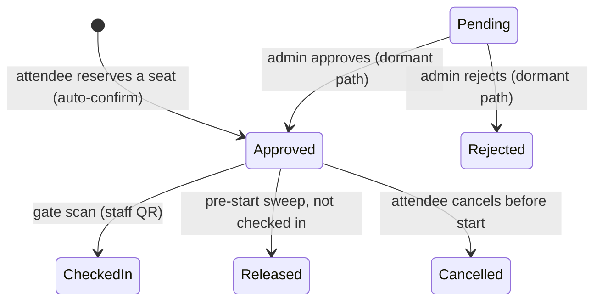

# Feature Design Specification — Bookings and Attendance

| Field | Value |
|-------|-------|
| Document ID | SIMF-FDS-005 |
| Title | Feature Design Specification — Bookings and Attendance |
| Version | 1.2 |
| Status | Approved |
| Classification | Confidential — to be confirmed by the owner |
| Prepared by | Engineering & Architecture Team, STARTIME |
| Owner | Product Owner |
| Approver | Product Owner |
| Date issued | 2026-05-20 |
| Related documents | SIMF-FDS-003, SIMF-FDS-004, SIMF-SRS-001, SIMF-UCS-001, SIMF-DAT-001, SIMF-RDR-001, SIMF-RPM-001 |

### Revision history

| Version | Date | Author | Summary of change |
|---------|------|--------|-------------------|
| 1.0 | 2026-05-20 | Engineering & Architecture Team | First issue. The bookings and attendance feature, build-ready. |
| 1.1 | 2026-05-21 | Engineering & Architecture Team | Architecture-review amendment (see Amendment A): graceful seat contention, held-seat expiry, aggregated live counts, Booking.Status Rejected. |
| 1.2 | 2026-07-19 | Apexium | Corrected to match the shipped code: seat reservation is confirmed immediately (no Control Panel approval step) and held provisionally until gate check-in; the pre-start sweep releases un-checked-in holds; FR-503 meaning updated; the Control Panel approval queue is retained but dormant. |

---

## 1. Purpose

This is the build-ready specification for bookings and attendance. It lets an
attendee reserve a seat in a session — confirmed immediately, with no Control
Panel approval step — held provisionally until the attendee checks in at the
hall gate, and reports whether the attendee actually attended. It sits directly
on the forum programme (SIMF-FDS-004) and the hall-arrival records
(SIMF-FDS-003).

## 2. Scope

The feature covers:

- making a booking — choosing a session and a seat (an assigned seat, a random
  seat, or a one-tap open-seating join), confirmed immediately,
- the rule that bookings may not overlap in time,
- the provisional hold confirmed by gate check-in, and the pre-start sweep that
  releases a hold not checked in,
- cancellation,
- the seat map and the attendee's "My Seat" view,
- session attendance derived from the hall-arrival records.

It does **not** define sessions, halls or seats — that is the Forum Programme
feature (SIMF-FDS-004). It does not capture hall arrival — that is Badge &
Access Control (SIMF-FDS-003); this feature **reads** those records. It does not
deliver notifications — it raises the events the Notifications feature sends.

## 3. Requirements and use cases covered

| From SIMF-SRS-001 | From SIMF-UCS-001 |
|-------------------|-------------------|
| FR-501 book a seat in a session | UC-09 Book a session seat |
| FR-502 many bookings, no time overlap | UC-09 |
| FR-503 attendee seat reservations confirmed immediately (no Control Panel approval); the approval queue retained but dormant | UC-22 Approve a booking |
| FR-504 cancel before the session starts | UC-10 Cancel a booking |
| FR-505 the assigned seat and the seat map | UC-09 |
| FR-506 session attendance from hall-arrival records | (feeds the statistics) |
| FR-903 booking and attendance notifications | (events only; see §6.6) |

Decision **D4** governs the booking design.

## 4. Feature overview

A booking moves through these states:

The attendee picks a seat (an assigned seat, a random seat, or a one-tap
open-seating join); the reservation is created **Approved** immediately and the
seat is held provisionally — there is no Control Panel approval step. The hold is
**confirmed** when the attendee checks in at the hall gate (staff QR scan); a
sweep shortly before the session **releases** any hold not checked in. The
attendee may cancel any time before the session starts. The **Pending →
Approved/Rejected** admin transitions belong to the retained-but-dormant approval
path only: nothing creates a Pending booking, so that path never runs (decision
D4).

## 5. Detailed behaviour

### 5.1 Making a booking

- **Trigger:** from a session detail (SIMF-FDS-004 section 6.2) the attendee
  chooses to book a seat (`UC-09`).
- **Rules:**
  - The attendee is **Approved** (SIMF-RPM-001).
  - The session is open for booking and the seat map has an available seat.
  - The session time does **not overlap** any session the attendee already has
    a Pending or Approved booking for (FR-502).
- **Processing:**
  1. Show the hall seat map with available, held and taken seats.
  2. The attendee selects an available seat.
  3. Check the overlap rule and that the seat is still free.
  4. Create a `Booking` in the **Approved** state (auto-confirmed) and **hold the
     seat** provisionally.
  5. Show the attendee an inline confirmation; no message is sent on reserving.
     The hold is confirmed later at gate check-in.
- **Failure:**
  - The session overlaps an existing booking → the booking is blocked with a
    clear explanation.
  - The seat was taken in the meantime → the attendee is asked to choose
    another.
  - The session is full → the attendee is told no seats remain.

### 5.2 Seat confirmation at the gate (and the dormant approval queue)

Attendee reservations are auto-confirmed on create (section 5.1), so a
reservation is never **Pending** and the seat hold is confirmed at the hall gate,
not in the Control Panel.

- **Confirmation path:** the held seat becomes the attendee's **confirmed** seat
  when they check in at the hall gate (a staff QR scan, SIMF-FDS-003). A hold not
  checked in shortly before the session starts is **released** by the pre-start
  sweep. An attendee may cancel before the session starts (section 5.3).
- **Dormant approval queue:** the Bookings page with the Approve and Reject
  actions (the PR team in the suggested configuration, decision D11), the
  bookings queue, the approve/reject/bulk-approve actions and the Bookings
  Approve/Reject permissions are **retained but dormant**. Nothing creates a
  **Pending** attendee booking, so this queue is **always empty**. When exercised
  (only through the dormant admin path) approve confirms the held seat and raises
  a booking-confirmed event (section 6.6), reject releases the seat and records a
  reason — but no attendee reservation reaches it.
- The queue remains an approval-queue pattern (SIMF-CPD-001 section 13.4); bulk
  approval is still available on that dormant surface.
- **Admin seat/row hold:** an administrator may reserve or block a specific seat,
  or a whole row, for a VIP — confirmed immediately, with no attendee attached.

### 5.3 Cancellation

- An attendee may cancel an Approved (provisionally held) booking **any time
  before the session starts** (`UC-10`, FR-504).
- On cancellation the booking becomes **Cancelled** and the seat is released
  back to the seat map.
- A booking cannot be cancelled once the session has started.

### 5.4 The seat map and My Seat

- The seat map shows the hall as a grid, each seat marked **available**, **held
  or taken**, or **mine** (mockup Screen 18, "My Seat").
- The attendee's session detail shows their assigned seat as soon as the
  reservation is created (Approved), and offers guidance to the seat through the
  venue map.

### 5.5 Seat holding

- A seat is **held** provisionally as soon as the reservation is created
  (Approved), **confirmed** when the attendee checks in at the gate, and
  **released** when the booking is Cancelled or when the pre-start sweep releases
  a hold not checked in (or, on the dormant admin path, when a booking is
  Rejected).
- Holding the seat on reserve prevents two attendees from taking the same seat.
  The database constrains a seat so it cannot be held or confirmed twice for the
  same session (SIMF-DAT-001 section 8).

### 5.6 Attendance and the events raised

- **Attendance** for a booked session is read from the `HallAttendance` records
  produced by Badge & Access Control (SIMF-FDS-003). The attendee's My Area and
  the statistics show whether they attended a session they booked.
- The feature raises these events for the Notifications feature to deliver
  (FR-903): **session started — you did not attend** and **session started — you
  did not enter** when a booked session starts and there is no matching
  hall-arrival record. No message is sent when the attendee reserves — the app
  shows an inline confirmation instead — so no booking-confirmed notification is
  raised on the attendee path; the **booking confirmed** event exists only on the
  retained-but-dormant admin approve path (section 5.2). This feature raises the
  events; the Notifications feature owns the channels and the delivery.

## 6. Data

The feature uses `Booking` and reads `Session`, `Seat`, `Hall`, `User` and
`HallAttendance` (SIMF-DAT-001 sections 5.3, 5.4).

`Booking.Status` needs the value **Rejected** in addition to Pending, Approved
and Cancelled; SIMF-DAT-001 section 5.4 currently lists three. This is open item
OI-1 against SIMF-DAT-001.

## 7. User interface

| Surface | Screens |
|---------|---------|
| Mobile app | Screen 17 Session detail (the Book action), Screen 18 My Seat (the seat map), Screen 14 My Area (saved sessions and confirmed bookings) |
| Control Panel | The Bookings approval queue and detail (retained but dormant — always empty), per SIMF-CPD-001 section 13.4; seat confirmation happens at the hall gate |

Mobile visuals are the external designer's; Control Panel screens follow
SIMF-CPD-001. Every screen has loading and error states; all text is localised,
Arabic and English.

## 8. Validation rules

| Item | Rule |
|------|------|
| Attendee | Must be Approved to book |
| Session | Must be open for booking; must have an available seat |
| Seat | Must be available at the moment of booking |
| Overlap | The session must not overlap a Pending or Approved booking of the same attendee |
| Cancellation | Allowed only before the session start time |
| Rejection reason | Required when a booking is rejected |

## 9. Security considerations

- Booking actions are tied to the signed-in attendee; an attendee can act only
  on their own bookings.
- The Bookings page is permission-controlled; only a role with the Bookings
  Approve/Reject actions can decide a booking.
- Approvals, rejections and cancellations are written to the operation log.
- Seat holding and the database constraint prevent a double-booked seat under
  concurrent requests.

## 10. Acceptance criteria

1. An Approved attendee can book an available seat in a session; the reservation
   is created Approved (auto-confirmed) and the seat is held provisionally, with
   an inline confirmation and no notification.
2. A booking that overlaps an existing Pending or Approved booking is blocked
   with a clear explanation.
3. A full session offers no seats and tells the attendee.
4. A held reservation is confirmed when the attendee checks in at the hall gate;
   a hold not checked in is released by the pre-start sweep. On the
   retained-but-dormant admin path the Control Panel can still approve a booking
   — the seat is confirmed and a booking-confirmed event is raised — or reject it
   with a reason and release the seat, but no attendee reservation reaches it.
5. An attendee can cancel an Approved (held) booking before the session starts;
   the seat is released.
6. A booking cannot be cancelled after the session has started.
7. The seat map shows available, held/taken and mine correctly; the assigned
   seat appears on the session detail once Approved.
8. The same seat cannot be booked twice for one session under concurrent
   requests.
9. Attendance for a booked session is shown from the hall-arrival records.
10. The booking and the session-started-no-attendance events are raised for the
    Notifications feature.
11. All screens render in Arabic (RTL) and English (LTR); no hardcoded text.
12. The build is clean and the feature has unit, integration and end-to-end
    tests that pass.

## 11. Test scenarios

| # | Scenario | Expected |
|---|----------|----------|
| T-01 | Book an available seat | reservation Approved (auto-confirmed); seat held provisionally; inline confirmation, no notification |
| T-02 | Book a session that overlaps an existing booking | blocked with an explanation |
| T-03 | Book in a full session | no seats offered; attendee told |
| T-04 | Two attendees book the same seat at once | one succeeds; the other is asked to choose again |
| T-05 | Approve a booking (dormant admin path — queue is always empty) | booking Approved; seat confirmed; booking-confirmed event raised |
| T-06 | Reject a booking with a reason (dormant admin path) | booking Rejected; seat released; attendee informed |
| T-07 | Bulk-approve several bookings (dormant admin path) | all selected bookings Approved |
| T-08 | Check in a held reservation at the hall gate | seat confirmed as the attendee's |
| T-09 | Cancel an Approved booking before the session | booking Cancelled; seat released |
| T-10 | Attempt to cancel after the session started | cancellation refused |
| T-11 | View the seat map | available, taken and mine shown correctly |
| T-12 | Booked attendee attends the session | attendance shown from the hall-arrival record |
| T-13 | Booked attendee does not attend | session-started-no-attendance event raised |
| T-14 | Render the booking screens in Arabic and English | correct layout and direction; no hardcoded text |

## 12. Open items

| ID | Item | Affects |
|----|------|---------|
| OI-1 | Add `Rejected` to `Booking.Status` in SIMF-DAT-001 section 5.4 | Section 6 |
| OI-2 | Confirm whether a booking has a cap per attendee, or is limited only by the no-overlap rule | Section 5.1 |
| OI-3 | Confirm whether a held seat for a Pending booking expires if approval is slow | Section 5.5 |
| OI-4 | Confirm document classification with the owner | Control block |

---

## Amendment A — Architecture review (2026-05-21)

The architecture reviews of 2026-05-21 amend this feature.

**Seat contention.** When a popular session opens for booking, many attendees
contend for the same seats. The seat uniqueness constraint (§5.5) guarantees
correctness; the application **expects and handles the constraint violation
gracefully** — "that seat was just taken, choose another" — rather than relying
on timing. A **held seat for a Pending booking expires** if approval is slow,
so an abandoned booking releases the seat (closes OI-3).

**Live counts.** Live attendance and per-session counts are computed by
**aggregating `VenueEntry` / `HallAttendance` on a short cycle** into a cached
value — not by incrementing a single counter row, which would serialise under
the morning scan burst.

**`Booking.Status`** includes the value `Rejected` (SIMF-DAT-001 Amendment A.4).

---

End of document.
