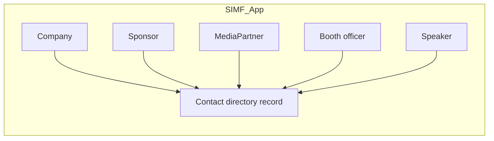
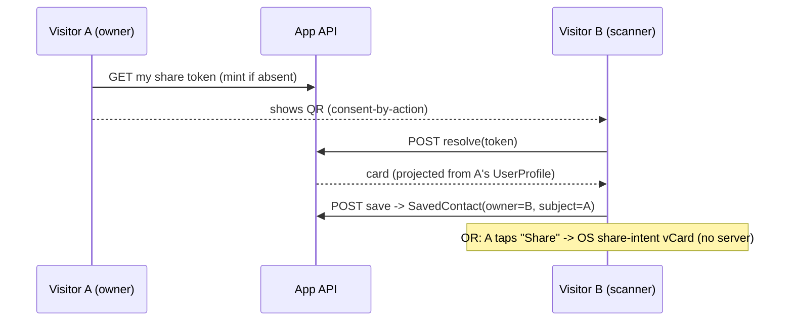

# Feature Design Specification — Shared Contact Directory & Visitor Contact Sharing

| Field | Value |
|-------|-------|
| Document ID | SIMF-FDS-014 |
| Title | Feature Design Specification — Shared `Contact` directory (org parties) + visitor-to-visitor contact sharing (QR / vCard) |
| Version | 0.1 (DRAFT — spec only, no code) |
| Status | Draft — pending §13 build-plan approval. **No code, no schema** committed by this document. |
| Classification | Confidential — to be confirmed by the owner |
| Prepared by | Engineering & Architecture Team |
| Owner | Product Owner |
| Approver | Product Owner |
| Date issued | 2026-06-03 |
| Related documents | SIMF-FDS-004 (Forum Programme — `Speaker`), SIMF-FDS-006 (Exhibition — `Company`, `Booth`, `Sponsor`), SIMF-FDS-008 (Networking — `Connection`; the V2-01 attendee-discovery boundary), SIMF-FDS-010 (Media — `MediaPartner`), SIMF-FDS-002 (Registration — `UserProfile`), SIMF-DAT-001 (`Country` lookup), SIMF-API-001 (envelope/headers), SIMF-MAA-001 (mobile architecture) |

### Revision history

| Version | Date | Author | Summary of change |
|---------|------|--------|-------------------|
| 0.1 | 2026-06-03 | Engineering & Architecture Team | First draft. Two-track scope/spec: (1) a shared, de-duplicated `Contact` directory the org-facing entities reference; (2) consent-by-action visitor-to-visitor contact sharing (dedicated share token + vCard). Owner decisions of 2026-06-03 folded in (§3). **No code.** |

---

> **Status note.** This document captures the four owner decisions of 2026-06-03
> (separate visitor cards; build the exchange now in full; dedicated share token;
> fixed social set) and the verified codebase facts behind them. It commits **no
> schema and no code** — implementation follows the §13 slice plan once approved.
> The D-110 freeze is currently lifted for **additive** `SIMF_App` work (D-219) but
> **must be re-instated before the production publish / handover**; this feature is
> additive-only and must land before then.

## 1. Purpose

Two related capabilities, deliberately kept as **two separate mechanisms**:

1. **A shared `Contact` directory (Track 1).** Today the "identity-card" cluster —
   logo, bilingual name, phone(s), social links, website, location, country — is
   re-implemented, inconsistently, on every org-facing entity (`Company`, `Sponsor`,
   `MediaPartner`, `Booth` officer, `Speaker`). This track extracts that cluster into
   **one de-duplicated `Contact` record** that those entities reference by FK. Editing a
   contact once updates it everywhere it is used (the owner's "one contact row reused
   across roles").

2. **Visitor-to-visitor contact sharing (Track 2).** A signed-in visitor can share
   their own contact card with another visitor by **showing a QR code** (the other
   scans it and saves them to *My Contacts*) or by an **OS share-intent vCard** (saved
   to the device's native contacts). This is **consent-by-action** — the act of
   showing the code or tapping *Share* is the consent.

## 2. Why they are separate (the engineering constraint)

A visitor's card is **their own Identity / profile data**; an org contact is
**admin-curated directory data**. They must not be the same record:

- **Two-DB rule (D-157 / D-246).** Visitor identity (email) lives in `SIMF_Identity`;
  the visitor's display data (`ArabicName`, `EnglishName`, `JobTitle`, `OrganisationId`,
  `SaudiMobile`, `InternationalMobile`, `NationalityId`) lives in `UserProfile` on
  `SIMF_App`. Copying visitor PII into the org `Contact` table would **duplicate
  Identity-owned data and blur the boundary** — forbidden. So a visitor card is
  **projected live** from `UserProfile` (+ a permitted bare-`Guid` Identity round-trip
  for email), never stored in the org directory.
- **No feature duplication.** `Connection` (D-224, SIMF-FDS-008) already models the
  visitor↔visitor *connect* relationship, and V2-01 already owns the *open discovery
  directory* with its privacy opt-in. Track 2 is the narrower, self-consented **save a
  card I was handed** flow — it does not reintroduce a discovery directory (that stays
  V2) and it does not replace `Connection` (a one-directional save is not a mutual
  request/accept).

## 3. Requirements and source

No SRS line exists yet (SIMF-SRS-001 is gate-blocked). Authority is the **owner
baseline** plus the **verified codebase**:

| Source | What it establishes |
|--------|---------------------|
| Owner, 2026-06-03 (Q1) | Visitor cards are a **separate** mechanism from the org `Contact` master. |
| Owner, 2026-06-03 (Q2) | **Build the visitor exchange now, in full.** |
| Owner, 2026-06-03 (Q3) | The share QR uses a **dedicated share token / vCard**, *not* the entry `QrId`. |
| Owner, 2026-06-03 (Q4) | Social links are a **fixed set** (Facebook / X / LinkedIn / Instagram). |
| Owner, 2026-06-03 | "Location = **map**" → latitude / longitude on the `Contact`. |
| Owner, 2026-06-03 | Apply to **all** org entities; shared UI components in CP, Website, mobile. |
| `Company.cs` | Has `NameAr/En`, `ContactEmail`, `ContactPhone`, `Website` — no logo / social / country. |
| `Sponsor.cs` | Has `NameAr/En`, `LogoRelativePath`, `Url` — no phone / email / social / country. |
| `MediaPartner.cs` | Has `NameAr/En`, `LogoRelativePath`, `Url` — no phone / email / social / country. |
| `Booth.cs` | Has booth-officer `OfficerName/Phone/Email`; exhibitor via `CompanyId`. |
| `Speaker.cs` | Has `FacebookUrl`, `LinkedInUrl`, `XUrl`, `PhotoRelativePath`, `CountryId` FK — the **fixed-social + country-FK precedent**. |
| `Country.cs` | Bilingual ISO-numeric lookup — the canonical country reference (logos stay **relative paths**, never absolute URLs). |
| `UserProfile.cs` | Source of the visitor card; holds name/title/org/mobile/country and the entry `QrId` (a check-in security token — **not** reused here). No public avatar field today (only the **encrypted** ID document, which must never be shared). |
| `Connection.cs` (D-224) | The existing visitor↔visitor relationship; app-only, no CP, bare-`Guid` cross-DB refs. |

## 4. Feature overview

## 5. Detailed behaviour

### Track 1 — shared `Contact` directory

#### 5.1 The `Contact` record (SIMF_App)
A single de-duplicated directory record holding the owner's listed fields:
- `LogoRelativePath` (relative, like `Sponsor`/`MediaPartner`/`Speaker`).
- `NameAr` (required), `NameEn`.
- Contact channels: `PhonePrimary`, `PhoneSecondary`, `Email` (the owner's "contact
  phones"; email retained because `Company`/`Organisation` already carry one).
- Social (fixed set, matching `Speaker`): `FacebookUrl`, `XUrl`, `LinkedInUrl`,
  `InstagramUrl`.
- `Website`.
- Location (map): `Latitude`, `Longitude` (nullable).
- `CountryId` — FK to the existing `Country` lookup (never free-text).
- `IsActive` (soft-delete), `CreatedAt`, `UpdatedAt`, `Deactivate()`.

#### 5.2 Reuse across roles ("one row reused")
- Each org entity gets a **nullable `ContactId` FK** to `Contact`. Multiple owners may
  point at the **same** `Contact` row; editing it updates everywhere — the owner's
  intended behaviour.
- Admin UX is **"link existing contact or create new"**: a shared picker lists active
  contacts (search by name) and offers *Create new*. Choosing an existing one wires the
  FK; creating one inserts a `Contact` and wires the FK.
- **Lifecycle:** a `Contact` is independent of its referrers — soft-deleting one
  referrer never deletes the shared `Contact`. A `Contact` is soft-deleted only from
  the contact directory page; the FK is `OnDelete.Restrict`, and a guard blocks
  deactivating a `Contact` still referenced by an active entity (clear bilingual error).

#### 5.3 Retrofit of the five entities (additive, wire-safe)
- `Company`, `Sponsor`, `MediaPartner`, `Speaker`, and `Booth` (its **officer** — a
  person distinct from the exhibitor `Company`) each gain a nullable `ContactId`.
- **Existing inline columns are retained** (additive only). The public read projection
  **prefers the `Contact` when set and falls back to the inline column**, so the
  **shipped mobile/public wire contract is preserved** (append-only, D-219): the same
  JSON field names are emitted, now sourced from `Contact` where linked. New fields
  (e.g. social on a sponsor card) are additive on the public DTO.
- A one-time, optional **backfill** can mint a `Contact` per existing row from its
  inline values; not required for correctness (fallback covers un-migrated rows).

### Track 2 — visitor-to-visitor sharing (consent-by-action)

#### 5.4 The share token (dedicated, ≠ entry QR)
- A `VisitorShareToken` (SIMF_App) holds `UserId` (bare `Guid` → `SimfUser.Id`), an
  opaque `Token` (Crockford base32, like the `QrId` minter, unique), `IsActive`,
  `CreatedAt`, `RevokedAt?`.
- Minted **on demand** the first time the visitor opens *Share my contact*; the visitor
  can **rotate** it (revoke the old, mint a new) so a previously shared code stops
  resolving. It is **separate from the entry `QrId`** so scanning someone at the gate
  never harvests their card (the Q3 decision).

#### 5.5 The card / vCard projection
- Resolving a token returns a card **projected live** from the owner's `UserProfile`:
  name (Ar/En), `JobTitle`, organisation name (from the `Organisation` lookup),
  `SaudiMobile`/`InternationalMobile`, country (from `Country`). Email is added via a
  permitted bare-`Guid` Identity round-trip (see OI-2 for the include/exclude decision).
- **No photo in V1** — visitors have no public avatar today; the encrypted ID document
  is private and must **never** be exposed. A public avatar is a later additive option.
- The OS **share-intent** path builds a standard **vCard 3.0** from the same card DTO and
  hands it to the platform share sheet (saved to the device's native contacts). This
  path stores nothing on the server.

#### 5.6 *My Contacts* (server-side save)
- `SavedContact` (SIMF_App): `Id`, `OwnerUserId` (bare `Guid`), `SubjectUserId` (bare
  `Guid`), `SavedAt`, optional `Note`, `IsActive`, `Deactivate()`.
- **No snapshot of the subject's PII** is stored — D-157 forbids extending the
  audit-snapshot copy pattern to live data. The card is **resolved on read** from the
  subject's `UserProfile` (App-to-App) + the email round-trip. If the subject is later
  deactivated, the saved row shows a limited/unavailable card.
- Saving is idempotent per (owner, subject). A visitor can remove a saved contact
  (soft-delete). **No notification** is sent to the subject (quiet by design;
  consent-by-action already covers the share).

#### 5.7 App endpoints (under `/api/v1/app/*`, app audience)
- `GET  share-token` (mint if absent) · `POST share-token/rotate`
- `POST contacts/resolve` (token → card) · `POST contacts/save` (token → SavedContact)
- `GET  contacts` (my list) · `DELETE contacts/{id}`
- `GET  contacts/{id}/vcard` (or client builds the vCard from the card DTO)

App-only, **no CP surface and no permission code** — matching `Connection` /
`SessionComment` (self-service visitor features key off
`RequireApprovedAccount` + the app audience, not a CP permission). This is deliberate
and does **not** violate the new-page-needs-permission rule, which governs CP
pages / admin API actions.

## 6. Data (additive on `SIMF_App` — freeze lifted, D-219; re-instate before handover)

> New tables/columns live on `SimfAppDbContext`. Visitor references are **bare `Guid`**
> logical FKs to `SimfUser.Id` on `SIMF_Identity` — no EF navigation, no DB FK, no
> cross-DB join (D-157/D-246). Org refs are real App FKs. **No Identity-owned data is
> duplicated**; visitor cards resolve on read.

| Entity / change | Key fields |
|-----------------|------------|
| `Contact` (new) | `Id`, `NameAr`, `NameEn`, `LogoRelativePath?`, `PhonePrimary?`, `PhoneSecondary?`, `Email?`, `Website?`, `FacebookUrl?`, `XUrl?`, `LinkedInUrl?`, `InstagramUrl?`, `Latitude?`, `Longitude?`, `CountryId?` (FK → `Country`), `IsActive`, `CreatedAt`, `UpdatedAt` |
| `Company` / `Sponsor` / `MediaPartner` / `Speaker` / `Booth` (extend) | add nullable `ContactId` (FK → `Contact`, `OnDelete.Restrict`); existing inline columns retained |
| `VisitorShareToken` (new) | `Id`, `UserId` (bare `Guid`), `Token` (unique), `IsActive`, `CreatedAt`, `RevokedAt?` |
| `SavedContact` (new) | `Id`, `OwnerUserId` (bare `Guid`), `SubjectUserId` (bare `Guid`), `SavedAt`, `Note?`, `IsActive` |
| New enums | none required (fixed social = columns; no new wire enum) |

## 7. Surfaces

| Surface | Screens |
|---------|---------|
| Control Panel | **Contacts** directory page (list / create / edit / soft-delete, permission-gated) + a shared **Contact picker/editor** component wired into the Company / Sponsor / MediaPartner / Speaker / Booth admin forms |
| Public website | A shared read-only **contact-card** component reused on the public org surfaces (sourced from `Contact`, falling back to inline) |
| Mobile app | A shared read-only contact-card; **Share my contact** (show QR + share-intent vCard); **scan QR** → preview → save; **My Contacts** list |

## 8. Validation rules

| Item | Rule |
|------|------|
| `Contact.NameAr` | Required, 1–256 |
| Phones | Optional; format-validated; lengths aligned FluentValidation = EF = UI |
| Social URLs | Optional; absolute-URL validated |
| `Latitude` / `Longitude` | Both set or both null; lat ∈ [-90,90], lng ∈ [-180,180] |
| `CountryId` | Must reference an active `Country` |
| Logo | Relative path only (never absolute URL) |
| Contact soft-delete | Blocked while referenced by an active entity |
| Share token | Opaque, unique; resolve returns 404 for unknown/revoked |
| Save | Idempotent per (owner, subject); cannot save yourself |

## 9. Security and privacy

- **Track 1 permission (HARD RULE).** New `PermissionCatalog` codes `Contacts.View` /
  `Contacts.Edit`, seeded `AdminOnly`, gating **both** the API
  (`Policies(PolicyFor(...), nameof(AuthorizationPolicies.RequireApprovedAccount))`)
  **and** the CP page (`[RequirePermission]` + nav `RequiredPermission` +
  `<AuthorizedAction>`). Guard tests must pass.
- **Track 2** is app-only self-service → no CP permission code (see §5.7); gated by
  `RequireApprovedAccount` + the app audience like `Connection`.
- **Audit.** CP contact create / edit / soft-delete write `OperationLog` / `RowAudit`.
- **NCA / privacy.** The entry `QrId` is **not** reused (Q3). The vCard exposes only the
  visitor's own profile fields by their own action; the **encrypted ID document is never
  exposed**. Consent is by action (show / scan / tap-share).

## 10. Acceptance criteria

1. An admin can create a `Contact` (logo, bilingual name, phones, social, website,
   lat/long, country) and link it from any of the five org entities; editing it once
   reflects on every linked entity.
2. Soft-deleting a `Contact` that is still referenced is rejected with a bilingual error.
3. Public/mobile org cards render unchanged field names, sourced from `Contact` where
   linked and from inline columns otherwise (shipped wire contract preserved).
4. A visitor can mint/rotate a dedicated share token and show it as a QR.
5. A second visitor can scan it, preview the projected card, and save it to *My Contacts*;
   the save stores only bare `Guid`s (no PII copy).
6. A visitor can export their card as a vCard via the OS share sheet (no server write).
7. Every CP surface is permission-gated; guard tests pass; app endpoints require an
   approved account.

## 11. Test scenarios (become the E2E catalogue at build)

| # | Scenario | Expected |
|---|----------|----------|
| T-01 | Create a contact + link to a Sponsor and a Company | both show the same data; edit once → both update |
| T-02 | Soft-delete a referenced contact | rejected (bilingual error) |
| T-03 | Public sponsor/booth/speaker card after linking a contact | identical JSON field names; new social fields additive |
| T-04 | Un-permitted admin opens Contacts page/endpoint | 403 / nav hidden |
| T-05 | Visitor mints + rotates share token | old token stops resolving |
| T-06 | Visitor B scans A's QR and saves | SavedContact(owner=B, subject=A); only Guids stored |
| T-07 | Resolve unknown/revoked token | 404 |
| T-08 | Save yourself | rejected |
| T-09 | Subject deactivated after save | saved row shows limited/unavailable card |
| T-10 | vCard export | well-formed vCard 3.0; no server write |

At build these become `docs/tests/e2e/cp-contacts.md` and
`docs/tests/e2e/mobile-my-contacts.md` (+ README index + PAGE-INDEX rows + per-page
reference docs), per the project DoD.

## 12. Open items (my recommended defaults — confirm on review, not blocking the spec)

| # | Item | Default / recommendation |
|---|------|--------------------------|
| OI-1 | Booth has two contactables (exhibitor `Company` vs booth **officer**). | The officer gets the `Contact` FK on `Booth`; the exhibitor's contact comes via `Company.ContactId`. |
| OI-2 | Does the visitor vCard include **email**? | **Include** (bare-`Guid` Identity read; it's a consented contact card). |
| OI-3 | Share-token lifecycle. | **Stable but rotatable** on demand (revoke + re-mint). |
| OI-4 | Notify the subject when someone saves them? | **No** (quiet; consent-by-action). |
| OI-5 | Phone count on `Contact`. | **Two slots** (`PhonePrimary` + `PhonePrimary`) + email; a child table only if open-ended phones are needed. |
| OI-6 | Backfill existing rows into `Contact`? | **Optional**; fallback-on-read covers un-migrated rows. |

## 13. Definition of Done & build plan (slices — pending your approval)

Build proceeds slice-by-slice, each its **own commit** (no push unless asked), each
carrying its docs (PAGE-INDEX + per-page) + unit/integration tests + E2E catalogue per
the DoD. Anchor decision **D-254** (next free; slices may take D-254..D-258).

**Track 1 — org `Contact` directory**
- **Slice A (D-254)** — Domain `Contact` + nullable `ContactId` on the five entities;
  EF configs; one additive migration; (no new enum).
- **Slice B (D-255)** — `IContactService` + admin API (CRUD + link/create + referenced-
  delete guard); `Contacts.View/Edit` permissions; contracts; tests.
- **Slice C (D-256)** — shared CP Contact picker/editor component wired into the five
  admin forms; public read projections flatten `Contact` into existing DTO field names
  (wire contract preserved); CP E2E + docs.
- **Slice D (D-257)** — shared read-only contact-card component for Website + mobile.

**Track 2 — visitor sharing**
- **Slice E (D-258)** — `VisitorShareToken` + `SavedContact` (App); app API (§5.7);
  vCard projection; mobile *Share my contact* + *Scan* + *My Contacts*; app-side tests
  + `mobile-my-contacts.md` E2E.

Each slice ends with a `DECISIONS_LOG.md` entry recording the build, the additive
freeze-lift use (D-219), and any OI resolutions. The freeze must be re-instated before
the production publish / handover.
