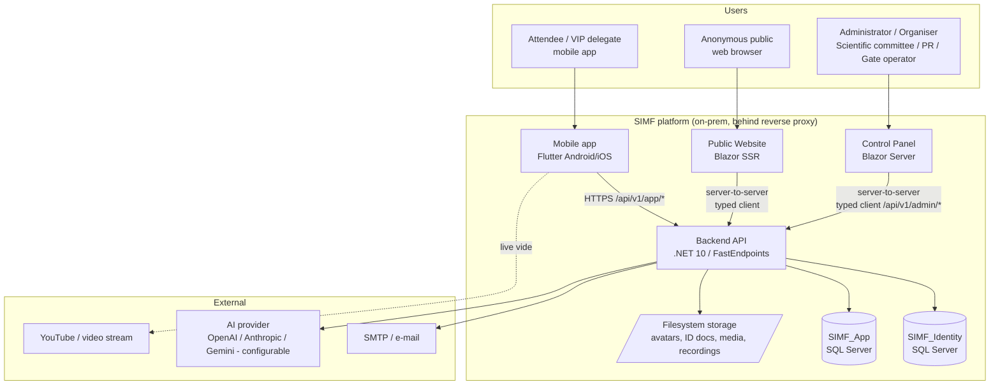
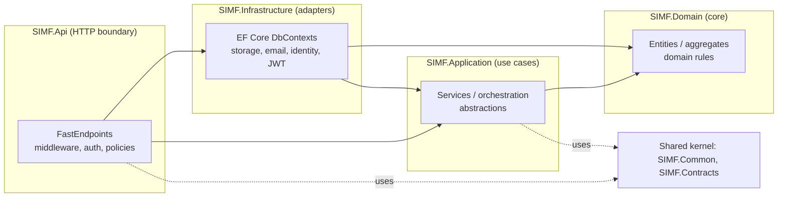
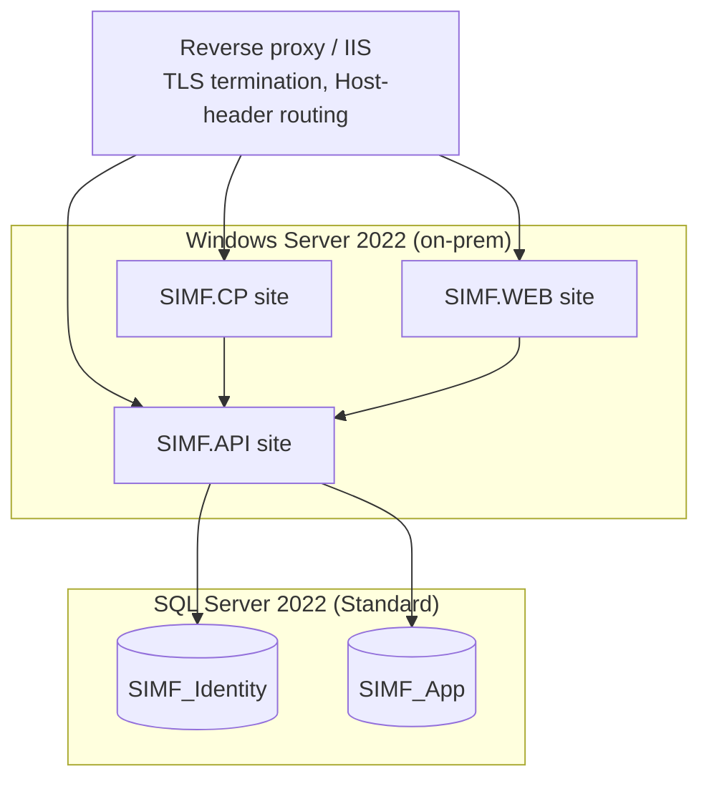

# SIMF — High-Level Design (HLD)

| Field | Value |
|-------|-------|
| Document | High-Level Design (HLD) |
| System | SIMF — Saudi International Maritime Forum platform |
| Version | 1.0 (Draft) |
| Date | 2026-06-25 |
| Status | Draft for review |
| Audience | Solution architects, lead engineers, security reviewers, client technical representatives |

> Readable rendition of `SIMF-HLD-001`. Written to a generic industry HLD template and
> self-contained. It reflects the current source tree on branch `feature/app-cp-api-split`,
> not just the 2026-05-21 controlled-document baseline. The formally controlled architecture
> record is `SIMF-SAD-001`; contract-level detail is in the companion **Low-Level Design**
> (`SIMF-LLD-001`). This HLD is not yet registered as a type in `SIMF-DMP-001 §4.2`.

---

## 1. Introduction

### 1.1 Purpose

This High-Level Design describes the SIMF platform end-to-end: its major components, how they
are layered, how they talk to each other, where data lives, how the system is secured, and how
it is deployed. Read it first, before the code or the detailed Low-Level Design.

### 1.2 Scope

The HLD covers the **whole system**:

- the **Backend API** (.NET 10, FastEndpoints),
- the **Control Panel** (Blazor Server admin application),
- the **public Website** (Blazor SSR with interactive auth islands),
- the **Mobile application** (Flutter, Android + iOS),
- the **two SQL Server databases** (`SIMF_Identity`, `SIMF_App`),
- the **shared libraries** that bind the .NET surfaces together, and
- the **deployment, operations and security** envelope around them.

### 1.3 What SIMF is

SIMF is a single-tenant event platform for a maritime forum run for the Royal Saudi Naval
Forces (RSNF) under a Ministry of Defense programme. Three audiences use three front-ends that
share one backend:

- **Attendees / visitors / VIP delegates** use the **mobile app** (and the website) to
  register, get a digital badge, browse the programme, reserve seats, watch live sessions, ask
  questions, network, and rate the event.
- **Organisers / administrators / scientific committee / public-relations / gate operators**
  use the **Control Panel** to run every part of the event.
- **Anonymous public** use the **website** to read public content (home, programme, visit
  information) and to start registration.

### 1.4 Definitions and acronyms

| Term | Meaning |
|------|---------|
| API | Application Programming Interface (the FastEndpoints HTTP backend) |
| CP | Control Panel (Blazor Server admin app) |
| BFF | Backend-for-Frontend (the thin server-side endpoint layer in CP/Website) |
| DDD | Domain-Driven Design |
| JWT | JSON Web Token |
| TOTP | Time-based One-Time Password (authenticator app) |
| OTP | One-Time Password (e-mailed code) |
| RBAC | Role-Based Access Control |
| PII | Personally Identifiable Information |
| RTL / LTR | Right-to-Left / Left-to-Right text direction (Arabic / English) |
| NCA | National Cybersecurity Authority (Saudi Arabia) |
| SSR | Server-Side Rendering |
| SoT | Source of Truth |

### 1.5 Reference documents

`SIMF-SAD-001` (Software Architecture Document), `SIMF-API-001` (API Specification),
`SIMF-DAT-001` (Data Model & Database Design), `SIMF-MAA-001` (Mobile Application
Architecture), `SIMF-CPD-001` (Control Panel Design), `SIMF-RPM-001` (Roles & Permissions),
`SIMF-OPS-001` (Deployment & Operations), `SIMF-SES-001` (Engineering Standards), and the
companion `SIMF-LLD-001` (Low-Level Design).

---

## 2. System context

### 2.1 Context diagram

### 2.2 Primary actors and channels

| Actor | Channel | Authentication |
|-------|---------|----------------|
| Attendee / visitor | Mobile app | Email + password, e-mail OTP second factor, optional biometric (device key) |
| VIP / delegate | Mobile app + CP-provisioned | Same as visitor; delegate flag granted by admin |
| Anonymous public | Website | None for public reads; registration starts the visitor flow |
| Administrator | Control Panel | Email + password + **TOTP** (authenticator) second factor |
| Gate operator | Mobile app (staff role) + CP operator console | Standard auth + role grant |
| Scientific committee / moderator | CP + mobile moderator screens | Standard auth + per-session grant / role |

### 2.3 External integrations

- **SMTP** — transactional e-mail (verification codes, OTP, approval notices, alerts). Sent
  asynchronously through an in-process queue.
- **AI provider** — pluggable (`Echo` stub, OpenAI, Anthropic, Gemini) behind an abstraction.
  Used for session-summary generation and comment/question filtering. Choosing a provider is a
  configuration change, not a code change.
- **Video / live stream** — YouTube (via the app's YouTube iframe player), with HLS/MP4
  fallback, for live sessions and sign-language feeds.
- **Maps** — a 2D venue map rendered from admin-maintained data. The current design has no
  third-party map-service dependency.

---

## 3. Architecture overview

### 3.1 Architectural style

SIMF is a **modular monolith**: a **single backend API** fronting **three client applications**
and **two databases**. The backend follows **Domain-Driven Design** layering and is organised
internally by **bounded context** (feature area). There is one HTTP API process. The split
between app users and administrators is **structural** — route prefixes and separate OpenAPI
documents — not a separate deployable service.

Key principles:

- **One API, one envelope, one permission model** shared by every client.
- **Two physically separate databases** for identity vs. business data, with no cross-database
  foreign keys (see §6).
- **Stateless API tier** (no in-process session state), so the event-day deployment can scale
  out horizontally without redesign.
- **Configuration over code** — content, categories, roles, permissions, and many behaviours
  are editable from the Control Panel without a release.

### 3.2 Logical layering (backend)

Dependencies point strictly inward: **Domain ← Application ← Infrastructure ← Api**.
`SIMF.Domain` has no web/EF-Core framework dependencies (it carries only the
`Microsoft.Extensions.Identity.Stores` abstraction). `SIMF.Application` holds use cases and
abstractions with no ASP.NET/EF dependency. `SIMF.Infrastructure` implements those abstractions (EF Core,
storage, e-mail, identity). `SIMF.Api` is the HTTP boundary.

### 3.3 Physical / deployment view

Three .NET sites (API, Control Panel, Website) plus one SQL Server instance hosting two logical
databases. The mobile app reaches the API through the same reverse proxy. The two web sites call
the API server-to-server using the shared typed client. Browser sessions hold encrypted auth
cookies, never raw bearer tokens.

---

## 4. Component architecture

### 4.1 Component inventory

| # | Component | Technology | Responsibility |
|---|-----------|------------|----------------|
| 1 | **SIMF.Api** | .NET 10, FastEndpoints | The HTTP API: authentication, authorisation, all app/admin endpoints, middleware, background workers |
| 2 | **SIMF.Application** | .NET 10 | Use-case orchestration, service contracts (abstractions) |
| 3 | **SIMF.Infrastructure** | .NET 10, EF Core | Persistence (two DbContexts), storage, e-mail, JWT/identity, audit interceptors |
| 4 | **SIMF.Domain** | .NET 10 | Entities, aggregates, enums, domain rules |
| 5 | **SIMF.ControlPanel** | Blazor Server, MudBlazor | Admin UI for the whole event |
| 6 | **SIMF.Web** | Blazor SSR + interactive islands | Public website + visitor self-service auth |
| 7 | **Mobile app** (`simf_app`) | Flutter (Riverpod, go_router, Dio) | Attendee-facing Android/iOS application |
| 8 | **SIMF.Common** | .NET 10 | Shared kernel: `ApiResult<T>`, `PermissionCatalog`, `AppRoles`, enums, error codes |
| 10 | **SIMF.Contracts** | .NET 10 | Request/response DTOs shared by API and clients |
| 11 | **SIMF.ApiClient** | .NET 10 | Typed HTTP client used by CP and Website |
| 12 | **SIMF.Components** | Blazor (Razor class library) | Shared `Simf*` UI components, themes, design tokens |

### 4.2 Backend API (SIMF.Api)

The API is the heart of the system. One process exposes two surfaces:

- **App surface** — routes under `/api/v1/app/*`, used by the mobile app and by the website's
  public reads and visitor self-service.
- **Admin surface** — routes under `/api/v1/admin/*`, used by the Control Panel.

Both surfaces share the same response envelope (`ApiResult<T>`), error model, standard headers,
and permission system. The API emits two OpenAPI documents — one filtered to `/app/*`, one to
`/admin/*` — so each client team reads only its own surface.

Internally the API is organised by **bounded context / feature area**: Auth & registration,
Account/profile, Programme & sessions, Bookings & seats, Gates & scan, Exhibition & booths,
Sponsors, News & media, Archive, Notifications, Networking, Meetings (speaker + delegation +
business), Statistics, System configuration, Organisation/About, and Reference data.

The API also hosts **background workers** (dormant-account sweep, registration-gate auto-close,
session reminders, e-mail dispatch) and **storage services** (avatars, encrypted ID documents,
VIP photos, session recordings, speaker presentations, media assets).

### 4.3 Client applications

- **Control Panel (SIMF.ControlPanel)** — Blazor Server (interactive server render). Cookie
  authentication with silent token refresh. Every page and action is gated by a permission code;
  list pages use a standard data-grid component; the UI is fully localised in English/Arabic with
  RTL. It calls the admin API surface through the typed client.
- **Website (SIMF.Web)** — Blazor SSR for fast static public pages, with **interactive islands**
  for the authentication and account flows (sign-in, OTP, forgot/reset password, profile,
  pending/rejected status, notifications). Public content pages call the app API's public reads.
- **Mobile app (`simf_app`)** — Flutter for Android and iOS. Riverpod state management; go_router
  with a persistent 5-tab bottom-navigation shell; a single Dio HTTP client with bearer-token and
  language interceptors; secure token storage; biometric sign-in; QR badge and scanning; and a
  navy-always bilingual (RTL) theme.

### 4.4 Real-time push — as-designed vs. as-built

The architecture **intends** SignalR-based push for live notifications, live-session interaction,
and Q&A moderation, and the deployment design allows for a SignalR backplane at event-day scale.
**As built there is no real-time push**: no hubs are registered, and clients get notifications
and live data through REST reads. A `SIMF.RealTime` project existed as an empty placeholder and
was removed on 2026-08-05 because it held no code and nothing referenced it; hubs would be
hosted by `SIMF.Api` when push is built. This HLD documents the intended design and flags the
gap; the LLD records the as-built state precisely. Closing the gap is tracked as outstanding
work.

---

## 5. Technology stack

| Layer | Technology |
|-------|------------|
| Backend runtime | .NET 10 |
| API framework | FastEndpoints + FluentValidation |
| ORM / persistence | EF Core (code-first) on SQL Server 2022 |
| Identity | ASP.NET Core Identity (`SimfUser`, `SimfRole`) + custom JWT issuance |
| Admin UI | Blazor Server + MudBlazor + shared `Simf*` components |
| Public UI | Blazor SSR + interactive server islands |
| Mobile | Flutter (Dart), Riverpod, go_router, Dio |
| Auth tokens | JWT (HS256), refresh-token rotation, TOTP/e-mail OTP second factor |
| E-mail | MailKit over SMTP, queued/asynchronous |
| Logging | Serilog (console + rolling file, 31-day retention) |
| CI/CD | Azure Pipelines (trunk-based on `main`), IIS deploy |
| Hosting | On-premises Windows Server behind a reverse proxy |

---

## 6. Data architecture

### 6.1 Two-database separation

SIMF uses **two physically separate SQL Server databases**:

- **`SIMF_Identity`** (`SimfIdentityDbContext`) — users, roles, permissions, role-permissions,
  refresh tokens, account codes/OTP, second-factor tokens, recovery codes, biometric device keys,
  password history, and per-user notifications.
- **`SIMF_App`** (`SimfAppDbContext`) — everything else: profiles, programme/sessions, seat
  reservations, halls, exhibition/booths, sponsors, news/media, archive, networking, meetings,
  feedback/ratings, gates/scans, system settings, venue map, organisation profile, and the audit
  tables.

### 6.2 Separation rules (permanent invariants)

1. **No cross-database foreign keys.** A reference from an App entity to a user is a **bare
   `Guid`** (logical FK), resolved on read with a second query — never a database constraint or
   cross-DB join.
2. **No duplicated live data.** Identity-owned data is never copied into `SIMF_App` (or vice
   versa). The only permitted copies are **immutable audit snapshots** — display-name/e-mail
   captured at write time in `OperationLog` / `RowAudit` / `GateScan`, so the audit trail is
   self-contained.
3. **No cross-database transaction.** A unit of work touches one database at a time.

The two connection strings may point at the same instance or at separate servers. This supports
both the development single-server topology and an event-day scale-out.

### 6.3 Data conventions (high level)

- Most business entities inherit a common **audit base** (`Id`, `CreatedAt/By`, `UpdatedAt/By`,
  `IsActive`, `DeletedAt`) and are **soft-deleted** by flipping `IsActive` and stamping
  `DeletedAt`.
- User-facing text is **bilingual** — entities carry an English and an Arabic field
  (`Name`/`NameArabic`, `Title`/`TitleArabic`, …). Public JSON field names are stable, to
  preserve the shipped mobile wire contract.
- **PII at rest** (national ID / Iqama / passport numbers, mobile numbers, and ID-document
  images) is **encrypted**.
- The entity-by-entity model — columns, keys, enums, migration history — is in the companion
  **LLD** (§4) and in `SIMF-DAT-001`.

---

## 7. Integration and interface design

### 7.1 Client ↔ API

- **Transport:** HTTPS only. Mobile uses a single Dio client; CP/Website use the shared typed
  client server-to-server.
- **Envelope:** every response is an `ApiResult<T>` carrying `success`, `data`, `error`, and
  optional `meta`. Errors carry a machine code and **bilingual** (English + Arabic) messages.
- **Standard headers:** application key, device type, `Accept-Language`, and `Authorization:
  Bearer <JWT>` on protected calls.
- **Pagination:** simple list endpoints use page/pageSize in `meta`; admin grids use a
  `GridQuery` POST body (`skip`/`top`/`search`/`sort`/`filters`) returning a `GridPage<T>`.

### 7.2 API ↔ external services

- **E-mail:** queued and sent asynchronously by a background service; failures can raise
  out-of-band alerts.
- **AI provider:** used through a provider abstraction. Every invocation is logged (telemetry,
  redaction markers) and rate-limited per administrator.
- **Video:** clients play the configured live-stream URL (YouTube iframe with HLS/MP4 fallback);
  the platform stores only the URL.

---

## 8. Security architecture

### 8.1 Authentication

- **Email + password** for all audiences. **Second factor:** e-mail OTP for visitors, **TOTP**
  (authenticator) for administrators; optional **biometric** sign-in on mobile via an ES256
  device key.
- **Access tokens** are short-lived JWTs (HS256). **Refresh tokens** rotate on use, and the
  session has an **absolute 24-hour cap**. Token reuse is detected, and a per-user
  **security-stamp** check lets the system revoke a session immediately.

### 8.2 Authorisation

- **RBAC with per-page/per-action permissions.** Permission codes (format `Page.Action`) live in
  a single `PermissionCatalog`, are seeded idempotently, are baked into the JWT as `perm` claims,
  and are enforced on **both** the API and the Control Panel.
- **`Administrator` holds the wildcard `*`** and satisfies any permission.
- Build-time tests fail the build if a Control Panel page or admin endpoint is missing its
  permission gate — an ungated admin surface is treated as a security defect.

### 8.3 Request protection and hardening

- **Rate limiting** is multi-dimensional: per-IP (auth bucket), per-email (credential
  endpoints), a global safety cap, and per-admin (AI test). Rejections are audited.
- **Security headers** and a **Content-Security-Policy** are applied. OpenAPI/Swagger is gated by
  Basic auth and disabled by default in production.
- **Secrets** (JWT signing key, ID-document encryption key, SMTP password, AI keys) come from
  environment variables and are never committed. In production the API **fails to boot** when a
  required secret is missing.

### 8.4 Data protection and audit

- **PII encrypted at rest** (ID numbers, mobiles, ID-document images).
- **The two-database split is itself a control** — the identity surface is isolated and frozen.
- **Two audit trails:** a durable **`OperationLog`** of security-relevant business events
  (sign-in, approvals, configuration changes, …) and a **`RowAudit`** row-level change log
  (insert/update/delete with before/after images). Both are append-only, with actor snapshots and
  correlation IDs.

### 8.5 Compliance posture

The system is being aligned to the **NCA Secure Application Development Standard** (and ECC /
OWASP baselines). A documented gap analysis drives a remediation programme: password policy,
PII-at-rest, CSP, audit-of-denials, upload AV scanning, a CI test-gate + dependency/SCA + SBOM,
and a threat model. Several items are **owner/operations actions** — rotate committed secrets,
issue a CA certificate, remove the development TLS bypass in the mobile release, add a WAF, and
run an independent penetration test — and remain open at the time of writing.

---

## 9. Deployment and operations

### 9.1 Environments

Four-stage promotion, no skipping: **Development → Test → Staging → Production**. A failing gate
stops promotion. Development/Test run a single-server topology. The event-day production topology
is built scale-ready (stateless API, externalised config), so scaling out is a deployment change,
not a redesign.

### 9.2 CI/CD

Trunk-based on `main` with pull-request review. The pipeline builds three apps in Release with
zero warnings, runs unit/integration/E2E tests as a gate, runs dependency vulnerability scanning
and SBOM generation, then deploys to IIS sites — keeping the last-known-good binaries for
rollback.

### 9.3 Health, rollback and observability

- **`/health`** is a real readiness check (database reachable, migrations applied), used by the
  proxy and monitors to pull unhealthy instances.
- **Migration order is enforced** — App database before Identity database — to keep deploys
  forward-compatible.
- **Rollback** restores the last-known-good binary, re-checks health, and re-runs the smoke test.
- **Observability** is Serilog structured logging plus the `OperationLog`/`RowAudit` database
  trails. The three forum days are the critical monitoring window.

---

## 10. Non-functional requirements (quality attributes)

| Priority | Attribute | Intent / target |
|---|-----------|-----------------|
| 1 | **Security** | Defence in depth; every endpoint authorised and auditable; NCA / OWASP alignment |
| 2 | **Event-day availability** | No avoidable single point of failure on the event-day path; validated by peak-shaped load tests (registration surge, live-session concurrency, scan bursts, notification fan-out, mixed steady state) |
| 3 | **Maintainability** | One clear way to do things; DDD layering; a new engineer productive in days |
| 4 | **Configurability** | Content, categories, labels, roles, permissions editable from the Control Panel without a release |
| 5 | **Performance** | Stateless API, push instead of polling (intended), indexed queries; specific p95/error-rate thresholds set during load testing |
| 6 | **Portability of dependencies** | AI provider and notification channels swappable via abstractions and configuration |
| — | **Localization** | Arabic (primary, RTL) and English (LTR) throughout |
| — | **Accessibility** | Mobile accessibility controls (text size, high contrast, reduced motion); web aims at WCAG AA |

Concrete load-test pass/fail thresholds and the monitoring/alerting toolchain are **open items**,
to be fixed during staging.

---

## 11. Cross-cutting concerns

- **Error handling** — a central middleware converts domain/validation exceptions into the
  standard `ApiResult` failure envelope with the correct HTTP status; clients render the bilingual
  message.
- **Validation** — FluentValidation per request shape; failures return HTTP 400 with field-level,
  bilingual detail.
- **Localization** — bilingual everywhere. The chosen language flows from the client's
  `Accept-Language` header and drives the response message language.
- **Configuration** — the Options pattern binds typed config sections. Production overrides and
  all secrets come from `SIMF_`-prefixed environment variables (double-underscore for nesting).
- **Correlation** — every request carries a correlation ID, propagated into logs and both audit
  trails for end-to-end tracing.

---

## 12. Key architectural decisions

| ID (decision log) | Decision | Rationale |
|---|----------|-----------|
| D-157 / D-246 | Two physically separate databases (Identity vs App), no cross-DB FKs | Isolate and freeze the identity/security surface; independent scaling and hardening |
| D-247 | One API, app/admin split by route prefix + dual OpenAPI docs | Single envelope/permission model and code reuse, with audience-scoped contracts |
| D-207 / D-208 | Per-page/per-action permissions, roles-only assignment, JWT-baked, `Administrator = *` | Fine-grained access control, enforceable on both tiers |
| — | Modular monolith with DDD layering | Maintainability and a clear single source of truth |
| — | Stateless API tier, externalised config | Event-day scale-out without redesign |
| D-110 (+ lifts) | Schema/enum freeze with controlled additive lifts | Protect the shipped mobile wire contract and persistence surface |
| D-443 | NCA token caps (5-min access / 24-h absolute) + single-flight refresh | Compliance and resilience under a refresh storm |

---

## 13. Assumptions, constraints and open items

**Constraints**

- Hard event deadline and a post-publish change freeze; mandatory NCA security compliance; source
  handover obligation.
- On-premises hosting behind a reverse proxy; SQL Server 2022 Standard edition.

**Open items (do not guess)**

- **Real-time (SignalR)** hubs are not implemented on the current branch (see §4.4).
- Specific **load-test thresholds** and the **monitoring/alerting toolchain** are unset.
- **Owner/operations security actions** remain outstanding: rotate the secrets currently in git
  history; issue a CA-signed certificate and remove the mobile development TLS bypass; enable the
  new identity-lifecycle knobs (password expiry/history, dormant-account disable); add a WAF; and
  run an independent penetration test.
- The **live-video provider** is resolved to **YouTube** for the proof of concept (D-349); a
  production provider is still pending procurement. The **geofence hall-arrival + attendance** is
  built (Hall geofence columns + `HallAttendanceService`, with tests); only continuous
  **movement/dwell** tracking and question-gating-on-arrival remain deferred. The final
  **statistics metric list** remains an open decision.
- **Notifications** are delivered over **in-app + e-mail only**; SMS and WhatsApp channels are
  specified (SRS FR-901) but not yet built. Live **AI translation / sign-language** and the
  **AI assistant/chatbot** are scaffolds on the `Echo` provider, not real conversion services.

---

*End of High-Level Design.*
