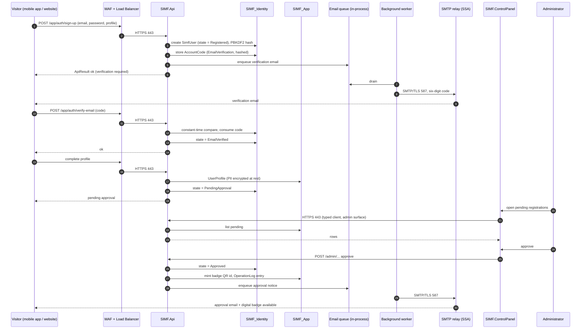
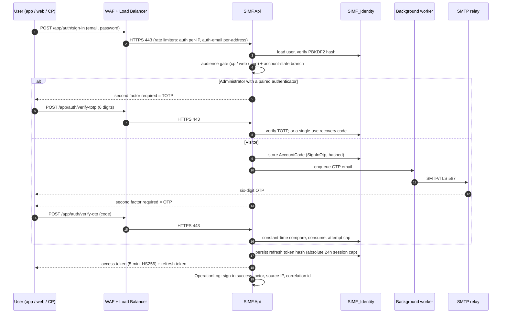
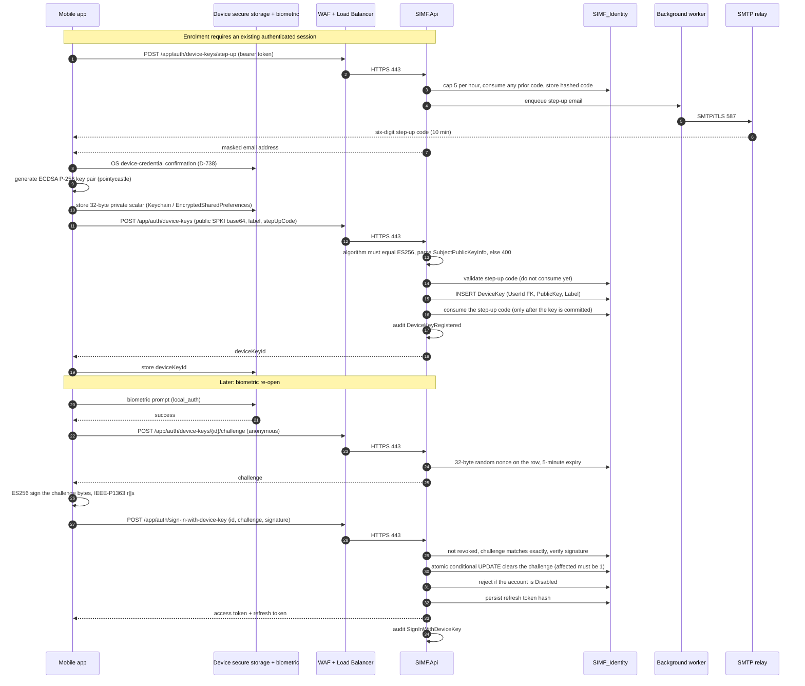
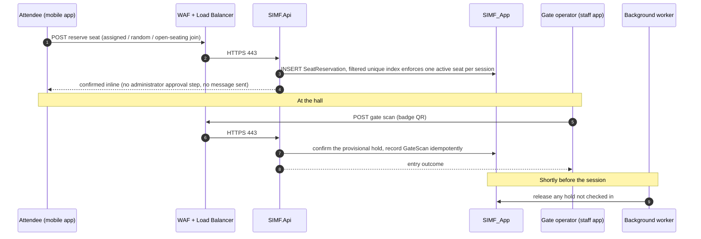
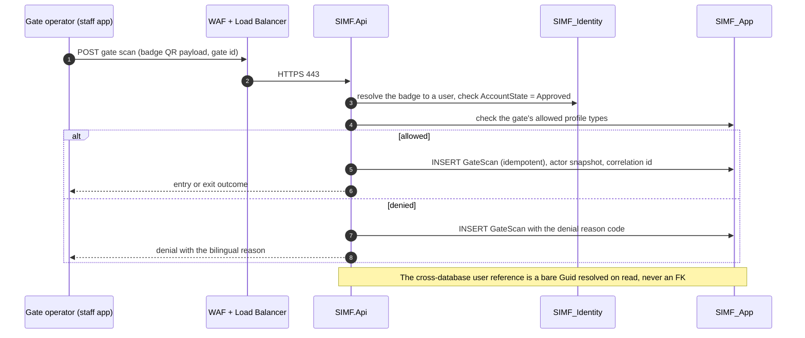
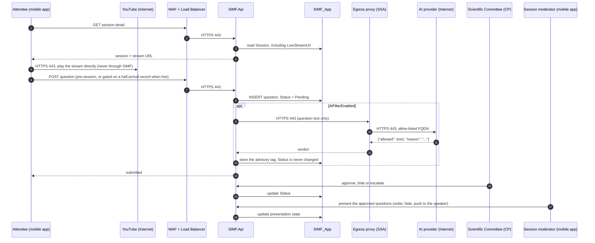
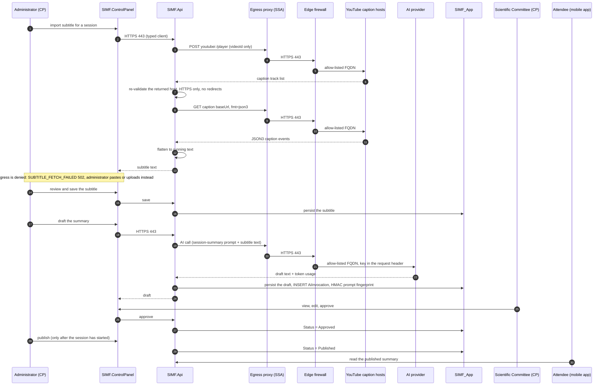
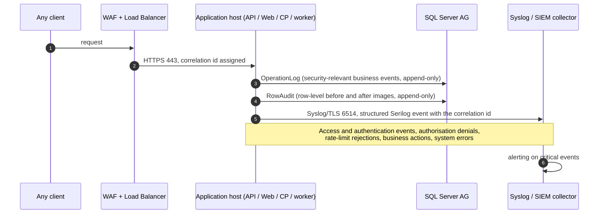

# SIMF HLD-002 / LLD-002: Response to Reviewer Clarification Points

| Field | Value |
|-------|-------|
| Document | Reviewer clarification response |
| Responds to | `SIMF-HLD-002-MoD-HLD-External-v0.07.docx`, `SIMF-LLD-002-Solution-Design-Document.docx` |
| Date | 2026-07-30 |
| Status | **Superseded in part by SIMF-HLD-003 v1.0 (2026-07-30).** Retained as the working evidence file |
| Superseding note | The owner decided on 2026-07-30 that **no AI runs in the cloud**. Every statement in this file about cloud AI providers, hybrid routing, provider retention, training exclusion, residency, sub-processors or data-processing agreements is therefore **obsolete**: there is no cloud AI call and no third-party AI processor. The file-encryption table in section 6.2 was corrected on the same date (four of eighteen categories are encrypted, not all). **The issued deliverables are `SIMF-HLD-003-MoD-HLD-External-v1.0.docx` and `SIMF-HLD-003-Formal-Response-to-Technical-Review.docx`.** This file is retained as the working evidence behind them and is not for issue |
| Basis | The two MoD deliverables above, plus the as-built source tree on branch `feat/cp-dashboard-reporting` |

Every answer below is grounded in the delivered source. Where the reviewer's
premise does not match the as-built system, that is stated plainly rather than
answered around. Where an item is a genuine open decision for the site network
team or the owner, it is marked **OPEN** and not guessed.

Two of the thirteen points (11 and 12) turn out to be defects in Figure 1 of
HLD-002 rather than design questions. Point 5 rests on a premise that does not
match the build. Those three are flagged first in the summary.

---

## Summary of findings

| # | Point | Outcome |
|---|-------|---------|
| 1 | Two-tier or three-tier | Three-tier. Presentation and API are separate hosts in production. Documentation clarification only. |
| 2 | YouTube communication flow | Two distinct flows exist. Playback is client-direct; captions are backend-outbound. Clarification only. |
| 3 | Embed only, or YouTube APIs | Embed plus read-only caption retrieval. No create, no manage, no OAuth, no Google account held. Clarification only. |
| 4 | Backend to AI and caption API | Clarification only. Purposes, payloads and auth methods listed below. |
| 5 | Passwords not stored | **Premise correction.** Passwords are stored as PBKDF2 hashes. SIMF never emails a password. |
| 6 | File share storage | Clarification only. Full 18-category classification table below. |
| 7 | Sequence diagrams | **New content.** Nine diagrams supplied below. |
| 8 | Mobile enrolment and device key | Clarification, plus one as-built limitation that must be disclosed (D-738 software-bound key). |
| 9 | Data shared with external services | Clarification, plus one configuration decision that needs an owner ruling. |
| 10 | SIEM and SMTP in the diagram | **Diagram defect.** Both are drawn with no connection lines and no host. |
| 11 | Load balancer to "SIMF.ai" | **Diagram defect.** There is no `SIMF.ai` component. The reviewer is reading a mis-routed egress arrow. |
| 12 | SIMF.Api outbound path | **Diagram defect.** The controlled egress point is named in the text but never drawn as a node. |
| 13 | Per-host deployment diagram | **Diagram and matrix rework.** Per-host inventory and revised matrix below. |

---

## 1. Deployment architecture: two-tier or three-tier, and is presentation separate from the API

**The solution is three-tier.** The tiers are:

| Tier | Components | Process type |
|------|-----------|--------------|
| Presentation | `SIMF.Web` (Blazor SSR public website), `SIMF.ControlPanel` (Blazor Server admin) | Server-side .NET, IIS sites |
| Application / business | `SIMF.Api` (FastEndpoints, .NET 10) plus the background worker | Server-side .NET, IIS site |
| Data | SQL Server 2022 (`SIMF_Identity`, `SIMF_App`) plus the shared encrypted file store | SQL Server, SMB file store |

**The presentation tier and the API tier are deployed separately in production.**
HLD-002 section 2.1 already sizes them as distinct node groups: website tier two
nodes, admin tier two nodes, API tier four nodes. They are separate IIS sites
today in every environment (`deploy/iis-deploy.ps1` deploys three named sites,
`ApiSiteName`, `CpSiteName`, `WebSiteName`, each with its own application pool),
and in the production topology those sites live on separate hosts. The reason the
reviewer could not tell is point 13: Figure 1 groups them inside a single "SSA
Zone (application servers)" box, which reads as one application server.

The separation is enforced, not merely conventional:

- Only `SIMF.Api` and the background worker hold database connection strings.
  Neither `SIMF.Web` nor `SIMF.ControlPanel` can reach SQL Server at all; they
  obtain every byte of data from the API.
- The two presentation applications call the API server-to-server over HTTPS 443
  using the shared typed client (`SIMF.ApiClient`). The browser holds an
  encrypted authentication cookie and never a raw bearer token.
- The mobile application calls `SIMF.Api` directly through the load balancer on
  `/api/v1/app/*`; it does not pass through the presentation tier.

Two points of honesty for the reviewer:

1. Because the presentation tier is Blazor Server and Blazor SSR, it is a
   server-side rendering tier, not a browser-only single-page application. It
   therefore genuinely occupies a server tier of its own rather than collapsing
   into the client.
2. In development and test the three IIS sites are co-located on one host, and
   the background worker runs in-process inside the API application pool. The
   worker's move to a dedicated Windows Service is planned and is already
   isolated in `deploy/ops.ps1` behind a `Workers` target so only that part of
   the script changes. This is stated in HLD-002 section 2.7 and remains accurate.

---

## 2. YouTube integration: role and communication flow

There are **two separate YouTube flows** with different directions and different
trust properties. Conflating them is the source of the question.

### Flow A. Live playback: client-direct, never through the backend

The attendee's device plays the stream directly from YouTube. The mobile
application uses `youtube_player_iframe`; the public website embeds the same
stream. The platform persists only the URL, on `Session.LiveStreamUrl`. No video
byte and no manifest request traverses `SIMF.Api`, the load balancer, or any
ministry server.

Consequences worth stating in the HLD:

- Video bandwidth is not a capacity input for the SSA zone. This is already
  reflected in the section 2.1 sizing note ("Live-session video streams directly
  from YouTube to the attendee device and never passes through SIMF").
- The attendee device requires Internet access to YouTube. If attendee devices
  are on a restricted ministry network, playback fails even though the platform
  is healthy. An HLS or MP4 fallback URL is supported on the same field for that
  case (D-349).
- The attendee's own IP address, user agent and the video id are disclosed to
  Google by the device. See point 9.

### Flow B. Caption import: server-to-server, outbound from the backend only

`SIMF.Api` fetches an existing caption track for a published video so the AI
summary drafter has a transcript to work from. Implementation:
`src/Backend/SIMF.Infrastructure/Programme/YoutubeTranscriptService.cs`.

Two outbound hops:

1. `POST https://youtubei.googleapis.com/youtubei/v1/player` with an `ANDROID`
   client context, to list the video's caption tracks. The request body carries
   only the `videoId`.
2. `GET` on the caption `baseUrl` the first hop returned, with `fmt=json3`, to
   download the track.

Hardening applied to the second hop, because the URL is attacker-influenceable
in principle:

- The host returned by YouTube is **re-validated** before the request against an
  allow-list (`youtube.com`, `google.com`, `googlevideo.com` and their
  subdomains) and the scheme must be HTTPS.
- The `HttpClient` is registered with redirects disabled, so a crafted or
  intercepted player response cannot steer the GET at an internal target.
- On reject, the generic failure is raised and the URL is never logged.

**No inbound connection from YouTube to SIMF exists.** Every YouTube flow is
either client-to-YouTube or SIMF-to-YouTube outbound.

---

## 3. Embed only, or use of YouTube APIs to create, manage or retrieve stream and caption information

| Capability | Used by SIMF | Detail |
|-----------|--------------|--------|
| Create or schedule a live broadcast | **No** | The broadcast is created on YouTube by ministry staff outside SIMF. An administrator pastes the resulting URL into the Control Panel session record. |
| Manage or control a live broadcast (start, stop, bind, transition) | **No** | No YouTube Live Streaming API call exists in the source. |
| Retrieve stream metadata (title, status, viewer counts) | **No** | Nothing is read back about the broadcast. The platform holds only the URL string the administrator entered. |
| Embed and play the stream | **Yes** | Client-side player only. See point 2, flow A. |
| Retrieve an existing caption track | **Yes, read-only** | Two unauthenticated GET/POST calls, described in point 2, flow B. |
| Create, upload, update or delete captions | **No** | SIMF never writes to YouTube. |
| YouTube Data API v3 | **No** | Not referenced anywhere in the solution. |
| Official YouTube Captions API | **No** | That API requires OAuth ownership of the channel. SIMF does not use it. |
| OAuth client, service account, or any Google credential | **No** | SIMF holds no Google account, no OAuth client and no refresh token for YouTube. |

The only key-like value in the caption path is a constant
(`InnertubeKey` in `YoutubeTranscriptService.cs`) which is the public web player
key shipped inside every browser's youtube.com page. It is not a secret, it is
not tied to any ministry identity, and it grants no privileged access. It is
committed deliberately and documented as non-secret in the source comment.

**Material design risk to declare, because a security reviewer will ask.** The
innertube and timedtext endpoints are undocumented and can change without
notice. The source states this explicitly. Every failure funnels to a single
`SUBTITLE_FETCH_FAILED` (502) whose bilingual message instructs the administrator
to paste or upload the transcript instead. The AI summary feature therefore
never hard-depends on this integration. If the MoD prefers to eliminate the
dependency entirely, removing flow B and keeping only paste and upload is a
configuration-level decision with no schema impact. **OPEN for owner ruling.**

---

## 4. Backend to AI provider and YouTube caption API: purpose, outbound flow, data exchange, authentication

### 4.1 Purpose

The two outbound integrations exist to serve one chained feature plus three
standalone ones.

**Chained: the AI session summary (the محضر), FDS-004 and D-238.**

1. An administrator asks the Control Panel to import the subtitle for a session.
2. `SIMF.Api` fetches the caption track from YouTube (point 2, flow B) and
   returns the flattened running text. The team reviews it and saves it.
3. `SIMF.Api` calls the configured AI provider with the seeded `session-summary`
   prompt plus that subtitle text, and receives a draft summary.
4. The Scientific Committee views, edits and approves the draft.
5. An administrator publishes it after the session has started; attendees read
   it in the application.

**Standalone AI features** (`src/Shared/SIMF.Common/Enums/AiFeature.cs`):
`QuestionFilter`, `Faq`, `Assistance`, `Translate`, `LiveTranslation`,
`LiveSignLanguage`, `SessionSummary`, `CpAssistant`.

### 4.2 What is actually sent to the AI provider, per feature

| Feature | Payload sent | Contains personal data |
|---------|--------------|------------------------|
| `SessionSummary` | Session title, **the session's speaker display names**, the session abstract, and the subtitle transcript in English and Arabic | **Yes, speaker names.** Published programme data, but they are names of identifiable individuals. No attendee data of any kind |
| `QuestionFilter` | The question text only, as `{"text": "..."}` | No. The author's user id stays server-side for the audit row and is never sent. |
| `Assistance` (attendee assistant) | Grounding context built from the same public read services the application's own screens call: active programme sessions (bilingual title, start, end, hall), public FAQ entries, public exhibition booths | No |
| `CpAssistant` | The Control Panel page catalogue (route and title) | No |
| `Faq`, `Translate`, `LiveTranslation`, `LiveSignLanguage` | The supplied text | No |

Verified in `src/Backend/SIMF.Infrastructure/Ai/AssistanceContextBuilder.cs`,
`src/Backend/SIMF.Infrastructure/SessionQuestions/AiQuestionFilter.cs` and
`src/Backend/SIMF.Infrastructure/Programme/AdminSessionSummaryService.cs`.

**Annex A carries the full field-by-field register**, derived from the seeded
prompt templates, which are the definitive statement of what can leave the
platform. Read it in place of this summary table for any security assessment.

### 4.3 Authentication method, per destination

| Destination | Endpoint | Credential | Transport |
|-------------|----------|-----------|-----------|
| Google Gemini | `POST {BaseUrl}/v1beta/models/{model}:generateContent`, default `https://generativelanguage.googleapis.com` | API key in the `x-goog-api-key` **header**, deliberately kept out of the query string so it cannot land in intermediary request-line logs | HTTPS 443 |
| Anthropic | `POST {BaseUrl}/v1/messages`, default `https://api.anthropic.com` | API key in the `x-api-key` header, plus the required `anthropic-version` header | HTTPS 443 |
| OpenAI, or an on-premises OpenAI-compatible endpoint | `POST {BaseUrl}/chat/completions`, default `https://api.openai.com/v1` | `Authorization: Bearer <key>` | HTTPS 443 |
| YouTube caption hosts | `youtubei.googleapis.com`, `www.youtube.com`, `*.googlevideo.com` | **None.** Unauthenticated public endpoints plus the browser-public innertube constant | HTTPS 443 |
| `Echo` provider | In-process | Not applicable. Offline stub, the default, so development and test never reach the network | None |

Key handling: every provider key is supplied only through a machine-scope
environment variable (`SIMF_Ai__Gemini__ApiKey`, `SIMF_Ai__Anthropic__ApiKey`,
`SIMF_Ai__OpenAi__ApiKey`), never committed. An empty key raises
`AI_PROVIDER_NOT_CONFIGURED` (503) rather than falling back to anything.

### 4.4 Controls on every AI invocation

- Recorded in the `AiInvocation` table with the caller, feature, provider, model
  and token counts.
- The prompt content is fingerprinted with **HMAC**-SHA256 keyed on a
  server-only secret (`Ai:PromptHash:Secret`), not a raw hash, so an insider
  with audit-read cannot brute-force short or templated prompts from the
  fingerprint (D-181).
- Provider error bodies are redacted and capped at 500 characters before they
  reach the log, because an error body can echo request content.
- Rate-limited per administrator.
- The question filter is **advisory only**. It never changes a question's
  status; every question still lands `Pending` for the Scientific Committee. Any
  AI failure degrades to an `ai-unavailable` verdict and never blocks a
  submission.

### 4.5 Outbound network flow

Both integrations must leave through the single controlled egress point, and
neither may open a socket to the Internet from an application host. That is the
subject of point 12, where the path is specified and the diagram defect is
recorded.

---

## 5. Password storage, subsequent logins, and the emailed password

**The premise needs correcting: SIMF does store a password verifier, and SIMF
never emails a password.** The HLD-002 wording that most likely produced this
question is in section 2.9, "passwords are hashed by ASP.NET Core Identity;
refresh tokens and one-time codes are stored hashed and never in clear text".
That says the plaintext is not stored. It does not say no password material is
stored.

### 5.1 How subsequent logins are authenticated

Standard password-verifier authentication:

- At sign-up the **user chooses their own password**. ASP.NET Core Identity
  derives a PBKDF2 hash with a per-user salt and stores it in
  `SimfUser.PasswordHash` in the `SIMF_Identity` database.
- On every later sign-in the user submits the password, Identity re-derives the
  hash with the stored salt and parameters and compares. The plaintext is never
  persisted and never logged.
- A successful password check is only the first factor. The second factor is an
  emailed OTP for visitors, or a TOTP authenticator code for administrators with
  ten single-use Crockford recovery codes as the fallback.
- Only then are tokens issued: a 5-minute HS256 access token and a rotating
  refresh token bounded by an absolute 24-hour session cap (D-443).

Password policy as built: at least 8 characters, at least one letter and one
digit, and not equal to the e-mail address. Account lockout and per-code attempt
caps bound brute force. Invalid-credential and forgot-password responses are
deliberately generic so they never reveal whether an account exists.

### 5.2 No password is ever emailed. Confirmed by inspection

A source-wide search for temporary-password generation
(`TemporaryPassword`, `GeneratePassword`, `InitialPassword`, `RandomPassword`)
returns **no matches**. What SIMF emails is always either a short-lived
single-use numeric code or a one-time link, never a credential the user keeps.
The complete set (`src/Shared/SIMF.Common/Enums/AccountCodePurpose.cs`):

| Purpose | What it is | Lifetime and limits |
|---------|-----------|---------------------|
| `EmailVerification` | Six-digit code at sign-up | Single use, hashed at rest |
| `PasswordReset` | Forgot-password code | Single use, hashed at rest |
| `SignInOtp` | Six-digit sign-in second factor for visitors | Single use, hashed at rest |
| `BadgeActivationOtp` | Code a badge holder uses to verify the address of an admin-created or walk-in account **before setting their first password** | Single use, hashed at rest |
| `BiometricEnrolStepUp` | Code confirming intent before a biometric device key is bound | 10 minutes, max 5 requests per hour, max 5 attempts then burned |
| `EmailChangeVerification` | Code sent to the new address when the login e-mail changes | Single use, hashed at rest |

Every code is stored as a keyed hash (`AccountCodeHasher.Hash`), compared in
constant time (`CryptographicOperations.FixedTimeEquals`), single-use, and only
the newest outstanding code for a purpose stays valid.

### 5.3 Administrator-created accounts: no password at all, and a 7-day invitation

This is the flow closest to what the reviewer may have had in mind, and it is
stronger than an emailed password. From
`src/Backend/SIMF.Api/Endpoints/Admin/CreateUserEndpoint.cs`:

> "The new account lands in `PendingApproval` **with no password** and receives a
> **7-day password-set invitation**."

So an account an administrator creates has no credential until the invited person
sets one themselves through the time-limited invitation. There is nothing to
intercept in an inbox, nothing to reuse, and nothing shared between the
administrator and the user.

### 5.4 Is the password temporary, and is a first-login change forced

Both questions dissolve: there is no system-issued password, so nothing is
temporary and there is nothing to force a change of. The user's first password is
one they set themselves, either at self-service sign-up or through the invitation
or badge-activation path.

Available in support of the same control objective:

- Self-service change-password, and forgot-password reset.
- Password history (`PasswordHistoryEntry` in `SIMF_Identity`) and a password
  expiry knob. These are built but their **enablement is an operator action that
  remains open**, and is already listed as an outstanding item in HLD-002
  section 2.9.

**If the MoD requires an emailed-initial-password flow instead of the invitation
link, that is a change request, not a documentation gap.** Our recommendation is
to keep the invitation link, because it never puts a reusable credential in
e-mail. **OPEN for owner ruling.**

---

## 6. File share storage: purpose and the file types held

### 6.1 Purpose

Three reasons, in priority order:

1. **Keep binary content out of the database.** Database rows hold a relative
   path reference, never a blob. This keeps both databases small, keeps backup
   and restore times predictable, and keeps the AlwaysOn Availability Group
   replicating rows rather than megabytes.
2. **Give a multi-node API tier one coherent view.** With four API nodes, a
   local disk would mean node 2 cannot serve a file node 1 wrote. The shared
   store (SMB 445, HSA zone) makes any node able to read back what another
   wrote. In the single-node development topology the store is local to the API
   host.
3. **Concentrate the file security controls in one place.** One `StoredFile`
   table with one policy resolver (D-568) replaced seven bespoke per-feature
   stores, so access control, encryption at rest, the upload allow-list,
   retention and disposal are decided once per category rather than per feature.

### 6.2 What is stored, by category and classification

The category is the `FileService` enum
(`src/Shared/SIMF.Common/Enums/FileService.cs`); the classification is the
`FileSensitivityTier` enum, persisted at write time so the classification is
auditable rather than inferred (NCA ECC 2-7-2).

| Category | Owner entity | Classification | Read access | Encrypted at rest |
|----------|-------------|----------------|-------------|-------------------|
| `IdDocument` | User | **Secret** | Owner or admin only, no-store, **every access audited** | Yes |
| `Avatar` | User | Confidential | Owner or admin | Yes |
| `VipPhoto` | User | Confidential | Admin only | Yes |
| `SpeakerPresentation` | SpeakerPresentation | Internal | Any signed-in approved account, served as an attachment | Yes |
| `SessionRecording` | Session | Internal | Any signed-in approved account, range-streamed | **No.** Corrected 2026-07-30: seekable plaintext is required for HTTP 206 range streaming, and the file holds no PII |
| `MediaGalleryImage` | MediaItem | Public | Public | No |
| `SpeakerPhoto` | Speaker | Public | Public | No |
| `NewsImage` | News | Public | Public | No |
| `SponsorLogo` | Sponsor | Public | Public | No |
| `MediaPartnerLogo` | MediaPartner | Public | Public | No |
| `CompanyLogo` | Contact | Public | Public | No |
| `OrganizationLogo` | OrganizationProfile | Public | Public | No |
| `ArchiveCover` | ArchiveEdition | Public | Public | No |
| `ProgrammeDayImage` | ProgrammeDay | Public | Public | No |
| `Banner` | Banner | Public | Public | No |
| `BoothLogo` | Booth | Public | Public | No |
| `ExhibitorLogo` | Exhibitor | Public | Public | No |
| `OrganizationHeroVideo` | OrganizationProfile | Public | Public, range-streamed | No, deliberately kept seekable for HTTP 206 |

The enum is append-only under the D-110 rule: an existing value is never renamed
or reordered, and a new category takes the next free integer.

### 6.3 Controls

- **Encryption at rest** for the Secret, Confidential and Internal tiers:
  application-level AES-GCM envelope encryption, a per-file data key wrapped by
  a key-encrypting key supplied through an environment variable
  (`Storage:UserIdDocumentEncryptionKey`, a 32-byte operator-supplied value, via
  `IPiiEncryptor`). There is no dependency on SQL Server TDE, so the protection
  survives a raw file-system copy of the store.
- **Only four of the eighteen categories are encrypted** (`IdDocument`, `Avatar`,
  `VipPhoto`, `SpeakerPresentation`). `SessionRecording` and
  `OrganizationHeroVideo` are deliberately plaintext because AES-GCM is not
  seekable and both are range-streamed over HTTP 206; the twelve public image
  categories are plaintext because they are public content. Each is a conscious
  decision recorded in the policy registry.
- **Retention is currently indefinite for every category.** No retention or
  disposal schedule is implemented. See HLD-003 open item OI-3.
- **Upload allow-list and scanning** per category.
- **Reachable only from the application servers.** No client and no user ever
  touches the SMB share; every read is an authorised API call that resolves the
  path, checks the tier policy, decrypts and streams.
- **Backups** of the store are scheduled alongside the database backups, in the
  HSA zone.

---

## 7. Sequence diagrams for the key system workflows

The nine workflows below cover HLD-002 section 2.3 plus the flows the other
reviewer points touch. Participants are named exactly as in the deployment
inventory of point 13, so each diagram maps one-to-one onto the communication
matrix.

### 7.1 Visitor registration and administrator approval



### 7.2 Sign-in with the second factor



### 7.3 Biometric device-key enrolment, then biometric sign-in



### 7.4 Seat reservation and hall check-in



### 7.5 Gate scan and access control



### 7.6 Live session and moderated question and answer



### 7.7 AI session summary, end to end



### 7.8 Asynchronous e-mail dispatch

```mermaid
sequenceDiagram
    autonumber
    participant API as SIMF.Api
    participant Q as EmailQueue (in-process)
    participant WRK as EmailBackgroundService
    participant SMTP as SMTP relay (SSA)
    participant LOG as Syslog / SIEM collector
    participant R as Recipient

    API->>Q: TryEnqueueAsync (purpose, subject email, subject user id)
    API-->>API: return immediately, SMTP latency never blocks the request
    WRK->>Q: drain
    WRK->>SMTP: SMTP/TLS 587 (MailKit)
    SMTP-->>R: message
    WRK->>LOG: Syslog/TLS 6514, dispatch outcome + correlation id
    Note over WRK,LOG: A failure raises an out-of-band alert; the worker heartbeat feeds /health
```

### 7.9 Logging and audit to the SIEM



---

## 8. Mobile enrolment and authentication: OTP, ES256 key storage, registration, binding, revocation, lost device

Implementation references:
`src/Backend/SIMF.Domain/IdentityAccess/DeviceKey.cs`,
`src/Backend/SIMF.Infrastructure/IdentityAccess/DeviceKeyService.cs`,
`src/Backend/SIMF.Api/Endpoints/Auth/DeviceKeyEndpoints.cs`,
`src/Mobile/simf_app/packages/simf_auth_pkg/lib/src/data/device_key_client.dart`,
`src/Mobile/simf_app/packages/simf_auth_pkg/lib/src/application/auth_controller.dart`.

### 8.1 Biometric sign-in is an accelerator, never a primary credential

Enrolment can only happen from an **already authenticated session**. Both
enrolment endpoints require `RequireApprovedAccount` with a bearer token, so the
user has already passed password plus second factor. A device key therefore never
creates an authentication path that did not already exist; it shortens a path
the user has already proved.

### 8.2 The OTP step-up before enrolment

Enrolment is gated by **two independent confirmations** (D-738):

1. An emailed six-digit step-up code, purpose `BiometricEnrolStepUp`.
2. An operating-system device-credential confirmation on the handset.

The reason is stated in the source: a borrowed but unlocked phone must not be
able to silently bind a new long-lived credential without also holding the
account's e-mail.

Step-up code properties:

| Property | Value |
|----------|-------|
| Lifetime | 10 minutes |
| Request cap | 5 per rolling hour per account, then HTTP 429, audited |
| Attempt cap | 5 wrong attempts, then the code is burned atomically |
| Concurrency | Issuing a new code consumes any prior unconsumed one, so only the newest is valid |
| Storage | Keyed hash only. The plaintext is emailed and never persisted |
| Comparison | Constant time (`FixedTimeEquals`), no timing side channel |
| Consumption ordering | Validated before the key is written, **consumed only after** the key row commits, so a failed save never burns a still-valid code |

### 8.3 Key generation and secure storage of the private key

- The **client** generates the ECDSA P-256 key pair locally (`pointycastle`).
  No key material is ever generated server-side.
- The private half is the 32-byte big-endian scalar, base64, written to
  `flutter_secure_storage` under `StorageKeys.deviceKeyPrivate`: iOS Keychain,
  Android EncryptedSharedPreferences. **The private key never leaves the device.**
- The public half is a base64 `SubjectPublicKeyInfo` DER blob, which is what the
  server imports with `ECDsa.ImportSubjectPublicKeyInfo`.
- Cold-start reads of secure storage are time-boxed (D-295) so a hung platform
  keystore cannot strand the user on the splash screen.

**As-built limitation that must be disclosed to a security reviewer (D-738).**
The private key is **software-bound** in secure storage; it is not
hardware-bound or biometric-bound. The biometric prompt gates the code path, not
the key material. Binding the key inside Android Keystore or StrongBox with
`setUserAuthenticationRequired`, and inside the iOS Secure Enclave, is a planned
Tier-2 hardening. The server contract (SPKI plus ES256 verification) does not
change when it lands, so it is a client-only change. This is documented in the
source and should be stated in the HLD rather than left implicit.

### 8.4 Public-key registration and server-side validation

`POST /app/auth/device-keys` with the public SPKI, a user-supplied device label
and the step-up code. The server:

- rejects any algorithm other than the exact string `ES256`
  (`DEVICE_KEY_ALGORITHM_UNSUPPORTED`, 400);
- rejects a missing public key or one over 256 characters;
- requires a label of 1 to 64 characters;
- **eagerly parses** the SPKI blob so a malformed key is a clean 400 rather than
  a 500 at first use;
- persists the row and writes a `DeviceKeyRegistered` audit entry.

### 8.5 Device binding

- `DeviceKey.UserId` is a **real foreign key** to `SimfUser.Id`. Both live in
  `SIMF_Identity`, so this does not violate the cross-database rule.
- The binding is one row per device per user. The `deviceKeyId` and the private
  key exist only in that one handset's secure storage, so possession of the
  device is what the signature proves.
- A user may enrol several devices. `GET /app/auth/device-keys` lists their own
  keys with the label, creation time, last-used time and revocation time, which
  is what makes the revoke surface usable.
- Challenge issuance is intentionally `AllowAnonymous`, and the source states
  why: a challenge is worthless without the matching private key, so leaking a
  `deviceKeyId` does not enable sign-in. The endpoint is still rate-limited.

### 8.6 Replay and race protection on sign-in

Four checks, in order, before any token is minted:

1. The key exists, is not revoked, and has a live challenge that has not expired
   (5-minute window).
2. The challenge the client submitted matches the stored one **exactly**
   (ordinal comparison).
3. The ES256 signature verifies over the challenge bytes, IEEE-P1363 raw
   `r || s` format.
4. The challenge is consumed by an **atomic conditional UPDATE**: only the row
   still holding that exact challenge is cleared, and the update must report
   exactly one affected row. A concurrent replay inside the window clears nothing
   and is rejected before token minting.

Then the account state is re-checked (a `Disabled` account fails), and the same
token pair as a password sign-in is issued: a 5-minute access token and a
rotating refresh token under the absolute 24-hour session cap. Every failure is
audited with its distinct reason (`expired_or_missing`, `mismatch`,
`bad_signature`, `already_consumed`, `user_missing_or_disabled`).

### 8.7 Revocation

| Path | Endpoint | Authorisation |
|------|----------|---------------|
| Self-service, one key | `DELETE /app/auth/device-keys/{id}` | The signed-in owner. A non-owner receives 404, not 403, so key ids cannot be enumerated |
| Administrator | `DELETE /admin/device-keys/{id}` | `AdministratorOnly` plus `RequireApprovedAccount` |

Revocation sets `RevokedAt`, clears the live challenge and its expiry, is
**idempotent**, and writes a `DeviceKeyRevoked` audit entry recording whether the
actor was an administrator. A revoked key returns 401 on both challenge issuance
and sign-in.

Client side, turning Face ID off best-effort revokes on the server and then
deletes the local `deviceKeyId` and private key **independently**, so a failure
on one delete cannot leave the biometric path alive. If the server revoke fails,
the orphaned server row is unusable because the private key has been destroyed.

### 8.8 Lost or replaced device

| Situation | Recovery |
|-----------|----------|
| Device lost, user can still sign in | Sign in on any device with e-mail, password and the second factor (biometric was never the only factor), open the device list, revoke the lost device by its label, then enrol a fresh key on the new device. |
| Device lost, user cannot sign in | An administrator revokes the key by id (`DELETE /admin/device-keys/{id}`). The user then recovers the account through forgot-password plus the emailed second factor and re-enrols. |
| Device replaced or upgraded | The new handset has no key material, so the application falls back to password plus OTP automatically (`hasEnrolledDeviceKey` is false, so the biometric button is not even offered). The user enrols a new key; the old row should be revoked from the device list. |
| Account compromise suspected | Disabling the account blocks device-key sign-in regardless of any live key, and the per-user security stamp plus refresh-token rotation revoke every live session immediately. |
| Device re-provisioned or the app reinstalled | Secure storage is cleared by the platform, so the private key is gone and the local path is dead. The server row remains until revoked; it is unusable. |

**Residual item worth recording.** There is no automatic revocation of a stale
key. A key that is never used again stays active until someone revokes it.
`LastUsedAt` is recorded on every successful sign-in, so a dormant-key sweep
mirroring the existing dormant-account sweep is straightforward if the MoD wants
one. **OPEN for owner ruling.**

---

## 9. Data shared with each external service: type, purpose, sensitivity, and whether personal or confidential data leaves the ministry

### 9.1 External destinations

| Destination | Data sent | Purpose | Classification | Personal data | Leaves the ministry |
|-------------|-----------|---------|----------------|---------------|---------------------|
| AI provider (Gemini, Anthropic, or OpenAI-compatible) | Session title, speaker display names, session abstract and subtitle transcript; audience question text; visitor free text and that visitor's own prior chat turns; grounding context built from public programme, FAQ and booth data; the Control Panel page directory for the calling operator; the prompt template | Session summary drafting, advisory question filtering, attendee assistant, Control Panel assistant, translation, live translation and sign-language glossing | Public to Internal, depending on the feature. See the risk note below | **Speaker display names only** (the session-summary feature; published programme data). No attendee name, e-mail, national ID, Iqama, passport, mobile number, badge, booking or scan data is ever included. A visitor's own free text may contain whatever the visitor chose to type. Field-by-field register in Annex A | Yes if a cloud provider is configured. No if the on-premises endpoint is configured |
| YouTube caption hosts | The `videoId` of a broadcast the ministry itself published, and the caption track URL YouTube returned | Import an existing transcript so the AI summary has source text | Public | No | Yes, but only a public video identifier |
| YouTube playback (device to Google, not via SIMF) | The attendee device's own IP address, user agent and the `videoId` | Play the live stream | Public content, attendee network metadata | The attendee's IP and device metadata are disclosed **by the device**, not by SIMF | Yes. See 9.3 |

### 9.2 Internal destinations, for completeness

| Destination | Data | Classification | Leaves the ministry |
|-------------|------|----------------|---------------------|
| SMTP relay (SSA zone) | Recipient e-mail, display name, verification and OTP codes, approval, booking and reminder notices | Confidential, internal | No |
| Syslog / SIEM collector | Structured events with the actor id and e-mail snapshot, source IP, user agent, correlation id, outcome, error code | Internal | No |
| SQL Server AG, shared file store (HSA zone) | All persistent data, including encrypted PII and identity documents | Up to Secret | No |

### 9.3 The one place attendee metadata reaches a third party

Because live playback is client-direct (point 2, flow A), the attendee's device
contacts Google directly. Google therefore observes that device's IP address,
user agent and the video watched. **SIMF does not send this; the device does, and
it is inherent to embedding YouTube.** It cannot be mitigated while keeping
YouTube as the delivery channel. The alternatives, if the MoD considers this
unacceptable, are to proxy the video through the SSA zone (which changes the
capacity model substantially, since video would then traverse ministry
infrastructure) or to use an on-premises streaming provider. **OPEN for owner
ruling.** This should be stated in the HLD, because a reviewer will otherwise
find it during a network assessment rather than in the document.

### 9.4 The AI content-sensitivity decision that needs an explicit ruling

No personal data reaches the AI provider. That part is settled and verifiable in
the source. But **session subtitle text is forum content**, and a maritime
defence forum's session content may itself be sensitive even though it contains
no PII.

The design already anticipates this with a hybrid policy: the `OpenAiProvider`
can be pointed at an **on-premises** OpenAI-compatible `BaseUrl`, so sensitive
defence content is summarised locally, while non-sensitive features use the
cloud. The routing is per prompt (`AiProviderRouting`), so the split is a
configuration decision, not a code change.

The consequence must be stated plainly: **if the operator points every feature at
a cloud provider, session content does leave the ministry.** With the hybrid
policy configured as designed, no personal data and no confidential content
leaves. We recommend recording the per-feature provider assignment as a formal
configuration baseline in the deployment prerequisites, so the decision is
explicit and auditable rather than implicit in an environment variable.
**OPEN for owner ruling.**

### 9.5 What never leaves the platform under any configuration

Password hashes, refresh tokens, OTP and code hashes, TOTP secrets, recovery
codes, device public keys, national ID, Iqama and passport numbers, mobile
numbers, identity-document images, badge QR payloads, gate-scan records, and the
`OperationLog` and `RowAudit` trails.

There is also **no inbound external interface**, no Active Directory or LDAP
integration (SIMF operates its own ASP.NET Core Identity store), and no SMS or
NAFATH dependency (the second factor is e-mail OTP or TOTP).

---

## 10. SIEM and SMTP in the diagram: paths, hosting locations, gateways, and the matrix

### 10.1 The defect

In Figure 1 of HLD-002 v0.07, SMTP and the SIEM appear only as a single dashed
box labelled "Internal services: SMTP relay | Syslog / SIEM", positioned in the
SSA zone with **no connection lines to anything** and no host of their own. The
communication matrix does carry two of the flows (`SIMF.Api` to SMTP relay on
587, and "All application hosts" to Syslog/SIEM on 6514), so the text is right
and the picture is incomplete. The reviewer is correct.

### 10.2 What the diagram must show

| Flow | Source | Destination | Protocol and port | Zone boundary crossed |
|------|--------|-------------|-------------------|-----------------------|
| Transactional e-mail | `SIMF-API-01..04`, `SIMF-WRK-01` | `SIMF-SMTP-01` | SMTP with STARTTLS, TCP 587 | None if the relay sits in SSA |
| Structured logging | `SIMF-API-01..04`, `SIMF-WEB-01..02`, `SIMF-CP-01..02`, `SIMF-WRK-01` | `SIMF-LOG-01` | Syslog over TLS, TCP 6514 | None if the collector sits in SSA |
| Database logging | `SIMF-SQL-01..03` | `SIMF-LOG-01` | Syslog over TLS, TCP 6514 | HSA to SSA, crosses the inner firewall |

Two corrections to the matrix as it stands:

1. The e-mail row currently names only `SIMF.Api`. The **background worker is the
   component that actually opens the SMTP connection** (`EmailBackgroundService`
   drains the queue and sends via MailKit). Once the worker moves to a dedicated
   Windows Service this becomes a distinct source host, so the row must name both.
2. The logging row says "All application hosts", which is correct today but
   becomes ambiguous once the diagram is per-host. It should be enumerated per
   host, and the SQL Server hosts added, since the section 2.9 monitoring view
   already claims the SIEM collects "from all components, the API, the Control
   Panel, the website and the database tier".

### 10.3 Hosting location: the open question

The design assumes both the SMTP relay and the log collector are **SIMF-owned
services inside the SSA zone**, which is what section 2.7 states. If the ministry
instead requires SIMF to send to a **central shared-services SMTP relay and a
central SIEM** outside the SSA zone, then:

- both flows cross the inner or an inter-zone firewall rather than staying inside
  SSA;
- the matrix rows change to `SSA` to `shared-services zone`, and each needs the
  gateway named and a firewall rule raised;
- SMTP AUTH credentials for the central relay become a new secret to supply
  through the environment-variable mechanism;
- the SIEM's ingestion format must be confirmed (Syslog RFC 5424 over TLS is what
  SIMF emits today via Serilog).

**OPEN.** This is a site network team and MoD infrastructure decision, not a
solution-design decision. It must be resolved before the deployment prerequisites
are finalised. The SIEM product itself (Splunk, QRadar, Sentinel, or other) is
also still unselected, which HLD-002 section 2.9 already records as an open item
("The monitoring and alerting toolchain is selected during deployment planning").

---

## 11. The apparent load balancer to "SIMF.ai" connection

### 11.1 There is no SIMF.ai component

**No component, process, site, host or service named `SIMF.ai` exists in the
solution.** The AI capability is not a deployable unit. It is a set of features
**inside `SIMF.Api`**: the provider implementations live in
`src/Backend/SIMF.Infrastructure/Ai/` behind the `IAiProvider` abstraction, and
clients reach them on the ordinary `/api/v1/app/*` and `/api/v1/admin/*` routes
like any other endpoint. There is no separate AI endpoint, no separate
certificate, and no separate load-balancer pool.

### 11.2 What the reviewer is actually seeing

In Figure 1 the orange arrow labelled "egress (AI, captions)" originates at
**`SIMF.Api`** and is routed leftwards so that it passes **across the WAF and
load balancer box** on its way out through the edge firewall to the "External
services (outbound)" box. Because the label sits immediately beside the load
balancer, the arrow reads as a link between the load balancer and an AI service.
It is a drawing artefact, not a design element. The reviewer's reading is a
reasonable one and the diagram is at fault.

### 11.3 The direct answers

- **Purpose of the apparent load balancer to AI connection:** none. It does not
  exist.
- **Are AI requests routed directly through the load balancer?** **No.** The load
  balancer never carries an AI provider call in either direction. Its only
  involvement is that a user request which happens to trigger an AI feature
  arrives at `SIMF.Api` through it, exactly like every other request.
- **Are AI requests routed through the main application?** **Yes, entirely.**
  `SIMF.Api` is the only component that ever calls an AI provider. It does so as
  an outbound server-to-server call while handling a request, and the result is
  persisted and returned in the ordinary `ApiResult<T>` envelope.

### 11.4 Diagram fix required

1. Reroute the egress arrow so it leaves `SIMF.Api`, terminates at an explicitly
   drawn **egress proxy** node inside the SSA zone, and only then crosses the
   edge firewall to the external box. It must not touch or pass over the WAF and
   load balancer box.
2. Rename the external box "External AI and caption services (outbound only, no
   inbound)" so it cannot be read as a SIMF-owned component.
3. Add a legend note: "AI is a feature set inside SIMF.Api. There is no separate
   AI service or host."

---

## 12. Outbound path from SIMF.Api to the external services: firewall, gateway, network zone

The reviewer's constraint is correct and matches the design intent. HLD-002
already says every outbound call leaves through "the single controlled egress
point", so the requirement is agreed. The problem is that the egress point is
named in the prose and **never drawn as a node**, which makes the API look like
it connects to the Internet directly.

### 12.1 The path as designed, to be drawn and specified

```
SIMF-API-01..04  (SSA zone)
        |  HTTPS / CONNECT 443, proxy-configured, no default Internet route
        v
SIMF-EGRESS-01   (SSA zone)  controlled egress point
        |         forward proxy with an FQDN allow-list, full request logging
        v
Edge firewall    egress rule: source = the proxy host only,
        |        destination = the allow-listed FQDNs, HTTPS 443 only
        v
Internet  ->  AI provider  |  YouTube caption hosts
```

### 12.2 Required properties

- **No application host has a default route to the Internet.** The API, website,
  Control Panel and worker hosts must not be able to open an outbound socket to
  an arbitrary destination. The API is configured to use the proxy (via
  `HTTPS_PROXY` or an explicit handler) rather than dialling out itself.
- **A single egress point**, so the egress surface is one auditable, reviewable
  object rather than one rule per application host. This is what the NCA egress
  posture requires and what HLD-002 section 3 already claims.
- **An FQDN allow-list**, not an IP allow-list, because the providers are behind
  CDNs with rotating addresses. The complete list is:

| FQDN | Used for | Required |
|------|----------|----------|
| `generativelanguage.googleapis.com` | Gemini | Only if Gemini is the configured provider |
| `api.anthropic.com` | Anthropic | Only if Anthropic is configured |
| `api.openai.com` | OpenAI | Only if the public OpenAI endpoint is configured. Not required when pointed at an on-premises endpoint |
| `youtubei.googleapis.com` | Caption track listing | Only if server-side caption import is enabled |
| `www.youtube.com` | Caption track download | Same |
| `*.googlevideo.com` | Caption track download (CDN host) | Same |

- **Every egress request logged** at the proxy, and correlated with the
  `AiInvocation` row on the application side.
- **Application-side SSRF defence remains in place regardless of the proxy**:
  the caption path re-validates the host YouTube returned before the second hop
  and uses a redirect-disabled HTTP client, so a crafted player response cannot
  be used to reach an internal target even through the proxy.

### 12.3 Graceful degradation if egress is denied

This matters for the approval decision, because it means egress is not a
go-live blocker:

- **AI features:** with no reachable provider the platform runs on the offline
  `Echo` provider, which is the default. An unconfigured or unreachable provider
  raises `AI_PROVIDER_NOT_CONFIGURED` (503) or `AI_PROVIDER_FAILED`; the question
  filter degrades to an `ai-unavailable` advisory verdict and never blocks a
  submission.
- **Caption import:** raises `SUBTITLE_FETCH_FAILED` (502) and the administrator
  pastes or uploads the transcript instead. The AI summary feature still works
  end to end.

### 12.4 Matrix rows that replace the current single outbound row

| Source | Destination | Protocol | Port | Direction | Purpose |
|--------|-------------|----------|------|-----------|---------|
| `SIMF-API-01..04` | `SIMF-EGRESS-01` | HTTPS / CONNECT | 443 | Internal, SSA to SSA | All outbound provider calls |
| `SIMF-EGRESS-01` | Edge firewall to AI provider FQDN | HTTPS | 443 | Outbound | Session summaries, advisory filtering, assistant, translation |
| `SIMF-EGRESS-01` | Edge firewall to YouTube caption FQDNs | HTTPS | 443 | Outbound | Caption import |

**OPEN:** whether the site implements the egress point as an explicit forward
proxy or as a firewall FQDN-filter rule is the site network team's choice. The
design requires only that it be single, allow-listed, logged, and that no
application host hold a direct Internet route. The diagram should draw it as a
generic "controlled egress point" node so either implementation satisfies it.

---

## 13. Per-host deployment diagram and the revised communication matrix

### 13.1 The defect

Figure 1 groups the website, API, Control Panel, worker and internal services
inside one box titled "SSA Zone (application servers)". The per-node counts are
in the sizing table, but the diagram gives no host identity, so a reviewer cannot
tell what runs where. That is what produced point 1 as well.

### 13.2 Production host inventory, to be drawn one host per box

| Host | Zone | Count | What runs on it | Notes |
|------|------|-------|-----------------|-------|
| `SIMF-LB-01/02` | SSA edge | 2, active and standby | WAF plus layer-7 load balancer | TLS termination, OWASP rule set, WebSocket-aware, health probes |
| `SIMF-WEB-01/02` | SSA | 2 | IIS site `SIMF.WEB` (Blazor SSR public website) | Session affinity at the load balancer. No database access |
| `SIMF-CP-01/02` | SSA | 2 | IIS site `SIMF.CP` (Blazor Server admin) | Sticky circuits. High availability, not load. No database access |
| `SIMF-API-01..04` | SSA | 4, N plus 1 | IIS site `SIMF.API` (FastEndpoints, REST plus SignalR) | Stateless. The only component with data access, alongside the worker |
| `SIMF-WRK-01` plus standby | SSA | 1 pinned plus 1 standby | Scheduled jobs and the e-mail queue drain | **Today in-process in the API application pool.** Planned as a dedicated Windows Service; `deploy/ops.ps1` already isolates it behind a `Workers` target |
| `SIMF-EGRESS-01` | SSA | 1 | Controlled egress point, FQDN allow-list, request logging | See point 12. Currently named in the prose but not drawn |
| `SIMF-SMTP-01` | SSA | 1 | Internal SMTP relay | See point 10. Location **OPEN** if a central ministry relay is mandated |
| `SIMF-LOG-01` | SSA | 1 | Syslog and SIEM collector | See point 10. Product and location **OPEN** |
| `SIMF-SQL-01..03` | HSA | 2 to 3 | SQL Server 2022 Enterprise, AlwaysOn Availability Group, primary plus one or two readable secondaries, reached through the AG listener | Synchronous commit, automatic failover, SignalR SQL backplane |
| `SIMF-FS-01` | HSA | Clustered SMB | Shared encrypted file store plus scheduled backups | Reachable only from the application servers |
| `SIMF-WITNESS-01` | HSA | 1 | File-share witness for the WSFC quorum | Required by the Availability Group, currently not drawn |
| Firewalls | Boundaries | 2 | Edge firewall (Internet to SSA) and inner firewall (SSA to HSA) | Already drawn |

Development and test, for contrast: **one** application host running all three
IIS sites with the worker in-process, **one** SQL Server 2022 Standard host, a
local file store, no WAF or load balancer, and no egress proxy. That single-host
footprint is deliberate and appropriate for those environments, and it is what
makes the "two-tier or three-tier" question ambiguous when only the development
topology is described.

### 13.3 Revised communication requirements matrix

Rows changed or added relative to v0.07 are marked. Ports and protocols are the
standard values for each flow. IP ranges and VLANs remain assigned by the site
network team.

| # | Source | Destination | Protocol | Port | Direction | Zone path | Purpose | Change |
|---|--------|-------------|----------|------|-----------|-----------|---------|--------|
| 1 | Mobile app (Internet) | `SIMF-LB-01/02` | HTTPS, TLS 1.2 or higher | 443 | Inbound | Internet to SSA edge, via edge firewall | App API traffic | Unchanged |
| 2 | Public browser (Internet) | `SIMF-LB-01/02` | HTTPS, TLS 1.2 or higher | 443 | Inbound | Internet to SSA edge, via edge firewall | Public website traffic | Unchanged |
| 3 | Administrator browser (Internet) | `SIMF-LB-01/02` | HTTPS, TLS 1.2 or higher | 443 | Inbound | Internet to SSA edge, via edge firewall | Control Panel traffic | Unchanged |
| 4 | `SIMF-LB-01/02` | `SIMF-WEB-01/02` | HTTPS | 443 | Internal | SSA to SSA | Public website rendering, session affinity | Host named |
| 5 | `SIMF-LB-01/02` | `SIMF-CP-01/02` | HTTPS | 443 | Internal | SSA to SSA | Control Panel rendering, sticky circuits | **Added.** Missing in v0.07 |
| 6 | `SIMF-LB-01/02` | `SIMF-API-01..04` | HTTPS | 443 | Internal | SSA to SSA | API traffic, stateless, round-robin | Host named |
| 7 | `SIMF-WEB-01/02`, `SIMF-CP-01/02` | `SIMF-API-01..04` | HTTPS | 443 | Internal | SSA to SSA | Server-to-server typed API client | Hosts named |
| 8 | `SIMF-API-01..04`, `SIMF-WRK-01` | SQL AG listener on `SIMF-SQL-01..03` | TCP, TDS | 1433 | Internal | SSA to HSA, via inner firewall | Data access plus the SignalR backplane, both databases | Hosts named, gateway named |
| 9 | `SIMF-SQL-01..03` | `SIMF-SQL-01..03` | TCP | 5022 | Internal | HSA to HSA | Availability Group replication | Unchanged |
| 10 | `SIMF-SQL-01..03` | `SIMF-WITNESS-01` | SMB | 445 | Internal | HSA to HSA | File-share witness quorum | **Added** |
| 11 | `SIMF-API-01..04`, `SIMF-WRK-01` | `SIMF-FS-01` | SMB | 445 | Internal | SSA to HSA, via inner firewall | Shared encrypted file store | Worker added as a source |
| 12 | `SIMF-API-01..04`, `SIMF-WRK-01` | `SIMF-SMTP-01` | SMTP with STARTTLS | 587 | Internal | SSA to SSA | Transactional e-mail dispatch | **Worker added as a source.** It is the component that opens the connection |
| 13 | `SIMF-API-01..04`, `SIMF-WEB-01/02`, `SIMF-CP-01/02`, `SIMF-WRK-01` | `SIMF-LOG-01` | Syslog over TLS | 6514 | Internal | SSA to SSA | Centralised structured logging | **Enumerated per host** |
| 14 | `SIMF-SQL-01..03` | `SIMF-LOG-01` | Syslog over TLS | 6514 | Internal | HSA to SSA, via inner firewall | Database-tier logging | **Added** |
| 15 | `SIMF-API-01..04` | `SIMF-EGRESS-01` | HTTPS, CONNECT | 443 | Internal | SSA to SSA | All outbound provider calls | **Added.** Replaces the implicit direct call |
| 16 | `SIMF-EGRESS-01` | AI provider FQDN | HTTPS | 443 | Outbound | SSA to Internet, via edge firewall | Session summaries, advisory filtering, assistant, translation | Gateway and zone named |
| 17 | `SIMF-EGRESS-01` | YouTube caption FQDNs | HTTPS | 443 | Outbound | SSA to Internet, via edge firewall | Caption import | Gateway and zone named |
| 18 | `SIMF-LB-01/02` | `SIMF-API-01..04`, `SIMF-WEB-01/02`, `SIMF-CP-01/02` | HTTPS | 443 | Internal | SSA to SSA | `/health` readiness probes | **Added** |
| 19 | Attendee device (Internet) | YouTube | HTTPS | 443 | Client-side | Internet to Internet | Live session playback. **Does not traverse SIMF or any ministry network element** | Clarified |

Row 19 is deliberately kept in the matrix even though no ministry component is
involved, because omitting it invites exactly the question raised in point 2.

### 13.4 Diagram changes required, consolidated

1. **Split** the "SSA Zone (application servers)" box so each host role is its
   own box with its instance count, rather than three application boxes inside
   one zone container (point 13).
2. **Draw** `SIMF-EGRESS-01` as a node, and reroute the "egress (AI, captions)"
   arrow through it, away from the WAF and load balancer box (points 11 and 12).
3. **Draw** `SIMF-SMTP-01` and `SIMF-LOG-01` as their own hosts with explicit
   arrows from every source host, replacing the unconnected dashed "Internal
   services" box (point 10).
4. **Add** `SIMF-WITNESS-01` in the HSA zone with its SMB 445 link to the SQL
   hosts.
5. **Add** the load balancer to `SIMF-CP-01/02` link, which is missing from both
   the drawing and the v0.07 matrix.
6. **Rename** the external box "External AI and caption services (outbound only,
   no inbound)" and add the legend note that AI is a feature set inside
   `SIMF.Api`.
7. **Annotate** the worker box "in-process in the API application pool today,
   planned as a dedicated Windows Service", so the as-built state is not
   overstated.
8. **Add** a second, smaller figure for the development and test topology (one
   application host, one SQL Standard host), so the two-tier appearance of that
   environment is never mistaken for the production design.

---

## Consolidated open items arising from this review

| Ref | Item | Owner | Blocking |
|-----|------|-------|----------|
| OI-A | SMTP relay and SIEM collector: SIMF-owned in SSA, or central ministry shared services. Determines two matrix rows, two firewall rules and one new secret | MoD infrastructure and site network team | Deployment prerequisites |
| OI-B | SIEM product and ingestion format. Already recorded as open in HLD-002 section 2.9 | MoD infrastructure | Deployment prerequisites |
| OI-C | Controlled egress point implementation: explicit forward proxy or firewall FQDN filter | Site network team | Diagram detail only, not the design |
| OI-D | Egress approval for the AI provider and YouTube caption FQDNs | MoD security | No. Both features degrade gracefully |
| OI-E | Per-feature AI provider assignment (cloud versus on-premises) recorded as a formal configuration baseline, since it determines whether session content leaves the ministry | Owner and MoD security | Should be settled before go-live |
| OI-F | Whether client-direct YouTube playback, which discloses attendee IP and device metadata to Google, is acceptable | Owner and MoD security | Should be settled before go-live |
| OI-G | Whether to keep the 7-day password-set invitation for administrator-created accounts, or switch to an emailed initial password. Recommendation: keep the invitation | Owner | No |
| OI-H | Whether to add a dormant device-key sweep using `LastUsedAt` | Owner | No |
| OI-I | Whether to keep server-side YouTube caption import at all, given the undocumented endpoints, or rely only on paste and upload | Owner | No |
| OI-J | Tier-2 biometric hardening: bind the device private key in Android Keystore or StrongBox and the iOS Secure Enclave. Client-only change, server contract unaffected | Owner | Should be scheduled and disclosed |
| OI-K | ~~Remove the unused `firebase_core` dependency, its `initializeApp` call and the committed `firebase_options.dart` keys from the mobile client~~. **CLOSED 2026-07-30: Firebase removed in full, 1096 of 1096 tests green. See Annex A.8.4** | Owner | Closed |
| OI-L | Apply the existing redactor to the outbound AI payload, not only to the stored record. See Annex A.5 | Owner | Should be settled before enabling a cloud provider |
| OI-M | Move `POST /app/ai/faq` and `POST /app/ai/translate` behind `RequireApprovedAccount` so no unauthenticated request can reach a paid external provider. See Annex A.3.2 | Owner | No |
| OI-N | Obtain the selected AI provider's retention, training-exclusion, residency, sub-processor and data-processing-agreement position. See Annex A.9 | MoD security and procurement | Blocking for any cloud provider |

Previously recorded items that remain open and unchanged by this review: rotate
the secrets present in development configuration history, issue a CA-signed
certificate and remove the mobile development TLS bypass, enable the
identity-lifecycle controls (password expiry and history, dormant-account
disable), deploy the WAF, commission an independent penetration test, and set the
load-test pass and fail thresholds during staging.

---

---

# Annex A. External data exchange register

This annex exists because the reviewer needs to see the actual payload, field by
field, rather than a characterisation of it. Every row below is derived from the
delivered source, with the file reference given so it can be audited
independently.

## A.1 Why this register is complete, and how to verify that claim

Every AI call in the platform passes through **one** method:
`IAiService.InvokeAsync` in
`src/Backend/SIMF.Infrastructure/Ai/AiService.cs`. That method does exactly two
things with caller-supplied data:

```
var systemPrompt = Substitute(prompt.SystemPrompt, inputs);
var userPrompt   = Substitute(prompt.UserPromptTemplate, inputs);
```

`Substitute` performs a literal `{key}` to value replacement and nothing else.
The result is handed to the provider as an `AiProviderCall`, which has exactly
five fields:

| `AiProviderCall` field | Content |
|------------------------|---------|
| `Model` | Model name string |
| `SystemPrompt` | The substituted system template |
| `UserPrompt` | The substituted user template |
| `Temperature` | Number, seeded at 0.2 |
| `MaxOutputTokens` | Number, seeded at 512 |

**Therefore the complete set of data that can leave the platform is the union of
the placeholders in the seeded prompt templates and the values bound to them.**
Nothing else is reachable. There is no second outbound path, no side channel, and
no hidden metadata envelope. This is a structural property of the code, not a
policy statement, which is why it can be verified by inspection rather than
taken on trust.

## A.2 The chokepoint controls

| Control | Value | Reference |
|---------|-------|-----------|
| Maximum inputs per call | 16 keys | `AiInputLimits.MaxInputsCount` |
| Maximum key length | 64 characters | `AiInputLimits.MaxInputKeyLength` |
| Maximum value length | 4000 characters | `AiInputLimits.MaxInputValueLength` |
| Effective ceiling per call | Roughly 64 KB of substituted input plus the template | Derived from the three above |
| Output cap | 512 tokens, seeded per prompt | `AiPrompt.MaxOutputTokens` |
| Temperature | 0.2, seeded per prompt | `AiPrompt.Temperature` |
| **Default provider** | **`Echo`, an in-process offline stub** | `AiOptions.DefaultProvider` |

The last row is the most important one for an approval decision. **As shipped,
every prompt is seeded with `Provider = Echo` and `Model = "echo"`, so no AI
traffic leaves the ministry at all.** Enabling external AI is a deliberate
configuration act requiring both a provider selection and an API key. A
development or test environment therefore never reaches the network by accident.

## A.3 Per-feature payload register

The eight features, with the exact placeholder set each one transmits. Templates
are the seeded defaults from
`src/Backend/SIMF.Infrastructure/Identity/IdentitySeeder.cs`
(`EnsureDefaultAiPromptsAsync`).

### A.3.1 `question-filter` (advisory audience-question moderation)

| Attribute | Value |
|-----------|-------|
| Endpoint | `POST /app/ai/question-filter`, plus the internal `AiQuestionFilter` path |
| Authorisation | `RequireApprovedAccount` |
| User template | `Question: {text}` |
| Fields sent | `{text}` only |
| Field source | The attendee-authored question body |
| Personal data sent by SIMF | None. The author's user id is deliberately **not** passed to the provider; it is used only for the local audit row |
| Classification | Internal, attendee-authored content |
| Response used for | An advisory tag only. It never changes the question status; the Scientific Committee still reviews every question |

### A.3.2 `faq-answer` (event FAQ assistant)

| Attribute | Value |
|-----------|-------|
| Endpoint | `POST /app/ai/faq` |
| Authorisation | **`AllowAnonymous`**, rate-limited on the `auth` bucket |
| User template | `Question: {question}` |
| Fields sent | `{question}` only |
| Field source | Caller free text |
| Personal data sent by SIMF | None |
| Classification | Public |

**Flag for the reviewer:** this endpoint and `translate` (A.3.4) are
unauthenticated. An anonymous caller can therefore cause an outbound provider
call, which is a cost and abuse surface as well as a data-egress surface. It is
rate-limited, but if the MoD requires that no unauthenticated request can reach a
paid external provider, both endpoints should be moved behind
`RequireApprovedAccount`. That is a one-line change per endpoint.
**OPEN for owner ruling.**

### A.3.3 `assistance` (attendee concierge)

| Attribute | Value |
|-----------|-------|
| Endpoint | `POST /app/ai/assistance` |
| Authorisation | `RequireApprovedAccount` |
| User template | `Visitor language: {locale}` newline `Visitor question: {message}` newline `Conversation so far (may be empty):` newline `{history}` newline `Live event context (programme sessions, FAQ, booths):` newline `{context}` |

| Field | Source | Contains |
|-------|--------|----------|
| `{locale}` | Request, defaulted to `en` | `ar` or `en` |
| `{message}` | Request | The visitor's free text |
| `{history}` | Retrieved server-side for that visitor | That same visitor's own recent prior turns, question and answer |
| `{context}` | Built server-side by `AssistanceContextBuilder` from the same public read services the application's own screens call | Active session titles in English and Arabic with start, end and hall names; public FAQ questions and answers in both languages; public booth code, name and hall |

Personal data sent by SIMF: none. No user id, name or e-mail is attached.

**Two properties the reviewer should be told explicitly:**

1. **`{history}` amplifies whatever the visitor typed.** The visitor's prior turns
   are re-sent to the provider on every subsequent message in the conversation. If
   a visitor typed personal information once, it is retransmitted on each later
   turn until the history window rolls off.
2. **Free text is unbounded in content.** SIMF sends no identity, but a visitor
   can volunteer their own name, phone number or identity number inside
   `{message}`. This is inherent to any free-text assistant. See A.5 for the
   mitigation and its current status.

### A.3.4 `translate`

| Attribute | Value |
|-----------|-------|
| Endpoint | `POST /app/ai/translate` |
| Authorisation | **`AllowAnonymous`**, rate-limited. See the flag in A.3.2 |
| User template | `{text}` |
| Fields sent | `{text}`, plus `{sourceLang}` and `{targetLang}` substituted into the system prompt |
| Field source | Caller free text and two language codes |
| Personal data sent by SIMF | None |

### A.3.5 `live-translation`

| Attribute | Value |
|-----------|-------|
| Endpoint | `POST /app/ai/live-translation/chunk` |
| Authorisation | `RequireApprovedAccount` |
| Fields sent | The in-progress transcript chunk, plus source and target language codes |
| Field source | A live session transcript chunk |
| Classification | **Internal to potentially sensitive.** This is live forum speech. See A.6 |

### A.3.6 `live-sign-language`

| Attribute | Value |
|-----------|-------|
| Endpoint | `POST /app/ai/live-sign-language/chunk` |
| Authorisation | `RequireApprovedAccount` |
| Fields sent | The in-progress transcript chunk |
| Classification | **Internal to potentially sensitive.** Same as A.3.5 |

### A.3.7 `session-summary` (the محضر drafter). The highest-sensitivity payload

| Attribute | Value |
|-----------|-------|
| Trigger | Administrator action from the Control Panel. Not a client-reachable endpoint |
| Caller context | `AiCallerContext(actorUserId, "Admin")`, used for the audit row only |
| User template | `Session: {sessionTitle}` newline `Speakers: {speakers}` newline `Abstract: {sessionAbstract}` newline `Transcript (subtitle): {transcript}` newline `Transcript (Arabic): {transcriptArabic}` |

| Field | Source | Contains |
|-------|--------|----------|
| `{sessionTitle}` | `Session.Title` | Published session title |
| `{speakers}` | Comma-joined display names of the session's active linked speakers, ordered by `DisplayOrder` | **Names of identifiable individuals.** Published programme data, but personal data nonetheless |
| `{sessionAbstract}` | `Session.Description` | Published abstract |
| `{transcript}` | `Session.LiveCaptions`, capped at 2048 characters by the column | **Verbatim record of what was said in the session** |
| `{transcriptArabic}` | `Session.LiveCaptionsArabic`, capped at 2048 characters | As above, Arabic |

The system prompt instructs the model to cover "the key points discussed, the
recommendations, and who took part", so the payload is deliberately the
substantive content of a defence-forum session.

**This is the payload that drives the hybrid on-premises decision in A.6.** It is
also the correction to any earlier reading that no personal data reaches the
provider: speaker names do.

### A.3.8 `cp-assistant` (Control Panel operator assistant)

| Attribute | Value |
|-----------|-------|
| Caller | Control Panel operator |
| User template | `Question: {question}` newline `Operator interface language: {locale}` newline `Control Panel pages available to this operator (name -> route):` newline `{pages}` |

| Field | Source | Contains |
|-------|--------|----------|
| `{question}` | Operator free text | Whatever the operator typed |
| `{locale}` | Operator interface language | `ar` or `en` |
| `{pages}` | Server-built directory of the Control Panel pages **this operator can access**, each with its route | Page names and route paths |

Personal data: none. **But `{pages}` discloses the shape of that operator's
effective permission set** to the provider, because the directory is filtered to
what the caller may open. It is an internal-architecture disclosure rather than a
personal-data one, and it is worth stating because a reviewer will notice that
the directory is permission-filtered.

## A.4 What is never sent, and why that is structural

Because the payload is only the two substituted template strings (A.1), and
because `AiCallerContext` is consumed **only** by the local `AiInvocation` row and
the audit entry and never enters `AiProviderCall`, the following never reach any
external provider under any configuration:

- User id, e-mail address, display name, account state, roles or permission claims
- National ID, Iqama or passport number
- Mobile number
- Password hash, access token, refresh token, OTP, TOTP secret, recovery code
- Device key public key, device key id, device label
- Badge QR payload, gate scan records, seat reservations, bookings
- Identity document images or any other stored file
- Any `OperationLog` or `RowAudit` content
- Any database row other than the specific fields named in A.3

The only exception to "no names" is the speaker display names in A.3.7.

## A.5 A distinction the reviewer must not misread: redaction is inbound only

This is the most likely source of a false assurance, so it is stated plainly.

`AiAuditDetail.RedactValue` masks a substantial pattern set:

| Pattern | Replacement |
|---------|-------------|
| PEM private key blocks | `[REDACTED_PEM]` |
| JWT | `[REDACTED_JWT]` |
| Generic API key, GitHub token, Google API key, Slack token, AWS access key and secret | `[REDACTED_KEY]` |
| Saudi IBAN | `[REDACTED_IBAN]` |
| Saudi national ID | `[REDACTED_NID]` |
| Saudi mobile number, e-mail address, payment card number | Masked |

All patterns use `RegexOptions.NonBacktracking`, so the redactor itself is not a
denial-of-service surface.

**However, redaction runs after the provider call, not before it.** In
`AiService.InvokeAsync` the sequence is: call the provider, then redact, then
persist. The redactor therefore protects **SIMF's own records**, the
`AiInvocation.InputJson` and `OutputText` columns and the SIEM audit detail. It
does **not** sanitise the outbound payload.

The practical consequence: if a visitor pastes their own national ID into the
assistant, that value **does** reach the provider, and is masked only in SIMF's
database and logs.

**Recommendation.** Apply the same `RedactValue` to `systemPrompt` and
`userPrompt` immediately before `provider.CallAsync`. Because every call funnels
through the single chokepoint, this is a small and contained change at one place,
and it would let the MoD state that pattern-matched personal data and secrets
cannot leave the platform even when a user volunteers them. It needs owner
approval and a test pass, and it is not currently implemented.
**OPEN for owner ruling.**

## A.6 The content-sensitivity decision, restated with the payload in view

With A.3.7, A.3.5 and A.3.6 on the table the decision is sharper than a general
statement about personal data:

- **No attendee personal data leaves** under any configuration. That is settled
  and verifiable.
- **Session content does leave** if a cloud provider is configured for the
  summary, live-translation or sign-language features, because the payload is the
  verbatim transcript of a maritime defence forum session plus the names of who
  spoke.

The design already provides the control: `OpenAiProvider` can be pointed at an
**on-premises OpenAI-compatible `BaseUrl`**, and routing is per prompt
(`AiProviderRouting`), so each feature can be assigned independently. The
recommended baseline is therefore:

| Feature | Recommended provider | Reason |
|---------|---------------------|--------|
| `session-summary` | **On-premises** | Verbatim session content plus speaker names |
| `live-translation` | **On-premises** | Live session speech |
| `live-sign-language` | **On-premises** | Live session speech |
| `question-filter` | Either | Short attendee-authored text |
| `assistance` | Either | Public event context plus visitor free text |
| `faq-answer` | Either | Public event content |
| `translate` | Either | Caller-supplied text |
| `cp-assistant` | Either | Page directory plus operator free text |

This assignment should be recorded as a formal configuration baseline in the
deployment prerequisites, so it is auditable rather than implicit in an
environment variable. **OPEN for owner ruling. This is item OI-E.**

## A.7 Governance: the payload set is administrator-configurable

A reviewer should know that this register describes the **seeded defaults**, and
that the templates are editable from the Control Panel without a redeploy by a
holder of `AiPrompts.Edit`. Because the placeholder set in a template determines
what leaves the platform, **the data-exchange surface can be changed by an
administrator at runtime.**

Existing controls on that:

| Control | Mechanism |
|---------|-----------|
| Versioning | `AiPromptHistory`, with `AiPrompt.Version` |
| Drift detection | HMAC-SHA256 content fingerprint keyed on a server-only secret, so an insider with audit-read cannot brute-force a short or templated prompt from the fingerprint (D-181) |
| Separate test permission | `AiPrompts.Test`, distinct from `AiPrompts.Edit` |
| Rate limiting | Per administrator on AI calls |
| Full invocation record | `AiInvocation` per call, with redacted input and output, token counts, latency, caller and error code |

**Recommendation:** treat this annex as a controlled artefact and require a change
record whenever a template's **placeholder set** changes, as distinct from
wording changes. Wording is a tuning activity; a new placeholder is a new data
flow. **OPEN for owner ruling.**

## A.8 Non-AI external data exchange

### A.8.1 YouTube caption track listing

| Attribute | Value |
|-----------|-------|
| Request | `POST https://youtubei.googleapis.com/youtubei/v1/player` |
| Body | `{ "context": { "client": { "clientName": "ANDROID", "clientVersion": "19.09.37", "androidSdkVersion": 30, "hl": "en" } }, "videoId": "<id>" }` |
| Header | A synthetic Android YouTube user agent |
| Credential | None. The public browser innertube key, which is not a secret |
| Data disclosed | The public video id of a broadcast the ministry itself published, and a synthetic client descriptor |
| Personal data | None |

The `clientName: "ANDROID"` context is used because it bypasses the web consent
interstitial. It is a fixed literal and carries no device or user information.

### A.8.2 YouTube caption track download

| Attribute | Value |
|-----------|-------|
| Request | `GET <baseUrl returned by the listing call>&fmt=json3` |
| Data disclosed | Only the caption track URL YouTube itself returned |
| Personal data | None |
| Controls | Host re-validated against an allow-list before the request, HTTPS required, redirects disabled, URL never logged |

### A.8.3 YouTube live playback, device to Google

| Attribute | Value |
|-----------|-------|
| Initiator | **The attendee device, not SIMF** |
| Data disclosed to Google | The device's own IP address, user agent and the video id |
| Personal data | Attendee network and device metadata |
| Mitigable | No, not while YouTube is the delivery channel |

This is item OI-F. It is the one place attendee metadata reaches a third party,
and it should be stated in the HLD rather than discovered during a network
assessment.

### A.8.4 Mobile client third-party SDK contact: RESOLVED, Firebase fully removed

**Status: closed on 2026-07-30 by owner directive. There is no Firebase anywhere
in the solution.**

The original finding was that the mobile client carried an initialised but
entirely unused Firebase SDK:

| Original finding | Detail |
|------------------|--------|
| `firebase_core: ^4.12.1` was a declared dependency | `src/Mobile/simf_app/pubspec.yaml` |
| `Firebase.initializeApp()` ran at application start | `src/Mobile/simf_app/lib/main.dart` |
| Three Firebase API keys plus project identifiers were committed in source | `src/Mobile/simf_app/lib/firebase_options.dart`, project `simfsa-c28ef` |
| A FlutterFire CLI project descriptor was committed | `src/Mobile/simf_app/firebase.json` |
| **No** `firebase_messaging`, `firebase_analytics` or `firebase_crashlytics` dependency | Dependency inspection |
| **No** push-registration, token-retrieval or analytics call anywhere in the client | Source search across `lib/` |
| No `google-services.json` or `GoogleService-Info.plist` present | Configuration was in-code |

**Remediation applied.** The owner directed complete removal. All four artefacts
are gone:

| Change | File |
|--------|------|
| Dependency removed | `src/Mobile/simf_app/pubspec.yaml` |
| Import and `Firebase.initializeApp()` call removed | `src/Mobile/simf_app/lib/main.dart` |
| Deleted | `src/Mobile/simf_app/lib/firebase_options.dart` |
| Deleted | `src/Mobile/simf_app/firebase.json` |

Regenerated artefacts confirmed clean after `flutter pub get`: `pubspec.lock` and
the Android `GeneratedPluginRegistrant.java` both contain **zero** Firebase
references, so the native plugin registration is gone as well as the Dart call.

**Verification performed:** `flutter analyze lib/main.dart` reports zero errors
(only the pre-existing repo-wide `always_use_package_imports` informational
baseline, now one item smaller). `flutter test` passes **1096 of 1096** tests.

**Consequences for this register.** The open question about whether
`firebase_core` initialisation alone produces outbound contact with Google, for
example a Firebase Installations registration, is now moot: the SDK is not
present, so no such contact is possible. The three committed Firebase API keys
are also gone from the working tree. They remain in git history and, being
project identifiers rather than secrets by Google's own documentation, they do
not require credential rotation; deleting the Firebase project itself is
optional cleanup on the Google side.

**The mobile client now contacts no third party other than YouTube for live
playback (A.8.3).**

### A.8.5 Internal destinations, for completeness

| Destination | Data | Zone | Leaves the ministry |
|-------------|------|------|---------------------|
| SMTP relay | Recipient address, display name, message subject and body including verification codes, OTPs, approval, booking and reminder notices | SSA | No |
| Syslog and SIEM collector | Structured event: actor id, actor e-mail snapshot, source IP, user agent, correlation id, outcome, error code, and the redacted AI invocation detail with `redactionKinds`, `redactionCount` and `inputPreview` | SSA | No |
| SQL Server AG and shared file store | All persistent data including encrypted PII and identity documents | HSA | No |

### A.8.6 Confirmed absent

No inbound external interface. No Active Directory or LDAP integration. No SMS
gateway. No NAFATH integration. No payment provider. No map service. **No
Firebase, in any form, in any client** (removed in full on 2026-07-30, see
A.8.4). No third-party analytics, crash-reporting or push-messaging SDK in any
client.

## A.9 Provider-side handling: outside the code, and genuinely open

The following cannot be answered from the source, because they are contractual
rather than technical. They are listed so the reviewer sees them acknowledged
rather than glossed:

| Question | Status |
|----------|--------|
| Data retention period at the AI provider | **OPEN.** Requires the vendor's terms for the selected provider and tier |
| Whether submitted content may be used for model training | **OPEN.** Provider and tier dependent. Enterprise and API tiers commonly exclude it, but this must be evidenced from the contract, not assumed |
| Geographic processing location and data residency | **OPEN.** Provider dependent |
| Sub-processors | **OPEN.** Requires the vendor's sub-processor list |
| Data processing agreement | **OPEN.** Required before any cloud provider is enabled |

**All five questions disappear for the sensitive features if the on-premises
OpenAI-compatible endpoint is used**, which is a further argument for the A.6
baseline. This is the recommended route for `session-summary`,
`live-translation` and `live-sign-language`.

---

*End of Annex A.*

---

*End of clarification response.*
