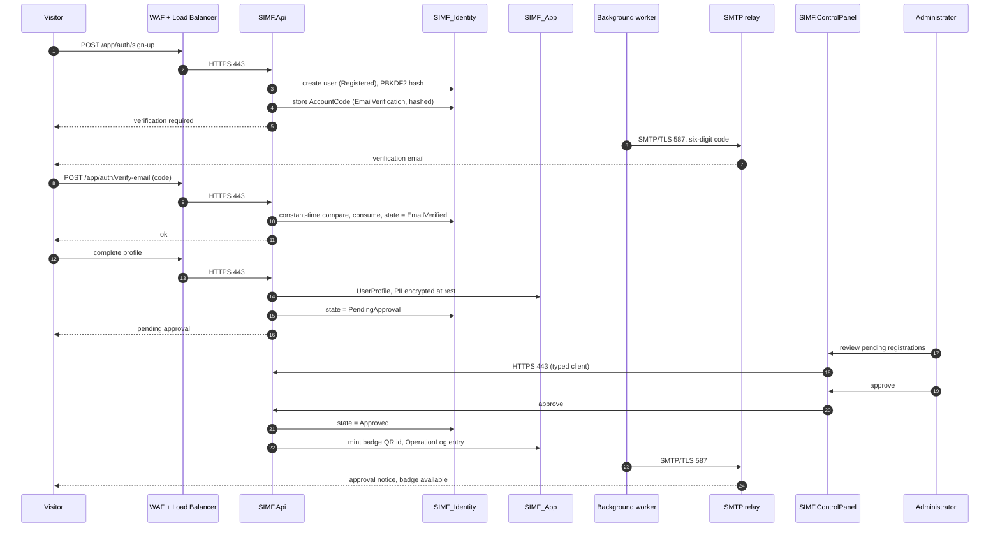
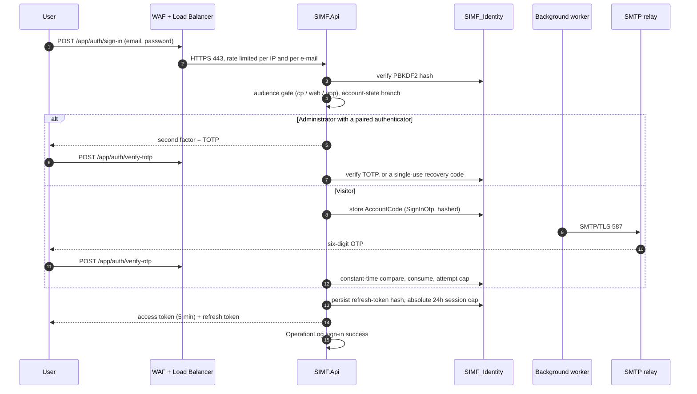
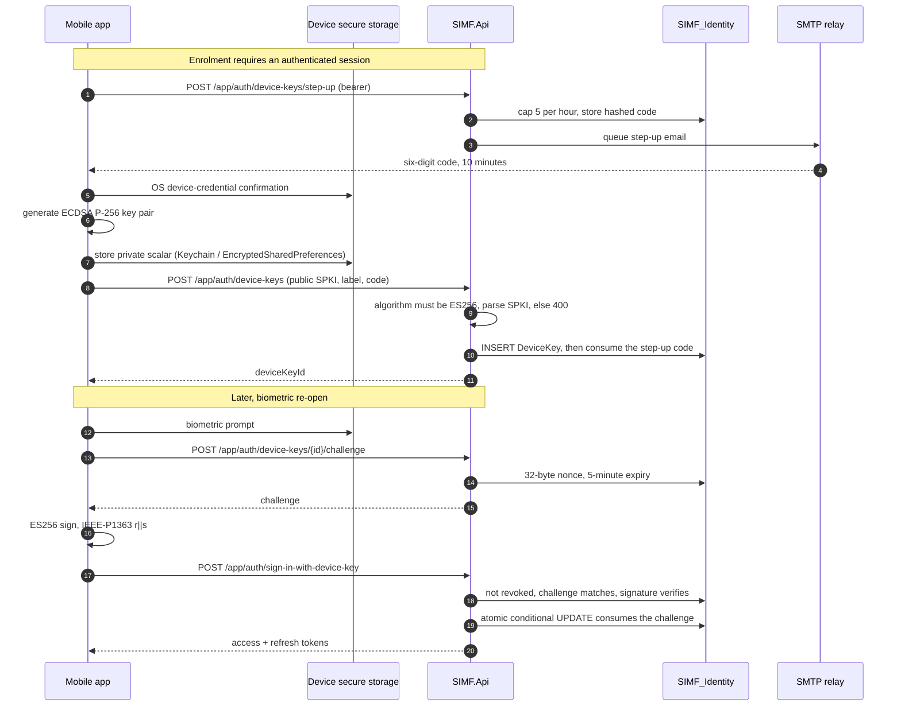
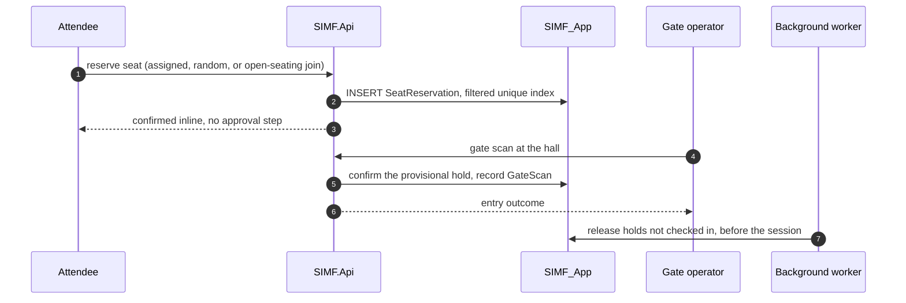
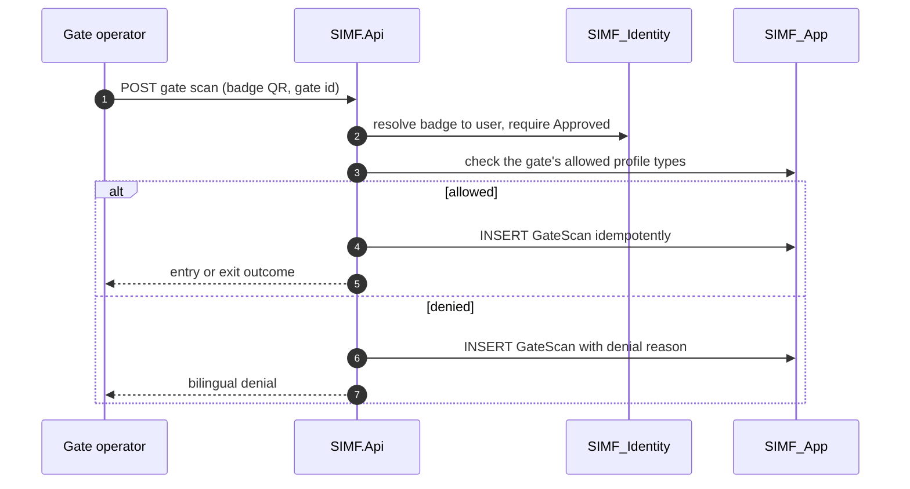
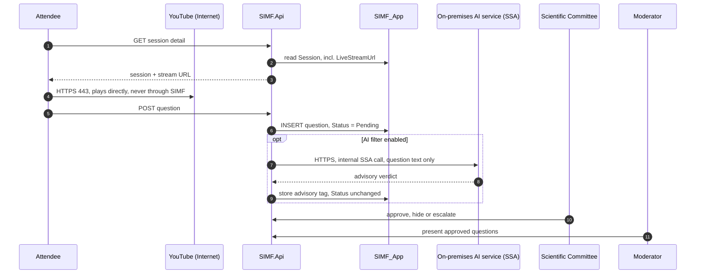
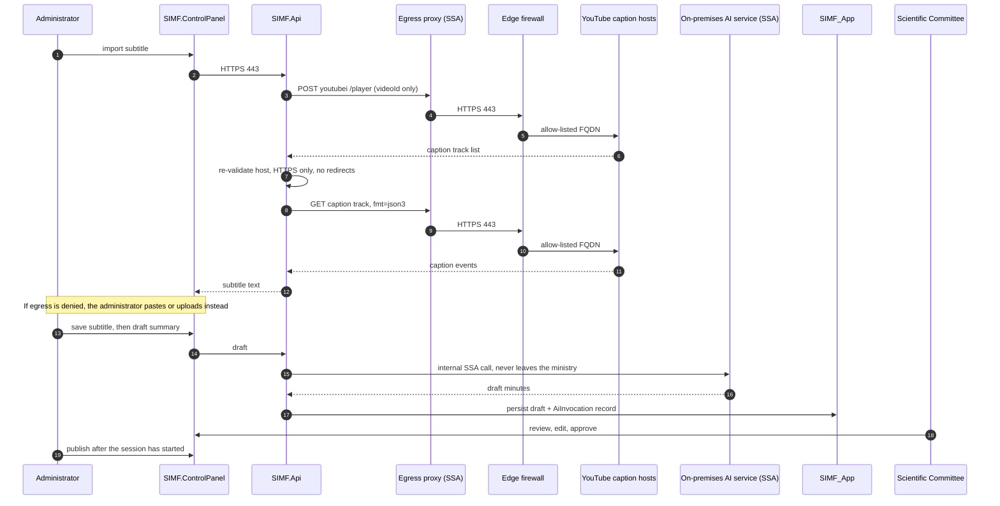
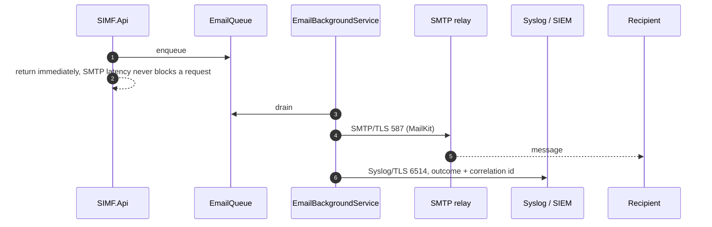
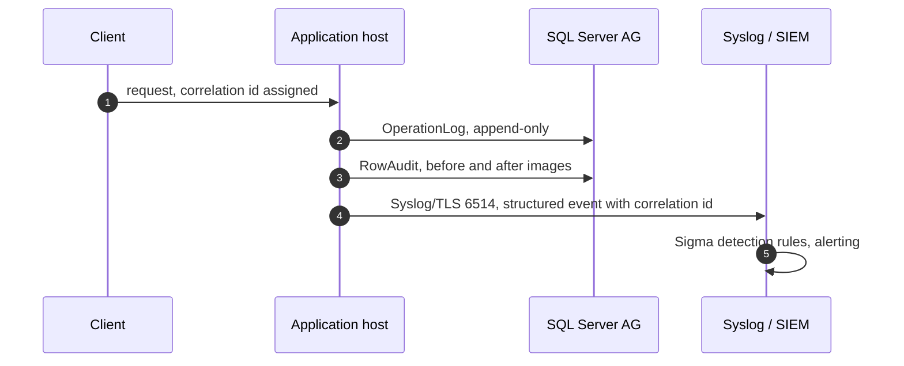

# SIMF High-Level Design (External), HLD-003

| Field | Value |
|-------|-------|
| Document ID | SIMF-HLD-003 |
| Title | High-Level Design (External) |
| Version | 1.0 |
| Supersedes | SIMF-HLD-002-MoD-HLD-External-v0.07 |
| Date | 2026-07-30 |
| Status | Issued for MoD technical review |
| System | SIMF, Saudi International Maritime Forum platform |
| Programme | Royal Saudi Naval Forces (RSNF), Ministry of Defense |
| Classification | Confidential |

## Revision history

| Version | Date | Summary of change |
|---------|------|-------------------|
| 0.07 | 2026-07-21 | Previous external issue (HLD-002) |
| 1.0 | 2026-07-30 | Reissued as HLD-003. Addresses all thirteen reviewer clarification points. **Records the owner decision that no AI runs in the cloud (section 2.4.2).** Corrects four as-built inaccuracies carried in v0.07 (sections 2.2, 2.8.3, 2.9.1). Adds nine sequence diagrams, a per-host deployment inventory, and a per-host communication matrix |

---

## Change summary against v0.07

A reviewer comparing this issue with v0.07 should look at the following. Each
entry names the reviewer point it answers, or marks the change as a correction we
raised ourselves.

| # | Change | Driver |
|---|--------|--------|
| 1 | Deployment stated explicitly as three-tier, with presentation and application on separate hosts | Reviewer point 1 |
| 2 | YouTube split into two named flows: client-direct playback and backend caption import | Reviewer point 2 |
| 3 | Scope of YouTube API usage stated as embed plus read-only caption retrieval, with an explicit list of what is not used | Reviewer point 3 |
| 4 | **AI is now on-premises only. No AI call leaves the ministry** | **Owner decision, 2026-07-30. Supersedes the D-491 hybrid** |
| 5 | Password handling corrected and expanded: hashes are stored, no password is ever emailed | Reviewer point 5 |
| 6 | File store purpose and full per-category classification and encryption table added | Reviewer point 6 |
| 7 | Nine sequence diagrams added (section 2.3) | Reviewer point 7 |
| 8 | Mobile enrolment, device binding, revocation and lost-device flows documented in full | Reviewer point 8 |
| 9 | External data exchange register added as Annex A | Reviewer point 9 |
| 10 | SMTP relay and SIEM collector drawn as hosts with explicit paths, and added to the matrix | Reviewer point 10 |
| 11 | Clarified that no `SIMF.ai` component exists; the load balancer carries no AI traffic | Reviewer point 11 |
| 12 | Controlled egress point drawn as a node; no application host has a direct Internet route | Reviewer point 12 |
| 13 | Deployment inventory and communication matrix reissued per host | Reviewer point 13 |
| C1 | **Correction: the real-time (SignalR) channel is not implemented.** v0.07 described it as built and sized the API tier for WebSocket concurrency | Self-raised |
| C2 | **Correction: not every stored file is encrypted at rest.** Four of eighteen categories are encrypted; the rest are public content or seekable media | Self-raised |
| C3 | **Correction: the WAF is not yet deployed.** v0.07 described it in the present tense in one section and as outstanding in another | Self-raised |
| C4 | **Correction: file retention is indefinite for every category.** No retention schedule is implemented | Self-raised |

---

# 1. System description

## 1.1 Purpose

This document describes the high-level design of the SIMF platform, a
single-tenant event platform delivered for the Royal Saudi Naval Forces under a
Ministry of Defense programme. It is written for MoD technical, security and
infrastructure reviewers.

## 1.2 System overview

SIMF serves three audiences through three front-end applications sharing one
backend API and two databases. It is designed to:

- Register visitors online, verify their e-mail and identity, and route them
  through an administrator approval workflow.
- Issue each approved attendee a digital QR badge and control physical entry by
  gate scanning.
- Publish the forum programme and let attendees browse sessions, reserve seats
  and receive reminders.
- Stream live sessions with a sign-language feed, and take moderated questions
  and comments.
- Present the exhibition, booths, sponsors, media partners, news, media gallery
  and the past-edition archive.
- Enable networking, contact sharing, and speaker, delegation and business
  meeting requests.
- Give organisers a Control Panel to administer the event without a code release.
- Collect ratings and feedback and present event statistics.

Assumptions and constraints:

- The forum runs on fixed dates. The platform must be feature-complete and frozen
  before it opens, and an outage during the event cannot be rescheduled.
- Hosting is on-premises on the SITE Private Cloud. There is no public-cloud
  dependency.
- The system must comply with the NCA Secure Application Development Standard.
- Arabic is the primary language (right to left); English is secondary.
- Identity data and business data are held in two physically separate SQL Server
  databases with no cross-database foreign keys.
- The source code is contractually handed over to the customer.

## 1.3 System context

**Users**

- Attendees, visitors and VIP delegates, using the mobile application (Android
  and iOS) and the public website.
- Anonymous public, using the website for public content and to begin
  registration.
- Administrators, organisers, scientific committee and public relations, using
  the Control Panel on a separate hostname.
- Gate operators and session moderators, using the mobile application staff and
  moderator screens and the Control Panel.

**Internal systems**

- On-premises AI inference service (see 2.4.2).
- SMTP relay for transactional e-mail.
- Syslog and SIEM collector for centralised structured logging.
- Shared encrypted file store.
- SQL Server 2022 hosting `SIMF_Identity` and `SIMF_App`.

**External entities**

- **YouTube**, in two distinct roles only, described in 2.4.1. This is the sole
  external dependency of the platform.

SIMF does not integrate with Active Directory or LDAP; it operates its own
ASP.NET Core Identity store. There is no SMS gateway, no NAFATH integration, no
payment provider, no map service, and no third-party analytics, crash-reporting
or push-messaging SDK in any client. **No external entity initiates an inbound
connection to SIMF.**

---

# 2. Solution design

## 2.1 Architecture overview

SIMF is a modular monolith following Domain-Driven Design layering. One backend
API serves the mobile application, the public website and the Control Panel over
two separate databases.

### 2.1.1 Deployment tiers (reviewer point 1)

**The solution is three-tier.**

| Tier | Components | Hosts in production |
|------|-----------|---------------------|
| Presentation | `SIMF.Web` (public website), `SIMF.ControlPanel` (administration) | Separate hosts, 2 nodes each |
| Application | `SIMF.Api`, plus the background worker | Separate hosts, 4 API nodes |
| Data | SQL Server 2022 Availability Group, shared file store | Separate hosts, in a separate zone |

**The presentation tier and the application tier are deployed on separate hosts.**
The separation is enforced, not conventional:

- Only `SIMF.Api` and the background worker hold database connection strings.
  Neither presentation application can reach SQL Server at all.
- The two presentation applications obtain every byte of data from the API,
  server to server over HTTPS 443, using a shared typed client. Browser sessions
  hold an encrypted authentication cookie and never a raw bearer token.
- The mobile application calls `SIMF.Api` directly through the load balancer and
  does not pass through the presentation tier.

Note for the reviewer: because the presentation tier is Blazor Server and Blazor
SSR, it is a server-side rendering tier, not a browser-only single-page
application. It therefore genuinely occupies a server tier of its own.

### 2.1.2 Network zones

A defence-in-depth three-zone model with a firewall at each boundary:

- **Internet.** Attendees, administrators and the public. No SIMF server runs
  here.
- **SSA zone (application servers).** WAF and load balancer; the API, website and
  admin tiers; the background worker; the on-premises AI inference service; the
  controlled egress point; the SMTP relay; the log collector.
- **HSA zone (data).** The SQL Server Availability Group, the shared encrypted
  file store, the cluster witness and the backups. Reachable only from the
  application servers.

Every connection uses HTTPS with TLS 1.2 or higher. TLS terminates at the load
balancer and is re-encrypted to the backend.

### 2.1.3 Capacity design point

The platform is sized for the event-day peak, not an average load: about 30,000
concurrent attendees at peak, from roughly 50,000 registered at a 0.6 peak
factor, with headroom to about 40,000. Target response times at that load are
400 ms for sign-in, 250 ms for a gate scan and 300 ms for a read, below 75 per
cent CPU.

Live-session video streams directly from YouTube to the attendee device and never
passes through SIMF, so the servers carry REST traffic and not video.

The per-host inventory and sizing are in section 2.7.2.

### 2.1.4 Key architectural principles

- One API, one response envelope and one permission model for every client.
- Two separate databases for identity and business data, with no cross-database
  foreign keys.
- A stateless API tier, so the platform scales out by adding nodes.
- Configuration as data: content, categories, roles and permissions are edited
  from the Control Panel without a release.
- **No external dependency on the request path.** The only external integration
  is an optional, administrator-triggered caption import that degrades gracefully.

## 2.2 Modules

**Client applications**

- Mobile application (Flutter, iOS and Android).
- Control Panel (Blazor Server with MudBlazor).
- Public website (Blazor SSR with interactive islands).

**Backend API modules (bounded contexts)**

Authentication and registration; account and profile; programme, sessions,
themes, speakers, presentations, summaries and recordings; bookings and seat
reservations; gates and scanning; exhibition, exhibitors and booths; sponsors;
news and media; archive; notifications; networking and connections; meetings
(speaker, delegation, business); statistics; system configuration; organisation
profile; reference data; AI; auditing and logs.

**Backend layers**

- `SIMF.Api`, the HTTP boundary: endpoints, middleware, authentication,
  authorisation policies and background workers.
- `SIMF.Application`, use-case orchestration and service abstractions.
- `SIMF.Infrastructure`, persistence (two DbContexts), storage, e-mail, identity
  and JWT, audit interceptors, and the AI provider implementations.
- `SIMF.Domain`, entities, aggregates, enums and domain rules, with no framework
  dependencies.

### 2.2.1 Correction C1: the real-time channel is not implemented

v0.07 listed `SIMF.RealTime` as "SignalR server push for live notifications and
Q&A", sized the API tier for approximately 10,000 WebSocket connections per node,
and described a SignalR SQL backplane and "server push rather than client
polling" as delivered behaviour.

**That is not the as-built state.** The `SIMF.RealTime` project contains a
project file and no source. No hub is wired into the API host, and no SignalR
service is registered. Clients obtain notifications and live data by REST reads.

Consequences recorded honestly:

- Server push is a **target-state design**, not a delivered capability.
- The WebSocket concurrency figures in the v0.07 sizing table do not describe
  anything currently running and are withdrawn from this issue.
- The SignalR SQL backplane is likewise target state.
- Live-session load is therefore carried as REST read traffic, which the
  section 2.9.3 load test must reflect.

Closing this gap is tracked as open item OI-5.

**Shared libraries.** `SIMF.Common` (response envelope, permission catalogue,
roles, enums, error codes, file policy), `SIMF.Contracts` (DTOs),
`SIMF.ApiClient` (typed HTTP client), `SIMF.Components` (shared UI components and
design tokens).

**Background workers and storage services.** Workers: dormant-account sweep,
registration-gate auto-close, session reminders, e-mail dispatch. Storage
services are unified behind one `StoredFile` table and one policy registry
(section 2.8.3).

**Module interaction.** All three clients call the same API. It exposes two
route-prefixed surfaces from one process, `/api/v1/app/*` for the mobile
application and the public website and `/api/v1/admin/*` for the Control Panel,
sharing one response envelope, one error model and one permission system. A
separate OpenAPI document is generated per surface.

## 2.3 System workflows and sequence diagrams (reviewer point 7)

### 2.3.1 Visitor registration and administrator approval



### 2.3.2 Sign-in with the second factor



### 2.3.3 Biometric enrolment and biometric sign-in



### 2.3.4 Seat reservation and hall check-in



### 2.3.5 Gate scan



### 2.3.6 Live session and moderated Q&A



### 2.3.7 AI session summary



### 2.3.8 Asynchronous e-mail dispatch



### 2.3.9 Logging and audit to the SIEM



## 2.4 Integration and interfaces

### 2.4.1 YouTube: two distinct flows (reviewer points 2 and 3)

**Flow A, live playback, client-direct.** The attendee device plays the stream
directly from YouTube. The platform persists only the URL, on
`Session.LiveStreamUrl`. No video byte traverses SIMF, the load balancer or any
ministry server. An HLS or MP4 fallback URL is supported on the same field.

**Flow B, caption import, backend outbound.** `SIMF.Api` fetches an existing
caption track so the AI summary drafter has source text. Two hops: a POST to the
YouTube player endpoint carrying only the `videoId`, then a GET on the caption
URL returned. Hardening: the returned host is re-validated against an allow-list
before the second request, HTTPS is required, redirects are disabled, and the URL
is never logged.

**Scope of YouTube API usage:**

| Capability | Used |
|-----------|------|
| Create or schedule a live broadcast | No |
| Manage or control a broadcast | No |
| Retrieve broadcast metadata or viewer counts | No |
| Embed and play the stream | Yes, client-side only |
| Retrieve an existing caption track | Yes, read-only |
| Create, upload or modify captions | No |
| YouTube Data API v3 | No |
| Official Captions API | No |
| OAuth client, service account or any Google credential | No |

Broadcasts are created on YouTube by ministry staff outside SIMF; an
administrator pastes the URL into the Control Panel.

The caption endpoints are undocumented and can change without notice. Every
failure funnels to a single error whose bilingual message instructs the
administrator to paste or upload the transcript instead, so the summary feature
never hard-depends on this integration.

### 2.4.2 AI: on-premises only (owner decision, 2026-07-30)

**No AI runs in the cloud. No AI call leaves the ministry network.**

This supersedes the hybrid split recorded in decision D-491, which permitted
cloud Gemini for non-sensitive features. The owner has directed that all AI
inference runs on-premises without exception.

| Aspect | Position |
|--------|----------|
| Inference location | An on-premises inference service in the SSA zone |
| Mechanism | The existing `OpenAiProvider` pointed at a local `BaseUrl`, speaking the OpenAI-compatible chat-completions contract (for example Ollama or vLLM). No code change is required; it is a configuration value |
| Cloud providers | The Gemini and Anthropic provider implementations remain in the codebase but **must not be configured**. With no API key set, each raises a "provider not configured" error rather than falling back |
| Default | The offline `Echo` stub, so an unconfigured environment makes no AI call of any kind |
| Traffic path | `SIMF.Api` to the AI host over HTTPS **inside the SSA zone**. It does not traverse the load balancer, the egress proxy, or any firewall boundary to the Internet |
| Data leaving the ministry for AI | **None** |

Consequences for the security posture, which are substantial:

- The external data-exchange surface reduces to the **YouTube caption import
  alone**, and that is optional and administrator-triggered.
- The provider retention, model-training, data-residency, sub-processor and
  data-processing-agreement questions **do not arise**, because no content is
  disclosed to a third-party processor.
- Session transcripts, speaker names, attendee questions and operator queries all
  remain inside the ministry boundary.

AI features served on-premises: session summary drafting, advisory question
filtering, the attendee assistant, the Control Panel operator assistant, FAQ
answering, translation, live translation and sign-language glossing.

Operational requirement: the inference host must be sized for the selected model.
That sizing is an open item (OI-1) because it depends on the model chosen, and we
will not state a specification we have not tested.

### 2.4.3 Internal interfaces

| Interface | Protocol and port |
|-----------|-------------------|
| Client to API | HTTPS 443, `ApiResult<T>` envelope, bilingual error messages, bearer token on protected calls |
| API to SQL Server | TCP 1433 via EF Core, one database per unit of work |
| API and worker to SMTP relay | SMTP with STARTTLS 587, queued and dispatched asynchronously |
| Application hosts to Syslog and SIEM | Syslog over TLS 6514 |
| API to file store | SMB 445 for the shared store; rows hold relative paths, never blobs |
| API to on-premises AI service | HTTPS, internal to the SSA zone |
| Presentation tier to API | HTTPS 443, server to server, shared typed client |

### 2.4.4 External interface and the controlled egress point (reviewer point 12)

**No application host has a default route to the Internet.** All outbound traffic
leaves through a single controlled egress point:

```
SIMF-API-01..04 (SSA)
    |  HTTPS / CONNECT 443, proxy-configured
    v
SIMF-EGRESS-01 (SSA), FQDN allow-list, full request logging
    |
    v
Edge firewall, egress rule: source = the proxy only, HTTPS 443, allow-listed FQDNs
    |
    v
Internet -> YouTube caption hosts
```

With AI on-premises, the complete outbound allow-list is now three FQDNs:

| FQDN | Purpose |
|------|---------|
| `youtubei.googleapis.com` | Caption track listing |
| `www.youtube.com` | Caption track download |
| `*.googlevideo.com` | Caption track download, CDN host |

If egress is not approved, the caption import fails cleanly and administrators
paste or upload the transcript. No other feature is affected.

### 2.4.5 There is no `SIMF.ai` component (reviewer point 11)

No component, process, site or host named `SIMF.ai` exists. In v0.07 Figure 1 the
egress arrow was drawn passing across the WAF and load balancer box, which read as
a direct link between the load balancer and an AI service. That was a drawing
artefact and has been corrected in this issue.

- **AI requests are never routed through the load balancer.**
- AI is a feature set inside `SIMF.Api`, reached on ordinary API routes.
- With the on-premises decision in 2.4.2, AI traffic is an internal SSA call.

## 2.5 Error handling and logging

**Error handling.** A central middleware converts domain and validation
exceptions into the standard failure envelope with the correct HTTP status;
clients render the bilingual message. Validation returns HTTP 400 with
field-level bilingual detail. Invalid states log and throw; there is no silent
fallback. The API refuses to boot in production when a required secret is missing.

**Logging.** Structured logging via Serilog to console and rolling files,
forwarded to the central Syslog and SIEM collector. Every request carries a
correlation id propagated into the logs and both audit trails.

Events logged: authentication events; authorisation denials and rate-limit
rejections; security-relevant business events in `OperationLog` with actor,
subject, source IP, user agent, outcome, error code and correlation id;
row-level changes in `RowAudit` with before and after images; system errors.
Both audit trails are append-only at the application level.

**SIEM integration is deliberately vendor-neutral.** SIMF ships 16 detection
rules in **Sigma 2.x** format under `docs/soc/siem-rules/`, together with a
canonical `Detail` JSON field contract for SOC ingestion. Sigma is a
platform-agnostic format, so the ministry deploys the rules to whichever SOC
platform it operates (Sentinel, Elastic or Splunk are all supported by the
go-live checklist). Naming a single product in the design would have been a
constraint, not a decision.

## 2.6 User interface design

Three front-ends share one design system and are fully bilingual, Arabic primary
and right-to-left, English secondary.

- **Mobile application:** a persistent five-tab shell (Home, Sessions, Badge, Map,
  Profile) over roughly 34 feature areas.
- **Control Panel:** roughly 12 navigation groups. Every list page uses one
  standard data-grid component with a shared CRUD framework, so all
  administration pages behave identically.
- **Public website:** statically rendered public content for speed, with
  interactive islands for authentication and account flows.

Usability: right-to-left layout with automatic mirroring; a single design-token
source of truth; flexible responsive widths for phones and tablets;
pull-to-refresh on every data screen; accessibility controls on mobile; the
website targets WCAG AA.

## 2.7 Operational model view

### 2.7.1 Environments

Four environments promoted in order with test-gated promotion: Development, Test,
Staging, Production.

- **Development and Test.** A single host runs the three application sites with
  the worker in-process, plus one SQL Server Standard instance. OpenAPI enabled.
- **Staging.** Mirrors production as a live rehearsal, ready two weeks before
  launch, and is where the load test runs.
- **Production.** The full topology in 2.7.2.

### 2.7.2 Production host inventory (reviewer point 13)

v0.07 grouped every application component inside one "application servers" box,
which is why the tier question arose. The inventory is now per host.

| Host | Zone | Count | Runs | Notes |
|------|------|-------|------|-------|
| `SIMF-LB-01/02` | SSA edge | 2, active and standby | WAF and layer-7 load balancer | TLS termination, OWASP rule set, health probes. **Not yet deployed, see C3** |
| `SIMF-WEB-01/02` | SSA | 2 | `SIMF.WEB`, Blazor SSR | Session affinity. No database access |
| `SIMF-CP-01/02` | SSA | 2 | `SIMF.CP`, Blazor Server | Sticky circuits. High availability, not load. No database access |
| `SIMF-API-01..04` | SSA | 4, N plus 1 | `SIMF.API`, FastEndpoints | Stateless. Holds data access with the worker |
| `SIMF-WRK-01` plus standby | SSA | 1 pinned plus 1 | Scheduled jobs, e-mail queue drain | **Today in-process in the API application pool**; planned as a dedicated Windows Service |
| `SIMF-AI-01` | SSA | 1 | On-premises inference service | **New in this issue.** Sizing is open item OI-1 |
| `SIMF-EGRESS-01` | SSA | 1 | Controlled egress point, FQDN allow-list | Now drawn as a node |
| `SIMF-SMTP-01` | SSA | 1 | Internal SMTP relay | Location subject to OI-2 |
| `SIMF-LOG-01` | SSA | 1 | Syslog and SIEM collector | Location subject to OI-2 |
| `SIMF-SQL-01..03` | HSA | 2 to 3 | SQL Server 2022 AlwaysOn Availability Group | Synchronous commit, automatic failover |
| `SIMF-FS-01` | HSA | Clustered SMB | Shared file store and backups | Reachable only from application servers |
| `SIMF-WITNESS-01` | HSA | 1 | File-share witness for cluster quorum | Added in this issue; absent from v0.07 |

### 2.7.3 Service operations

The three application sites run as IIS sites and application pools. One
operations script installs, removes, starts, stops and restarts each site and
reports status. The background workers run in-process in the API application
pool, exposed as an isolated `Workers` target so only that part of the script
changes when they move to a dedicated service.

Production configuration and every secret are applied as machine-scope,
`SIMF_`-prefixed environment variables. Committed templates carry empty values;
real values are set on the server and never committed. The JWT signing key, the
file encryption key, the AI prompt-hash secret and the SMTP password are held in
the secrets vault.

### 2.7.4 Production prerequisites

- Issue a CA-signed TLS certificate and remove the development trust-all setting
  from the mobile client.
- Deploy the WAF (see C3).
- Provision and size the on-premises AI inference host (OI-1).
- Open outbound access, through the controlled egress point, to the three
  YouTube caption FQDNs, if caption import is wanted.
- Provision the shared file store and enable session affinity for the website and
  Control Panel tiers.
- Confirm the SMTP relay and SIEM collector endpoints (OI-2).

## 2.8 Data architecture view

### 2.8.1 Two-database separation

Two physically separate SQL Server 2022 databases. The separation is permanent
and is itself a security control, isolating and freezing the identity surface.

- **`SIMF_Identity`**: users, roles, permissions, refresh tokens, account and OTP
  codes, second-factor tokens, recovery codes, biometric device keys, password
  history, per-user notifications.
- **`SIMF_App`**: all business data, plus the audit tables.

**Permanent invariants:** no cross-database foreign keys (a reference to a user is
a bare GUID resolved on read); no duplicated live data (the only permitted copies
are immutable audit snapshots); no cross-database transaction.

### 2.8.2 Data flow

Attendees and administrators reach SIMF over HTTPS. TLS terminates at the load
balancer, which routes public pages to `SIMF.Web`, Control Panel traffic to
`SIMF.ControlPanel`, and app and API traffic to `SIMF.Api`. The API authenticates
and authorises the caller, runs the use case, and reads or writes the database
over TCP 1433. Files are read and written through the file store, e-mail is
queued to the SMTP relay, AI calls go to the on-premises inference service inside
the SSA zone, and the only outbound Internet call leaves through the controlled
egress point. Every request carries a correlation id written to the logs and both
audit trails.

### 2.8.3 File store, purpose and classification (reviewer point 6)

**Purpose.** Keep binary content out of the database (rows hold a relative path,
never a blob), so backup and restore stay predictable and the Availability Group
replicates rows rather than megabytes. Give a multi-node API tier one coherent
view, so any node can read back what another wrote. Concentrate file security
decisions in one policy registry rather than per feature.

**Correction C2.** v0.07 stated that the store "keeps every uploaded file,
including identity documents, encrypted at rest". **That is not accurate.** Four
of eighteen categories are encrypted. The remainder are either public content or
media that must stay seekable for HTTP range requests, because AES-GCM is not
seekable.

| Category | Classification | Read access | Encrypted at rest |
|----------|----------------|-------------|-------------------|
| `IdDocument` | **Secret** | Owner or admin, every access audited | **Yes** |
| `Avatar` | Confidential | Owner or admin | **Yes** |
| `VipPhoto` | Confidential | Admin only | **Yes** |
| `SpeakerPresentation` | Internal | Authenticated, served as attachment | **Yes** |
| `SessionRecording` | Internal | Authenticated, range-streamed | **No**, deliberately: seekable plaintext is required for HTTP 206, and it holds no PII |
| `OrganizationHeroVideo` | Public | Public, range-streamed | No, public branding content |
| 12 public image categories (media gallery, speaker photo, news, sponsor, media partner, company, organisation, archive cover, programme day, banner, booth, exhibitor logos) | Public | Public | No, public content |

Encryption for the four encrypted categories is application-level AES-GCM
envelope encryption, a per-file data key wrapped by a key-encrypting key supplied
through an environment variable. There is no dependency on SQL Server TDE, so the
protection survives a raw file-system copy.

An unmapped category is a hard deny, never a silent default, and a guard test
enforces that every category has a reviewed policy.

**Correction C4: retention.** Every category currently carries an indefinite
retention (`Retention: null`). No retention or disposal schedule is implemented.
This is inconsistent with the owner resolution that retention aligns to the NCA
and MoD data-retention policy, and it is raised as open item OI-3.

### 2.8.4 Data integrity and validation

Database constraints (primary keys, foreign keys within one database, unique and
filtered-unique indexes such as one active reservation per seat per session);
atomic single-database units of work; server-side validation at the API boundary
regardless of client validation, with validation rules, column lengths and UI
limits kept aligned; EF Core parameterises every query with no raw SQL
concatenation; append-only audit trails; PII and identity documents encrypted at
rest; soft delete preserving referential history.

### 2.8.5 Communication requirements matrix (reviewer points 10, 12 and 13)

Per host. IP ranges and VLANs are assigned by the site network team.

| # | Source | Destination | Protocol | Port | Direction | Zone path | Purpose |
|---|--------|-------------|----------|------|-----------|-----------|---------|
| 1 | Mobile app | `SIMF-LB-01/02` | HTTPS TLS 1.2+ | 443 | Inbound | Internet to SSA, edge firewall | App API traffic |
| 2 | Public browser | `SIMF-LB-01/02` | HTTPS TLS 1.2+ | 443 | Inbound | Internet to SSA, edge firewall | Website traffic |
| 3 | Administrator browser | `SIMF-LB-01/02` | HTTPS TLS 1.2+ | 443 | Inbound | Internet to SSA, edge firewall | Control Panel traffic |
| 4 | `SIMF-LB-01/02` | `SIMF-WEB-01/02` | HTTPS | 443 | Internal | SSA | Website rendering, session affinity |
| 5 | `SIMF-LB-01/02` | `SIMF-CP-01/02` | HTTPS | 443 | Internal | SSA | Control Panel rendering. **Missing from v0.07** |
| 6 | `SIMF-LB-01/02` | `SIMF-API-01..04` | HTTPS | 443 | Internal | SSA | API traffic, round-robin |
| 7 | `SIMF-WEB`, `SIMF-CP` | `SIMF-API-01..04` | HTTPS | 443 | Internal | SSA | Server-to-server typed client |
| 8 | `SIMF-API`, `SIMF-WRK` | SQL AG listener | TCP TDS | 1433 | Internal | SSA to HSA, inner firewall | Data access |
| 9 | `SIMF-SQL` | `SIMF-SQL` | TCP | 5022 | Internal | HSA | Availability Group replication |
| 10 | `SIMF-SQL` | `SIMF-WITNESS-01` | SMB | 445 | Internal | HSA | Cluster quorum witness. **Added** |
| 11 | `SIMF-API`, `SIMF-WRK` | `SIMF-FS-01` | SMB | 445 | Internal | SSA to HSA, inner firewall | Shared file store |
| 12 | `SIMF-API`, `SIMF-WRK` | `SIMF-SMTP-01` | SMTP STARTTLS | 587 | Internal | SSA | Transactional e-mail. **Worker added as a source** |
| 13 | `SIMF-API`, `SIMF-WEB`, `SIMF-CP`, `SIMF-WRK` | `SIMF-LOG-01` | Syslog over TLS | 6514 | Internal | SSA | Structured logging. **Enumerated per host** |
| 14 | `SIMF-SQL` | `SIMF-LOG-01` | Syslog over TLS | 6514 | Internal | HSA to SSA, inner firewall | Database-tier logging. **Added** |
| 15 | `SIMF-API` | `SIMF-AI-01` | HTTPS | 443 | Internal | SSA | **On-premises AI inference. Added; replaces the outbound AI row** |
| 16 | `SIMF-API` | `SIMF-EGRESS-01` | HTTPS CONNECT | 443 | Internal | SSA | Outbound caption calls only |
| 17 | `SIMF-EGRESS-01` | YouTube caption FQDNs | HTTPS | 443 | Outbound | SSA to Internet, edge firewall | Caption import, optional |
| 18 | `SIMF-LB-01/02` | All application hosts | HTTPS | 443 | Internal | SSA | `/health` readiness probes. **Added** |
| 19 | Attendee device | YouTube | HTTPS | 443 | Client-side | Internet to Internet | Live playback. **Does not traverse SIMF or any ministry network element** |

Row 19 is retained deliberately even though no ministry component is involved,
because omitting it invites the question.

**Removed from v0.07:** the outbound row from the egress point to an AI provider.
With decision 2.4.2 there is no such flow.

## 2.9 Solution and non-functional views

### 2.9.1 Security view

**Authentication.** E-mail and password for all audiences. Second factor: an
e-mailed one-time password for visitors, a TOTP authenticator for administrators
with single-use recovery codes. Optional biometric sign-in on mobile using an
enrolled ES256 device key.

**Passwords (reviewer point 5).** Passwords **are** stored, as PBKDF2 hashes with
a per-user salt, by ASP.NET Core Identity. Only the plaintext is not stored. Each
sign-in re-derives the hash and compares. **SIMF never emails a password.**
Administrator-created accounts are created **with no password** and receive a
7-day password-set invitation, so nothing is temporary and there is no
forced-change-on-first-login, because there is no system-issued password. What is
emailed is always a short-lived, single-use, hashed code: e-mail verification,
sign-in OTP, password reset, badge activation, biometric enrolment step-up, or
e-mail-change verification. Policy: at least 8 characters, at least one letter and
one digit, not equal to the e-mail. Password history and expiry controls are built
but not yet enabled (OI-4).

**Mobile device keys (reviewer point 8).** Enrolment requires an authenticated
session plus an emailed step-up code plus an OS device-credential confirmation.
The client generates the P-256 key pair on device and keeps the private key in
platform secure storage; only the public key is sent. Sign-in is challenge and
response with a 5-minute single-use challenge consumed by an atomic conditional
update, so a replay loses the race. Revocation is self-service or administrator,
idempotent. Lost or replaced device: sign in with password and OTP, revoke the
old key and enrol a new one; or an administrator revokes it. Biometric is never
the only factor.

*Disclosure:* the device private key is currently **software-bound** in secure
storage, not hardware or biometric bound. Binding it inside Android Keystore or
StrongBox and the iOS Secure Enclave is planned hardening; the server contract is
unchanged by it (OI-6).

**Authorization.** Role-based access control with per-page and per-action
permissions, seeded idempotently, baked into the JWT and enforced on both the API
and the Control Panel; Administrator holds a wildcard. Build-time tests fail the
build if any Control Panel page or admin endpoint is missing its permission gate.

**Tokens.** Short-lived HS256 access tokens (5 minutes) with rotating refresh
tokens and an absolute 24-hour session cap. Token reuse is detected and a per-user
security stamp allows immediate revocation. The signing algorithm is pinned.

**Encryption.** TLS 1.2 or higher in transit, terminated at the load balancer and
re-encrypted to the backend. At rest, PII (national ID, Iqama, passport, mobile
numbers) and the four encrypted file categories in 2.8.3 use application-level
AES-GCM. Passwords are hashed; refresh tokens and one-time codes are stored
hashed.

**Correction C3: the WAF.** v0.07 described the WAF in the present tense in the
security view while listing its deployment as outstanding elsewhere. **The WAF is
not yet deployed.** It is a production prerequisite (2.7.4) and remains open
(OI-7).

**Hardening.** Multi-dimensional rate limiting (per IP on authentication, per
e-mail on credential endpoints, a global cap, per administrator on AI), with
audited rejections; security headers and a Content-Security-Policy; an explicit
CORS allow-list; OpenAPI disabled by default in production; upload scanning;
secrets only through environment variables with production boot guards.

**Audit.** Two append-only trails, `OperationLog` and `RowAudit`, each carrying an
actor snapshot, source IP, user agent and correlation id.

**Compliance.** Aligned to the NCA Secure Application Development Standard with
ECC and OWASP baselines. A documented gap analysis drives the remediation
programme.

### 2.9.2 Availability view

**Database tier.** SQL Server 2022 Enterprise AlwaysOn Availability Group: a
read-write primary and up to two readable secondaries with synchronous commit and
automatic failover, behind a listener that routes writes to the primary and
read-only queries to a secondary. A file-share witness holds the cluster quorum.
Development and test use a single Standard node.

*Note:* the production SQL Server edition is recorded in the Open Items Register
as deferred to host confirmation. This issue assumes Enterprise with an
Availability Group; if Standard is confirmed instead, the availability and
read-scale design changes materially and this section must be reissued (OI-8).

**Application tier.** The API is stateless and load-balanced round-robin. The
website and Control Panel run with session affinity. Adding nodes adds capacity
with no redesign.

**Operational availability.** `/health` is a real readiness probe (database
reachable, migrations applied) used by the load balancer to pull unhealthy
instances. Migration order is enforced. Rollback restores the last known-good
binaries, re-checks health and re-runs the smoke test. The three forum days are
the critical availability window.

### 2.9.3 Sizing and performance view

- **Application tier** scales horizontally: the API is stateless, so nodes absorb
  registration surges, gate-scan bursts and live-session load.
- **Database tier** scales reads on the readable secondaries and vertically.
- **Queries** are indexed and projected; list endpoints page at source (default
  20, grid cap 200) rather than filtering in memory.
- **E-mail** is queued and dispatched asynchronously, so SMTP latency never blocks
  a request.
- **Caching:** reference and configuration data is cached at the application
  layer; static assets are served with cache headers.

Per correction C1, live data is currently delivered by REST reads, not server
push. The staging load test must therefore model live-session concurrency as read
traffic. Peak-shaped load tests are planned in staging covering registration
surge, live-session concurrency, scan bursts and mixed steady state. Pass and fail
thresholds are set during that testing (OI-9).

---

# 3. Risks and mitigation

| Risk | Impact | Mitigation |
|------|--------|------------|
| **Security** | Unauthorised access to attendee personal data or administrative functions | Permission gating enforced on both tiers with build-time tests; PII and identity documents encrypted at rest; TLS in transit; WAF at the SSA edge once deployed; rate limiting with audited rejections; secrets only from environment variables with boot guards; append-only audit trails; NCA alignment with an independent penetration test before handover |
| **Event-day availability** | The forum runs on fixed dates; an outage cannot be rescheduled | Stateless multi-node API tier; Availability Group with automatic failover; readiness probe pulls unhealthy nodes; last known-good binaries retained; peak-shaped load testing in staging |
| **Scalability and performance** | Registration surge, live concurrency and scan bursts coincide | Horizontal scale-out; indexed, projected, server-paged queries; asynchronous e-mail; application-layer caching. **Note:** the absence of server push (C1) raises read load relative to the original design and must be validated by load test |
| **Integration** | Caption import depends on outbound access | Caption import fails gracefully to paste or upload, so no feature is hard-blocked. **With AI now on-premises, the platform has no external dependency on the request path at all** |
| **Schedule and change freeze** | A defect found after the freeze is expensive | Four-stage promotion with no skipping; trunk-based development with pull-request review; zero-warning Release builds; unit, integration and end-to-end gates; a per-page E2E catalogue as executable regression proof; dependency scanning and SBOM |
| **Data integrity and compliance** | Loss or corruption of attendee, booking or scan data | Physically separated databases with no cross-database references; atomic single-database units of work; database-enforced keys and filtered unique indexes; soft delete; `RowAudit` and `OperationLog` append-only trails |

---

# Annex A. External data exchange register

With the on-premises AI decision (2.4.2), this register is short.

## A.1 Complete list of data leaving the ministry

| Destination | Data sent | Purpose | Personal data | Optional |
|-------------|-----------|---------|---------------|----------|
| YouTube caption hosts | The `videoId` of a broadcast the ministry itself published, and the caption track URL YouTube returned | Import an existing transcript | **None** | Yes. Degrades to paste or upload |
| YouTube, from the attendee device | The device's own IP address, user agent and the `videoId` | Play the live stream | Attendee network and device metadata, disclosed **by the device, not by SIMF** | No, inherent to embedding YouTube |

**That is the entire external data-exchange surface.**

## A.2 What no longer leaves, following the on-premises AI decision

Under the superseded hybrid model, the following would have reached a cloud AI
provider. Under this issue, none of it leaves the ministry:

- Session transcripts and subtitles, in Arabic and English.
- Session titles, abstracts and **speaker display names**.
- Attendee-authored questions.
- Attendee free text and prior conversation turns from the assistant.
- Control Panel operator queries and the operator's accessible page directory.

## A.3 What never leaves under any configuration

User ids, e-mail addresses, display names, roles and permission claims; national
ID, Iqama and passport numbers; mobile numbers; password hashes, access tokens,
refresh tokens, OTPs, TOTP secrets and recovery codes; device public keys and
labels; badge QR payloads, gate scans, seat reservations and bookings; identity
document images and any other stored file; `OperationLog` and `RowAudit` content.

## A.4 Internal destinations

| Destination | Data | Zone | Leaves the ministry |
|-------------|------|------|---------------------|
| On-premises AI service | Session transcripts, speaker names, question text, assistant free text, page directory | SSA | **No** |
| SMTP relay | Recipient address, display name, message body including codes and notices | SSA | No |
| Syslog and SIEM | Structured events with actor id and e-mail snapshot, source IP, user agent, correlation id | SSA | No |
| SQL Server and file store | All persistent data including encrypted PII | HSA | No |

## A.5 AI invocation controls, retained

Even though no data leaves, the controls remain, because they also govern
insider risk on the internal path: an invocation record per call with redacted
input and output; a keyed HMAC prompt fingerprint for drift detection; per-prompt
versioning and history; per-administrator rate limiting; input caps of 16 keys,
64-character keys and 4000-character values.

*Known limitation:* redaction is applied to the **stored record**, after the call,
not to the payload sent to the inference service. With the service on-premises the
exposure is contained inside the ministry boundary, which materially reduces the
risk; applying redaction to the outbound payload as well remains a recommended
hardening (OI-10).

---

# Annex B. Point-by-point response to the review

| # | Reviewer point | Where answered |
|---|----------------|----------------|
| 1 | Two-tier or three-tier; presentation separate from API | 2.1.1 |
| 2 | YouTube role and communication flow | 2.4.1 |
| 3 | Embed only, or YouTube APIs used | 2.4.1 |
| 4 | Backend to AI and caption API, data and authentication | 2.4.1, 2.4.2, Annex A |
| 5 | Authentication if passwords are not stored; emailed password | 2.9.1 |
| 6 | File store purpose and file types | 2.8.3 |
| 7 | Sequence diagrams | 2.3.1 to 2.3.9 |
| 8 | Mobile enrolment, key storage, binding, revocation, lost device | 2.9.1, 2.3.3 |
| 9 | Data shared with external services | Annex A |
| 10 | SIEM and SMTP components, paths, hosting, matrix | 2.4.3, 2.5, 2.7.2, 2.8.5 |
| 11 | Load balancer to `SIMF.ai` | 2.4.5 |
| 12 | Outbound path, firewall, gateway, zone | 2.4.4 |
| 13 | Per-host deployment diagram and matrix | 2.7.2, 2.8.5 |

---

# Annex C. Open items

| Ref | Item | Owner | Blocking |
|-----|------|-------|----------|
| OI-1 | Size and provision the on-premises AI inference host. Depends on the model selected | Owner and MoD infrastructure | Yes, for AI features |
| OI-2 | Confirm the SMTP relay and SIEM collector endpoints and whether they sit in the SSA zone or central shared services. Determines two matrix rows and two firewall rules | MoD infrastructure and site network team | Deployment prerequisites |
| OI-3 | Define and implement the file retention and disposal schedule. Currently indefinite for every category (C4) | Owner, aligned to NCA and MoD policy | Compliance |
| OI-4 | Enable the identity-lifecycle controls: password expiry, password history, dormant-account disable | Owner and operations | Compliance |
| OI-5 | Implement the real-time (SignalR) channel, or formally accept REST reads as the delivered design (C1) | Owner | Affects the load-test model |
| OI-6 | Bind the device private key in Android Keystore or StrongBox and the iOS Secure Enclave | Owner | Recommended hardening |
| OI-7 | Deploy the WAF (C3) | MoD infrastructure | Production prerequisite |
| OI-8 | Confirm the production SQL Server edition. Enterprise with an Availability Group is assumed | MoD infrastructure | Availability design |
| OI-9 | Set load-test pass and fail thresholds during staging | Engineering and owner | Go-live gate |
| OI-10 | Apply redaction to the outbound AI payload as well as the stored record | Owner | Recommended hardening |
| OI-11 | Rotate the secrets present in development configuration history; issue a CA-signed certificate and remove the mobile development TLS bypass | Owner and operations | Production prerequisite |
| OI-12 | Commission an independent penetration test before handover | Owner | Handover gate |
| OI-13 | Confirm whether client-direct YouTube playback, which discloses attendee IP and device metadata to Google, is acceptable | Owner and MoD security | Should be settled before go-live |

**Closed since v0.07:** the AI provider retention, model-training, data-residency,
sub-processor and data-processing-agreement questions are closed by decision
2.4.2, because no content is disclosed to any third-party processor. The Firebase
SDK previously present in the mobile client was removed in full on 2026-07-30, so
no client contacts any third party other than YouTube for playback.

---

*End of SIMF-HLD-003.*
