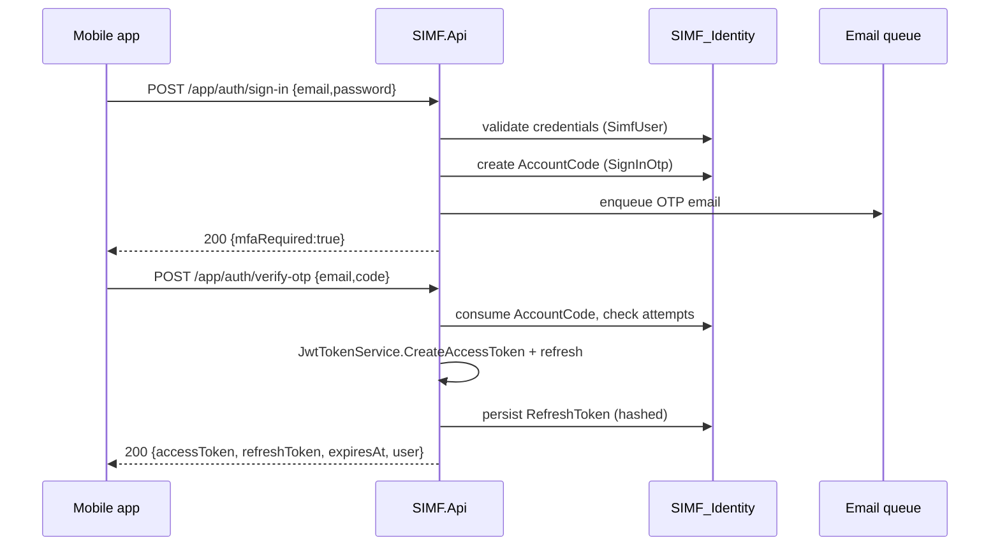
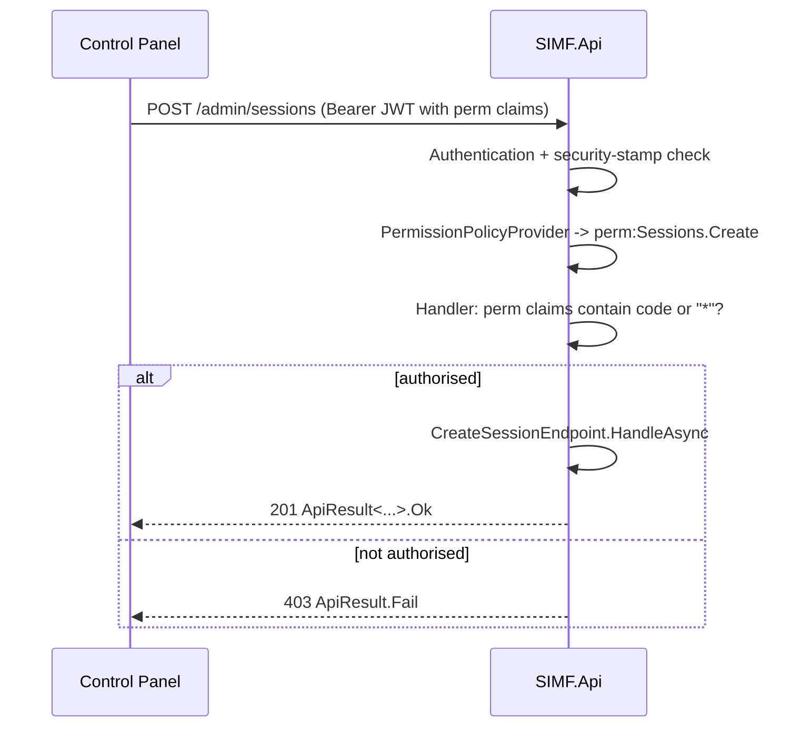
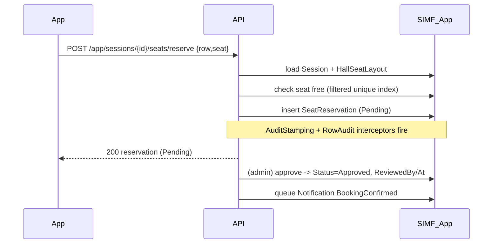
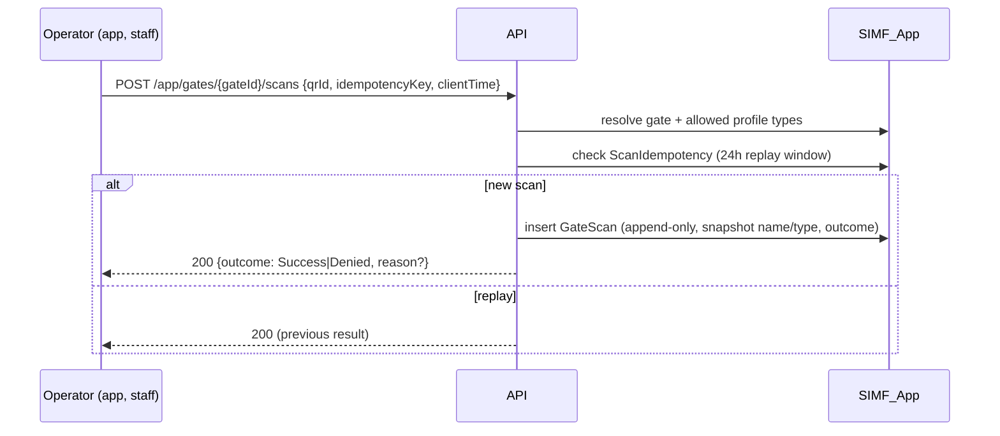

# SIMF — Low-Level Design (LLD)

| Field | Value |
|-------|-------|
| Document | Low-Level Design (LLD) |
| System | SIMF — Saudi International Maritime Forum platform |
| Version | 1.0 (Draft) |
| Date | 2026-06-25 |
| Status | Draft for review |
| Audience | Engineers implementing, extending, reviewing or maintaining SIMF |

> Readable rendition of `SIMF-LLD-001`. Written to a generic industry LLD template,
> self-contained, and grounded in the current source tree on branch `feature/app-cp-api-split`.
> Depth is **representative**: every component is covered with class/method/schema-level detail
> and sequence diagrams for the important flows, using representative examples rather than an
> exhaustive per-method catalogue. Companion: `SIMF-HLD-001` (High-Level Design). Authoritative
> contract docs: `SIMF-API-001`, `SIMF-DAT-001`, `SIMF-RPM-001`.
>
> **Verification note:** the file paths, class names, routes, enum values and migration names
> below were read from source. Where the source itself marks something as not-yet-implemented or
> reserved, the LLD says so explicitly rather than inventing detail.

---

## Table of contents

1. Introduction
2. Backend solution structure and layering
3. Backend request pipeline and cross-cutting design
4. Authentication and authorisation (internals)
5. Audit, soft-delete and base entities
6. Backend feature design (endpoints, services, representative walkthroughs)
7. Data model and database design
8. Control Panel (low-level design)
9. Website (low-level design)
10. Mobile application (low-level design)
11. Shared libraries (low-level design)
12. Key sequence diagrams
13. Configuration, options and secrets
14. Appendices (enum tables, endpoint catalogue, migration history)

---

## 1. Introduction

### 1.1 Purpose and scope

This LLD describes **how** SIMF is built: the project structure, the request pipeline, the classes
and interfaces behind each cross-cutting concern, the endpoint pattern and feature areas, the
database schema, the two web front-ends, the Flutter app's layering, the shared libraries, and the
runtime flows that tie them together. It is detailed enough to implement against and to review
against.

### 1.2 How to read this document

Sections 2–6 cover the backend. Section 7 is the data model. Sections 8–11 cover the clients and
shared code. Section 12 collects sequence diagrams for the highest-value flows. Section 14 holds
reference tables (enums, endpoints, migrations).

---

## 2. Backend solution structure and layering

### 2.1 Projects and dependency direction

Solution file: `SIMF.slnx`.

**Backend (`src/Backend/`)**

| Project | References | Role |
|---------|-----------|------|
| `SIMF.Domain` | `SIMF.Common` | Entities, aggregates, enums, domain rules. No ASP.NET/EF-Core deps (carries only `Microsoft.Extensions.Identity.Stores`). |
| `SIMF.Application` | `SIMF.Domain`, `SIMF.Common`, `SIMF.Contracts` | Use cases, service abstractions. No ASP.NET/EF. |
| `SIMF.Infrastructure` | `SIMF.Domain`, `SIMF.Application` | EF Core contexts, storage, e-mail, identity, JWT, audit interceptors. |
| `SIMF.Api` | `SIMF.Application`, `SIMF.Infrastructure`, `SIMF.Common`, `SIMF.Contracts` | FastEndpoints host, middleware, auth, policies, workers. |

**Shared (`src/Shared/`)**

| Project | References | Role |
|---------|-----------|------|
| `SIMF.Common` | — | `ApiResult<T>`, `ApiError`, `PermissionCatalog`, `AppRoles`, enums, `ErrorCodes`, `GridQuery` |
| `SIMF.Contracts` | `SIMF.Common` | Request/response DTOs |
| `SIMF.ApiClient` | `SIMF.Common`, `SIMF.Contracts` | Typed HTTP client for CP + Website |
| `SIMF.Components` | `SIMF.Common` | Shared `Simf*` Blazor components + theme tokens |

The dependency rule points strictly inward (Domain ← Application ← Infrastructure ← Api). This is
what keeps the domain testable and the persistence concerns isolated.

### 2.2 Bounded contexts

Endpoints live under `src/Backend/SIMF.Api/Endpoints/`, organised by feature folder; the matching
use cases live under `src/Backend/SIMF.Application/`. Feature areas include: Auth/IdentityAccess,
Account/MyArea, Programme (sessions/themes/speakers/presentations/summaries/recordings),
SeatReservations/Bookings, Gates, Exhibition/Exhibitors/Booths, Sponsors, News/Media, Archive,
Notifications, Networking, MeetingRequests (speaker/delegation) + BusinessMeetings, Statistics,
Configuration (system settings / organisation profile / site settings), Organisations, Contacts,
Faq, Feedback, Cms (content blocks/banners), Ai, Venue, Operations, Auditing/Logs.

---

## 3. Backend request pipeline and cross-cutting design

### 3.1 Host configuration

`src/Backend/SIMF.Api/Program.cs` configures the host. Highlights:

- **FastEndpoints** with route prefix `api/v1`.
- **Dual OpenAPI documents** (D-247): an `app` document filtered to `/app/*` and a `cp` document
  filtered to `/admin/*`.
- **Authentication:** JWT bearer (default scheme) plus a distinct `StreamToken` scheme for
  short-lived recording-stream tokens.
- **Authorisation:** named policies plus a dynamic permission-policy provider.
- **CORS:** explicit origin allow-list (never wildcard).
- **Swagger:** always on in Development. In Production it is gated behind Basic auth and an
  `AllowSwagger` flag, with a boot guard that refuses to start if it is enabled without
  credentials.
- **Rate limiting:** global per-IP plus named policies (`auth`, `auth-email`, `ai-test`).
- **Health:** `GET /health`.
- **Hosted services:** dormant-account sweep, registration-gate auto-close, session reminders,
  e-mail dispatch.
- **Startup migration + seed:** App database migrated **before** Identity database, then
  identity/reference seeding.

### 3.2 Middleware pipeline (order)

```mermaid
flowchart LR
    R[Request] --> FH[ForwardedHeaders<br/>recover client IP]
    FH --> CID[CorrelationId]
    CID --> SH[SecurityHeaders]
    SH --> EH[ErrorHandling]
    EH --> CORS[CORS if enabled]
    CORS --> ERL[EmailRateLimitKey]
    ERL --> RL[RateLimiter]
    RL --> AUTHN[Authentication<br/>+ security-stamp check]
    AUTHN --> AUTHZ[Authorization<br/>permission + role policies]
    AUTHZ --> FE[FastEndpoints dispatch]
    FE --> Resp[ApiResult&lt;T&gt; response]
```



Key middleware classes (all under `src/Backend/SIMF.Api/`):

| Class | Responsibility |
|-------|----------------|
| `CorrelationIdMiddleware` | Read/generate `X-Correlation-Id`; enrich logs |
| `SecurityHeadersMiddleware` | Apply baseline security response headers |
| `ErrorHandlingMiddleware` | Convert exceptions to `ApiResult.Fail` with correct status |
| `EmailRateLimitKeyMiddleware` | Extract `email` from credential bodies for per-email throttling |
| `SwaggerBasicAuthMiddleware` | Gate OpenAPI UI in production |

### 3.3 The response envelope

`src/Shared/SIMF.Common/ApiResult.cs`:

```csharp
public sealed class ApiResult<T>
{
    public bool Success { get; init; }
    public T? Data { get; init; }
    public ApiError? Error { get; init; }
    public object? Meta { get; init; }            // pagination / counts
    public static ApiResult<T> Ok(T data, object? meta = null);
    public static ApiResult<T> Fail(ApiError error);
}
```

`ApiError` (`src/Shared/SIMF.Common/ApiError.cs`) carries `Code`, `Message`, `MessageArabic`, and a
list of `ApiErrorDetail` (`Field`, `Message`, `MessageArabic`). `ApiCallResult<T>` pairs an HTTP
status with the envelope, so clients can branch on 401/403/etc. `DataValidationException` (extends
`ApiException`) is the domain-level validation error caught by the error middleware.

### 3.4 Endpoint pattern (FastEndpoints)

Every endpoint is a class with `Configure()` (route, verbs, policies/anonymous, tags, rate
limiting, summary) and `HandleAsync()`. A representative create endpoint:

```csharp
public sealed class SignUpEndpoint(IRegistrationService registration)
    : Endpoint<SignUpRequest, ApiResult<SignUpResponse>>
{
    public override void Configure()
    {
        Post("/app/auth/sign-up");
        AllowAnonymous();
        Tags("Authentication");
        Options(rb => rb.RequireRateLimiting("auth"));
    }

    public override async Task HandleAsync(SignUpRequest req, CancellationToken ct)
    {
        var res = await registration.SignUpAsync(req, ct);
        await Send.ResponseAsync(ApiResult<SignUpResponse>.Ok(res), 201, ct);
    }
}
```

An admin endpoint gates on a permission policy **and** the approved-account policy:

```csharp
public override void Configure()
{
    Post("/admin/visitors/list");
    Policies(
        PermissionCatalog.PolicyFor(PermissionCatalog.Visitors.View),
        nameof(AuthorizationPolicies.RequireApprovedAccount));
    Tags("Admin");
}
```

Validation uses FluentValidation `Validator<TRequest>` classes; failures are converted to HTTP 400
with `code = VALIDATION_FAILED` and bilingual field detail.

### 3.5 Pagination

- **Simple lists** (app GETs): `?page=&pageSize=&sort=&search=`; paging metadata is returned in
  `meta`.
- **Admin grids** (POST): a `GridQuery` body (`Skip`, `Top`, `Search`, `Sort`, `SortDescending`,
  `Filters`) returning `GridPage<T>` (`Items`, `Total`, `Skip`, `Top`) inside `data`
  (`src/Shared/SIMF.Common/GridQuery.cs`). Default page size 20; grid cap 200; export/import caps
  higher.

---

## 4. Authentication and authorisation (internals)

### 4.1 Token service

`IJwtTokenService` / `JwtTokenService`
(`src/Backend/SIMF.Infrastructure/Identity/JwtTokenService.cs`):

- `CreateAccessToken(SimfUser, roles, permissions, MobileAppRole)` issues an HS256 JWT with claims:
  `sub`, `email`, `jti`, `display_name`, `security_stamp`, `account_state`, `user_type`,
  `mobile_app_role`, one `role` per role, and one `perm` per permission code (the Administrator
  collapses to a single `*`).
- `CreateRecordingStreamToken(sessionId, userId)` issues a minimal, short-lived token bound to a
  **distinct audience** (`Jwt:StreamAudience`), so it can never be replayed as a user token.

JWT validation (`JwtBearerSetup`): `MapInboundClaims = false`; issuer/audience/lifetime/signing
validated; algorithm pinned to HS256 (rejects `alg:none`/confusion); 30-second clock skew. The
default scheme also runs a **security-stamp check**, so revoking a role or disabling an account
takes effect immediately; the `StreamToken` scheme skips that check for the hot streaming path.

### 4.2 Second factor and refresh

- **Visitors:** e-mailed OTP (`AccountCode`, purpose `SignInOtp`). **Admins:** TOTP, with
  single-use `TotpRecoveryCode` fallback.
- **Refresh tokens** are stored hashed (`RefreshToken`, with a `RotatedFromId` chain) and rotate on
  use; reuse of a rotated token is detected. The session has an absolute 24-hour cap
  (`Jwt:SessionLifetimeHours`).
- **Biometric** sign-in uses an enrolled ES256 `DeviceKey` (challenge/response), with an OTP
  step-up to enrol (`AccountCodePurpose.BiometricEnrolStepUp`).

### 4.3 Permission system

`PermissionCatalog` (`src/Shared/SIMF.Common/PermissionCatalog.cs`) is the single source of truth:

- `Wildcard = "*"`, `ClaimType = "perm"`, `PolicyPrefix = "perm:"`.
- `PolicyFor(code)` → `"perm:" + code`; `IsPermissionPolicy` and `CodeFromPolicy` are the inverses.
- Codes are nested classes per page (`Visitors.View`, `Sessions.Edit`, `Bookings.Approve`,
  `Gates.Manage`, …). `PermissionCatalog.All` lists each with its baseline role(s) for idempotent
  seeding.

API enforcement (`src/Backend/SIMF.Api/Authorization/PermissionAuthorization.cs`):

- `PermissionPolicyProvider` materialises `perm:<code>` policies on demand.
- `PermissionAuthorizationHandler` passes if the caller's `perm` claims contain the code or the
  wildcard.

Named policies (in `AuthorizationPolicies`) include `RequireApprovedAccount`, `AdministratorOnly`,
and the gate policies (`GatesManage`, `GatesOperate`, `GatesViewOwnReports`).

The Control Panel reuses the same `PermissionCatalog` (see §8.3), so the API and the CP enforce
identical codes, and dedicated tests fail the build if a page/endpoint is ungated.

---

## 5. Audit, soft-delete and base entities

### 5.1 Base entities

`src/Backend/SIMF.Domain/Common/BaseEntity.cs`:

- **`BaseAuditEntity`** (current): `Id`, `CreatedAt`, `CreatedBy`, `UpdatedAt?`, `UpdatedBy?`,
  `IsActive = true`, `DeletedAt?`, and `Deactivate()` (soft-delete).
- **`BaseEntity`** (legacy/minimal): `Id`, `CreateBy`, `CreatedAt`.

Soft delete is by convention: `Deactivate()` flips `IsActive`; list queries filter
`IsActive == true`.

### 5.2 Audit interceptors

Two `SaveChangesInterceptor`s in `src/Backend/SIMF.Infrastructure/Auditing/`, registered in order
on the App context (the Identity context registers the row-audit interceptor):

1. **`AuditStampingSaveChangesInterceptor`** — stamps `CreatedAt/By` on insert (if unset) and
   `UpdatedAt/By` on every update, sourcing the actor from `IRequestContext.ActorUserId` and the
   time from `TimeProvider`.
2. **`RowAuditingSaveChangesInterceptor`** — captures every insert/update/delete into a `RowAudit`
   row (table name, entity type, operation, JSON primary key, old/new value JSON, affected columns,
   actor snapshot, correlation ID). Excludes append-only tables such as `GateScan`.

`IRequestContext` (`src/Backend/SIMF.Application/Abstractions/IRequestContext.cs`, implementation
`HttpRequestContext`) surfaces `SourceIp`, `UserAgent`, `CorrelationId`, `ActorUserId`, and
`ActorDisplayName` without coupling services to `HttpContext`.

### 5.3 Operation log

`OperationLogEntry` (table `OperationLog`) is written explicitly by services for security-relevant
business events, via `IAuditLog` / `AuditLog`
(`src/Backend/SIMF.Infrastructure/Auditing/AuditLog.cs`): `EventType`, `Outcome`, subject (e-mail /
user id / display-name snapshot), actor (id / display name), `SourceIp`, `UserAgent`,
`CorrelationId`, `ErrorCode`, `Detail`, `TimestampUtc`. Both audit tables are append-only at the
application level.

---

## 6. Backend feature design

### 6.1 File storage — centralized store (D-568)

All file surfaces go through **one centralized file subsystem** (D-568). The earlier per-concern
storage classes (avatar / ID-document / VIP-photo / recording / presentation / media / asset stores)
have been removed and replaced by:

| Component | Class | Role |
|-----------|-------|------|
| File entity | `StoredFile` (`src/Backend/SIMF.Domain/Files/StoredFile.cs`) | One row per file; metadata-only diffs |
| Service | `IFileService` / `StoredFileService` | Upload, lookup, download-by-GUID orchestration |
| Storage provider | `IFileStorageProvider` / `FilesystemFileStorageProvider` | Filesystem-backed bytes |
| Cipher | `IFileCipher` / `AesGcmEnvelopeCipher` | Envelope encryption for sensitive files (KEK `FileStorage:EncryptionKey`) |
| Endpoints | `FileEndpoints.cs` | Upload + download-by-GUID; enums `FileOwnerEntityType`, `FileSensitivityTier`, `FileSourceType`, `FileType` |

Session **recordings** keep a dedicated range-served stream: `RequestRecordingStreamTokenEndpoint`
mints a short-lived `StreamToken` and the stream endpoint serves with `enableRangeProcessing`
(HTTP 206 seek). Separately, **PII columns** on `UserProfile` are encrypted at rest through
`IPiiEncryptor` / `AesGcmPiiEncryptor` (key `Storage:UserIdDocumentEncryptionKey`); a boot guard
requires the key in production.

### 6.2 Background workers

| Worker | File / registration | Purpose |
|--------|--------------------|---------|
| `DormantAccountSweepService` | `SIMF.Api/HostedServices/` | Daily disable of dormant accounts (`IdentityLifecycle:DormantAccountDisableDays`; no-op if unset) |
| `RegistrationGateAutoCloseWorker` | Infrastructure | Auto-close sign-up at the scheduled time (D-166) |
| `SessionReminderWorker` | Infrastructure | "Session starting soon" reminders (D-217), dedup via `Session.ReminderSent` |
| `EmailBackgroundService` | `SIMF.Infrastructure/Email/` | Drains `EmailQueue`; sends via `SmtpEmailSender` (MailKit) |

### 6.3 Representative endpoint catalogue

The full catalogue is in Appendix 14.2 and `SIMF-API-001`. Representative routes per area:

| Area | App surface (examples) | Admin surface (examples) |
|------|------------------------|--------------------------|
| Auth | `POST /app/auth/sign-in`, `/verify-otp`, `/verify-totp`, `/refresh`, `/forgot-password`, `/reset-password` | — |
| Account | `GET /app/bootstrap`, `GET/POST /app/account/user-profile`, `POST /app/account/avatar` | `GET /admin/visitors/{id}` |
| Programme | `GET /app/programme/days`, `GET /app/programme/sessions/{id}` | `POST /admin/sessions/list`, `POST/PUT/DELETE /admin/sessions` |
| Bookings | `POST /app/sessions/{id}/seats/reserve`, `/reserve-random`, `/open-seating` | `POST /admin/bookings/{id}/approve` / `reject` |
| Gates | `POST /app/gates/{gateId}/scans`, `GET /app/gates/my-reports/today` | `POST /admin/gates`, `PUT /admin/gates/{id}` |
| Exhibition | `GET /app/booths`, `GET /app/sponsors` | `POST /admin/exhibitors/list`, `POST /admin/sponsors` |
| News/Media | `GET /app/news`, `GET /app/media` | `POST /admin/news`, `POST /admin/media/list` |
| Networking/Meetings | `POST /app/account/connections`, `POST /app/programme/speaker-meeting-request`, `GET /app/my-meetings` | `POST /admin/business-meetings/list`, `POST /admin/delegation-meetings/list` |
| Feedback | `POST /app/feedback/rate`, `POST /app/sessions/{id}/questions` | `POST /admin/session-comments/{id}/approve` |
| Statistics/Config | `GET /app/site-settings` | `GET /admin/statistics`, `GET /admin/system-settings`, `POST /admin/operation-logs/list` |

### 6.4 Representative service walkthrough — seat reservation

1. `ReserveSeatEndpoint` (`POST /app/sessions/{sessionId}/seats/reserve`) validates the request and
   resolves the caller from the JWT (`RequireApprovedAccount`).
2. The seat-reservation service loads the `Session` and its `Hall`/`HallSeatLayout`, checks the
   `SeatSelectionMode`, and verifies the seat is free using the filtered unique index (one active
   reservation per seat per session).
3. It creates a `SeatReservation` (`Kind = UserBooking`, `Status = Pending` when approval is
   required) and saves; the audit interceptors stamp and row-audit the insert.
4. On approval (`ApproveBookingEndpoint`): `Status → Approved`, `ReviewedByUserId/At` are set, and a
   `Notification` (`BookingConfirmed`) is queued. Rejection sets `Status → Rejected` with a reason
   and queues `BookingRejected`.

See §12 for the sequence diagram.

---

## 7. Data model and database design

### 7.1 Contexts

- **`SimfIdentityDbContext`** (`src/Backend/SIMF.Infrastructure/Persistence/SimfIdentityDbContext.cs`)
  extends `IdentityDbContext<SimfUser, SimfRole, Guid>`; migrations history table
  `__EFMigrationsHistory_Identity`.
- **`SimfAppDbContext`** (same folder) extends `DbContext`; receives `IPiiEncryptor`; history table
  `__EFMigrationsHistory_App`.

Configurations are applied via `ApplyConfigurationsFromAssembly` from
`SIMF.Infrastructure.Persistence.Configurations`.

### 7.2 `SIMF_Identity` entities

| Entity | Table | Key columns / notes |
|--------|-------|---------------------|
| `SimfUser` | AspNetUsers | `Id` (Guid); `DisplayName`, `AccountState`, `UserType`, `PasswordChangeRequired`, `SecurityStamp`, `PasswordChangedAtUtc`, `LastSuccessfulSignInAtUtc`, `AvatarRelativePath` |
| `SimfRole` | AspNetRoles | `Id`; `IsBaseline` |
| `Permission` | Permissions | `Code`, `Page`, `Action`, `DisplayName` |
| `RolePermission` | RolePermissions | composite (`RoleId`,`PermissionId`) |
| `RefreshToken` | RefreshTokens | `UserId`, `TokenHash`, `ExpiresAt`, `RevokedAt`, `RotatedFromId` |
| `AccountCode` | AccountCodes | `UserId`, `Purpose` (enum), `Code` (holds a keyed HMAC, never the code itself), `ExpiresAt`, `ConsumedAt`, `AttemptCount` |
| `SecondFactorToken` | SecondFactorTokens | `UserId`, `TokenHash`, `Kind` (enum), `ExpiresAt`, `AttemptCount` |
| `TotpRecoveryCode` | TotpRecoveryCodes | `UserId`, `CodeHash`, `ConsumedAt` |
| `DeviceKey` | DeviceKeys | `UserId`, `PublicKey` (ES256 SPKI), `Algorithm`, `CurrentChallenge`, `ChallengeExpiresAt` |
| `Notification` | Notifications | `UserId`, `Kind` (enum), `Title/TitleArabic`, `Body/BodyArabic`, `Severity`, `ReadAt`, `RelatedEntityType/Id` |
| `PasswordHistoryEntry` | PasswordHistory | `UserId`, `PasswordHash`, `CreatedAtUtc` (reuse prevention) |
| `RowAudit` | RowAudits | row-level change log (Identity side) |

### 7.3 `SIMF_App` entities (grouped)

> All business entities except join tables and certain append-only tables inherit
> `BaseAuditEntity` (`Id`, `CreatedAt/By`, `UpdatedAt/By`, `IsActive`, `DeletedAt`). Cross-DB user
> references are bare `Guid` "logical FKs".

**Programme:** `Theme`, `Hall` (capacity, `SeatSelectionMode`, geofence cols), `Speaker`
(`AllowsMeetingRequests`, social, `ContactId`), `SpeakerPresentation`, `ProgrammeDay`, `Session`
(`Code`, `HallId`, `CategoryId?`, `Type?`, `Start/End`, `Status`, recording cols,
`LiveStreamUrl`, `LiveSignLanguageUrl`, `LiveCaptions(Arabic)`, `ReminderSent`), `SessionSpeaker`
(composite, `Role`), `SessionTheme` (composite), `SessionCategory`, `SessionSummary`
(`ReviewApproved?`), `HallAttendance`.

**Profiles & reference:** `UserProfile` (`UserId` logical FK unique, bilingual name, `Gender`,
`NationalId`/`IqamaNumber`/`PassportNumber`/mobiles **encrypted at rest**, `OrganisationId?`,
`ProfileTypeId?`, `IsDelegate`, `QrId` unique, `ReferenceNumber`, VIP cols), `UserProfileType`
(`IsForVisitor`, `MobileAppRole`), `UserInterest`, `Organisation`, `Country` (int key, ISO-3166
code, `IsInvited`).

**Seats & venue:** `HallSeatLayout` (1:1 hall), `SeatReservation` (`Kind`, `Status`, review cols,
filtered unique index), `VenueMapNode` (`Kind`, X/Y, `HallId?`/`BoothId?`).

**Sessions content:** `SessionQuestion` (`Recipient`, `Phase`, `Status`, `AiFilterVerdict?`),
`SessionModerator`, `SessionComment` (`Status`, `LikeCount`, moderation cols), `SessionCommentLike`.

**Exhibition:** `Booth` (officer cols, `ExhibitorId?`, `ContactId?`, map X/Y), `Exhibitor`,
`ExhibitorMembership`, `ExhibitorVisitorScan`, `Sponsor` (`Tier`, `Tagline(Arabic)`, `ContactId?`).

**Media/news/archive:** `News`, `MediaItem` (`Kind`), `MediaPartner`, `ArchiveEdition` (owns
`ArchiveMediaItem`, `ArchiveSessionTitle`, `ArchivePastSpeaker`).

**Engagement:** the dynamic rating model — `RatingType`, `RatingQuestionGroup`, `RatingQuestion`,
`RatingResponse`, `RatingAnswer` (not a single `Rating` entity) — plus `ContentBlock`, `Banner`,
`FaqGroup` (owns `FaqEntry`), `Connection` (networking), `Invitation`.

**Meetings:** `MeetingTable`, `HallAllocation`, `BusinessMeeting` (owns
`BusinessMeetingParticipant`), `SpeakerMeetingRequest`, `SpeakerAvailabilityWindow`,
`DelegationMeetingRequest`.

**Contacts:** `Contact` (shared, referenced by Speaker/Sponsor/MediaPartner/Booth/Exhibitor),
`VisitorShareToken`, `SavedContact`.

**Operations/config:** `RegistrationGate` (singleton), `ArchiveVisibility` (singleton), `Gate`
(owns `GateProfileTypeAllow`, `GateAssignment`), `GateScan` (append-only, bigint identity, snapshot
cols), `ScanIdempotency`, `SystemSetting`, `OrganizationProfile` (owns `OrganizationAboutItem`,
`OrganizationDetail`).

**AI:** `AiPrompt`, `AiPromptHistory` (append-only), `AiInvocation` (telemetry).

**Audit:** `OperationLogEntry` (`OperationLog`), `RowAudit` (`RowAudits`).

### 7.4 Enums (frozen against rename/reorder; additive values allowed)

Located in `src/Shared/SIMF.Common/Enums/`. Representative values (full list in Appendix 14.1):

- `AccountState`: Registered=0, EmailVerified=1, PendingApproval=2, Approved=3, Rejected=4,
  Disabled=5.
- `UserType`: Visitor=0, (1 reserved — was `Other`, removed D-186), Admin=2.
- `AccountCodePurpose`: EmailVerification=0, PasswordReset=1, SignInOtp=2, BadgeActivationOtp=3,
  BiometricEnrolStepUp=4.
- `SecondFactorKind`: Totp=0, EmailOtp=1, PasswordChange=2.
- `MobileAppRole`: None=0, Visitor=1, Staff=2, Moderator=3, Exhibitor=4 (D-519). (Note: the
  Flutter-side `AppRole` enum orders these differently — guest=0, visitor=1, moderator=2, staff=3,
  exhibitor=4.)
- `SessionStatus`: Scheduled=0, Held=1, Recorded=2, Published=3.
- `SeatReservationKind`: UserBooking=0, AdminReservedRow=1, RandomAssignment=2, OpenSeating=3.
- `BookingStatus`: Pending=0, Approved=1, Rejected=2, Cancelled=3.
- `SponsorTier`: Platinum=10, Gold=20, Silver=30, Bronze=40 (gaps left for future tiers).
- `NotificationKind`: a by-name-persisted enum (e.g. BookingConfirmed=40, SessionReminder=41,
  BookingRejected=42, MeetingScheduled=43, MeetingCancelled=44, SessionRatingRequest=45).
- Plus venue/scan/meeting/networking/media/AI enums (Appendix 14.1).

### 7.5 Migration history

The earlier per-decision migration series was **squashed** into a single consolidated initial
migration (`20260501001`) on each context, with only a few migrations after it (Identity adds
`D610_AuditConstraints`; App adds `D589_RemoveAudienceComments`, `D611_AuditConstraints`,
`D619_MediaFilePointers`, `D627_DropDeadFileColumns` — `D589`/`D627` are drop/cleanup, not purely
additive). The Identity schema is frozen (D-110); App changes land per controlled freeze-lift.
Full list in Appendix 14.3.

---

## 8. Control Panel (low-level design)

### 8.1 Hosting and auth

Blazor Server, interactive-server render with prerendering disabled
(`AppRenderMode.InteractiveServerNoPrerender`). Cookie authentication (`simf.cp.auth`, 8-hour
sliding) with `SimfCookieRefreshHandler.OnValidatePrincipalAsync` rotating the access token from
the refresh token before expiry (D-121). The SignalR circuit allows large payloads (QR/image
transfer).

### 8.2 BFF pattern

Browser sessions never hold raw bearer tokens. A thin endpoint layer
(`SIMF.ControlPanel/Endpoints/AuthEndpoints.cs`) handles the credential/second-factor steps and
stores tokens in the encrypted cookie. The access token is held per-circuit in `SimfAuthSession`
and forwarded to the API by the typed client.

### 8.3 Permission gating

The CP reuses `PermissionCatalog`. A dynamic `PermissionPolicyProvider` +
`PermissionAuthorizationHandler` (`SIMF.ControlPanel/Authorization/PermissionAuthorization.cs`)
materialise `perm:<code>` policies. Mechanisms:

- Pages: `@attribute [RequirePermission(PermissionCatalog.X.Y)]`.
- Nav items: each `CpNavigation` item carries a `RequiredPermission`.
- Action buttons: wrapped in `<AuthorizedAction Permission="...">`.

`CpNavigation` (`SIMF.ControlPanel/CpNavigation.cs`) defines 13 nav groups (Overview, People,
Access Control, Programme, Scientific Committee, Exhibition, Engagement, Knowledge, Content, Public
Relations, Gates, Reference Data, System) over the `/admin/*` routes. Tests
(`CpNavigationPermissionTests`) fail the build if a page is ungated.

### 8.4 List-page and CRUD standard

Every list page uses `SimfDataGrid` (filter, select-all, row checkbox, quiet per-row icon actions)
with the shared CRUD framework (`CrudShell`, `CrudPageFrame`, `CrudDialogFrame`, `CrudFormBase`,
`CrudGridExcel`). Dialog-vs-full-page presentation is a per-page user preference (`CpPreferences`,
localStorage; D-353). Localization uses `IStringLocalizer<Strings>` (resx `Strings.resx` /
`Strings.ar.resx`); `dir` is set from `CultureInfo.CurrentUICulture`.

---

## 9. Website (low-level design)

The public root (`/`) is served as a **static `wwwroot/index.html`** (via `UseDefaultFiles()`), and
`Programme` (`/programme`) and `Visit` (`/visit`) are genuine **static-SSR** Blazor pages for speed.
The auth and account flows are **interactive islands** (`@rendermode
AppRenderMode.InteractiveServerNoPrerender`): `Auth/SignIn` (`/login`), `Auth/OtpVerify`,
`Auth/ForgotPassword`, `Auth/ResetPassword`, `Account/UserProfile`, `Account/Notifications`,
`Account/PendingApproval`, `Account/Rejected`, plus the post-sign-in landing `Home` (`/account`,
also an interactive island — not a static public page). Cookie auth (`simf.web.auth`) uses the same
refresh handler; public reads use `SimfPublicClient`. A smaller SignalR message-size cap reflects
the lighter payloads. Auth is binary (signed-in vs. anonymous); the website has no per-page
permission policies.

---

## 10. Mobile application (low-level design)

### 10.1 Layout and packages

- App: `src/Mobile/simf_app` (Flutter, Riverpod, go_router, Dio).
- Local packages (tracked): **`simf_data_pkg`** (single HTTP layer: `SimfApiClient`, `ApiResult`,
  `ApiFailure`, secure/prefs storage) and **`simf_auth_pkg`** (auth controller/state, session,
  `AppRole`, biometric ES256 device keys). The pubspec resolves these from
  **`src/Mobile/simf_app/packages/`** — the single copy. (BUG-009: a second, stale duplicate
  used to sit at `src/Mobile/packages/`; it was orphaned — nothing resolved it — and has been
  deleted.)

### 10.2 Networking

A single `SimfApiClient` (Dio) with interceptors:

- `HeadersInterceptor` — attaches `X-App-Key`, `X-Device-Type`, `Accept-Language` (read live from
  the locale controller), and `Authorization: Bearer <token>` (read live from the auth token
  source).
- `LoggingInterceptor` — dev/test only.

On 401 the client refreshes via `POST /app/auth/refresh` (with `skipAuthRefresh`) and replays once.
Concurrent 401s share **one in-flight refresh future** (single-flight, D-443). Authenticated images
use `getBytes()` — never bare `Image.network`, which cannot carry the bearer token or the
self-signed-TLS handling. The self-signed-TLS bypass is a **trust-all** `badCertificateCallback` on
native (app-wide — an earlier host-scoped restriction "did not hold on the device"; no-op on web via
a conditional file). It is flagged as a security item to remove for production.

### 10.3 State, routing and theme

- **State:** Riverpod (Notifier + providers). Auth state is restored asynchronously on cold start
  while the splash holds protected routes.
- **Routing:** go_router with `StatefulShellRoute.indexedStack` — a persistent 5-tab bottom nav
  (Home, Sessions, Badge, Map, Profile) with state preserved per tab; auth and role gates
  (staff / moderator / exhibitor) redirect appropriately. The app privilege model is `AppRole`
  (Guest, Visitor, Moderator, Staff, Exhibitor — D-519).
- **Theme:** navy-always (dark theme pinned), bilingual with automatic RTL for Arabic. The full
  app-bar action cluster (notifications bell + language toggle + inert dark-mode indicator +
  hamburger) is shown on the **Home** header; it is opt-in per page (`showHeaderActions`, default
  off), so most sub-pages render back + title only.

### 10.4 Screens

~40 feature folders under `lib/features/` covering: onboarding/splash/guest; auth (sign-in, sign-up
steps, OTP, badge sign-in/activation, biometric step-up — these live under `account/`, there is no
separate `auth/` folder); profile/registration; home; sessions
(+seat picker, my-seat, join hub); speakers; badge/QR; venue map; my-area (+identity liveness);
live broadcast; AI summary; news; gallery; archive; booths; sponsors; media partners; comments;
questions; meet-people; contacts (share/scan vCard); chatbot; exhibitor lead scan; gate scan
(staff); session moderation (moderator); my-meetings; feedback/rate; notifications; accessibility;
more; about; content/terms.

---

## 11. Shared libraries (low-level design)

- **`SIMF.Common`** — `ApiResult<T>`, `ApiError`/`ApiErrorDetail`, `ApiCallResult<T>`,
  `DataValidationException`, `ErrorCodes`, `GridQuery`/`GridPage<T>`, `AppRoles` (Administrator,
  GateOperator, PublicRelations) + `VipProfileTypes`, all enums, and `PermissionCatalog`.
- **`SIMF.Contracts`** — request/response DTOs grouped by feature (Authentication, Account,
  Programme, Admin, Feedback, Archive, Exhibitors, …).
- **`SIMF.ApiClient`** — typed clients: `SimfAuthClient` (`api/v1/app/auth/`), `SimfAccountClient`
  (`api/v1/app/`), `SimfAdminClient` (`api/v1/admin/`), `SimfPublicClient` (anonymous reads).
  Network faults map to failed `ApiResult` envelopes (no exceptions reach the caller). The base
  address is resolved by `SimfApiBaseAddress` (HTTPS enforced outside Development; self-signed
  support flag).
- **`SIMF.Components`** — `Simf*` form/layout/control components, the CRUD framework, and the theme
  token CSS (`theme.tokens.css` as the single source of truth for colour/typography/spacing/radius/
  motion; light/dark/grey themes).

---

## 12. Key sequence diagrams

### 12.1 Visitor sign-in with e-mail OTP



### 12.2 Admin action authorisation (permission gate)



### 12.3 Seat reservation and approval



### 12.4 Gate scan (idempotent)



---

## 13. Configuration, options and secrets

Typed config via the Options pattern; production overrides and secrets via `SIMF_`-prefixed
environment variables (double-underscore for nesting, e.g. `SIMF_Jwt__SigningKey`). Representative
sections:

| Section | Keys (examples) | Required in prod |
|---------|-----------------|------------------|
| `ConnectionStrings` | `SimfIdentityDb`, `SimfAppDb` | Yes (boot fails if missing) |
| `Jwt` | `SigningKey`, `Issuer`, `Audience`, `AccessTokenMinutes`, `SessionLifetimeHours`, `StreamAudience`, `StreamTokenMinutes` | `SigningKey` yes |
| `Storage` | `AvatarBase`, `UserIdDocumentBase`, `UserIdDocumentEncryptionKey`, `VipPhotoBase`, `LogDirectory` | encryption key yes |
| `Email` | `Host`, `Port`, `User`, `Password`, `FromAddress`, `FailureAlertRecipients` | host/user/password yes |
| `SuperAdmin` | `Email`, `TempPassword`, `TotpSecret` | rotate after first login |
| `Cors` | `WebAppOrigins`, `DevWebOrigins` | explicit allow-list |
| `RateLimit` | `PermitLimit`/`WindowSeconds`, `EmailPermitLimit`, `GlobalPermitLimit`, `AiTestPermitLimit` | defaults present |
| `Swagger` | `AllowSwagger`, `Username`, `Password` | off by default |
| `ReverseProxy` | `KnownProxies` | yes (for correct client IP) |
| `IdentityLifecycle` | `PasswordMaxAgeDays`, `PasswordHistoryCount`, `DormantAccountDisableDays` | default off |
| `UploadScanning` | `Enabled` | on by default |
| `Ai` | `DefaultProvider`, per-provider `ApiKey`/`BaseUrl`/`DefaultModel`, `PromptHash:Secret` | key required if provider used |

Boot guards refuse to start in production when a required secret is missing. **Note:** some secrets
exist in committed development config and must be rotated/purged before handover — see the security
remediation register. This is an owner/operations action, not a code item.

---

## 14. Appendices

### 14.1 Enum reference (selected, integer-backed)

`SignInAudience` (Web/Cp/App) · `AccountState` · `AccountCodePurpose` · `SecondFactorKind` ·
`UserType` · `AuditOutcome` (Success/Failure) · `RowAuditOperation` (Insert/Update/Delete) ·
`NotificationKind` (by name) · `NotificationSeverity` (Info/Success/Warning/Error) · `MobileAppRole`
· `Gender` · `SessionStatus` · `SessionType?` · `SessionSpeakerRole` (Speaker/Host) ·
`SessionCommentStatus` · `QuestionStatus` · `QuestionPhase` · `SessionQuestionRecipient` ·
`SeatReservationKind` · `SeatSelectionMode` · `BookingStatus` · `VenueMapNodeKind` · `DirectionMode`
· `ScanDirection` · `ScanOutcome` · `ScanSource` · `AttendanceMethod` · `HallPurpose` ·
`SponsorTier` · `ConnectionState` · `MeetingPartyKind` · `BusinessMeetingType` ·
`BusinessMeetingStatus` · `HallAllocationMode` · `MeetingRequestStatus` · `InvitationState` ·
`MediaKind` · `ArchiveMediaKind`. (Exact integer assignments are in
`src/Shared/SIMF.Common/Enums/`; values are frozen against rename/reorder, additive-only.)

### 14.2 Endpoint catalogue

The authoritative, full catalogue (every route, verb, request/response DTO and permission) is
`SIMF-API-001` and the endpoint classes under `src/Backend/SIMF.Api/Endpoints/`. §6.3 lists
representative routes per feature area and the app/admin split convention (`/api/v1/app/*` vs
`/api/v1/admin/*`).

### 14.3 Migration history (per context)

The pre-existing per-decision migration series was **squashed** into a single consolidated initial
migration (`20260501001`) on each context; only a few migrations follow it. As-built on this branch:

- **Identity:** `20260501001` (consolidated initial) + `D610_AuditConstraints`.
- **App:** `20260501001` (consolidated initial) + `D589_RemoveAudienceComments`,
  `D611_AuditConstraints`, `D619_MediaFilePointers`, `D627_DropDeadFileColumns`
  (`D589` / `D627` are drop/cleanup migrations, not purely additive).

(See `src/Backend/SIMF.Infrastructure/Persistence/Migrations/{Identity,App}/` for the canonical,
timestamped list. Because of the squash, the earlier `D186_*`…`D495_*` migration names no longer
exist on disk — their schema is folded into `20260501001`.)

### 14.4 As-built deltas / open items

- **Real-time push is not implemented** — no SignalR hubs are registered and clients use REST.
  The empty `SIMF.RealTime` placeholder project was removed on 2026-08-05; hubs would be hosted
  by `SIMF.Api` when push is built. Closing this is outstanding work.
- The mobile **self-signed-TLS bypass** and the **committed development secrets** are flagged
  security items for owner/operations action before handover.
- Specific **load-test thresholds** and the **monitoring/alerting toolchain** are unset.
- **Notifications** currently dispatch over **two** channels only — in-app row + queued e-mail.
  There is no SMS or WhatsApp sender (SRS FR-901 asks for four channels); the channel-mix-by-config
  design is not yet built.
- **Live AI translation / sign-language** endpoints exist but are scaffolds routed through the
  default `Echo` AI provider (sign-language returns text, not video); the **Riyadh-region** live
  restriction (SRS FR-702) and the conversational **AI assistant/chatbot** (FR-805) are not
  implemented. Live video itself is a stored YouTube/HLS URL.
- **Geofence hall-arrival is built** (`Hall` geofence columns + `HallAttendanceService`
  `RecordGeofenceArrivalAsync`, with tests); only continuous **movement/dwell** tracking
  (FR-1103) and question-gating-on-arrival remain deferred.

---

*End of Low-Level Design.*
