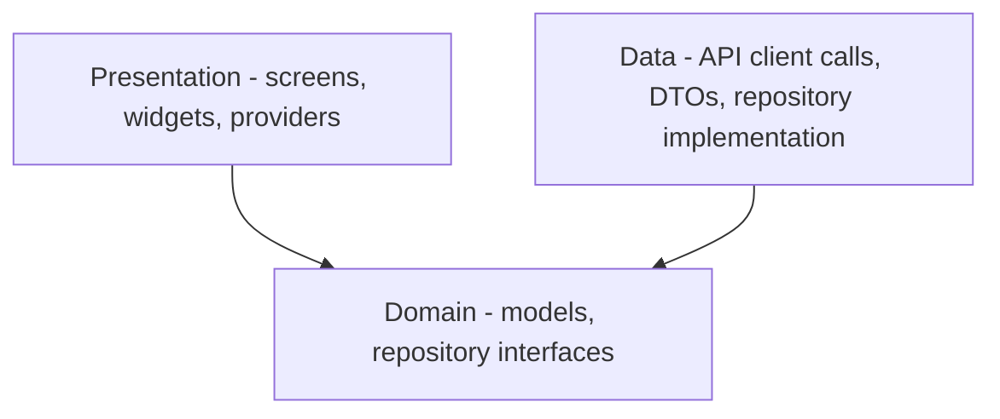

# Mobile Application Architecture

| Field | Value |
|-------|-------|
| Document ID | SIMF-MAA-001 |
| Title | Mobile Application Architecture |
| Version | 1.1 |
| Status | Approved |
| Classification | Confidential — to be confirmed by the owner |
| Prepared by | Engineering & Architecture Team, STARTIME |
| Owner | Solution Architect |
| Approver | Solution Architect |
| Date issued | 2026-05-20 |
| Related documents | SIMF-SAD-001, SIMF-API-001, SIMF-SES-001, SIMF-CON-001 |

### Revision history

| Version | Date | Author | Summary of change |
|---------|------|--------|-------------------|
| 1.0 | 2026-05-20 | Engineering & Architecture Team | First issue. |
| 1.1 | 2026-05-20 | Engineering & Architecture Team | Made the §10 date and digit formatting explicit (dates display as dd-MM-yyyy, digits are always Latin); added a §12 cross-reference to the Smif* shared component library. |
| 1.2 | 2026-05-29 | Engineering & Architecture Team | D-161 — added §8.1 documenting the `mobile_app_role` JWT claim, the role enum (None / Visitor / Staff / Moderator), the per-`UserType` resolution rules, and the role-based route guard pattern. |
| 1.3 | 2026-05-29 | Engineering & Architecture Team | D-164 — added §8.1.1 disambiguating `MobileAppRole.Moderator` (mobile-app content authority, JWT claim) from the session-question moderator (per-session permission, lands in gap-plan phase G3). |

---

## 1. Purpose

This document describes how the SIMF mobile application is built: its
structure, how state moves through it, how it talks to the backend, how it
handles two languages and two text directions, and how it takes delivery of the
visual design from the external designer. It is the reference for any engineer
working on the Flutter app.

## 2. Scope

The document covers the Flutter application for Android and iOS. It defines the
internal architecture and the engineering decisions behind it. It does not
define the visual design — colours, typography, illustration, motion — which is
the external UI/UX designer's deliverable (section 12). It does not define the
backend; that is SIMF-SAD-001 and SIMF-API-001.

**Web is a developer-diagnostics target only**, not a shipped platform: the app
can be built and run on web (`flutter run -d chrome`) for local API/UX testing —
the storage and HTTP layers are platform-conditional so they compile and run in
a browser (D-328) — but **Android and iOS remain the only product targets**. On
web `flutter_secure_storage` is **not encrypted** (browser storage) and live API
calls need a Development-only CORS allowance on the API, so a web run must use
non-production credentials only.

The functional scope of the app is the 41 screens in the agreed mockup
(`Mockup.html`), as recorded in SIMF-CON-001. This document is about how those
screens are built, not what each one does.

## 3. Architecture principles

1. The app is a client. Business rules live in the backend. The app presents
   data, collects input, and calls the API. It does not re-implement a domain
   rule.
2. One way to manage state, one way to navigate, one way to call the API.
   Consistency matters more than any individual library preference.
3. Feature-first structure. Code is grouped by feature, not by technical type,
   so a screen and everything behind it sits together.
4. The visual layer is replaceable. The app is built so the designer's visual
   design is applied on top of a working structure, not woven through it.
5. Arabic and RTL are the default case, not an afterthought. English and LTR
   are fully supported, but the app is designed RTL-first.

## 4. Technology choices

The app is built in Flutter, one codebase for Android and iOS, per the
confirmed stack. The libraries below are engineering decisions for this
project, recorded here so the whole team uses the same set. They are mainstream,
well-supported choices; if the team agrees a change before the build starts, it
is changed here first.

| Concern | Choice | Reason |
|---------|--------|--------|
| State management | Riverpod | Compile-safe, testable, less boilerplate than the alternatives; scales from a single widget to app-wide state |
| Navigation | go_router | Declarative routing, deep-link support, fits a 41-screen app with named routes |
| HTTP client | dio | Interceptors for headers, auth and logging; mature |
| Local storage | shared_preferences | Non-sensitive settings (language, theme) |
| Secure storage | flutter_secure_storage | Tokens and anything sensitive — Keychain on iOS, Keystore on Android |
| Localisation | Flutter `intl` with ARB files | The standard Flutter localisation path |
| Real-time | a SignalR Dart client | Talks to the backend SignalR hubs (SIMF-SAD-001 section 6.4) |
| Serialisation | json_serializable | Generated, type-safe model code |

The final package list with versions is fixed in the app's `pubspec.yaml` at
project setup and reviewed like any other code.

## 5. Project structure

The app uses a feature-first layout. Each feature folder holds its own data,
domain and presentation code.

```
lib/
  main.dart                 Entry point
  app/
    app.dart                Root widget, MaterialApp configuration
    router.dart             go_router route table
    theme/                  Theme definitions (see section 11)
    localization/           Localisation setup
  core/
    network/                dio setup, interceptors, the API client, ApiResult
    storage/                Secure and non-secure storage wrappers
    error/                  Failure types, error mapping
    constants/              App-wide constants
    widgets/                Shared widgets used across features
  features/
    auth/
      data/                 API calls, DTOs, repository implementation
      domain/               Models, repository interface
      presentation/         Screens, widgets, Riverpod providers
    onboarding/
    agenda/
    sessions/
    speakers/
    venue_map/
    badge/
    live/
    media/
    networking/
    notifications/
    profile/
    settings/
  l10n/                     ARB resource files (app_ar.arb, app_en.arb)
```

The feature folders correspond to the screen sections of the mockup. The exact
final list is settled at project setup; the structure above is the pattern.

## 6. Layers inside a feature

Each feature has three layers, matching the domain-driven thinking on the
backend, scaled to a client app.



- **Presentation** holds the screens and widgets and the Riverpod providers
  that hold their state. A widget reads state from a provider and renders it.
- **Domain** holds the plain models the app works with and the repository
  interfaces the presentation depends on.
- **Data** holds the DTOs that match the API, the code that calls the API, and
  the repository implementation that maps a DTO to a domain model.

A screen depends on a repository interface, never on dio directly. This keeps a
screen testable with a fake repository and keeps API detail out of the UI.

## 7. State management

State is managed with Riverpod.

- Screen and feature state lives in providers. A screen watches a provider and
  rebuilds when it changes.
- Asynchronous work — an API call — is exposed through Riverpod's async state,
  so a screen handles loading, data and error states explicitly. Every screen
  that loads data shows a loading state and an error state; a blank screen on
  failure is not acceptable.
- Cross-feature state — the signed-in user, the current language, the current
  theme — lives in app-level providers under `app/`.

## 8. Navigation

Routing uses go_router with named routes. The route table is declared once in
`app/router.dart`. The 41 screens map to named routes; the cross-screen links
documented in the Screen Guide are wired through this table.

Routes are guarded by authentication state. A guest can reach the screens that
are open to guests; the screens that need an account redirect an
unauthenticated user to sign-in. The guest-versus-authenticated screen split
follows SIMF-CON-001 and is confirmed against the roles specification
(SIMF-RPM-001).

### 8.1 The mobile-app role (D-161)

Beyond the guest-vs-authenticated split, four in-app roles drive which screens
are reachable:

| App role  | Source                                                                                    |
|-----------|-------------------------------------------------------------------------------------------|
| Guest     | The user is not signed in (no JWT). Maps to the absence of `mobile_app_role`.             |
| Visitor   | The user signed in with `UserType=Visitor`. Always `mobile_app_role=Visitor`.             |
| Staff     | The user signed in with `UserType=Other` and the assigned `ProfileType.MobileAppRole=Staff`.      |
| Moderator | The user signed in with `UserType=Other` and the assigned `ProfileType.MobileAppRole=Moderator`.  |

`UserType=Admin` users never reach the mobile app surface — they hit the
Control Panel; their access tokens carry `mobile_app_role=None` so a misrouted
admin token cannot unlock Staff / Moderator screens.

The role lives on a single JWT claim, `mobile_app_role`, minted at sign-in and
at every refresh:

```text
mobile_app_role: "None" | "Visitor" | "Staff" | "Moderator"
```

The app reads the claim once on sign-in, stores it next to the access token
in secure storage (§9.4), and uses it to gate route entries in `app/router.dart`.
The mapping for `UserType=Other` profile types is **admin-curated runtime
data**, not a hardcoded list: an admin can promote a new Other-tier profile
type to Staff or Moderator by editing the row from the Control Panel; the
mapping takes effect on the next sign-in / refresh. The seed ships only
`Staff (Other) → Staff`; every other operational mapping is event-curated.

**D-196 — approval gate.** A partner profile type confers its `Staff` /
`Moderator` `mobile_app_role` only once the account's `AccountState` is
`Approved`. A self-registering user who self-picks a partner profile type
stays `PendingApproval`, so they resolve to `Visitor` until an admin
reviews and approves them — at which point the admin has seen (and may
have changed) the proposed profile type. This makes the admin approval,
not the user's self-pick, the point at which operational authority is
granted; the mobile sign-up API alone can never mint more than `Visitor`.

The Flutter app must not infer authority from `UserType` alone: a user whose
`UserType=Other` carries `mobile_app_role=None` is treated as a Visitor for
navigation purposes (their `ProfileType` is "Exhibitor" or "Speaker" — a
display-side discriminator, not an authority).

The wire contract for the claim is documented in SIMF-API-001 §12.2. The
backend behaviour is captured in the SIMF Decisions Log entry D-161.

#### 8.1.1 Two distinct "Moderator" concepts (D-164)

The stakeholder requirements PDF (D-162 §2.7.2) names a role called
**المحاور** — the **session-question moderator**: a person assigned to a
specific live session who curates Q&A — viewing audience questions,
hiding or reordering them, and pushing approved ones to the speakers.

This **is not the same** as the `MobileAppRole.Moderator` claim
documented above:

| Concept | Authority | Scope | Source |
|---|---|---|---|
| `mobile_app_role = Moderator` (D-161) | Mobile-app content + user moderation | App-global | JWT claim, resolved from `ProfileType.MobileAppRole` |
| Session moderator (D-164 / D-162 §2.7.2) | Q&A curation during a live session | Per-`Session.Id` | Per-session permission grant (`SessionModerate`) — landing in gap-plan phase G3 |

A user can hold either authority, both, or neither. The Flutter app must
not infer one from the other: an admin granting `SessionModerate` to a
specific user for one specific session does not change that user's
`mobile_app_role` claim, and vice versa. The two surfaces are gated
independently — `mobile_app_role` for app-level navigation, the
per-session permission for the Q&A management screen of one specific
session.

## 9. Networking and the API layer

### 9.1 The API client

The app talks to the SIMF backend through one API client built on dio. The
client is the only place that knows about HTTP. Features call typed methods on
repositories; repositories call the client.

### 9.2 Headers

A dio interceptor attaches the standard headers from SIMF-API-001 to every
request: `X-App-Key`, `X-Device-Type` (`Android` or `iOS`), `Accept-Language`
(the current app language), the `Authorization` bearer token when the user is
signed in, and the anti-forgery token on state-changing requests.

### 9.3 The response envelope

Every response is an `ApiResult<T>` (SIMF-API-001 section 6). The client
deserialises it once, into a Dart `ApiResult<T>`. A repository returns either
the data or a typed failure mapped from `error.code`. A screen never parses raw
JSON and never inspects an HTTP status directly.

### 9.4 Tokens and refresh

- The access token and refresh token are stored with `flutter_secure_storage`,
  never in plain preferences.
- An interceptor handles a 401 caused by an expired access token: it calls
  `POST /auth/refresh` once, stores the rotated tokens, and retries the original
  request. If the refresh itself fails, the app clears the session and routes
  to sign-in.
- Sign-out calls the API and clears secure storage.

### 9.5 Real-time

The app connects to the backend SignalR hubs for live-session updates and
in-app notifications. The connection is opened when it is needed — for example
on a live-session screen — and closed when it is not, to respect battery and
data. Connection drops are handled with a reconnect, and the UI reflects the
connection state rather than silently showing stale data.

## 10. Localisation

- Two languages: Arabic and English. Arabic is primary.
- All user-facing strings come from ARB files (`l10n/app_ar.arb`,
  `l10n/app_en.arb`). No string is hardcoded in a widget.
- Text direction follows the language: RTL for Arabic, LTR for English. The app
  uses Flutter's directionality so layouts mirror correctly. Layouts are built
  with direction-aware widgets and start/end alignment, not hardcoded left and
  right.
- The chosen language is stored locally and sent on every request as
  `Accept-Language`, so server messages come back in the same language.
- Dates are displayed in the format `dd-MM-yyyy`.
- Numbers — including the digits inside dates and times — are always rendered
  in Latin (English) digits (`0`–`9`), regardless of the UI language. The app
  does not use Arabic-Indic digits (`٠`–`٩`). This makes the formatting rule
  explicit: it overrides any reading of "formatted for the active locale" that
  would otherwise produce Arabic-Indic digits or a different date format. Other
  locale-sensitive formatting, such as the wording around a time, still follows
  the active locale.

## 11. Theming

- Theme values — colours, typography, spacing, radii — are defined as tokens in
  `app/theme/`, in one place. A widget references a token, never a literal
  colour or size.
- The brand tokens — the colour palette and the typography — come from
  **SIMF-VID-001 (Visual Identity and Design Tokens)**. The `app/theme/` tokens
  are populated from it, and the external designer's visual design must conform
  to SIMF-VID-001.
- The app supports light and dark themes from the start. The token structure
  allows more themes to be added without touching widgets.
- When the external designer delivers the visual design system, its values are
  loaded into these tokens. Because widgets reference tokens and not literals,
  applying the design is a change in one place, not a sweep through every
  screen.

## 12. The design handoff with the external UI/UX designer

The app's visual design is produced by an external UI/UX designer. The Flutter
team and the designer need a clear contract so the two streams of work meet
cleanly.

### 12.1 What the Flutter team builds before the design arrives

While the design is in progress, the Flutter team builds the parts that do not
depend on final visuals:

- The project skeleton, the folder structure, and the package baseline.
- The networking layer, the API client, token handling and refresh.
- The authentication feature against the API in SIMF-API-001 section 12.
- Navigation and the route table for the 41 screens.
- Localisation and the RTL/LTR setup.
- The theme token structure, filled with placeholder values.
- Screen scaffolding for the 41 screens — the structure, the state wiring, the
  API integration — using placeholder visuals.

This is the WS3 work the programme plan says proceeds while the designer works.

### 12.2 What the designer delivers

For the handoff to apply cleanly, the design delivery needs:

- A design system: the colour palette, typography scale, spacing scale, corner
  radii, elevation, and the icon set, expressed as named tokens.
- A component library: the shared components (buttons, fields, cards, the
  bottom navigation, list rows) with their states.
- Screen designs for the 41 screens, in both Arabic (RTL) and English (LTR).
- Exportable assets — icons, illustrations, images — at the required densities.
- The source file in a tool the team can inspect for measurements and export
  (Figma is the assumed tool; to be confirmed).

### 12.3 How the design is applied

When the design system arrives, its tokens are loaded into `app/theme/`. The
shared components are styled to match the component library. These shared
components are the app's `Smif*` wrapper components (SIMF-SES-001 section 6.3):
each `Smif*` component wraps the matching widget from the designer's delivered
component library, so applying the design styles the wrappers in one place
rather than every screen. Each screen's placeholder visuals are replaced with
the real design. Because the structure,
navigation, state and API integration are already built and tested, this stage
is a visual pass, not a rebuild.

Open item OI-1 records the need to confirm the design tool and the delivery
format with the designer.

## 13. Build and release

- The app targets Android and iOS from one codebase.
- Build configuration is separated by environment (development, test,
  production) so the app points at the right API without code changes.
- Releases go to the Apple App Store and Google Play. The store accounts,
  signing identities and certificates are prepared early, because store review
  — Apple's in particular — is on the critical path in SIMF-PGP-001.
- Secrets and signing material are not committed to the repository.

## 14. Testing

The app is tested at three levels, consistent with SIMF-SES-001:

- **Unit tests** for domain logic, repositories (with a fake API client), and
  providers.
- **Widget tests** for screens and shared components, including a check that
  each data screen renders its loading and error states.
- **Integration tests** for the main user journeys end to end against a test
  backend — sign-up, sign-in, and the core flows.

RTL rendering is part of widget testing: key screens are tested in Arabic to
catch mirrored-layout problems early.

## 15. Open items

| ID | Item | Needed for |
|----|------|-----------|
| OI-1 | Confirm the design tool and delivery format with the external designer | Section 12 |
| OI-2 | Final package list and versions, fixed at project setup | Section 4 |
| OI-3 | Guest-versus-authenticated screen split, confirmed against SIMF-RPM-001 (gate D1) | Section 8 |
| OI-4 | Map/location service for the venue map and GPS presence (gate, see SIMF-SAD-001 OI-7) | venue_map feature |
| OI-5 | Confirm document classification with the owner | Control block |

---

End of document.
