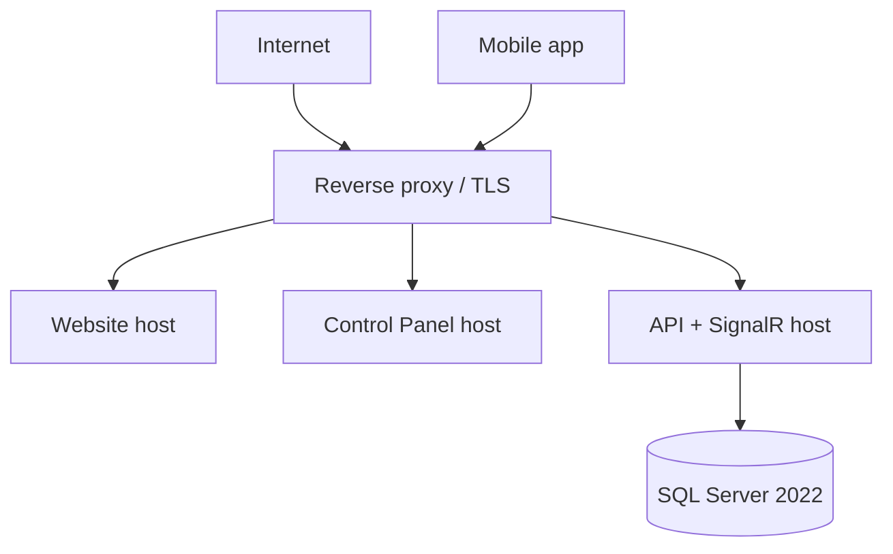

# Deployment and Operations Document

| Field | Value |
|-------|-------|
| Document ID | SIMF-OPS-001 |
| Title | Deployment and Operations Document |
| Version | 1.1 |
| Status | Approved |
| Classification | Confidential — to be confirmed by the owner |
| Prepared by | Engineering & Architecture Team, STARTIME |
| Owner | DevOps Engineer |
| Approver | Project Owner (MoD / RSNF representative) |
| Date issued | 2026-05-21 |
| Related documents | SIMF-SAD-001, SIMF-SES-001, SIMF-PGP-001, SIMF-MAA-001, SIMF-TST-001 |

### Revision history

| Version | Date | Author | Summary of change |
|---------|------|--------|-------------------|
| 1.0 | 2026-05-21 | Engineering & Architecture Team | First issue. |
| 1.1 | 2026-05-21 | Engineering & Architecture Team | Architecture-review amendment (see Amendment A): the §11 load test rewritten to peak-shaped targets; the production scale-out cross-referenced; connection-pool sizing; a real readiness `/health`. |

---

## 1. Purpose

This document describes how SIMF is deployed and run: the environments, the
pipeline, how a release reaches production, how the system is configured,
backed up and monitored, and the checklist a deployment follows. It is the
reference for the DevOps engineer and for anyone operating the system.

## 2. Scope

The document covers the deployment topology, the four environments, the CI/CD
pipeline, build and release, configuration and secrets, database migrations,
the mobile-app release, monitoring and logging, backup and rollback,
performance testing, the security clearance gate, and the deployment checklist.

It does not cover the test strategy in depth — that is SIMF-TST-001. It does
not cover the architecture — that is SIMF-SAD-001.

## 3. Deployment topology

SIMF is deployed **on-premises** on Windows Server 2022, hosted with a local
Saudi provider through STC, behind a reverse proxy that terminates TLS
(SIMF-SAD-001 section 10).



The backend is one deployable application (the modular monolith of
SIMF-SAD-001). The website and the Control Panel are Blazor applications. The
mobile app reaches the same API through the reverse proxy.

## 4. Environments

Four environments, with promotion gated by tests (SIMF-PGP-001, SIMF-SES-001).

| Environment | Purpose | Notes |
|-------------|---------|-------|
| Development | Day-to-day development | Stood up first; the team's working environment |
| Test | Integrated testing and QA | The continuous-testing environment |
| Staging | The live rehearsal | Mirrors production; the live environment is ready two full weeks before publication |
| Production | The live system | On-premises, behind the reverse proxy |

Each environment has its own configuration (section 6) and its own database. A
change is promoted Development → Test → Staging → Production; a promotion does
not skip an environment, and a promotion gate that fails its tests does not
proceed.

## 5. CI/CD pipeline

The pipeline runs in Azure DevOps — Repos, Boards, Pipelines and Test Plans.

```
Commit ──▶ Build ──▶ Test ──▶ Deploy ──▶ Monitor
```

| Stage | What happens |
|-------|--------------|
| Commit | A push to a feature branch; branch policy requires a reviewed pull request to merge to `main` (SIMF-SES-001 section 9) |
| Build | Restore, compile and package. The build runs in Release and fails on any warning (SIMF-SES-001 section 13) |
| Test | The unit and integration tests run; a failing test stops the pipeline |
| Deploy | The package is deployed to the next environment; promotion to Staging and Production is gated by the tests passing |
| Monitor | Logs, metrics and alerts are watched after a deployment |

The pipeline builds the backend, the website and the Control Panel. The Flutter
app has its own build and store-release path (section 8).

## 6. Configuration and secrets

Configuration follows SIMF-SES-001 section 4.4.

- `appsettings.json` holds the non-sensitive shared settings; it carries no
  secret.
- `appsettings.Development.json` and `appsettings.E2E.json` hold the
  development and end-to-end overrides.
- **Production configuration carries no committed file.** The production
  overrides and every secret — connection strings, the JWT signing key, the
  channel-provider and AI-provider keys — are applied as Machine-scope
  environment variables, set by a per-service `set-env-<service>.ps1` script.
- The `set-env-<service>.ps1` committed to the repository is a placeholder
  template with empty values; the real secret values are never committed.
- Variables use the ASP.NET Core double-underscore convention
  (`ConnectionStrings__AppData`).

## 7. Database and migrations

- The database is SQL Server 2022; the schema is EF Core code-first.
- A migration is generated, **read and reviewed as code**, and committed with
  the change that needs it (SIMF-SES-001 section 5.4).
- A deployment applies the pending migrations to the target environment's
  database as part of the deploy stage, before the new application version
  serves traffic.
- The SQL Server edition is confirmed with the host (SIMF-RDR-001 D8); the
  schema does not depend on Enterprise-only features unless that is confirmed.

## 8. Mobile app release

- The Flutter app is built for Android and iOS and released to Google Play and
  the Apple App Store.
- Build configuration is separated by environment so the app points at the
  right API (SIMF-MAA-001 section 13).
- The store accounts, the signing identities and the certificates are prepared
  **early**, because store review — Apple's in particular — is on the critical
  path (SIMF-PGP-001 section 9).
- Signing material and store credentials are configuration secrets; they are
  not committed.

## 9. Monitoring, logging and health

- The API exposes a `/health` endpoint; the reverse proxy and the monitoring
  use it to confirm the system is up.
- Logging is through Serilog, structured, collected centrally (SIMF-SAD-001
  section 11). The audit and security events feed the operation log and the
  monitoring.
- Metrics and alerts are watched after every deployment and through the event;
  the three forum days are the window that matters most.

## 10. Backup and rollback

- The database and the application are backed up on a schedule.
- The **last known-good published build** is retained, so a release can be
  rolled back to it (SIMF-SES-001 section 10, the CLAUDE.md deployment rules).
- A rollback restores the previous application version and, where a migration
  must be reversed, follows the reverse migration; a destructive database
  rollback is done only with explicit approval.

## 11. Performance and load testing

Before go-live the system is tested under load, per the technical requirements:

- a **load test** that adds a new registered user roughly every 30 seconds,
- a **traffic test** under real load before the launch, to confirm the system
  is fit before it is switched on.

The test environment is stood up from day one so this testing has somewhere to
run well ahead of the event (SIMF-PGP-001).

## 12. Security clearance before go-live

The website and the app are not published until the security clearances are in
hand (SIMF-CON-001 section 10.3, SIMF-SES-001 section 12):

- a secure-code review by the MoD cyber centre before the code goes for
  penetration testing,
- penetration testing and a vulnerability assessment,
- the security approval from the authorities and the NCA-accredited firms.

Go-live does not proceed until these clear.

## 13. The deployment checklist

Every production deployment follows this checklist (the CLAUDE.md deployment
rules):

1. **Build** — a clean Release build, zero warnings.
2. **Configuration** — the target environment's settings and secrets are in
   place via the environment variables (section 6).
3. **Migration** — the pending database migrations are applied and confirmed.
4. **Health** — the `/health` endpoint reports healthy.
5. **Smoke test** — the core paths are exercised — sign-in, a registration, the
   Control Panel — and pass.
6. **Monitoring** — logs, metrics and alerts are watched after the release.

A deployment that fails any step does not proceed; it is rolled back
(section 10).

## 14. Roles and responsibilities

- The **DevOps Engineer** owns the pipeline, the environments and the
  deployments, and this document.
- The **Solution Architect** approves a change to the topology or the pipeline.
- The **QA Lead** owns the test gates the pipeline enforces (SIMF-TST-001).
- The **Project Owner** approves a production release and go-live.

## 15. Open items

| ID | Item | Affects |
|----|------|---------|
| OI-1 | Confirm the host's specifics with STC — capacity, the reverse-proxy setup, the backup destination | Sections 3, 10 |
| OI-2 | Confirm the SQL Server 2022 edition and licence (SIMF-RDR-001 D8) | Section 7 |
| OI-3 | Confirm the monitoring and alerting tooling | Section 9 |
| OI-4 | Confirm the backup schedule and the retention periods with the owner | Section 10 |
| OI-5 | Confirm document classification with the owner | Control block |

---

## Amendment A — Architecture review (2026-05-21)

The 150,000-user scalability review of 2026-05-21 amends this document.

### A.1 Performance and load testing — rewrites §11
The §11 load test is replaced. The "one new user every 30 seconds" figure is
retired as a target — it tests the average, not the peak. The performance test
uses peak-shaped scenarios, run on a Staging environment matching the intended
production topology, each with pass/fail thresholds (p95 latency, error rate,
connection-success rate):

1. **Registration surge** — 30–50 sign-ups/minute sustained for an hour, with
   burst spikes, the full flow including the email-code send.
2. **Live-session concurrency** — ramp SignalR to the target concurrent
   connection count for the busiest session, with a representative
   question/comment rate; measure fan-out latency.
3. **Venue-entry scan burst** — the morning rate, thousands of `VenueEntry`
   writes in 30–60 minutes, plus concurrent hall-arrival scans.
4. **GPS-presence write load** — the chosen device count × reporting interval,
   sustained.
5. **Notification fan-out** — one notification to tens of thousands of
   recipients; measure time-to-last-delivery and database impact.
6. **Mixed steady state** — all of the above together, as a real forum morning.

### A.2 Topology — amends §3
The §3 single-server topology is the **development and test** topology. The
**event-day production topology** — a multi-instance API tier, a SignalR
backplane and SQL Server high availability — is the deferred scale-out decision
in SIMF-SAD-001 Amendment A.3, settled with the host (STC) closer to the event,
with the reverse-proxy WebSocket connection capacity confirmed then.

### A.3 Database connections — amends §6 and §7
Each connection string sets an explicit `Max Pool Size`, sized against the SQL
Server capacity and the node count. EF Core is async throughout, with a command
timeout and `EnableRetryOnFailure` for transient SQL errors. The database is
**SQL Server 2022 Standard edition** (decision O-3).

### A.4 Readiness health check — amends §9
`/health` is a real **readiness** check — it confirms the database is reachable
and the migrations are applied — so the reverse proxy / load balancer pulls an
unhealthy instance automatically. It is not a static 200.

---

End of document.
