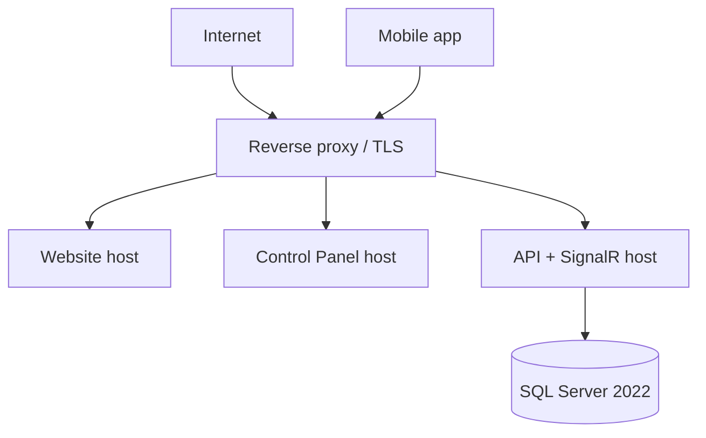

# Deployment and Operations Document

| Field | Value |
|-------|-------|
| Document ID | SIMF-OPS-001 |
| Title | Deployment and Operations Document |
| Version | 1.1 |
| Status | Approved |
| Classification | Confidential — to be confirmed by the owner |
| Prepared by | Engineering & Architecture Team, STARTIME |
| Owner | DevOps Engineer |
| Approver | Project Owner (MoD / RSNF representative) |
| Date issued | 2026-05-21 |
| Related documents | SIMF-SAD-001, SIMF-SES-001, SIMF-PGP-001, SIMF-MAA-001, SIMF-TST-001 |

### Revision history

| Version | Date | Author | Summary of change |
|---------|------|--------|-------------------|
| 1.0 | 2026-05-21 | Engineering & Architecture Team | First issue. |
| 1.1 | 2026-05-21 | Engineering & Architecture Team | Architecture-review amendment (see Amendment A): the §11 load test rewritten to peak-shaped targets; the production scale-out cross-referenced; connection-pool sizing; a real readiness `/health`. |
| 1.2 | 2026-08-15 | Engineering & Architecture Team | Amendment C: the backup set is four artefacts, not three. Key escrow, backup order, the restore and verification procedure, and the two standing caveats (rotation is not operational; a byte-level restore reverses a crypto-shred). |

---

## 1. Purpose

This document describes how SIMF is deployed and run: the environments, the
pipeline, how a release reaches production, how the system is configured,
backed up and monitored, and the checklist a deployment follows. It is the
reference for the DevOps engineer and for anyone operating the system.

## 2. Scope

The document covers the deployment topology, the four environments, the CI/CD
pipeline, build and release, configuration and secrets, database migrations,
the mobile-app release, monitoring and logging, backup and rollback,
performance testing, the security clearance gate, and the deployment checklist.

It does not cover the test strategy in depth — that is SIMF-TST-001. It does
not cover the architecture — that is SIMF-SAD-001.

## 3. Deployment topology

SIMF is deployed **on-premises** on Windows Server 2022, hosted with a local
Saudi provider through STC, behind a reverse proxy that terminates TLS
(SIMF-SAD-001 section 10).



The backend is one deployable application (the modular monolith of
SIMF-SAD-001). The website and the Control Panel are Blazor applications. The
mobile app reaches the same API through the reverse proxy.

## 4. Environments

Four environments, with promotion gated by tests (SIMF-PGP-001, SIMF-SES-001).

| Environment | Purpose | Notes |
|-------------|---------|-------|
| Development | Day-to-day development | Stood up first; the team's working environment |
| Test | Integrated testing and QA | The continuous-testing environment |
| Staging | The live rehearsal | Mirrors production; the live environment is ready two full weeks before publication |
| Production | The live system | On-premises, behind the reverse proxy |

Each environment has its own configuration (section 6) and its own database. A
change is promoted Development → Test → Staging → Production; a promotion does
not skip an environment, and a promotion gate that fails its tests does not
proceed.

## 5. CI/CD pipeline

The pipeline runs in Azure DevOps — Repos, Boards, Pipelines and Test Plans.

```
Commit ──▶ Build ──▶ Test ──▶ Deploy ──▶ Monitor
```

| Stage | What happens |
|-------|--------------|
| Commit | A push to a feature branch; branch policy requires a reviewed pull request to merge to `main` (SIMF-SES-001 section 9) |
| Build | Restore, compile and package. The build runs in Release and fails on any warning (SIMF-SES-001 section 13) |
| Test | The unit and integration tests run; a failing test stops the pipeline |
| Deploy | The package is deployed to the next environment; promotion to Staging and Production is gated by the tests passing |
| Monitor | Logs, metrics and alerts are watched after a deployment |

The pipeline builds the backend, the website and the Control Panel. The Flutter
app has its own build and store-release path (section 8).

## 6. Configuration and secrets

Configuration follows SIMF-SES-001 section 4.4.

- `appsettings.json` holds the non-sensitive shared settings; it carries no
  secret.
- `appsettings.Development.json` and `appsettings.E2E.json` hold the
  development and end-to-end overrides.
- **Production configuration carries no committed file.** The production
  overrides and every secret — connection strings, the JWT signing key, the
  channel-provider and AI-provider keys — are applied as Machine-scope
  environment variables, set by a per-service `set-env-<service>.ps1` script.
- The `set-env-<service>.ps1` committed to the repository is a placeholder
  template with empty values; the real secret values are never committed.
- **The API script is tracked under a different name.** Its filled form carries
  every production secret, so the repository tracks
  `deploy/set-env-api.template.ps1` (all values empty) while `.gitignore`
  deliberately ignores `deploy/set-env-api.ps1`, the filled overlay created on
  the server with
  `Copy-Item deploy\set-env-api.template.ps1 deploy\set-env-api.ps1`. **Never
  remove that ignore entry to make the filled script trackable — that commits
  live production credentials.** The Control Panel and Website scripts
  (`set-env-cp.ps1`, `set-env-web.ps1`) hold only non-secret shared config, so
  they stay tracked under their own names.
- Every value in the API template is annotated with what breaks when it is
  missing. Three of them are **Production boot gates** — the API refuses to
  start without `SIMF_API_FileStorage__EncryptionKey` (the centralized file-store
  KEK, D-568), `SIMF_API_Storage__UserIdDocumentEncryptionKey` (the PII column key,
  NCA A2-10) or `SIMF_API_Ai__PromptHash__Secret` (the AI audit HMAC secret). A
  fourth, `SIMF_Storage__AvatarBase`, is validated with `ValidateOnStart`, so
  the host fails to build without it.
- First-time provisioning uses the runbook `deploy/configure-prod-env.ps1`
  (§B.3): it generates the missing base64 32-byte AES keys with
  `System.Security.Cryptography.RandomNumberGenerator` without printing them,
  **never overwrites an existing encryption key** (rotating the file-store KEK
  makes every stored file undecryptable — it warns and skips, and there is no
  `-Force`), prompts for the non-generatable values without echoing them,
  verifies by reporting each key's name and set/missing state only, then
  restarts the IIS app pools and health-checks the API. It is safe to re-run,
  and `-VerifyOnly` audits without changing anything.
- Variables use the ASP.NET Core double-underscore convention with a `SIMF_`
  prefix (`SIMF_API_ConnectionStrings__SimfAppDb`). Each host registers
  `builder.Configuration.AddEnvironmentVariables("SIMF_")`, which strips the
  prefix at bind time so the value lands on `ConnectionStrings:SimfAppDb`
  (D-355). The prefix keeps SIMF's variables from colliding with other apps' on
  a shared host.

### 6.0 Meeting confirmation links (`SIMF_API_MeetingLinks__PublicWebBaseUrl`) — REQUIRED

The speaker double-opt-in flow (D-717) emails the speaker an Approve / Decline link
that lands on the public Website page `{PublicWebBaseUrl}/meeting/confirm?token=…`.
The value is bound from `MeetingLinks:PublicWebBaseUrl` and overridden per
environment with the Machine-scope variable:

| Variable | Value | Notes |
|----------|-------|-------|
| `SIMF_API_MeetingLinks__PublicWebBaseUrl` | the public Website origin, e.g. `https://web.simrsnf.com` | no trailing slash needed; trimmed when the link is built |
| `SIMF_API_MeetingLinks__TokenTtlHours` | `72` (default) | link lifetime, §15.7 |

`appsettings.json` ships the key **empty**; `appsettings.Development.json` defaults it
to the Website's local origin (`http://localhost:5115`). **It must be set explicitly in
QA and in Production.** When it is empty the Control Panel's **Approve** and **Resend
speaker confirmation** actions now fail with `MEETING_LINKS_NOT_CONFIGURED` (409) rather
than silently parking the request in `AwaitingSpeaker` with a confirmation email that was
never sent. The same guard refuses `SPEAKER_MEETING_CONTACT_MISSING` (409) when the
speaker has no `Email` on file — add the speaker's email in `/admin/speakers`, or use
**Confirm** when the admin already has the speaker's verbal agreement.

### 6.1 AI provider go-live (turning the AI features from echo to real)

Every AI feature (the app assistant, FAQ, translate, live translation / sign
language, the session-summary محضر draft, and the Control Panel assistant) routes
through the one `IAiService` chokepoint. By default the stack ships **offline**:
`Ai:DefaultProvider = "Echo"`, every seeded prompt is pinned to `Provider = Echo`
/ `Model = "echo"`, and every provider API key is empty, so each feature returns
the echo stub (`[echo:...] ` + the prompt) instead of a real answer. To turn the
whole stack on, set these Machine-scope environment variables (`SIMF_` prefix,
`__` = section nesting) and restart the API:

1. `SIMF_API_Ai__DefaultProvider = Anthropic` (or `Gemini` / `OpenAi`). Because every
   seeded prompt is on `Provider = Echo`, this one setting redirects **all** of
   them to the chosen provider (D-484); a prompt pinned to a concrete provider in
   the CP is honoured as-is.
2. `SIMF_API_Ai__Anthropic__ApiKey = <key>` (and/or `SIMF_API_Ai__Gemini__ApiKey`,
   `SIMF_API_Ai__OpenAi__ApiKey`). A missing key returns `AI_PROVIDER_NOT_CONFIGURED`
   (503) for that provider, not a real answer. Keys are never committed.
3. Model: the seeded sentinel `Model = "echo"` is treated as "use the provider's
   configured `DefaultModel`" whenever the effective provider is real, so **no
   per-prompt model edit is needed**. To pin a specific model, either set the
   prompt's Model in the CP (`/admin/ai/prompts`) or set
   `SIMF_API_Ai__<Provider>__DefaultModel`.
4. Keep prompts active (the seeder sets `IsActive = true`; a disabled prompt
   returns `AI_FEATURE_DISABLED`, 503).
5. `SIMF_API_Ai__PromptHash__Secret = <32-byte base64>` is a Production **boot gate**
   (the audit HMAC key) - the API refuses to start without it.
6. Optional: `SIMF_API_SessionQuestions__AiFilterEnabled = true` swaps the offline
   `StubQuestionAiFilter` for the real `AiQuestionFilter` on the Q&A submit path
   (advisory only - it never blocks a question).

**Existing databases and the grounded assistant prompt.** The prompt seeder is
idempotent: it inserts a missing prompt but never updates an existing row. A
database seeded **before** the app assistant was grounded still carries the old
`assistance` template (message-only), so the endpoint's `{context}`/`{locale}`
inputs are dropped and the assistant answers ungrounded. Run the idempotent data
update `docs/migrations/2026/SIMF_App_AssistancePromptGrounding.sql` once against
`SIMF_App` (it rewrites the `assistance` row to the grounded template; safe to
re-run; a freshly-seeded database already carries the template, so the script
updates 0 rows there). An operator may instead edit the prompt in the CP
(`/admin/ai/prompts`). The event context itself (sessions / FAQ / booths) is built
live from the App database on every call, so it needs no configuration.

**Verify.** After the restart: the CP `/admin/ai/services` dashboard records real
calls; the app assistant answers with real agenda / FAQ / booth facts; and outputs
no longer start with `[echo:...]`. Manage per-prompt provider / model / active
state at runtime in the CP (`/admin/ai/prompts`, `PUT /admin/ai/prompts/{id}`).

## 7. Database and migrations

- The database is SQL Server 2022; the schema is EF Core code-first.
- A migration is generated, **read and reviewed as code**, and committed with
  the change that needs it (SIMF-SES-001 section 5.4).
- A deployment applies the pending migrations to the target environment's
  database as part of the deploy stage, before the new application version
  serves traffic.
- The SQL Server edition is confirmed with the host (SIMF-RDR-001 D8); the
  schema does not depend on Enterprise-only features unless that is confirmed.

## 8. Mobile app release

- The Flutter app is built for Android and iOS and released to Google Play and
  the Apple App Store.
- Build configuration is separated by environment so the app points at the
  right API (SIMF-MAA-001 section 13).
- The store accounts, the signing identities and the certificates are prepared
  **early**, because store review — Apple's in particular — is on the critical
  path (SIMF-PGP-001 section 9).
- Signing material and store credentials are configuration secrets; they are
  not committed.

## 9. Monitoring, logging and health

- The API exposes a `/health` endpoint; the reverse proxy and the monitoring
  use it to confirm the system is up.
- Logging is through Serilog, structured, collected centrally (SIMF-SAD-001
  section 11). The audit and security events feed the operation log and the
  monitoring.
- Metrics and alerts are watched after every deployment and through the event;
  the three forum days are the window that matters most.

## 10. Backup and rollback

> **Superseded in part by Amendment C.** This section describes the backup as
> "the database and the application". That is not the whole recoverable state:
> the encrypted file store and the encryption keys are also required, and the
> keys are the one artefact no backup of the databases or the disk contains.
> **Amendment C is the authoritative backup and restore runbook. Read it first,
> and do C.1 today.**

- The database and the application are backed up on a schedule.
- The **last known-good published build** is retained, so a release can be
  rolled back to it (SIMF-SES-001 section 10, the CLAUDE.md deployment rules).
- A rollback restores the previous application version and, where a migration
  must be reversed, follows the reverse migration; a destructive database
  rollback is done only with explicit approval.

## 11. Performance and load testing

Before go-live the system is tested under load, per the technical requirements:

- a **load test** that adds a new registered user roughly every 30 seconds,
- a **traffic test** under real load before the launch, to confirm the system
  is fit before it is switched on.

The test environment is stood up from day one so this testing has somewhere to
run well ahead of the event (SIMF-PGP-001).

## 12. Security clearance before go-live

The website and the app are not published until the security clearances are in
hand (SIMF-CON-001 section 10.3, SIMF-SES-001 section 12):

- a secure-code review by the MoD cyber centre before the code goes for
  penetration testing,
- penetration testing and a vulnerability assessment,
- the security approval from the authorities and the NCA-accredited firms.

Go-live does not proceed until these clear.

## 13. The deployment checklist

Every production deployment follows this checklist (the CLAUDE.md deployment
rules):

1. **Build** — a clean Release build, zero warnings.
2. **Configuration** — the target environment's settings and secrets are in
   place via the environment variables (section 6).
3. **Migration** — the pending database migrations are applied and confirmed.
4. **Health** — the `/health` endpoint reports healthy.
5. **Smoke test** — the core paths are exercised — sign-in, a registration, the
   Control Panel — and pass.
6. **Monitoring** — logs, metrics and alerts are watched after the release.

A deployment that fails any step does not proceed; it is rolled back
(section 10).

## 14. Roles and responsibilities

- The **DevOps Engineer** owns the pipeline, the environments and the
  deployments, and this document.
- The **Solution Architect** approves a change to the topology or the pipeline.
- The **QA Lead** owns the test gates the pipeline enforces (SIMF-TST-001).
- The **Project Owner** approves a production release and go-live.

## 15. Open items

| ID | Item | Affects |
|----|------|---------|
| OI-1 | Confirm the host's specifics with STC — capacity, the reverse-proxy setup, the backup destination | Sections 3, 10 |
| OI-2 | Confirm the SQL Server 2022 edition and licence (SIMF-RDR-001 D8) | Section 7 |
| OI-3 | Confirm the monitoring and alerting tooling | Section 9 |
| OI-4 | Confirm the backup schedule and the retention periods with the owner | Section 10 |
| OI-5 | Confirm document classification with the owner | Control block |

---

## Amendment A — Architecture review (2026-05-21)

The 150,000-user scalability review of 2026-05-21 amends this document.

### A.1 Performance and load testing — rewrites §11
The §11 load test is replaced. The "one new user every 30 seconds" figure is
retired as a target — it tests the average, not the peak. The performance test
uses peak-shaped scenarios, run on a Staging environment matching the intended
production topology, each with pass/fail thresholds (p95 latency, error rate,
connection-success rate):

1. **Registration surge** — 30–50 sign-ups/minute sustained for an hour, with
   burst spikes, the full flow including the email-code send.
2. **Live-session concurrency** — ramp SignalR to the target concurrent
   connection count for the busiest session, with a representative
   question/comment rate; measure fan-out latency.
3. **Venue-entry scan burst** — the morning rate, thousands of `VenueEntry`
   writes in 30–60 minutes, plus concurrent hall-arrival scans.
4. **GPS-presence write load** — the chosen device count × reporting interval,
   sustained.
5. **Notification fan-out** — one notification to tens of thousands of
   recipients; measure time-to-last-delivery and database impact.
6. **Mixed steady state** — all of the above together, as a real forum morning.

### A.2 Topology — amends §3
The §3 single-server topology is the **development and test** topology. The
**event-day production topology** — a multi-instance API tier, a SignalR
backplane and SQL Server high availability — is the deferred scale-out decision
in SIMF-SAD-001 Amendment A.3, settled with the host (STC) closer to the event,
with the reverse-proxy WebSocket connection capacity confirmed then.

### A.3 Database connections — amends §6 and §7
Each connection string sets an explicit `Max Pool Size`, sized against the SQL
Server capacity and the node count. EF Core is async throughout, with a command
timeout and `EnableRetryOnFailure` for transient SQL errors. The database is
**SQL Server 2022 Standard edition** (decision O-3).

### A.4 Readiness health check — amends §9
`/health` is a real **readiness** check — it confirms the database is reachable
and the migrations are applied — so the reverse proxy pulls an
unhealthy instance automatically. It is not a static 200.

---

## Amendment B — On-prem release runbook (D-193, 2026-05-30)

This amendment is the operational consolidation of every deployment-time
decision recorded across the DECISIONS_LOG since the Sprint-1 Login API
ship (D-001 → D-191). It expands the §13 six-bullet checklist into a
full release runbook covering the configuration matrix, migration
order, secret generation, rollback plan, post-deploy smoke,
and NCA security pre-flight.

### B.1 Complete configuration matrix

Every key the API reads at startup, the section that owns it, the
required-vs-optional status, and what happens when missing. Configuration
follows §6 (`appsettings.json` for non-secret defaults; environment
variables for the secrets, double-underscore convention). For an
on-prem deploy, the per-service `set-env-<service>.ps1` script must
populate every row marked **Required**.

| Section | Key | Required? | What it controls | Failure mode if missing |
|---------|-----|-----------|------------------|-------------------------|
| ConnectionStrings | `SimfIdentityDb` | **Required** | SQL Server connection for Identity DB (Users, RefreshTokens, DeviceKeys, OperationLog) | Startup throws on first DbContext resolve |
| ConnectionStrings | `SimfAppDb` | **Required** | SQL Server connection for App DB (UserProfiles, ProfileTypes, AiPrompts, AiPromptHistory, Sessions, Gates, MeetingRequests, etc.) | Startup throws |
| Jwt | `Issuer` | Optional (default `SIMF`) | JWT `iss` claim | Default OK |
| Jwt | `Audience` | Optional (default `SIMF`) | JWT `aud` claim | Default OK |
| Jwt | `SigningKey` | **Required** | HS256 signing key — generate with `openssl rand -base64 48` | Token issuance throws; SignIn 500s on every call |
| Jwt | `AccessTokenMinutes` | Optional (default 30) | Access-token lifetime | Default OK |
| Email | `Host` | **Required** | SMTP host for code/notification email | Email enqueue throws; sign-up loops in EmailVerified state |
| Email | `Port` | Optional (default 587) | SMTP port | Default OK |
| Email | `User` / `Password` | **Required** | SMTP auth | Email enqueue throws |
| Email | `FromAddress` / `FromName` | Optional | Envelope From | Defaults OK |
| Email | `FailureAlertRecipients` | Optional | Comma-separated emails for the email-enqueue-failure alert (H10) | Empty = no out-of-band alert |
| SuperAdmin | `Email` | **Required** | The bootstrap admin email | IdentitySeeder skips super-admin creation |
| SuperAdmin | `TempPassword` | **Required** | The bootstrap admin password — **MUST be rotated post-first-login** | Seed skipped |
| SuperAdmin | `TotpSecret` | **Required** | TOTP secret for the bootstrap admin's MFA | Seed skipped |
| ReverseProxy | `KnownProxies` | **Required for prod** | IPv4/v6 list of trusted reverse-proxy hops for `X-Forwarded-For` | Without it `RequireRateLimiting` keys on the proxy IP — every visitor shares one bucket |
| RateLimit | `PermitLimit` / `WindowSeconds` | Optional (default 20 / 60s) | Per-IP `auth` bucket | Defaults OK; tighten on a public-facing deploy |
| RateLimit | `EmailPermitLimit` / `EmailWindowSeconds` | Optional (default 5 / 60s) | Per-email bucket (H7 — D-062) | Defaults OK |
| RateLimit | `GlobalPermitLimit` / `GlobalWindowSeconds` | Optional (default 600 / 60s) | Top-level safety cap | Defaults OK |
| RateLimit | `AiTestPermitLimit` / `AiTestWindowSeconds` | Optional (default 20 / 3600s) | Per-admin AI dry-run quota (D-179 + D-189) | Defaults OK |
| Storage | `AvatarBase` | **Required** | Absolute path for the avatar filesystem store (D-039) | Avatar upload throws |
| Storage | `UserIdDocumentBase` | **Required** | Absolute path for encrypted ID-image storage (D-046 b; renamed P8) | ID-image upload throws |
| Storage | `UserIdDocumentEncryptionKey` | **Required** | Base64-encoded 32-byte AES-GCM key — generate with `openssl rand -base64 32` | ID-image upload throws on every call (rejected at write time) |
| Storage | `LogDirectory` | Optional (default `logs`) | Serilog file-sink directory | Default OK |
| Ai | `DefaultProvider` | Optional (default `Echo`) | Provider override when a prompt has Echo | Default OK; production should set to `OpenAi` |
| Ai | `OpenAi:ApiKey` | **Required if any prompt uses OpenAi** | OpenAI / Anthropic / Echo provider API key | First OpenAi-prompt invocation throws 502 |
| Ai | `OpenAi:BaseUrl` | Optional (default `https://api.openai.com/v1`) | Provider base URL — point at an internal proxy if needed | Default OK |
| Ai | `OpenAi:DefaultModel` | Optional (default `gpt-4o-mini`) | Fallback model when a prompt omits its own Model | Default OK |
| Ai | `PromptHash:Secret` | **Required for prod** | HMAC key for the D-181 prompt-content drift hashes — generate with `openssl rand -base64 32` | Falls back to a deterministic per-process key + logs a startup warning. **`AiAuditDetail.IsHmacKeyDevFallback` becomes `true`; the hosting layer must refuse to start in prod** |
| Swagger | `AllowSwagger` | Optional (default `false`) | Serve the OpenAPI UI in Production too (non-prod always serves it) — D-355 | Default OK; UI stays off in production |
| Swagger | `Username` / `Password` | **Required if `AllowSwagger=true` in prod** | HTTP Basic-auth gate for the `/swagger` surface so the App+CP contract isn't anonymously enumerable (D-355) | Startup throws if `AllowSwagger=true` without both |
| Serilog | `MinimumLevel` etc. | Optional | Log levels per source | Defaults OK |

### B.2 Migration order — App before Identity

Per D-187 review-pass (security H-3): `Program.cs` MUST run
`SimfAppDbContext.MigrateAsync()` **before** `SimfIdentityDbContext.MigrateAsync()`.
The App migration is forward-compatible with a pre-D-186 Identity DB
(it can run against legacy `AspNetUsers.UserType='Other'` rows
unchanged); the Identity migration is NOT forward-compatible with a
pre-D-186 App DB (Other users folded to Visitor would orphan against
ProfileTypes still labelled UserType='Other'). The startup code
enforces this order; do not reverse it.

Deploy-time verification: after `dotnet ef database update` (or the
in-process MigrateAsync), confirm both contexts' `__EFMigrationsHistory`
tables include the latest migration ids. Mismatched contexts is the
single canonical sign of a partial-failure recovery scenario — drop
the in-process API instance, re-run migrations, then restart.

### B.3 Secret generation cheatsheet

Generate the production secrets ONCE per environment; vault them
(Azure Key Vault, AWS Secrets Manager, HashiCorp Vault) and inject
via the env-var script. NEVER commit values.

```bash
# Jwt:SigningKey (≥384-bit HS256 key)
openssl rand -base64 48

# Storage:UserIdDocumentEncryptionKey (32-byte AES-GCM key, base64)
openssl rand -base64 32

# Ai:PromptHash:Secret (≥32-byte ASCII or base64 HMAC key)
openssl rand -base64 32

# SuperAdmin:TotpSecret (160-bit, base32 lowercased + space-grouped)
openssl rand -base64 20 | base32 | tr 'A-Z' 'a-z' | sed 's/.\{4\}/& /g'
```

### B.4 HMAC rotation runbook (D-185 + D-188)

When `Ai:PromptHash:Secret` rotates, the historical `contentHashOld` /
`contentHashNew` values stored in the AiPrompt.Updated audit rows are
no longer comparable against post-rotation hashes. The drift hashes
carry a `v1:` / `v2:` prefix so SOC rules can detect cross-version
compares (per the `docs/soc/siem-rules/README.md` HMAC rotation
playbook).

Procedure:

1. Generate the new key (`openssl rand -base64 32`).
2. Stand up the new key in the secrets store alongside the old one.
3. Bump the version prefix in `AiAuditDetail.PromptContentHash` from
   `v1:` to `v2:` (code change — coordinate with a regular release).
4. Restart the API with the new env var. New prompt updates emit
   `v2:` hashes from this point.
5. SOC rules AI-001 / AI-004 / AI-008: pin `validFrom` to the
   cutover UTC timestamp on the new rule version that compares
   `v2:` hashes; keep the old `v1:` rule alive through the audit
   retention window so historical alerts still replay.
6. After audit retention rolls over (typically 90 days), delete the
   `v1:` key from the secrets store and remove the legacy rule.

The `AiPromptHistory` table (D-188) is unaffected — its snapshots
already carry the version-prefixed hash, so post-rotation recovery
of a pre-rotation prompt-text still works via the snapshot.

### B.5 Rollback playbook

The last known-good published folder is preserved per CLAUDE.md §10.
Rollback is the canonical recovery path; database migrations are
forward-only in the freeze-baseline contract, but every migration
since D-110 has a working `Down` (D-186 migrations are best-effort
on `Down` per their inline comments — sufficient for the emergency
pre-deploy window only).

Procedure for a failed deploy:

1. **Detect** — `/health` returns 503 OR the post-deploy smoke
   (§B.7) fails on the first canary call OR Serilog emits any
   error at `Fatal` severity within 60s of startup.
2. **Halt traffic** — pull the new instance from the reverse-proxy
   pool (mark unhealthy / set its weight to 0).
3. **Restore the binary** — `xcopy` the last-known-good published
   folder over the deploy target; start the previous version's
   service.
4. **Schema rollback** — usually unnecessary. The Sprint-1 baseline
   migrations are additive; D-186 + D-188 add columns / tables that
   pre-D-186 / D-188 code ignores. If the rollback target predates
   a destructive migration (extremely rare; flag in the deploy
   plan), run `dotnet ef database update <previousMigrationId>`
   against both contexts in reverse order (Identity first, App
   second — opposite of the forward order).
5. **Verify** — `/health` returns 200, smoke (§B.7) passes,
   reverse-proxy weight back to normal.
6. **Post-mortem** — open the incident; do not redeploy without a
   root-cause fix.

### B.6 Initial admin password rotation

After the first successful deploy, the SuperAdmin bootstrap account
(seeded by `IdentitySeeder` from `SuperAdmin:TempPassword`) is the
single canonical breakable identity. Per SES-001 + D-073 hardening:

1. Sign into the CP as the super-admin with the bootstrap password.
2. Change the password via `/account/change-password` (enforces the
   D-061 policy — ≥12 chars, mixed-case + digit + symbol).
3. Re-enrol TOTP via `/account/totp/setup` (generates a NEW secret;
   the seed TotpSecret stops working).
4. Rotate `SuperAdmin:TempPassword` and `SuperAdmin:TotpSecret` in
   the env file to NEW random throwaway values — the seeder is
   idempotent and won't overwrite the now-rotated DB row, but
   leaving the original values in the env file means "anyone with
   prod-env-read access knows the original credentials."

This step is the gate between deploy-complete and operationally-secure.
A deploy that lands without §B.6 is exposed.

### B.7 Post-deploy smoke test

The §13 smoke step ("the core paths are exercised — sign-in, a
registration, the Control Panel — and pass") is expanded into a
deterministic 8-call sequence the on-call engineer runs against the
new version. Every call's expected response is precise; a deviation
is a deploy fail.

```bash
# 1. Liveness — the API process is up.
curl -fsS https://api.simf.example/health
# Expect: HTTP 200, body includes "status":"Healthy"

# 2. Anonymous sign-up — D-072 P0 path; verifies email enqueue works.
curl -fsS -X POST https://api.simf.example/api/v1/auth/sign-up \
    -H 'Content-Type: application/json' \
    -d '{"email":"smoke-'$(date +%s)'@simf.example","password":"Smoke123!aA"}'
# Expect: 200, ApiResult.Success=true. Then check the inbox for the
# email — if it doesn't arrive within 60s, the SMTP path is broken.

# 3. Super-admin sign-in — verifies the seeder + Identity DB.
curl -fsS -X POST https://api.simf.example/api/v1/auth/sign-in \
    -H 'Content-Type: application/json' \
    -d '{"email":"<super-admin>","password":"<password>","audience":"Cp"}'
# Expect: 200, second-factor challenge OR tokens (depending on TOTP enrol).

# 4. Admin list-visitors — verifies the App DB connection + EF query path.
curl -fsS -X POST https://api.simf.example/api/v1/admin/visitors/list \
    -H "Authorization: Bearer <token>" \
    -H 'Content-Type: application/json' \
    -d '{"top":1}'
# Expect: 200, ApiResult<GridPage<AdminUserSummary>>.

# 5. Public ProfileType picker — verifies the D-190 cross-context query.
curl -fsS https://api.simf.example/api/v1/account/profile-types \
    -H "Authorization: Bearer <token>"
# Expect: 200, items array (length depends on seed).

# 6. Audit-log write — verify by checking the OperationLog table after
# step 4 — it MUST contain an `Admin.MeetingRequestsListed`-shaped row
# (or whatever the most recent admin action produced).
sqlcmd -S <host> -d <SimfAppDb> -Q "SELECT TOP 5 EventType, TimestampUtc FROM OperationLog ORDER BY TimestampUtc DESC"

# 7. Rate-limit fires — verify the bucket bounds.
for i in 1 2 3 4 5; do
    curl -fsS -X POST https://api.simf.example/api/v1/auth/sign-in \
        -H 'Content-Type: application/json' \
        -d '{"email":"nonexistent-'$(date +%s)'@simf.example","password":"x"}'
done
curl -i -X POST https://api.simf.example/api/v1/auth/sign-in \
    -H 'Content-Type: application/json' \
    -d '{"email":"nonexistent-'$(date +%s)'@simf.example","password":"x"}'
# Expect: 6th call returns 429 (per-email bucket exhausted) or 401
# (auth-fail before rate-limit) — anything but 200 is acceptable.

# 8. Control Panel loads — manual.
# Open https://cp.simf.example in a browser, confirm the login page
# renders Arabic + English, sign in, confirm the dashboard renders.
```

A failed smoke triggers §B.5 rollback within 5 minutes of the deploy
go-live.

### B.8 NCA security pre-flight

SIMF carries mandatory Saudi NCA (National Cybersecurity Authority)
compliance per the programme constraints. The following checks MUST
pass before production go-live:

1. **TLS** — every public endpoint behind HTTPS only; HSTS header on
   every response (configured in the reverse-proxy layer); minimum
   TLS 1.2.
2. **Headers** — `X-Content-Type-Options: nosniff`,
   `X-Frame-Options: DENY`, `Referrer-Policy: no-referrer` on every
   response (already wired in the Website cookie-auth setup; verify
   the reverse-proxy passes them through).
3. **CSP** — Content-Security-Policy on the CP + Website; no `unsafe-inline`
   for script.
4. **Audit immutability** — `OperationLog` is the append-only audit
   surface. Confirm the SQL Server account the app uses has no
   `DELETE` / `UPDATE` grant on `dbo.OperationLog`; the table is
   write-only from the app's perspective.
5. **Secret-key hygiene** — confirm `Ai:PromptHash:Secret`,
   `Jwt:SigningKey`, `Storage:UserIdDocumentEncryptionKey`, and the
   SMTP password live in the secrets vault (not in the env-var
   committed file). Confirm `AiAuditDetail.IsHmacKeyDevFallback`
   returns `false` at startup.
6. **PII redaction** — the AI invocation Detail JSON carries
   `redactionKinds` per D-185. Run a synthetic prompt through the
   live AI invocation path with a fake NID / IBAN / email; confirm
   the persisted `AiInvocation.InputJson` shows the `[REDACTED_*]`
   markers, not the raw secrets.
7. **ID-image encryption at rest** — confirm `Storage:UserIdDocumentEncryptionKey`
   is set (not empty). A test upload + on-disk inspection should
   show the file is unreadable without the key.
8. **SIEM forwarder** — confirm the OperationLog rows are being
   shipped to the SOC platform (Sentinel / Elastic / Splunk) and
   the D-185 / D-187 / D-191 Sigma rules are imported and active.
9. **Backup verification** — confirm the §10 backup is running on
   schedule AND a restore drill has been performed against a
   non-prod environment within the last 30 days.
10. **Rate-limit defaults** — confirm `RateLimit:PermitLimit` is
    tightened from the dev default (20) to the production target
    (sized against expected legitimate traffic; the §11 load test
    informs the number).

Sign-off on §B.8 is the prerequisite for the §13 production deploy.

### B.9 Acceptance criteria for the deploy

A deploy is accepted only when all of the following pass:

- [ ] §B.1 — every Required env var set; `set-env-<service>.ps1`
      review-passed by the DevOps engineer + the Solution Architect.
- [ ] §B.2 — both `__EFMigrationsHistory` tables include the latest
      migration ids in the correct order.
- [ ] §B.6 — super-admin bootstrap credentials rotated, the seed
      values purged from the env file.
- [ ] §B.7 — all 8 smoke calls return the expected status.
- [ ] §B.8 — every NCA pre-flight item green.
- [ ] §10 — last known-good binary archived for rollback.
- [ ] §13 — every checklist step green.

A deploy that fails any line is rolled back per §B.5.

---

## Amendment C — Backup set, key escrow and restore (2026-08-15)

Amends §10, and is the authoritative backup and restore runbook. It exists
because §10 counted the recoverable state wrong. Companion material:
§B.1 (the configuration matrix), §B.3 (secret generation),
`deploy/configure-prod-env.ps1`, `deploy/set-env-api.template.ps1`,
`docs/manuals/SIMF-File-Store-Dev-Guide.md`.

### C.1 Do this first: escrow the keys (about five minutes)

`deploy/configure-prod-env.ps1` generates the two data-encryption keys on the
server, writes them straight into the Machine-scope environment, and
**deliberately never prints them**. That is correct for a provisioning script
and it leaves one gap: there is no escrow copy anywhere. A backup of both
databases plus the whole file tree therefore does **not** contain the keys, so a
rebuilt machine restores to permanently undecryptable Avatar, IdDocument,
VipPhoto and SpeakerPresentation bytes, and to unreadable national ID / Iqama /
passport / mobile columns. Nothing about that failure is recoverable later. It
is recoverable now, by reading the values off the running API box once and
storing them somewhere else.

On the API server, as Administrator:

```powershell
# Read the two data keys plus the KEK version stamp. Do NOT run this into a
# transcript, a log, a shared console or a screen-share.
'SIMF_API_FileStorage__EncryptionKey',
'SIMF_API_FileStorage__KekVersion',
'SIMF_API_Storage__UserIdDocumentEncryptionKey' | ForEach-Object {
    [pscustomobject]@{
        Name  = $_
        Value = [Environment]::GetEnvironmentVariable($_, 'Machine')
    }
}
```

Store the result in the organisation's secret vault, **not** on the file server
those keys protect and **not** in the same backup set as the store. A backup
that loses the store and the key together restores nothing; a backup that keeps
them together concedes both to one compromise.

`SIMF_API_FileStorage__KekVersion` is escrowed alongside the key and not treated
as trivia. The version stamp is written into every encrypted blob's header, and
a correct key restored under the wrong version number fails with
`No KEK available for version N`.

### C.2 The backup set is four artefacts, not three

| # | Artefact | Where it is | Lost by itself means |
|---|----------|-------------|----------------------|
| 1 | `SIMF_App` database | `SIMF_API_ConnectionStrings__SimfAppDb` | Everything except accounts. Orphan bytes on disk that nothing can name. |
| 2 | `SIMF_Identity` database | `SIMF_API_ConnectionStrings__SimfIdentityDb` | Every account, role, permission and second factor. |
| 3 | The file tree | `SIMF_API_FileStorage__RootPath` (falls back to `%ProgramData%\SIMF\files` when unset, which is a location an operator never chose and may not be backing up) | Every uploaded byte. Rows survive and degrade to 404. |
| 4 | **The keys** | Machine-scope environment on the API box, escrowed per C.1 | Both encrypted surfaces, permanently. |

Artefact 4 is two independent keys, and a restore missing either one is unusable
in a different way:

- `SIMF_API_FileStorage__EncryptionKey` (plus `SIMF_API_FileStorage__KekVersion`)
  is the KEK for the centralized file store. Each file carries its own random
  data key sealed under the KEK, so without the KEK no per-file key unwraps and
  every encrypting service is gone at once: Avatar, IdDocument, VipPhoto,
  SpeakerPresentation. Public images and the session recordings are stored as
  plaintext and survive; that is the whole of what survives.
- `SIMF_API_Storage__UserIdDocumentEncryptionKey` is a **separate, independent**
  AES-256-GCM key over the `UserProfile` identity-document columns (NCA A2-10).
  It is not derived from the KEK and does not travel with it. Without it the file
  store may open perfectly while every stored national ID, Iqama, passport number
  and mobile number stays ciphertext in a database that is otherwise intact.

Related but out of scope here: the Control Panel and Website share a Data
Protection key ring at `DataProtection__KeyRingPath`. It is a presentation-tier
artefact, it protects no stored data, and losing it signs every admin out rather
than destroying anything. Back it up on those hosts; do not confuse it with the
two data keys above.

### C.3 Order: databases first, then the file tree

Back up in this order, and do not let a scheduler reverse it for convenience:

1. `SIMF_App` and `SIMF_Identity`.
2. The tree at `FileStorage:RootPath`.

The direction is chosen because its failure mode is the survivable one. Between
the two steps a new upload can land on disk with no row naming it, which is
harmless: the restored system simply never mentions it. A row whose bytes are
missing is equally benign, because the download path answers a clean 404 and the
owning screen renders its empty state.

Reversed, the same window produces rows that exist with no bytes behind them for
files uploaded during the gap, and, worse, the silent case: bytes newer than the
rows. Nothing in this system ever enumerates the disk to reconcile it against
the database. There is no sweep, no orphan report, no integrity job. A blob
whose row was never captured is unreachable forever and no operator is ever told
it happened. Prefer the failure that announces itself.

Backup verification is already a go-live gate: §B.8 item 9 requires a restore
drill against a non-production environment inside the last 30 days. Amendment C
defines what that drill has to prove (C.5).

### C.4 Restore procedure

1. Restore `SIMF_App` and `SIMF_Identity`.
2. Restore the file tree to whatever path this machine will use.
3. Set `SIMF_API_FileStorage__RootPath` to that path. **It may point anywhere.**
   A local directory or a UNC share on a file server (`\\fs.simrsnf.local\simf\files`)
   are equally valid, and no database row is rewritten either way, because every
   row stores a **relative** `StorageKey` of the form `{Service}/{Id:N}{ext}` and
   never an absolute path. Relocating the store, splitting it onto a file server,
   or standing the estate up in a DR site is a configuration change and nothing
   more. This is also what lets the API tier scale out: a second node reads the
   same UNC root with no data migration.
4. Restore the keys from escrow into the Machine-scope environment on the API
   box: `SIMF_API_FileStorage__EncryptionKey`,
   `SIMF_API_FileStorage__KekVersion` and
   `SIMF_API_Storage__UserIdDocumentEncryptionKey`. Re-running
   `configure-prod-env.ps1` will **not** do this for you: it generates a key only
   when none is set, it never overwrites one, and there is deliberately no
   `-Force`. On a rebuilt machine with no key set it would happily generate a
   **new** one, which boots cleanly and decrypts nothing. Put the escrowed values
   in before the first start.
5. Restart the app pools and confirm `/health`, then run C.5.

**What the boot gates do and do not catch.** In Production the API refuses to
start when `FileStorage:EncryptionKey` is missing, and refuses to start when
`Storage:UserIdDocumentEncryptionKey` is absent, not base64, or does not decode
to exactly 32 bytes. The file-store KEK is checked at boot for presence only:
a KEK that is malformed or the wrong length is caught by the cipher when it is
first constructed, which is the first file operation rather than start-up. And
a key that is well-formed but simply **wrong** passes every check on both
surfaces, because 32 random bytes look exactly like 32 correct bytes until
something tries to unwrap a data key with them. No boot gate can find that.
Only C.5 can, which is why C.5 is not optional.

### C.5 Verification: prove it with a private download

After any restore, download a sample of Confidential-or-above files through the
**normal** API endpoint, signed in as an account entitled to them. Do not read
the bytes off disk and do not add a bespoke check script.

The download path already recomputes SHA-256 over the served plaintext and
compares it against the hash recorded on the row, failing closed on a mismatch,
for Confidential tier and above. One successful private download therefore
proves, in a single action, that the KEK is the right key, that the blob is the
right blob, and that the metadata still describes it.

Sample selection matters, because the hash re-check is tier-gated:

- **Avatar** (Confidential) and **VipPhoto** (Confidential): covered by the
  re-check. Include at least one of each.
- **IdDocument** (Secret): covered by the re-check, and it is the one service
  whose loss is a reportable data event. Always include one.
- **SpeakerPresentation** is encrypted but Internal tier, so a successful
  download proves the key unwrapped and the file opened; it does not prove the
  hash. Treat it as a key test, not an integrity test.

Separately, open one profile in the Control Panel that carries a national ID or
passport number and confirm the value renders as text rather than as ciphertext.
That is the only check that exercises the second key. The file download says
nothing about it.

A restore is not accepted until both pass.

### C.6 Two standing caveats

**Key rotation is not operational.** The blob format supports it: every
encrypted file carries a KEK-version byte in its header, the cipher will hold a
previous KEK alongside the active one, and the configuration surface for that
exists (`FileStorage:PreviousEncryptionKey`, `FileStorage:PreviousKekVersion`).
The operational half is missing on three counts. No deploy template or
provisioning script has an entry for the previous key, so nothing puts one on a
server. There is no re-wrap job, so nothing walks the store re-sealing per-file
keys under the new KEK. And the `StoredFile` row records `CipherFormatVersion`
but **not** the KEK version, which lives only inside the blob header on disk, so
rotation progress cannot be inventoried, resumed or reported from SQL. Until
those exist, treat both data keys as set-once for the life of the store. A key
believed to be compromised is an incident to escalate, not a variable to edit.

**A byte-level restore silently reverses a crypto-shred.** The PDPL
right-to-erasure path destroys a file by overwriting the head of its blob on
disk, which shreds the wrapped data key and makes that one file's ciphertext
unrecoverable. The shred is local to the blob; the KEK itself is untouched, and
in practice has never rotated. So restoring a file tree from a point in time
before the erasure brings back an intact wrapped key, and those bytes decrypt
again for anyone holding the KEK and filesystem access. The database still
records `SecureDestroyed` and the API still answers 404, so the resurrection is
invisible through the application, which is precisely what makes it dangerous.
Restore the database to a pre-erasure point as well and even that trace is gone.

There is no automated protection against this today. The fix is a **destruction
ledger**: a durable record of erasures, kept outside the restorable set and
replayed after any restore so that anything erased is erased again. It is
recorded here as an open item and is not designed in this amendment.

---

End of document.
