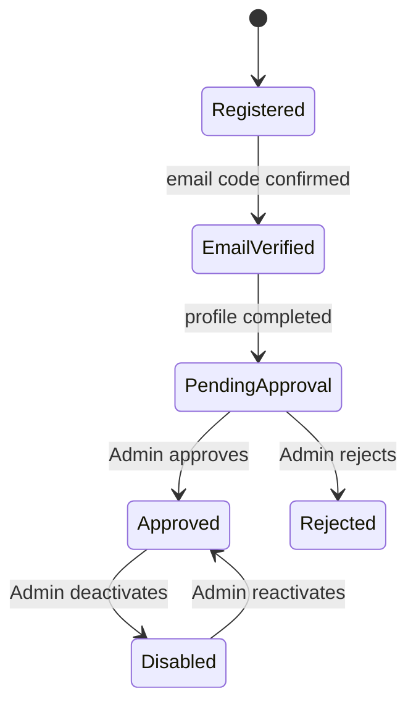

# Roles and Permissions Specification

| Field | Value |
|-------|-------|
| Document ID | SIMF-RPM-001 |
| Title | Roles and Permissions Specification |
| Version | 1.2 |
| Status | Approved |
| Classification | Confidential — to be confirmed by the owner |
| Prepared by | Engineering & Architecture Team, STARTIME |
| Owner | Solution Architect |
| Approver | Project Owner (MoD / RSNF representative) |
| Date issued | 2026-05-20 |
| Related documents | SIMF-RDR-001, SIMF-SRS-001, SIMF-UCS-001, SIMF-CPD-001, SIMF-API-001, SIMF-SAD-001 |

### Revision history

| Version | Date | Author | Summary of change |
|---------|------|--------|-------------------|
| 1.0 | 2026-05-20 | Engineering & Architecture Team | First issue. User types, account states, the permission catalogue, and the proposed permission matrix. |
| 1.1 | 2026-05-20 | Engineering & Architecture Team | Matrix review applied: added the Networking (meetings) permissions; rewrote §9 with view/manage actions and a single manager per module. Findings 4–6 opened as decisions D10–D12. |
| 1.2 | 2026-05-20 | Engineering & Architecture Team | Role model reworked on client instruction: all roles dynamic and Administrator-managed; permissions restructured as a page-and-action model with friendly naming; the Administrator holds all permissions for the initial delivery; the per-team configuration moved to Appendix A as a suggested starting point. Decisions D10–D12 applied. |

---

## 1. Purpose

This document defines who uses SIMF and what each of them is allowed to do. It
names the user types, sets out the account states a user moves through, defines
the permission model the Control Panel runs on, and explains how the
Administrator builds and assigns roles.

## 2. Scope

The document covers the SIMF authorisation model: user types, roles, the
permission model, and the account lifecycle. It covers all three surfaces — the
Control Panel, the website and the mobile app.

It does not define the authentication mechanics (tokens, MFA); those are in
SIMF-API-001. It does not define feature behaviour; that is SIMF-SRS-001 and the
per-feature specifications.

The roles in SIMF are dynamic — they are built and assigned by the
Administrator, not fixed by the software. Appendix A gives a **suggested**
starting configuration for the organising-team roles; it is a recommendation
for the client and the Administrator, not a binding specification.

## 3. Approach

SIMF uses role-based access control. The chain is: a **user** holds one or more
**roles**; a role grants a set of **permissions**; a permission allows one
action on one page. Authorisation always checks a permission, never a role name
directly.

Two principles shape the model:

- **Nothing is open by default.** Every Control Panel page and every endpoint
  requires a permission, except the small anonymous set — sign-in, sign-up,
  password reset (SIMF-SES-001 section 12, SIMF-API-001).
- **All roles are dynamic.** Roles are data, not code. The Administrator
  creates, names, configures, assigns and removes every role from the Control
  Panel (decision D1). The software fixes only two things: the single
  Administrator role, and the catalogue of pages and actions in section 8 that
  the Administrator composes roles from.

## 4. The actor model

SIMF has two groups of users, and a user belongs to one group or the other.

- **Internal users** run the forum. They use the **Control Panel**. They are the
  Administrator and the organising teams.
- **External users** attend or exhibit at the forum. They use the **website**
  and the **mobile app**. They are visitors, exhibitors and guests.

A few roles bridge the two: a Moderator is an external-facing role that works
inside the mobile app during sessions, and Staff work in the app doing field
operations. Neither uses the Control Panel.

## 5. User type catalogue

### 5.1 Internal user types

| Type | Description |
|------|-------------|
| Administrator (مشرف) | Runs the system from the Control Panel. Holds every permission. Creates and assigns all other roles. |
| Organising teams | Security, PR, Technical, Scientific, Logistics, Marketing and any others — each a dynamic role the Administrator builds and assigns (section 7). |

### 5.2 External user types

| Type | Surface | Description |
|------|---------|-------------|
| Guest (ضيف) | App | An unregistered user browsing the app. Sees the open, public content; personal features are locked. |
| Visitor (زائر) | Website, App | A registered attendee. Sub-types: **VIP**, **Normal**, and more added in the Control Panel. Each sub-type has its own colour. |
| Exhibitor (عارض) | Website, App | A registered exhibiting organisation. |
| Other (آخر) | Website, App | A registration type covering **Media**, **Sponsor**, and any further type added in the Control Panel. |
| Moderator (محاور) | App | Manages the questions for the sessions assigned to them (decision D3). |
| Staff | App | Performs field operations only — badge scanning at entry, on-site registration, hall-door check-in. No Control Panel access (decision D3). |

> The Visitor sub-types and the contents of "Other" are **dynamic** — new types
> are added in the Control Panel, each with a colour (decision D1). VIP, Normal,
> Media and Sponsor are the types known today.

### 5.3 The final user type is set at approval

A person registers by choosing **Visitor** or **Other**. Their **final user
type** is set by an Administrator when the registration is approved (decision
D1, and the registration workflow in SIMF-CON-001 section 9).

## 6. Account states

An account moves through a defined set of states. Authorisation depends on the
state as well as the role.

| State | What the user can do |
|-------|----------------------|
| Registered | Account created; email not yet verified. Cannot sign in. |
| EmailVerified | Email confirmed; profile not yet completed. Completes the registration profile. |
| PendingApproval | Profile submitted, awaiting an Admin. **May sign in** and sees their **registration status plus guest-level content**; the rest of the app stays locked (decision D1). |
| Approved | The registration is approved and the final user type assigned. Full access for that user type. |
| Rejected | The registration was refused. The user is informed; the account does not gain access. |
| Disabled | A previously approved account has been deactivated by an Admin. Cannot sign in. |

Account state is separate from role. The state gates how much of a role is live.

## 7. Roles

All roles in SIMF are dynamic. A role is a named set of permissions, created and
managed by the Administrator (decision D1). The software fixes only one role:

- **Administrator** — holds every permission on every page. There is always at
  least one Administrator; the system cannot be run without one.

Every other role — the organising teams such as Security, PR, Technical,
Scientific, Logistics and Marketing — is created by the Administrator. The
Administrator gives a role a name, chooses the pages it may reach and the
actions it may perform on each (section 8), and assigns the role to users.

**For the initial delivery, all permissions sit with the Administrator.** The
organising-team roles are then built and assigned by the Administrator, from the
Control Panel, before the event. Appendix A offers a suggested starting
configuration the Administrator may apply or adapt; it is a recommendation, not
a fixed structure.

A Moderator is not a Control Panel role; it is a mobile-app role (section 10).

## 8. The permission model

### 8.1 Pages and actions

The Control Panel is organised into **pages**. Every page that shows or changes
data is permission-controlled. Each page offers a set of **actions** — the
things a user can do on it. A **permission** is one action on one page; for
example, "approve a registration" is the Approve action on the Registration
Requests page.

A **role** is a set of permissions. The Administrator builds a role by going
through the list of pages and, for each page the role needs, choosing the
actions it may perform.

### 8.2 Friendly naming

Every page and every action has a plain-language name, and permissions are
grouped by page. The Administrator manages permissions in readable terms —
*Registration Requests → Approve a registration* — not raw codes. A code form
(`registrations.approve`) exists for the software to check against; the
Administrator never has to see it.

### 8.3 The action set

A page uses the actions that apply to it, drawn from this standard set:

| Action | Meaning |
|--------|---------|
| View | See the page and its data |
| Create | Add a new record |
| Edit | Change an existing record |
| Delete | Deactivate a record (soft delete) |
| Approve / Reject | Decide a request |
| Send | Send an outbound item, such as a notification |
| Moderate | Approve or discard moderated content |
| Manage broadcast | Start and stop a live session |
| Assign | Assign a role to a user |

### 8.4 Page and action catalogue

The pages, their friendly names, and the actions each one offers. This catalogue
is fixed by the software; assembling pages and actions into roles is the
Administrator's work. When a new page is added to the system it is added here
with its actions, and becomes available to grant.

| Page (friendly name) | Actions available |
|----------------------|-------------------|
| Dashboard | View |
| Registration Requests | View · Approve · Reject |
| Attendees | View · Edit |
| Roles & Permissions | View · Create · Edit · Delete · Assign |
| Themes & Pillars | View · Create · Edit · Delete |
| Sessions | View · Create · Edit · Delete |
| Halls & Seating | View · Create · Edit · Delete |
| Speakers | View · Create · Edit · Delete |
| Bookings | View · Approve · Reject |
| Exhibitors | View · Approve · Reject |
| Booths | View · Create · Edit · Delete |
| Sponsors | View · Create · Edit · Delete |
| Venue Map | View · Edit |
| Live Sessions | View · Manage broadcast |
| Comment Moderation | View · Moderate |
| One-to-one Meetings | View · Approve · Reject |
| FAQ & AI Assistant | View · Create · Edit · Delete |
| AI Settings | View · Edit |
| Media Center | View · Create · Edit · Delete |
| News | View · Create · Edit · Delete |
| Previous Editions | View · Create · Edit · Delete |
| Notifications | View · Send |
| System Configuration | View · Edit |
| Content & Categories | View · Create · Edit · Delete |
| Operation Log | View |
| Settings | View · Edit |

`Content & Categories` and `System Configuration` are separate pages, per
decision D11: the dynamic content blocks and the categories sit on one page,
the system and platform settings on the other.

## 9. Permission assignment

For the initial delivery, the **Administrator role holds every permission** —
every action on every page (client instruction, 2026-05-20). Every other role
is created and configured by the Administrator, using the page-and-action model
in section 8, and assigned to users.

This keeps the live system simple to stand up, and puts the team structure in
the Administrator's hands, where it can change without a release.

Appendix A gives a **suggested starting configuration** for the organising-team
roles. It reflects decisions D3, D10, D11 and D12 and the earlier matrix review.
The Administrator may apply it as it stands, adapt it, or build the roles
differently. It is a recommendation, not a binding specification.

## 10. Mobile app — user types and access

The mobile app is open to Guests and to the registered external user types. The
table below sets, at a high level, what each app user type may reach. The
screen-by-screen detail is in the app design and the use cases (SIMF-UCS-001);
the 41-screen scope is in SIMF-CON-001.

| App user type | Access |
|---------------|--------|
| Guest | The open content — agenda, speakers, map, gallery, the forum's public information. Personal features (badge, bookings, meeting requests, notifications) are locked behind sign-in. |
| Visitor (PendingApproval) | Sign-in succeeds; sees the registration status screen and the guest-level content; personal features stay locked until Approved. |
| Visitor (Approved) | The full attendee experience for their sub-type — badge, agenda and bookings, sessions, live, networking, notifications. VIP sub-type access follows the VIP rules. |
| Exhibitor (Approved) | The attendee experience plus the exhibitor's own booth-related screens. |
| Moderator | The attendee experience plus the moderator tools for the sessions assigned to them. |
| Staff | The field-operations tools — badge and QR scanning at entry, on-site registration, hall-door check-in. Staff do not see the Control Panel. |

The mobile app's access is by user type, as above; the page-and-action model in
section 8 governs the Control Panel. The exact VIP-only features and the precise
per-type screen list are confirmed against SIMF-UCS-001 and the app design.

## 11. Authentication and MFA

How a user proves who they are — passwords, the email verification code, token
issue and refresh, and the TOTP second factor for Control Panel sign-in — is
specified in SIMF-API-001 section 12. This document covers only what an
authenticated user is then allowed to do. A Control Panel sign-in requires the
TOTP second factor.

## 12. Managing roles and permissions

The Control Panel has a **Roles & Permissions** page. From it, a user with the
right permissions can:

- **Create a role** and give it a friendly name.
- **Configure a role** — go through the pages in the catalogue (section 8.4)
  and, for each page the role needs, choose the actions, all in plain language.
- **Assign a role** to one or more users.
- **Edit or delete** a role.

The seeded roles and a role the Administrator creates are the same kind of
thing: every role is editable, renamable and removable. Nothing about a role is
fixed in code.

The page-and-action catalogue is part of the software and grows only when a new
page is added. The Administrator composes roles from the catalogue; they do not
invent pages or actions.

Every change to a role or an assignment is written to the operation log, so the
authorisation model has a history.

## 13. Open items

| ID | Item | Needed for |
|----|------|-----------|
| OI-1 | Client review of the page-and-action catalogue (§8.4) and the suggested starting configuration (Appendix A) | Sections 8, 9, Appendix A |
| OI-2 | Confirm the VIP-only feature set and the per-type mobile-app screen list | Section 10 |
| OI-3 | Confirm whether Exhibitor and Moderator are granted in addition to a Visitor account or replace it | Sections 5, 10 |
| OI-4 | Confirm document classification with the owner | Control block |

---

## Appendix A — Suggested starting role configuration

This appendix suggests how the Administrator might configure the
organising-team roles. It is a recommendation, drawn from the role
responsibilities and decisions D3, D10, D11 and D12. The Administrator is free
to apply it, change it, or build the roles another way.

Each role below lists the pages it would hold and, in brackets, the actions on
each page.

**Security**
- Registration Requests (View, Approve, Reject)
- Attendees (View)
- Exhibitors (View)
- Operation Log (View)
- Dashboard (View)

**PR**
- Attendees (View, Edit)
- Exhibitors (View, Approve, Reject) — one-stage approval, decision D10
- Bookings (View, Approve, Reject) — decision D11
- Booths (View, Create, Edit, Delete)
- Sponsors (View, Create, Edit, Delete)
- One-to-one Meetings (View, Approve, Reject)
- Registration Requests (View) — all registrations, decision D12
- Notifications (View, Send)
- Dashboard (View)

**Technical**
- Roles & Permissions (View, Create, Edit, Delete, Assign)
- System Configuration (View, Edit) — decision D11
- AI Settings (View, Edit)
- FAQ & AI Assistant (View, Create, Edit, Delete)
- Settings (View, Edit)
- Operation Log (View)
- Notifications (View)
- Dashboard (View)

**Scientific**
- Themes & Pillars (View, Create, Edit, Delete)
- Sessions (View, Create, Edit, Delete)
- Halls & Seating (View, Create, Edit, Delete)
- Speakers (View, Create, Edit, Delete)
- Live Sessions (View, Manage broadcast) — decision D11
- Comment Moderation (View, Moderate) — single owner, decision D11
- Bookings (View)
- Previous Editions (View)
- Notifications (View)
- Dashboard (View)

**Logistics**
- Venue Map (View, Edit)
- Halls & Seating (View)
- Booths (View)
- Notifications (View)
- Dashboard (View)

**Marketing**
- Media Center (View, Create, Edit, Delete)
- News (View, Create, Edit, Delete)
- Content & Categories (View, Create, Edit, Delete) — decision D11
- Previous Editions (View, Create, Edit, Delete)
- Notifications (View, Send)
- Dashboard (View)

The Administrator role is not listed: it holds every action on every page.

---

End of document.
