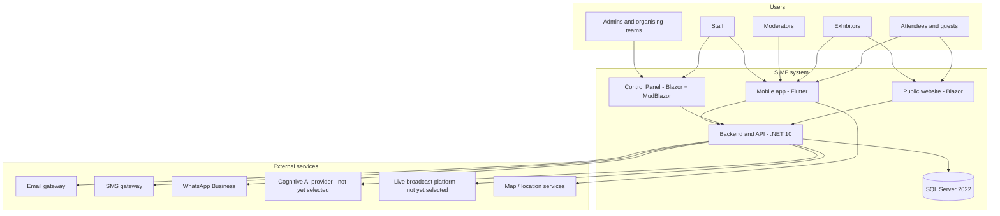
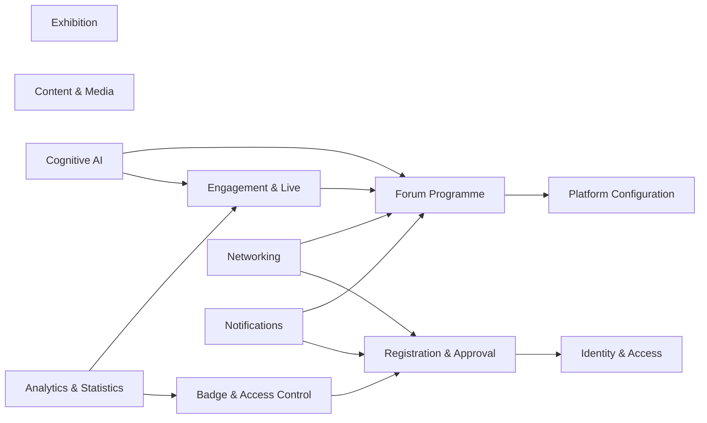
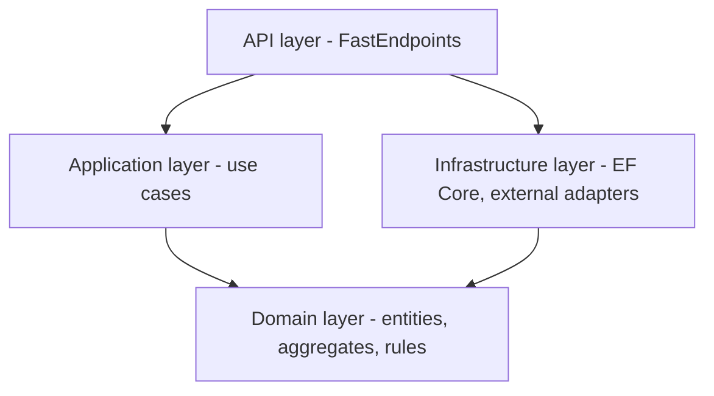
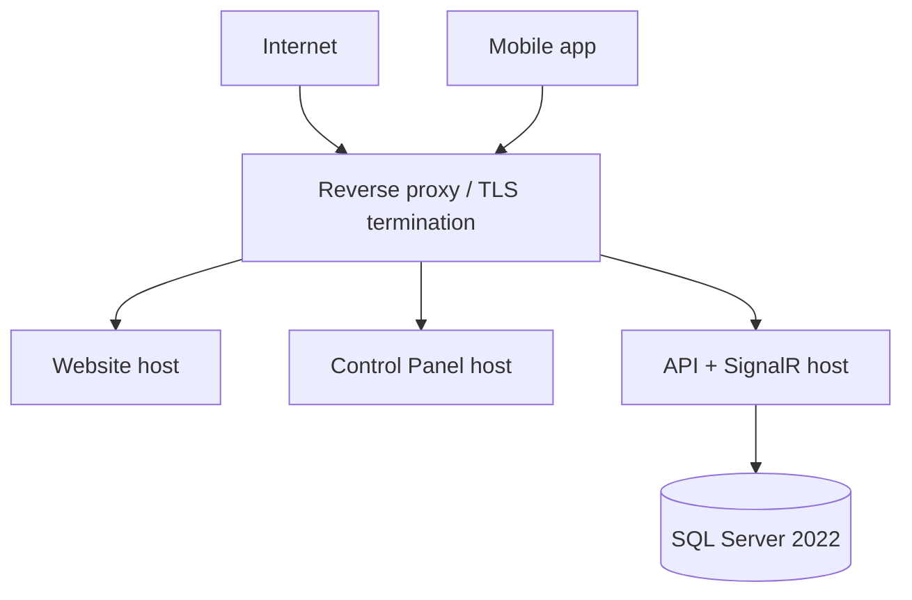

# Software Architecture Document

| Field | Value |
|-------|-------|
| Document ID | SIMF-SAD-001 |
| Title | Software Architecture Document |
| Version | 1.0 |
| Status | Draft |
| Classification | Confidential — to be confirmed by the owner |
| Prepared by | Engineering & Architecture Team, STARTIME |
| Owner | Solution Architect |
| Approver | Solution Architect |
| Date issued | 2026-05-20 |
| Related documents | SIMF-CON-001, SIMF-PGP-001, SIMF-SES-001, SIMF-API-001, SIMF-DAT-001, SIMF-MAA-001, SIMF-CPD-001 |

### Revision history

| Version | Date | Author | Summary of change |
|---------|------|--------|-------------------|
| 1.0 | 2026-05-20 | Engineering & Architecture Team | First issue. High-level architecture; low-level detail follows once requirement gates D1–D6 close. |

---

## 1. Introduction

### 1.1 Purpose

This document describes the architecture of the SIMF system: the major parts,
how they are arranged, how they talk to each other, and why the structure is the
way it is. It is the reference an engineer uses to place a new piece of work in
the right layer and the right context, and the reference a reviewer uses to
judge whether a change fits.

### 1.2 Scope and current limits

This version covers the high-level design: context, bounded contexts, the
backend solution shape, data and security architecture, integration, and
deployment. It is enough to start the backend, the API and the Control Panel
shell, and to set up the Flutter base.

It does not yet contain the low-level design — the exact aggregates, entities
and endpoint contracts for every feature. That detail depends on requirement
decisions that are still open (the gates D1–D6 in SIMF-PGP-001). Section 14
lists those gates. The architecture here is deliberately built so that closing
those gates adds detail without forcing a redesign.

### 1.3 Audience

Engineers building any SIMF surface, reviewers, the QA lead, and the project
owner's technical reviewers.

### 1.4 How this document relates to others

The concept and scope come from SIMF-CON-001. The engineering rules that this
architecture assumes are in SIMF-SES-001. The API contract, the data model, the
mobile architecture and the Control Panel design each get their own document
(SIMF-API-001, SIMF-DAT-001, SIMF-MAA-001, SIMF-CPD-001) and expand on the
relevant section here.

## 2. Architectural goals and constraints

### 2.1 What the architecture must achieve

SIMF runs a three-day national event with a fixed date. The architecture is
shaped by that more than by anything else.

- It must be **ready early**. The plan targets a working system about two months
  before the forum. The structure favours steady, parallel delivery by a small
  team over flexibility the project will never use.
- It must be **secure to a government standard**. NCA ECC-1:2018, CSCC-1:2019,
  OWASP Top 10 and ASVS are requirements, not aspirations.
- It must **stay up during the event**. The busiest, least forgiving window is
  three days in November 2026.
- It must be **configurable without a release**. Content, categories, labels,
  colours, roles and permissions change from the Control Panel, because the
  organisers will keep changing them up to and during the event.
- It must serve **three surfaces from one source of truth** — the public
  website, the Control Panel, and the mobile app — without three divergent
  copies of the rules.

### 2.2 Fixed constraints

| Constraint | Value | Source |
|------------|-------|--------|
| Backend platform | .NET 10 | SIMF-CON-001 |
| API framework | FastEndpoints, `ApiResult<T>` | SIMF-CON-001, SIMF-SES-001 |
| Web and Control Panel | Blazor + MudBlazor | SIMF-CON-001 |
| Mobile | Flutter (Android, iOS) | SIMF-CON-001 |
| Database | SQL Server 2022 | SIMF-CON-001 |
| Hosting | Windows Server 2022, on-premises, local Saudi host via STC | SIMF-CON-001 |
| Real-time | SignalR | SIMF-CON-001 |
| Logging | Serilog | SIMF-CON-001 |
| Tenancy | Single-tenant | SIMF-CON-001 |
| Languages | Arabic (primary, RTL) and English (LTR) | SIMF-CON-001 |

### 2.3 Quality attributes

The architecture is judged against these, in roughly this priority order.

1. **Security** — defence in depth; every endpoint authorised; auditable.
2. **Availability during the event** — graceful behaviour under load; no single
   avoidable point of failure in the event-day path.
3. **Maintainability** — one clear way to do things; a new engineer is
   productive in days.
4. **Configurability** — behaviour and content change through data, not code.
5. **Performance** — the load profile in the technical requirements is a new
   registered user roughly every 30 seconds, plus a pre-launch traffic test.
6. **Portability of dependencies** — the AI provider and the notification
   channels can change without a redesign.

## 3. Solution strategy

Six decisions set the shape of everything else. Each is recorded as an
architecture decision in section 13.

1. **A modular monolith, not microservices** (AD-002). The backend is one
   deployable application, divided inside into bounded-context modules. For a
   single-tenant system, a fixed deadline, a small team and on-premises hosting,
   a monolith is faster to build, simpler to secure, and simpler to operate. The
   module boundaries are kept clean so that if a part ever needs to split out
   later, it can.
2. **Domain-driven layering** (AD-001). Domain, Application, Infrastructure,
   API. Dependencies point inward. Business rules do not depend on a framework
   or a database.
3. **One API for all surfaces** (AD-004). The website, the Control Panel and the
   mobile app are clients of the same API. A rule is written once.
4. **Configuration lives in data** (AD-009). Dynamic content, categories,
   labels, colours, roles and permissions are stored in the database, seeded
   once, and read at runtime from the database.
5. **Volatile dependencies sit behind abstractions** (AD-007, AD-008). The
   cognitive AI provider and the notification channels are reached through
   interfaces the Application layer owns, so the provider choice is a
   configuration concern, not a code rewrite.
6. **Real-time is a first-class layer** (AD-005). Live broadcast state,
   moderation queues and notifications use SignalR rather than client polling.

## 4. Context view

### 4.1 System context



### 4.2 The three surfaces

- **Public website.** Marketing and information, plus registration. Open to
  anonymous visitors. Built in Blazor.
- **Control Panel.** The permission-gated admin console for the organising
  teams. Built in Blazor with MudBlazor. Designed in-house (SIMF-CPD-001).
- **Mobile app.** The attendee experience, 41 screens, built in Flutter. Its
  visual design comes from an external UI/UX designer; its structure and
  integration are built against the agreed scope (SIMF-MAA-001).

All three are clients of one backend.

### 4.3 External systems

| External system | Used for | Status |
|-----------------|----------|--------|
| Email gateway | OTP codes, registration and approval mail | Provider to confirm |
| SMS gateway | Critical alerts | Provider to confirm |
| WhatsApp Business | Conversational notifications | Provider to confirm (gate D7) |
| Cognitive AI provider | Session summaries, comment filtering, translation | Not selected (gate D7) |
| Live broadcast platform | Session streaming | Not selected (gate D7) |
| Map / location services | Venue map and navigation, GPS presence | To confirm |

Because three of these are not yet chosen, the architecture reaches each one
through an internal abstraction (section 9). The choice, when it is made, is a
configuration and one adapter, not a structural change.

## 5. Logical view — bounded contexts

The domain is divided into bounded contexts. Each is a module inside the
backend, with its own domain model and its own ownership of a slice of the
database. Modules collaborate through application services and domain events,
never by reaching into each other's tables.



### 5.1 Context responsibilities

| Context | Owns | Notes |
|---------|------|-------|
| Identity & Access | Accounts, sign-in, email verification, roles, permissions, sessions/tokens | Login is email + password only; no Nafath, no Face ID |
| Registration & Approval | Registration requests, attendee profiles, the vetting and approval workflow, attachments | Registration types are dynamic; approval sets the final user type and permissions |
| Badge & Access Control | Badges, QR codes, entry verification, on-site registration, attendance records | |
| Forum Programme | Themes/pillars, sessions, halls, seating and seat assignment, speakers, presentations | Sessions may be live or non-live; hall capacity is configurable |
| Exhibition | Booths, exhibitors, sponsors and tiers, the venue map | Delegations are out of scope (removed 2026-05-20) |
| Engagement & Live | Live broadcast state, session questions, comments and the two-stage moderation | Question availability is time- and location-gated |
| Networking | Interests, one-to-one meeting requests, "meet people like you" matchmaking | Matchmaking is interest- and session-based |
| Content & Media | Media coverage, social posts, news, previous editions (archive) | Content is Control-Panel managed |
| Notifications | Multi-channel delivery (in-app, email, SMS, WhatsApp), reminders | One abstraction over all channels |
| Cognitive AI | Session summaries, comment filtering, translation, AI settings (two levels) | Provider behind an abstraction; not yet selected |
| Analytics & Statistics | Attendance and registration statistics, GPS-presence tracking, dashboards | Reads from other contexts; owns no source-of-truth entities |
| Platform Configuration | Dynamic content, categories, labels, colours, registration open/close, the operation log | The data layer behind the "everything is dynamic" requirement |

### 5.2 How contexts collaborate

Two patterns, and only two:

- **Synchronous application calls** for a query or command that must complete
  now. For example, Badge & Access Control asks Registration whether an
  attendee is approved before it issues a badge.
- **Domain events** for things other contexts react to but the originator does
  not wait on. For example, Registration & Approval raises `RegistrationApproved`;
  Notifications and Badge & Access Control both handle it.

Within one deployable application, domain events are dispatched in-process.
Keeping the pattern explicit means a context could later be separated without
rewriting its collaborators.

### 5.3 The Control Panel across contexts

The Control Panel is not a bounded context. It is a presentation surface that
reaches into many contexts through their application services. Platform
Configuration is the context that holds the dynamic-configuration data the
Control Panel edits; the rest of the Control Panel's screens are admin views
over Registration, Programme, Engagement, Media and the others.

## 6. Component view — the backend solution

### 6.1 Layering

Per SIMF-SES-001, the backend has four layers with dependencies pointing inward.



### 6.2 Project structure

The backend solution is organised so that each bounded context is visible as a
module. The shape is fixed here; the exact project list per context is
finalised with the low-level design.

```
/src/Backend
  SIMF.Domain            Entities, aggregates, value objects, domain events
  SIMF.Application       Use cases, service interfaces, validators
  SIMF.Infrastructure    EF Core, repositories, external-service adapters
  SIMF.Api               FastEndpoints endpoints, ApiResult<T>, middleware
  SIMF.RealTime          SignalR hubs
/src/Shared
  SIMF.Contracts         Request/response DTOs shared with clients
  SIMF.Common            Cross-cutting constants, enums, result types
```

Inside `SIMF.Domain` and `SIMF.Application`, code is grouped by bounded context
(an `IdentityAccess` folder, a `Registration` folder, and so on) so the module
boundary is obvious in the file tree. Whether each context becomes its own
project or stays a folder is a low-level-design decision recorded against
SIMF-SES-001 OI-3.

### 6.3 The API layer

The API uses FastEndpoints. Every endpoint implements `Configure()` and
`HandleAsync()`, declares its authorisation, and returns `ApiResult<T>`. The
full contract — the result envelope, the error model, the standard headers, and
versioning — is in SIMF-API-001.

A request passes through a fixed middleware pipeline before it reaches an
endpoint: request logging, localisation, authentication, rate limiting,
anti-forgery for state-changing requests, then authorisation. Section 8
describes the security middleware in detail.

### 6.4 The real-time layer

`SIMF.RealTime` holds the SignalR hubs. Three hubs are foreseen: a live-session
hub (broadcast state, the question and comment stream to moderators and
audience), a notifications hub (in-app delivery and the unread count), and an
admin hub (live updates on the Control Panel's lists and the moderation queue).
The hub set is confirmed with the low-level design.

## 7. Data architecture

### 7.1 Database

One SQL Server 2022 database. EF Core, code-first migrations. Each bounded
context owns its own tables and does not write to another context's tables; a
context that needs another's data reads it through that context's application
service, not with a cross-context join.

### 7.2 Conventions

- Soft delete is the default. Entities carry `IsActive`; `Deactivate()` sets it
  false; list queries filter on it. Physical deletes need a specific reason.
- Auditing columns — created and modified, by whom and when — are standard on
  entities that change over time.
- Bilingual content is stored so that Arabic and English values live together,
  not in two disconnected records. The exact pattern (paired columns versus a
  translations table) is set in SIMF-DAT-001.
- Dynamic configuration — categories, labels, colours, content blocks — is
  ordinary data in ordinary tables, seeded once and then edited from the Control
  Panel.

The full logical model, the entity definitions and the ERD are in SIMF-DAT-001.
That document can only be completed for the gated contexts once D1–D6 close;
the stable contexts (Identity & Access, Platform Configuration) are modelled
first.

## 8. Security architecture

Security is built in from the first endpoint. The controls below implement the
NCA standard and the OWASP guidance that SIMF-SES-001 section 12 commits to.

### 8.1 Authentication

- Sign-in is email and password. There is no Nafath and no Face ID (confirmed
  2026-05-20).
- Account creation verifies the email with a six-digit code before the rest of
  the profile is completed.
- On success the API issues a short-lived JWT access token and a refresh token.
  The access token expires in about 30 minutes; refresh tokens rotate; a session
  stays valid for about 30 days. The exact values are confirmed in SIMF-API-001.
- Administrative sign-in additionally requires a time-based one-time code
  (TOTP), so a Control Panel login needs a second factor.

### 8.2 Authorisation

- Access is role- and permission-based (RBAC). Every endpoint declares what it
  needs. No endpoint is anonymous except sign-in, sign-up and password reset.
- Roles and permissions are dynamic data, owned by Platform Configuration and
  the Identity & Access context. An admin can add a role and adjust a permission
  set from the Control Panel.
- The website's public pages are open for reading; everything that changes data
  or returns personal data is authorised.

### 8.3 Request protection

- Each request carries the standard headers defined in SIMF-API-001 (an
  application key, the device type, the language, and the bearer token).
- State-changing requests carry an anti-forgery token.
- Rate limiting is applied per IP, per user and per endpoint, to blunt brute
  force and abuse.

### 8.4 Data protection

- In transit, everything is over TLS.
- Sensitive fields are encrypted at rest; the cipher choices follow the NCA
  standard. Identity numbers, contact details and attachments are treated as
  sensitive personal data.
- Secrets — connection strings, keys, tokens — come from configuration and a
  secrets store, never from the repository.

### 8.5 Audit

Security-relevant actions are logged through Serilog with enough context to
reconstruct events: sign-in and sign-out, permission changes, registration
approvals and rejections, and configuration changes. The Platform Configuration
operation log records who changed what in the Control Panel. Audit data is
write-once from the application's point of view.

### 8.6 Anti-spoofing on photo capture

Where the registration flow captures a photo for identity verification,
anti-spoofing checks apply, with the documented exception that women are not
asked to use the camera and are verified through an alternative the organisers
control. This follows the client requirement and the mockup's alternate
verification screen.

## 9. Integration architecture

### 9.1 Notifications

Notifications go out over four channels: in-app, email, SMS and WhatsApp. The
Notifications context exposes one interface to the rest of the system —
"notify this recipient about this event" — and a set of channel adapters behind
it. Which channels carry which message is configuration. Adding or changing a
channel is an adapter plus configuration, not a change to any calling context.

### 9.2 Cognitive AI

The Cognitive AI context exposes interfaces for what the system needs —
summarise a session, screen a comment, translate text. Behind those interfaces
sits one provider adapter. The provider is not selected (gate D7); the
architecture treats it as replaceable. The AI provider is given the narrowest
data it needs and, for audit-style analysis, read-only access. The two levels
of AI settings the client described are configuration owned by this context.

### 9.3 Live broadcast

The live-streaming platform is not selected (gate D7). The Engagement & Live
context owns session broadcast state and the question and comment flow; the
actual video stream is embedded from the chosen platform. The geographic
restriction on the live stream (the Riyadh-region rule) is enforced as a rule
in this context.

### 9.4 Map and location

The venue map and in-app navigation, and the GPS-presence tracking that feeds
attendance statistics, use a map/location service confirmed during low-level
design. Location is also one input to the rule that decides when a session's
questions are open.

## 10. Deployment view

### 10.1 Topology

SIMF is deployed on-premises on Windows Server 2022, behind a reverse proxy,
hosted with a local Saudi provider via STC. The backend is one application; the
website and Control Panel are Blazor applications; the database is SQL Server
2022.



The mobile app is distributed through the Apple App Store and Google Play and
reaches the same API through the reverse proxy.

### 10.2 Environments

Four environments, with promotion gated by tests, per SIMF-PGP-001 and
SIMF-SES-001: Development, Test, Staging, Production. The test environment is
stood up from day one; the live environment is ready a full two weeks before
publication.

### 10.3 Operational basics

- The API exposes a `/health` endpoint for the reverse proxy and monitoring.
- Backups of the database and the application are taken on a schedule; the last
  known-good published build is retained for rollback.
- Logs are collected centrally for monitoring and for the audit and analytics
  use described in section 8.5.

The full deployment procedure, the backup schedule and the monitoring setup are
specified in SIMF-OPS-001.

## 11. Cross-cutting concerns

- **Localisation.** Arabic is primary and the layout is RTL-first; English and
  LTR are fully supported. User-facing strings come from resources, never
  hardcoded. The language travels on every request as a standard header.
- **Error handling.** Validation failures throw `DataValidationException`;
  illegal domain transitions throw domain-specific exceptions; the API turns
  both into a clean `ApiResult<T>` error. Exceptions are never swallowed.
- **Logging.** Serilog, structured, with context on every message.
- **Configuration.** Dynamic behaviour is data. A category, a label, a colour or
  a content block is changed in the Control Panel and takes effect without a
  release.
- **Time and the event window.** Several rules depend on the clock and the
  venue — when a session's questions open, when registration auto-closes at the
  end of the last forum day. These rules live in their owning context and are
  written against a single, server-authoritative notion of time.

## 12. Mapping to quality attributes

| Quality attribute | How the architecture supports it |
|-------------------|----------------------------------|
| Security | Layered defence in section 8; authorisation on every endpoint; audit log |
| Availability during the event | One simple deployable; reverse proxy; health checks; rollback build; load and traffic testing before launch |
| Maintainability | DDD layering; bounded-context modules; one API; the standards in SIMF-SES-001 |
| Configurability | Configuration-as-data (AD-009); the Platform Configuration context |
| Performance | Stateless API tier; SignalR instead of polling; indexing and query review in SIMF-DAT-001 |
| Dependency portability | AI, notifications, broadcast behind abstractions (AD-007, AD-008) |

## 13. Architecture decisions

| ID | Decision | Reason |
|----|----------|--------|
| AD-001 | Domain-driven layering: Domain, Application, Infrastructure, API | Keeps business rules independent of frameworks; matches SIMF-SES-001 |
| AD-002 | Modular monolith, not microservices | Single tenant, fixed deadline, small team, on-premises hosting; a monolith is faster to build, secure and operate. Module boundaries kept clean for a possible future split |
| AD-003 | FastEndpoints with the `ApiResult<T>` envelope | One predictable response shape; high performance; OpenAPI built in |
| AD-004 | One API serving website, Control Panel and mobile app | A rule is written once; no divergent copies |
| AD-005 | SignalR for live broadcast, moderation and notifications | Real-time needs push, not client polling |
| AD-006 | SQL Server 2022 with EF Core code-first | Per the confirmed stack; code-first keeps the schema versioned with the code |
| AD-007 | Cognitive AI reached through an abstraction; provider not bound | The provider is undecided (gate D7) and may change; isolate it |
| AD-008 | Notification channels behind one abstraction | Channel mix is configuration; adding a channel must not touch callers |
| AD-009 | Dynamic configuration stored as data, seeded, read at runtime from the database | The client requires content, categories, roles and permissions editable without a release |
| AD-010 | Soft delete as the default | Preserves history and audit; matches SIMF-SES-001 |
| AD-011 | Resource-based localisation, RTL-first | Arabic is the primary language; English and LTR fully supported |
| AD-012 | On-premises deployment, reverse proxy, four environments | Per the confirmed hosting model and SIMF-PGP-001 governance |

## 14. Open items

The low-level design of the gated contexts cannot be completed until these
close. They map to the decision gates in SIMF-PGP-001.

| ID | Item | Blocks |
|----|------|--------|
| OI-1 | D1 — per-user-type permissions and screens | Identity & Access and Registration low-level design |
| OI-2 | D2 — meaning of "direction / track" | Registration model |
| OI-3 | D3 — exhibitor, moderator and staff workflows | Registration, Exhibition, Engagement models |
| OI-4 | D4 — booking and attendance rules; hall-arrival verification | Programme and Badge & Access Control models |
| OI-5 | D5 — question open/close mechanics; AI comment-filter rules; AI setting levels | Engagement and Cognitive AI models |
| OI-6 | D7 — AI provider, live-broadcast platform, WhatsApp provider | Integration adapters in section 9 |
| OI-7 | Map/location service selection | Section 9.4 |
| OI-8 | Confirm document classification with the owner | Control block |

---

End of document.
